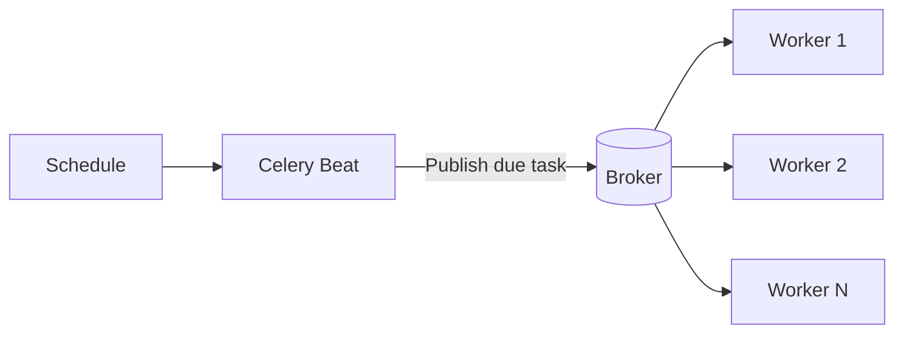
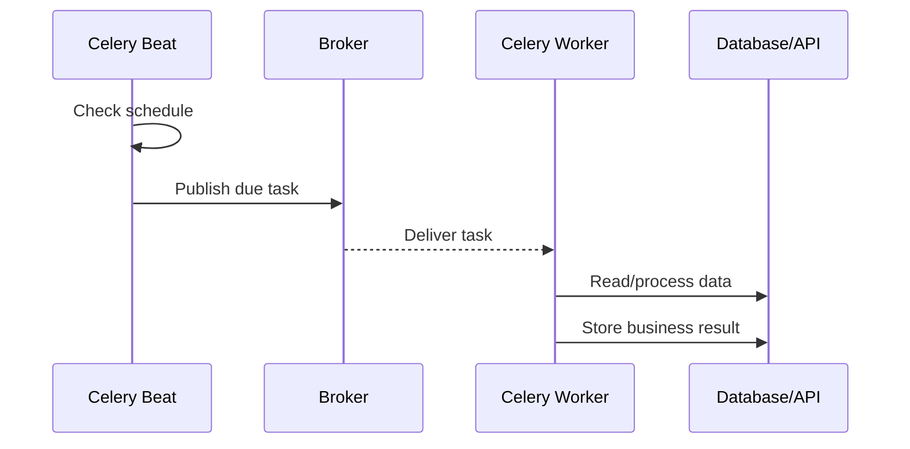
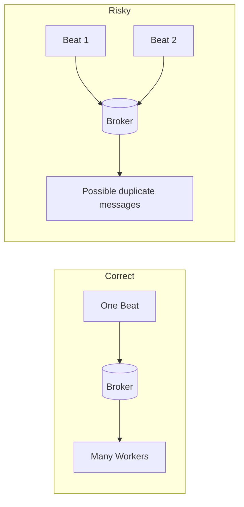
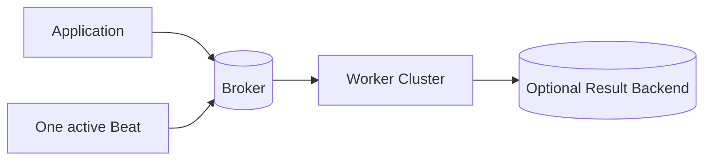

# Periodic / Scheduled Tasks with Celery Beat

> Celery Beat schedules recurring tasks and publishes them to the broker; Celery workers execute the actual task code.
>
> **Reference baseline:** Celery 5.6.3 stable documentation, reviewed on August 19, 2026.

## In short

- **Celery Beat = scheduler**, not the worker that performs the job.
- Beat checks which entries are due and publishes task messages to the broker.
- Run **one active Beat scheduler for a given schedule**. Multiple schedulers can publish duplicate tasks.
- Use an **interval** for “every N seconds/minutes” and **`crontab`** for clock/calendar rules such as “daily at 9:00 AM”.
- Use **`django-celery-beat`** when schedules must be changed at runtime from the database or Django Admin.
- Periodic tasks can **overlap** if one run is still executing when the next run becomes due.
- Design important tasks to be **idempotent** because duplicate execution can happen in distributed systems.
- Configure the application timezone explicitly and be clear about the business timezone used by the schedule.



---

# 1. What Is Celery Beat?

Celery Beat is Celery's **periodic task scheduler**.

A normal Celery task is usually triggered by an application event:

```text
User/API event -> Application -> Broker -> Worker
```

A periodic task is triggered by time:

```text
Clock/Schedule -> Celery Beat -> Broker -> Worker
```

For example, an application may need to:

- Generate a report every morning.
- Reconcile payments every 15 minutes.
- Delete expired records every hour.
- Synchronize data with an external service every 10 minutes.

The important separation is:

| Component | Responsibility |
|---|---|
| Celery Beat | Decides **when** a task is due and publishes it |
| Broker | Holds/routes the task message |
| Celery Worker | Executes the task code |
| Result Backend | Optionally stores task state/results |

Beat does not normally run the business logic itself.

---

# 2. How Celery Beat Works

Suppose a report must run every day at 9:00 AM.



The default Beat scheduler keeps last-run information in a local file named **`celerybeat-schedule`** unless a different scheduler is configured.

A key production rule is:

> **One schedule should have one active Beat scheduler.**

If two Beat processes evaluate the same schedule independently, both can publish the same due task.



Workers are designed to scale horizontally. Beat should not be scaled in the same way unless the chosen scheduler provides coordination such as leader election.

---

# 3. Schedule Types

The schedule type should match the business requirement.

| Requirement | Suitable schedule |
|---|---|
| Every 30 seconds | Number/float |
| Every 10 minutes | `timedelta` |
| Every day at 9:00 AM | `crontab` |
| Every Monday at 8:00 AM | `crontab` |
| Sunrise/sunset based work | `solar` |
| Admin/user-editable schedule | `django-celery-beat` |

## Interval schedule

Use an interval when the requirement is **duration-based**.

```python
app.conf.beat_schedule = {
    "sync-provider-every-10-minutes": {
        "task": "integrations.tasks.sync_provider",
        "schedule": 600.0,
    },
}
```

Mental model:

```text
Interval = "after how much time?"
```

## Crontab schedule

Use `crontab` when the requirement is tied to the **clock or calendar**.

```python
from celery.schedules import crontab

crontab(hour=9, minute=0)                  # Daily at 09:00
crontab(minute="*/15")                    # Every 15 minutes
crontab(hour=8, minute=0, day_of_week="monday")
```

Mental model:

```text
Crontab = "at which clock/calendar time?"
```

---

# 4. Schedule Entry Fields

A Beat entry normally looks like this:

```python
app.conf.beat_schedule = {
    "entry-name": {
        "task": "reports.tasks.generate_report",
        "schedule": 300.0,
        "args": (123,),
        "kwargs": {"format": "pdf"},
        "options": {
            "queue": "reports",
            "expires": 240,
        },
    },
}
```

| Field | Meaning |
|---|---|
| `task` | Registered Celery task name |
| `schedule` | When/how often it should be sent |
| `args` | Positional task arguments |
| `kwargs` | Keyword task arguments |
| `options` | `apply_async()` options such as queue, routing, priority, or `expires` |

### Registered task name

The `task` value is the **registered Celery task name**. It is not conceptually a Python import operation, even though Celery's default generated name usually looks like a module path.

```python
@app.task(name="billing.generate_invoice")
def generate_invoice(invoice_id: int) -> None:
    ...
```

The Beat entry should use:

```python
"task": "billing.generate_invoice"
```

Also remember that a one-item tuple needs a comma:

```python
"args": (customer_id,)   # correct
```

---

# 5. Practical Django Example

Consider a Django application that generates the previous day's sales report every morning at 7:00 AM.

## Task

```python
# reports/tasks.py
from celery import shared_task
from django.utils import timezone


@shared_task
def generate_daily_sales_report(report_date: str) -> dict[str, str]:
    # Query data for report_date and generate/store the report.
    return {
        "status": "generated",
        "report_date": report_date,
        "generated_at": timezone.now().isoformat(),
    }
```

## Schedule

```python
# settings.py
from celery.schedules import crontab

CELERY_TIMEZONE = "Asia/Kolkata"
CELERY_ENABLE_UTC = True

CELERY_BEAT_SCHEDULE = {
    "generate-daily-sales-report": {
        "task": "reports.tasks.generate_daily_sales_report",
        "schedule": crontab(hour=7, minute=0),
        "kwargs": {"report_date": "previous-day"},
        "options": {
            "queue": "reports",
            "expires": 60 * 60,
        },
    },
}
```

Start the processes separately:

```bash
celery -A myproject worker --loglevel=INFO
celery -A myproject beat --loglevel=INFO
```

In a real project, derive the exact logical report date inside a small dispatcher or pass a concrete period such as `2026-08-18` to downstream work. A stable business period makes retries, auditing, and deduplication easier.

---

# 6. Static Schedules vs `django-celery-beat`

Static configuration is a good choice when schedules change only with application deployments.

```python
CELERY_BEAT_SCHEDULE = {...}
```

Use **`django-celery-beat`** when schedules are runtime data, for example:

- An administrator changes a report time from Django Admin.
- Different tenants have different schedules.
- Users configure reminders.
- Operations needs to enable or disable jobs without a deployment.

Basic setup:

```bash
pip install django-celery-beat
python manage.py migrate
```

```python
INSTALLED_APPS = [
    # ...
    "django_celery_beat",
]

CELERY_BEAT_SCHEDULER = (
    "django_celery_beat.schedulers:DatabaseScheduler"
)
```

Then run Beat normally:

```bash
celery -A myproject beat --loglevel=INFO
```

Comparison:

| Static schedule | Database-backed schedule |
|---|---|
| Version-controlled | Runtime editable |
| Simple deployment model | Requires database models/migrations |
| Best for application-defined jobs | Best for admin/user-defined schedules |
| Change usually needs deployment | Change can happen without deployment |

---

# 7. Task Overlap and Idempotency

Beat publishes a new task when the schedule becomes due. It does **not** wait for the previous run to finish.

```text
10:00  sync starts
10:05  next sync starts
10:08  first sync finishes
```

If overlapping executions are unsafe, protect the operation.

Common approaches are:

- Distributed lock.
- Database row lock.
- Unique database constraint.
- Processing-state flag with safe transitions.
- Partitioning one large job into independent smaller tasks.

For business-critical work, database constraints are often stronger than relying only on a cache lock.

Example business rule:

```text
Only one invoice may exist for:
(customer_id, billing_month)
```

The database should enforce that invariant with a unique constraint.

## Idempotency

A periodic task should produce the same valid business outcome when the **same logical operation** is attempted more than once.

Useful idempotency keys include:

```text
invoice:{customer_id}:{billing_month}
report:{tenant_id}:{report_date}
reconciliation:{provider}:{window_start}:{window_end}
```

Do not use only the Celery task ID as the business idempotency key. Two separately published duplicate messages can have different task IDs while representing the same business operation.

---

# 8. Timezone Handling

Celery periodic schedules use UTC by default unless another timezone is configured.

For Django projects, make the business timezone explicit:

```python
TIME_ZONE = "Asia/Kolkata"
USE_TZ = True

CELERY_TIMEZONE = "Asia/Kolkata"
CELERY_ENABLE_UTC = True
```

With:

```python
crontab(hour=9, minute=0)
```

and `CELERY_TIMEZONE = "Asia/Kolkata"`, the business intention is 9:00 AM in that timezone.

For regions that use daylight-saving time, prefer named IANA zones such as `Europe/London` rather than fixed UTC offsets.

One operational detail matters with database-backed schedules: after changing timezone-related configuration, previously stored `last_run_at` state may need to be reset deliberately so the scheduler recalculates correctly.

---

# 9. Beat vs `eta` / `countdown`

These features solve different scheduling problems.

| Requirement | Better fit |
|---|---|
| Run once in 30 seconds | `countdown` |
| Run once in a few minutes | `eta` / `countdown` |
| Run every 15 minutes | Celery Beat |
| Run every day at 9:00 AM | Celery Beat |
| Long-term user-managed schedules | Durable/database-backed scheduler |

Example:

```python
send_reminder.apply_async(countdown=300)
```

Celery's current documentation warns against using large numbers of distant-future ETA/countdown tasks because workers fetch them early and keep them in memory until their execution time. For longer scheduling horizons, a durable scheduler is usually a better design.

---

# 10. Production Design

A simple production topology is:



Keep these rules in mind:

### Keep Beat separate from horizontally scaled workers

This is convenient locally:

```bash
celery -A project worker -B
```

But embedding Beat in every worker replica is unsafe because each replica may become a scheduler. A separate Beat process is easier to scale and operate correctly.

### Route heavy scheduled work

```python
"options": {
    "queue": "reports",
    "expires": 1800,
}
```

Dedicated queues prevent long report or maintenance jobs from blocking user-facing tasks.

### Use `expires` for stale work

If a dashboard refresh runs every five minutes, a refresh message that is already 30 minutes old may no longer be useful. Expiration lets workers reject stale task messages.

### Retry only transient failures

Good retry candidates:

- Network timeout.
- Temporary HTTP 5xx response.
- Temporary database connection failure.
- Rate limiting with appropriate backoff.

Permanent validation or configuration errors should not retry forever.

### Monitor business completion

A running Beat process does not prove the full pipeline is healthy.

Monitor:

```text
Beat scheduled task
      -> broker accepted message
      -> worker started task
      -> task completed
      -> business result recorded
```

Useful metrics include task duration, retry count, queue delay, last successful logical execution, and skipped overlapping runs.

---

# Final Mental Model

```text
Celery Beat decides WHEN.
Broker carries WHAT to execute.
Celery Worker performs the WORK.
Database/business rules protect CORRECTNESS.
```

For interviews, the most important design point is not only knowing how to write `crontab(...)`. It is understanding that scheduling and execution are separate, Beat should normally be a singleton per schedule, periodic tasks may overlap, and critical jobs must be safe against duplicate execution.
