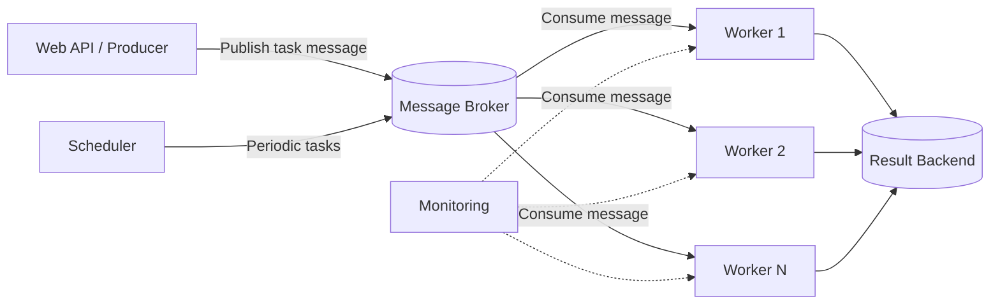
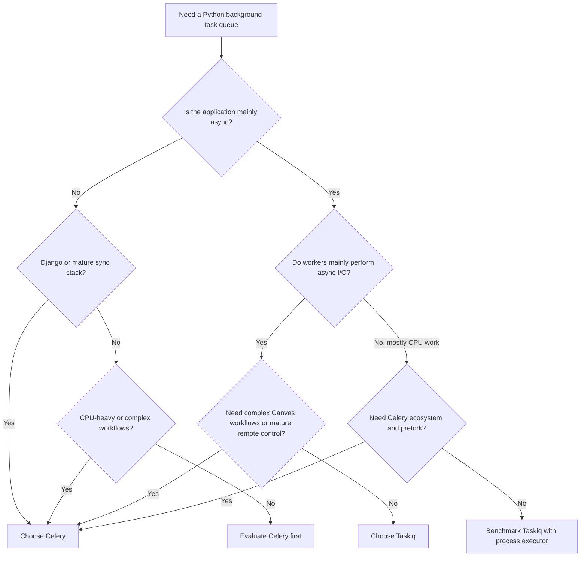

# Celery vs Taskiq

> **Category:** Async & Task Processing  
> **Audience:** Python developers with 3+ years of experience  
> **Updated:** July 30, 2026  
> **Version snapshot:** Celery 5.6.x · Taskiq 0.12.4

---

## Index

1. [Why Background Task Queues Are Needed](#1-why-background-task-queues-are-needed)
2. [Common Architecture](#2-common-architecture)
3. [Celery Overview](#3-celery-overview)
4. [Taskiq Overview](#4-taskiq-overview)
5. [Celery vs Taskiq: Quick Comparison](#5-celery-vs-taskiq-quick-comparison)
6. [The Most Important Difference: Execution Model](#6-the-most-important-difference-execution-model)
7. [Broker and Result Backend Support](#7-broker-and-result-backend-support)
8. [Retries and Failure Handling](#8-retries-and-failure-handling)
9. [Scheduling Periodic Tasks](#9-scheduling-periodic-tasks)
10. [Task Workflows and Pipelines](#10-task-workflows-and-pipelines)
11. [Monitoring and Observability](#11-monitoring-and-observability)
12. [Framework Integration](#12-framework-integration)
13. [Practical Celery Example](#13-practical-celery-example)
14. [Practical Taskiq Example](#14-practical-taskiq-example)
15. [Reliability and Delivery Guarantees](#15-reliability-and-delivery-guarantees)
16. [Performance and Scalability](#16-performance-and-scalability)
17. [Testing](#17-testing)
18. [When to Choose Celery](#18-when-to-choose-celery)
19. [When to Choose Taskiq](#19-when-to-choose-taskiq)
20. [Decision Flow](#20-decision-flow)
21. [Production Best Practices](#21-production-best-practices)
22. [Final Recommendation](#22-final-recommendation)
23. [Official References](#23-official-references)

---

# 1. Why Background Task Queues Are Needed

A web request should usually finish quickly. Some operations are too slow, unreliable, or resource-intensive to execute inside the request-response cycle.

Common examples include:

- Sending emails or WhatsApp notifications
- Processing uploaded documents
- Generating reports
- Calling slow third-party APIs
- Running OCR or AI inference
- Resizing images or videos
- Exporting large CSV files
- Processing payments asynchronously
- Running scheduled cleanup jobs

Without a task queue:

```text
Client
  |
  | HTTP request
  v
Web API ----> Slow operation ----> Response after 20 seconds
```

With a task queue:

```text
Client
  |
  | HTTP request
  v
Web API ----> Broker ----> Background worker
  |
  | Immediate response: "Task accepted"
  v
Client receives task ID
```

The API sends a small task message to a **broker**. A separate **worker** reads that message and performs the actual work.

Celery and Taskiq both implement this general model.

---

# 2. Common Architecture



## Main Components

### Producer

The application that submits a task.

Examples:

- Django API
- FastAPI endpoint
- CLI command
- Another background task

### Broker

The message transport between producers and workers.

Common brokers:

- RabbitMQ
- Redis
- AWS SQS
- NATS
- Kafka, depending on the framework and plugin

### Worker

A separate process that receives and executes tasks.

### Result Backend

Stores task status or returned values.

A result backend is optional when the producer does not need the result.

### Scheduler

Publishes tasks according to a schedule.

- Celery uses **Celery Beat**
- Taskiq uses **TaskiqScheduler**

---

# 3. Celery Overview

Celery is a long-established distributed task queue for Python. It focuses on reliable background processing, worker management, routing, scheduling, monitoring, and complex task workflows.

As of July 2026, the stable documentation is for the Celery 5.6 series.

## Core Characteristics

- Mature and widely used ecosystem
- Strong Django integration
- Works naturally with synchronous Python applications
- Supports multiple worker concurrency models
- Built-in retry mechanisms
- Built-in task routing
- Built-in workflow primitives through Canvas
- Periodic execution through Celery Beat
- Monitoring through Celery events and Flower
- Remote worker inspection and control
- Supports task revocation
- Large amount of production knowledge and operational tooling

## Basic Celery Task

```python
from celery import Celery

app = Celery(
    "tasks",
    broker="redis://localhost:6379/0",
    backend="redis://localhost:6379/1",
)


@app.task
def add(x: int, y: int) -> int:
    return x + y
```

Send the task:

```python
task_result = add.delay(10, 20)

print(task_result.id)
```

Run a worker:

```bash
celery -A tasks worker --loglevel=INFO
```

## Celery Mental Model

```text
Normal function call:
add(10, 20)
    |
    +--> Executes immediately in the current process

Celery call:
add.delay(10, 20)
    |
    +--> Serializes task message
          |
          +--> Sends message to broker
                |
                +--> Celery worker executes task later
```

---

# 4. Taskiq Overview

Taskiq is an asynchronous distributed task queue built around modern Python and `asyncio`.

It can execute both synchronous and asynchronous task functions, but publishing tasks is designed around an asynchronous API.

As of July 2026, the latest Taskiq release on PyPI is 0.12.4 and it requires Python 3.10 or newer.

## Core Characteristics

- Native `async`/`await` design
- Executes both `async def` and regular `def` tasks
- Strong type hints and editor autocompletion
- Dependency injection
- Modular broker and backend ecosystem
- FastAPI and AioHTTP integration
- Middleware-based retries and observability
- Prometheus and OpenTelemetry support
- Scheduler support
- Lightweight and extensible architecture

## Basic Taskiq Task

```python
from taskiq_redis import RedisStreamBroker

broker = RedisStreamBroker("redis://localhost:6379")


@broker.task
async def add(x: int, y: int) -> int:
    return x + y
```

Send the task:

```python
task = await add.kiq(10, 20)

print(task.task_id)
```

Run a worker:

```bash
taskiq worker tasks:broker
```

## Taskiq Mental Model

```text
await add.kiq(10, 20)
    |
    +--> Async producer sends task message
          |
          +--> Broker stores or forwards message
                |
                +--> Async Taskiq worker receives it
                      |
                      +--> Directly awaits async task
```

Taskiq is especially natural when the rest of the application already uses:

- FastAPI
- AioHTTP
- Async SQLAlchemy
- Async database drivers
- Async HTTP clients
- NATS or other async messaging tools

---

# 5. Celery vs Taskiq: Quick Comparison

| Area | Celery | Taskiq |
|---|---|---|
| Main design | Mature distributed task queue | Async-first distributed task queue |
| Stable version snapshot | 5.6.x | 0.12.4 |
| Minimum Python version | Python 3.9 for Celery 5.6 | Python 3.10 |
| Native `async def` execution | No built-in asyncio worker pool | Yes |
| Synchronous tasks | Excellent support | Supported through an executor |
| Publishing from sync code | Natural with `.delay()` | Async API with `await .kiq()` |
| Publishing from async code | Possible, but API is primarily synchronous | Natural |
| Django integration | First-class and mature | Possible, but not its strongest fit |
| FastAPI integration | Works, but requires design care around sync APIs | Strong dedicated integration |
| Type safety | More dynamic | Strong typing using modern Python typing |
| Dependency injection | Not a core task API feature | Built in |
| Retry support | Built into task API | Middleware based |
| Periodic tasks | Celery Beat | TaskiqScheduler |
| Workflow primitives | Mature Canvas: chain, group, chord, map, starmap | Pipelines available; ecosystem is smaller |
| Task routing | Powerful and mature | Broker/plugin dependent |
| Monitoring | Events, CLI inspection, Flower | Prometheus and OpenTelemetry middleware |
| Remote worker control | Strong | More limited |
| Task revocation | Supported | Core documentation currently lists task aborting as unavailable |
| Broker ecosystem | Broad and mature | Modular, growing ecosystem |
| Operational knowledge | Extensive | Smaller community and fewer long-term references |
| Best fit | Django, complex workflows, mature production systems | FastAPI and async-first services |
| Learning curve | Higher | Usually simpler for async developers |

---

# 6. The Most Important Difference: Execution Model

The biggest difference is not syntax. It is how each worker handles concurrency.

## 6.1 Celery Execution Model

Celery 5.6 documents these built-in worker pools:

- `prefork`
- `eventlet`
- `gevent`
- `solo`
- `threads`
- custom pools

The default is normally `prefork`.

```text
Celery main worker process
    |
    +-- Child process 1 --> Task
    +-- Child process 2 --> Task
    +-- Child process 3 --> Task
    +-- Child process 4 --> Task
```

### Why Prefork Is Useful

Each task runs in a separate worker process.

This works well for:

- CPU-heavy Python code
- Existing synchronous libraries
- Django ORM operations
- Tasks that may leak memory
- Isolation between task executions

### Celery and Async Code

Celery's built-in pool list does not include a native asyncio worker pool.

That means an `async def` function is not automatically handled like it is inside FastAPI or Taskiq.

A Celery task can still call asynchronous code through a bridge, such as managing an event loop, but that adds complexity and should be designed carefully.

```python
import asyncio

from celery import Celery

app = Celery("tasks", broker="redis://localhost:6379/0")


async def fetch_remote_data() -> dict:
    await asyncio.sleep(1)
    return {"status": "ok"}


@app.task
def fetch_remote_data_task() -> dict:
    return asyncio.run(fetch_remote_data())
```

This is acceptable for isolated cases, but it is not the same as a persistent native async worker runtime.

## 6.2 Taskiq Execution Model

Taskiq is built around `asyncio`.

```text
Taskiq worker process
    |
    +-- Event loop
          |
          +-- Async task A waits for HTTP response
          +-- Async task B waits for database
          +-- Async task C waits for storage
          +-- Event loop continues other work
```

An async task can directly await asynchronous libraries:

```python
@broker.task
async def fetch_customer(customer_id: str) -> dict:
    async with httpx.AsyncClient() as client:
        response = await client.get(
            f"https://service.example/customers/{customer_id}"
        )
        response.raise_for_status()
        return response.json()
```

Taskiq can also execute synchronous functions. Its documentation states that synchronous functions use a `ThreadPoolExecutor` by default, while CPU-heavy work can use a `ProcessPoolExecutor`.

## 6.3 Practical Meaning

Choose based on the dominant workload:

| Workload | Better Starting Point |
|---|---|
| Django ORM, PDF generation, image processing | Celery |
| FastAPI with async HTTP and async database calls | Taskiq |
| CPU-intensive Python calculations | Celery prefork |
| High-concurrency network calls | Taskiq |
| Mixed mature enterprise workloads | Usually Celery |
| New async microservice | Usually Taskiq |

---

# 7. Broker and Result Backend Support

A task framework is only one part of delivery reliability. The selected broker and its acknowledgement behavior are equally important.

## 7.1 Celery Brokers

Common Celery transports include:

- RabbitMQ
- Redis
- AWS SQS
- Other Kombu-supported transports

RabbitMQ is generally the strongest choice when advanced queue behavior, acknowledgements, routing, and messaging reliability are important.

Redis is simpler to operate and commonly used for moderate workloads.

## 7.2 Taskiq Brokers

Taskiq's maintained ecosystem includes broker packages for:

- RabbitMQ through `taskiq-aio-pika`
- Redis through `taskiq-redis`
- NATS through `taskiq-nats`

Its documentation also lists community-supported integrations such as:

- AWS SQS
- PostgreSQL
- YDB

The Taskiq repository also references broker integrations for Kafka and other systems.

## 7.3 Taskiq Redis Broker Types

The current `taskiq-redis` package provides different Redis broker strategies.

### Redis Pub/Sub

- Broadcast behavior
- No acknowledgement support
- A message can be lost if a worker dies during processing

### Redis List Queue

- Simple queue using Redis list operations
- No acknowledgement support
- A message can be lost after removal from the list if the worker crashes

### Redis Stream

- Uses Redis Streams
- Supports acknowledgements
- Better option when task durability matters

```text
Pub/Sub or List Queue:
Broker --> Worker receives message --> Worker crashes
                                     --> Message may be lost

Redis Stream:
Broker --> Worker receives message --> Worker crashes
                                     --> Unacknowledged message can be recovered
```

Do not select a broker only because setup is easy. Confirm its delivery and acknowledgement behavior.

## 7.4 Result Backends

Both frameworks can store:

- Task completion state
- Returned value
- Error information
- Execution metadata

Avoid storing results when they are not needed.

Results create:

- Additional network calls
- Extra storage
- Cleanup requirements
- Potential exposure of sensitive data

---

# 8. Retries and Failure Handling

Retries should handle temporary failures, not programming errors.

Good retry candidates:

- Temporary network failure
- HTTP 429 rate limit
- External API 503 response
- Temporary database unavailability
- Short-lived object-storage error

Poor retry candidates:

- Invalid input
- Missing required business data
- Authentication permanently rejected
- Programming bug
- Unsupported file format

## 8.1 Celery Retry

```python
class TemporaryServiceError(Exception):
    pass


@app.task(
    bind=True,
    autoretry_for=(TemporaryServiceError,),
    retry_backoff=True,
    retry_backoff_max=300,
    retry_jitter=True,
    max_retries=5,
)
def sync_customer(self, customer_id: str) -> None:
    call_external_service(customer_id)
```

Celery supports:

- Manual `self.retry(...)`
- Automatic retry for selected exception types
- Exponential backoff
- Jitter
- Retry limits

## 8.2 Taskiq Retry

Taskiq provides retries through middleware.

```python
from taskiq.middlewares import SmartRetryMiddleware
from taskiq_redis import RedisStreamBroker

broker = RedisStreamBroker(
    "redis://localhost:6379",
).with_middlewares(
    SmartRetryMiddleware(
        default_retry_count=5,
        default_delay=10,
        use_jitter=True,
        use_delay_exponent=True,
        max_delay_exponent=300,
    ),
)


@broker.task(
    retry_on_error=True,
    max_retries=5,
    delay=10,
)
async def sync_customer(customer_id: str) -> None:
    await call_external_service(customer_id)
```

Taskiq's smart retry middleware supports:

- Retry limit
- Initial delay
- Jitter
- Exponential delay

## Retry Timeline

```text
Attempt 1 --> fails
   |
   +-- wait 10 seconds

Attempt 2 --> fails
   |
   +-- wait about 20 seconds + jitter

Attempt 3 --> fails
   |
   +-- wait about 40 seconds + jitter

Attempt 4 --> succeeds
```

Jitter prevents thousands of failed tasks from retrying at exactly the same moment.

---

# 9. Scheduling Periodic Tasks

## 9.1 Celery Beat

Celery Beat publishes scheduled tasks to the broker.


Example:

```python
from celery.schedules import crontab

app.conf.beat_schedule = {
    "daily-report": {
        "task": "tasks.generate_daily_report",
        "schedule": crontab(hour=2, minute=0),
    },
}
```

Start Beat:

```bash
celery -A tasks beat --loglevel=INFO
```

Start worker:

```bash
celery -A tasks worker --loglevel=INFO
```

Keep Beat and workers as separate production processes.

## 9.2 Taskiq Scheduler

Taskiq uses `TaskiqScheduler` and one or more schedule sources.

```python
from taskiq import TaskiqScheduler
from taskiq.schedule_sources import LabelScheduleSource
from taskiq_redis import RedisStreamBroker

broker = RedisStreamBroker("redis://localhost:6379")

scheduler = TaskiqScheduler(
    broker=broker,
    sources=[LabelScheduleSource(broker)],
)


@broker.task(schedule=[{"cron": "0 2 * * *"}])
async def generate_daily_report() -> None:
    ...
```

Run the scheduler:

```bash
taskiq scheduler tasks:scheduler
```

Run the worker:

```bash
taskiq worker tasks:broker
```

Taskiq also supports dynamic schedule sources, including Redis-based sources.

---

# 10. Task Workflows and Pipelines

## 10.1 Celery Canvas

Celery includes mature workflow primitives.

### Chain

Execute tasks sequentially.

```text
Task A --> Task B --> Task C
```

```python
from celery import chain

workflow = chain(
    download_file.s(file_id),
    extract_text.s(),
    create_summary.s(),
)

workflow.apply_async()
```

### Group

Execute tasks in parallel.

```text
          +--> Task A
Start ----+--> Task B
          +--> Task C
```

```python
from celery import group

job = group(
    process_page.s(page_number)
    for page_number in range(1, 11)
)

job.apply_async()
```

### Chord

Execute a callback after all parallel tasks finish.

```text
          +--> Task A --+
Start ----+--> Task B --+--> Final callback
          +--> Task C --+
```

```python
from celery import chord

workflow = chord(
    process_page.s(page_number)
    for page_number in range(1, 11)
)(combine_results.s())
```

Celery is normally the stronger choice when the application depends on complex fan-out and fan-in workflows.

## 10.2 Taskiq Pipelines

Taskiq supports task pipelines through its ecosystem. It is suitable for sequential task composition, but Celery Canvas is more established for complex orchestration patterns such as groups, chords, callbacks, and error handling across large workflows.

For business-critical orchestration, also consider whether a durable workflow engine is more appropriate.

Examples:

- Temporal
- AWS Step Functions
- Prefect
- Dagster

A task queue executes background jobs. A workflow engine additionally persists and coordinates long-running business state.

---

# 11. Monitoring and Observability

## 11.1 Celery

Celery workers emit events that can be consumed by monitoring tools.

Common options:

- `celery inspect`
- `celery events`
- Flower
- Prometheus metrics through Flower or exporters
- Application logs
- Distributed tracing through additional instrumentation

Flower provides:

- Worker status
- Task history
- Task arguments and runtime
- Queue information
- Worker pool control
- Worker shutdown or restart controls
- Graphs and statistics

Example:

```bash
celery -A tasks flower
```

## 11.2 Taskiq

Taskiq provides observability through middleware.

Prometheus:

```python
from taskiq import PrometheusMiddleware

broker = broker.with_middlewares(
    PrometheusMiddleware(
        server_addr="0.0.0.0",
        server_port=9000,
    )
)
```

OpenTelemetry:

```python
from taskiq.instrumentation import TaskiqInstrumentor

TaskiqInstrumentor().instrument()
```

Taskiq provides a clean modern observability model, but Celery has a broader operational control ecosystem.

## Useful Metrics for Either Framework

Track:

- Queue depth
- Oldest queued message age
- Task success rate
- Task failure rate
- Retry count
- Task execution duration
- End-to-end queue latency
- Worker utilization
- Worker restarts
- Dead-letter count
- Broker connection errors

Queue depth alone is insufficient. A queue containing 100 one-second tasks is different from a queue containing 100 ten-minute tasks.

---

# 12. Framework Integration

## 12.1 Django

Celery is usually the default choice for Django.

Reasons:

- Official Django integration
- Automatic task discovery
- Familiar configuration through Django settings
- Mature Django ecosystem
- `django-celery-beat`
- `django-celery-results`
- Extensive production examples

Typical project structure:

```text
project/
├── manage.py
├── project/
│   ├── __init__.py
│   ├── settings.py
│   └── celery.py
└── orders/
    └── tasks.py
```

Celery also provides `delay_on_commit()` support in its Django integration, helping ensure a task is published only after the database transaction commits.

## 12.2 FastAPI

Taskiq is usually more natural for an async-first FastAPI service.

Reasons:

- Native async publishing
- Native async task execution
- FastAPI dependency integration
- Reuse of async database and HTTP clients
- Strong type hints
- Startup and shutdown lifecycle support

Important: a FastAPI `Request` object from the original HTTP call is not transported to the worker. The worker runs in another process and possibly another machine.

Only serialize the data the task needs:

```python
# Good
await process_order.kiq(order_id=str(order.id))

# Bad idea
await process_order.kiq(request=request)
```

The task should load fresh state using the identifier.

## 12.3 FastAPI with Celery

Celery can still work well with FastAPI when:

- The organization already operates Celery
- Tasks are mostly synchronous
- Complex Canvas workflows are needed
- Mature monitoring and operational controls are required

Do not select Taskiq only because the API is written in FastAPI. Select it when the worker workload and dependency stack are also genuinely asynchronous.

---

# 13. Practical Celery Example

This example processes an uploaded document after an API stores it.

## Installation

```bash
pip install "celery[redis]"
```

## `celery_app.py`

```python
from celery import Celery

celery_app = Celery(
    "document_worker",
    broker="redis://localhost:6379/0",
    backend="redis://localhost:6379/1",
)

celery_app.conf.update(
    task_serializer="json",
    result_serializer="json",
    accept_content=["json"],
    task_track_started=True,
    result_expires=3600,
    timezone="UTC",
)
```

## `tasks.py`

```python
from celery_app import celery_app


class TemporaryOCRFailure(Exception):
    pass


@celery_app.task(
    bind=True,
    autoretry_for=(TemporaryOCRFailure,),
    retry_backoff=True,
    retry_jitter=True,
    max_retries=5,
    acks_late=True,
)
def process_document(self, document_id: str) -> dict[str, str]:
    document = load_document(document_id)

    if document.status == "completed":
        return {
            "document_id": document_id,
            "status": "already_completed",
        }

    text = run_ocr(document.storage_key)
    save_extracted_text(document_id, text)

    return {
        "document_id": document_id,
        "status": "completed",
    }
```

## Submit Task

```python
result = process_document.delay(str(document.id))

return {
    "task_id": result.id,
    "document_id": str(document.id),
    "status": "queued",
}
```

## Run Worker

```bash
celery -A celery_app.celery_app worker \
  --loglevel=INFO \
  --concurrency=4
```

## Why This Design Is Reliable

- Only the document ID is placed in the message
- The worker loads current state from the database
- The operation checks whether processing is already complete
- Temporary OCR failures are retried
- `acks_late=True` delays acknowledgement until execution finishes
- The task is designed to be idempotent

---

# 14. Practical Taskiq Example

This example performs asynchronous calls to an external document-analysis service.

## Installation

```bash
pip install taskiq taskiq-redis httpx
```

## `broker.py`

```python
from taskiq.middlewares import SmartRetryMiddleware
from taskiq_redis import RedisAsyncResultBackend, RedisStreamBroker

result_backend = RedisAsyncResultBackend(
    redis_url="redis://localhost:6379/1",
    result_ex_time=3600,
)

broker = RedisStreamBroker(
    url="redis://localhost:6379/0",
).with_result_backend(
    result_backend
).with_middlewares(
    SmartRetryMiddleware(
        default_retry_count=5,
        default_delay=10,
        use_jitter=True,
        use_delay_exponent=True,
        max_delay_exponent=300,
    )
)
```

## `tasks.py`

```python
import httpx

from broker import broker


class TemporaryAnalysisFailure(Exception):
    pass


@broker.task(
    retry_on_error=True,
    max_retries=5,
    delay=10,
)
async def analyze_document(document_id: str) -> dict[str, str]:
    document = await load_document(document_id)

    if document.status == "completed":
        return {
            "document_id": document_id,
            "status": "already_completed",
        }

    try:
        async with httpx.AsyncClient(timeout=30) as client:
            response = await client.post(
                "https://analysis.example/documents",
                json={"storage_key": document.storage_key},
            )
            response.raise_for_status()
    except (httpx.TimeoutException, httpx.ConnectError) as exc:
        raise TemporaryAnalysisFailure from exc

    await save_analysis(document_id, response.json())

    return {
        "document_id": document_id,
        "status": "completed",
    }
```

## Submit from FastAPI

```python
from fastapi import APIRouter, status

from tasks import analyze_document

router = APIRouter()


@router.post(
    "/documents/{document_id}/analyze",
    status_code=status.HTTP_202_ACCEPTED,
)
async def start_analysis(document_id: str) -> dict[str, str]:
    task = await analyze_document.kiq(document_id)

    return {
        "task_id": task.task_id,
        "document_id": document_id,
        "status": "queued",
    }
```

## Run Worker

```bash
taskiq worker broker:broker tasks
```

This model stays asynchronous from the FastAPI endpoint through task publishing and worker execution.

---

# 15. Reliability and Delivery Guarantees

Neither framework automatically provides exactly-once execution.

Most distributed task systems effectively provide **at-least-once delivery** when configured for reliability.

That means a task may execute more than once.

Common causes:

- Worker executes the task but crashes before acknowledgement
- Broker redelivers an unacknowledged message
- Producer retries publishing after a network timeout
- Scheduler publishes a duplicate task
- Operator manually retries a task

## Idempotency Is Mandatory

An idempotent task produces the same business outcome even when executed repeatedly.

### Non-idempotent Example

```python
def charge_card(order_id: str) -> None:
    payment_gateway.charge(order_id)
```

If executed twice, the customer may be charged twice.

### Safer Example

```python
def charge_card(order_id: str) -> None:
    payment = get_payment(order_id)

    if payment.status == "captured":
        return

    payment_gateway.charge(
        order_id=order_id,
        idempotency_key=f"order:{order_id}",
    )

    mark_payment_captured(order_id)
```

## Reliability Checklist

- Use broker acknowledgements where supported
- Make tasks idempotent
- Use unique business operation keys
- Apply database constraints
- Retry only temporary failures
- Add a dead-letter or failed-task strategy
- Set task timeouts
- Monitor queue age
- Store task state when business tracking is required
- Never assume a task runs exactly once

---

# 16. Performance and Scalability

There is no universal winner.

Performance depends on:

- Workload type
- Broker
- Message size
- Serialization
- Network latency
- Worker count
- Concurrency configuration
- Database and external service limits
- Retry volume
- Result backend usage

## 16.1 I/O-Bound Workloads

Examples:

- HTTP calls
- Async database calls
- Object-storage operations
- Network-heavy integrations

Taskiq can efficiently run many async operations while they wait for I/O.

```text
One worker event loop
    |
    +-- Task A waits for API
    +-- Task B waits for DB
    +-- Task C waits for S3
    +-- Task D continues running
```

## 16.2 CPU-Bound Workloads

Examples:

- Image conversion
- Video encoding
- Large PDF processing
- Machine-learning inference
- Encryption
- Data compression

Celery's prefork model is a strong default because multiple processes can use multiple CPU cores.

```text
CPU Core 1 <-- Celery child process 1
CPU Core 2 <-- Celery child process 2
CPU Core 3 <-- Celery child process 3
CPU Core 4 <-- Celery child process 4
```

Taskiq can use process executors for synchronous CPU-heavy functions, but Celery has more established operational patterns for this workload.

## 16.3 Separate Long and Short Tasks

Do not run five-minute OCR jobs and 50-millisecond notification jobs in the same queue with identical worker settings.

```text
notifications queue --> high concurrency, short tasks
ocr queue           --> lower concurrency, high memory
reports queue       --> long timeout, low prefetch
```

This prevents large tasks from blocking small urgent tasks.

## 16.4 Avoid Oversized Messages

Bad:

```python
process_document.delay(large_base64_file)
```

Better:

```python
process_document.delay(document_id)
```

Store large data in:

- Object storage
- Database
- Shared file storage

Send only an identifier in the task message.

---

# 17. Testing

## 17.1 Celery Testing

For unit tests, test the task's business logic as a normal function or service.

```python
def test_process_document_service() -> None:
    result = process_document_service("doc-123")

    assert result["status"] == "completed"
```

Celery also supports eager mode, which executes tasks locally:

```python
celery_app.conf.task_always_eager = True
celery_app.conf.task_eager_propagates = True
```

Eager mode is useful, but it does not reproduce every real worker behavior.

Use integration tests with a real broker for:

- Serialization
- Routing
- Acknowledgements
- Retries
- Worker crashes
- Scheduling
- Result backend behavior

## 17.2 Taskiq Testing

Taskiq provides an `InMemoryBroker` for local and test execution.

```python
from taskiq import InMemoryBroker

test_broker = InMemoryBroker()


@test_broker.task
async def add(x: int, y: int) -> int:
    return x + y
```

Example test:

```python
import pytest


@pytest.mark.asyncio
async def test_add() -> None:
    await test_broker.startup()

    task = await add.kiq(2, 3)
    result = await task.wait_result(timeout=1)

    assert result.return_value == 5

    await test_broker.shutdown()
```

Again, in-memory testing cannot fully validate production broker semantics.

---

# 18. When to Choose Celery

Choose Celery when most of the following are true:

- The application is built with Django
- The codebase is mainly synchronous
- The team already has Celery experience
- Complex chains, groups, and chords are required
- Task routing is important
- Remote control and task revocation are needed
- Flower-based operations are valuable
- CPU-heavy jobs are common
- Long-term ecosystem maturity matters
- The organization wants a conservative technology choice

## Typical Celery Projects

- E-commerce platforms
- ERP systems
- Insurance applications
- Financial back-office processing
- Report-generation systems
- Media-processing systems
- Large Django monoliths
- Systems with many separate task queues

---

# 19. When to Choose Taskiq

Choose Taskiq when most of the following are true:

- The service is built around `asyncio`
- FastAPI or AioHTTP is used
- Worker tasks call async databases or HTTP clients
- Strong typing and autocompletion are important
- Dependency injection is useful
- The team wants a smaller, modular framework
- Prometheus and OpenTelemetry are preferred
- The task workflows are not heavily dependent on Celery Canvas
- The team accepts a smaller ecosystem
- The team is comfortable validating broker/plugin behavior

## Typical Taskiq Projects

- Async microservices
- FastAPI backends
- Notification services
- API-integration workers
- Async data-enrichment pipelines
- Chatbot and messaging services
- NATS-based systems
- High-concurrency network-processing services

## Important Maturity Note

Taskiq describes itself as production-ready and is actively maintained. However, its PyPI metadata still uses the **Development Status: Alpha** classifier as of the version snapshot used for this guide.

This does not automatically mean it is unsafe. It means teams should perform their own evaluation of:

- Broker implementation
- Failure recovery
- Plugin maintenance
- Monitoring
- Upgrade policy
- Operational support
- Required workflow features

---

# 20. Decision Flow



## Simple Rule

```text
Django + synchronous workload + mature operations
    --> Celery

FastAPI + async I/O workload + modern typed API
    --> Taskiq

Complex orchestration, regardless of web framework
    --> Usually Celery or a dedicated workflow engine
```

---

# 21. Production Best Practices

These practices apply to both Celery and Taskiq.

## 21.1 Pass Identifiers, Not Large Objects

```python
# Recommended
await process_order.kiq(order_id)

# Avoid
await process_order.kiq(full_order_object)
```

## 21.2 Make Every Important Task Idempotent

Assume that retries and duplicate deliveries can occur.

## 21.3 Publish After Database Commit

Do not publish a task that references a database record before the transaction commits.

```text
Wrong:
Create order --> Publish task --> Transaction rolls back
                                --> Worker cannot find order

Correct:
Create order --> Commit transaction --> Publish task
```

## 21.4 Use Separate Queues

Separate workloads by:

- Runtime
- Priority
- CPU and memory requirements
- External API rate limits
- Business criticality

## 21.5 Configure Timeouts

Every external call should have a timeout.

```python
async with httpx.AsyncClient(timeout=30) as client:
    ...
```

A task timeout is not a substitute for an HTTP or database timeout.

## 21.6 Use Exponential Backoff and Jitter

Avoid immediate retry loops.

## 21.7 Do Not Retry Every Exception

Retry selected temporary exception types.

## 21.8 Control Concurrency

More workers do not always increase throughput.

The actual bottleneck may be:

- Database connections
- External API limits
- CPU
- Memory
- Broker throughput
- Storage I/O

## 21.9 Set Result Expiration

Do not leave task results in Redis forever.

## 21.10 Monitor Queue Age

Alert on the age of the oldest task, not only queue length.

## 21.11 Use Structured Logging

Include:

- `task_id`
- Task name
- Business entity ID
- Retry number
- Duration
- Worker name
- Error type
- Correlation or request ID

Example:

```json
{
  "event": "document_processing_failed",
  "task_id": "task-123",
  "document_id": "doc-456",
  "retry": 2,
  "error_type": "TemporaryOCRFailure"
}
```

## 21.12 Protect Sensitive Data

Task messages and results may contain confidential data.

- Prefer IDs over full payloads
- Avoid secrets in task arguments
- Restrict broker access
- Use TLS where supported
- Apply result expiration
- Redact sensitive arguments from logs and monitoring tools

---

# 22. Final Recommendation

## Choose Celery by Default When

You need a proven general-purpose background processing system with mature Django support, complex workflows, task routing, remote worker control, and a large operational ecosystem.

## Choose Taskiq by Default When

You are building a genuinely async-first service and want tasks, publishing, dependencies, HTTP calls, and database operations to remain within the `asyncio` model.

## Practical Recommendation for Common Python Stacks

| Stack | Recommended Starting Point |
|---|---|
| Django + PostgreSQL + Redis | Celery |
| Django + CPU-heavy document processing | Celery |
| FastAPI + async SQLAlchemy + async HTTP | Taskiq |
| FastAPI + existing company-wide Celery cluster | Celery |
| FastAPI + complex fan-out/fan-in workflows | Celery |
| FastAPI + high-volume async API calls | Taskiq |
| Small async microservice | Taskiq |
| Enterprise platform with many worker controls | Celery |
| Long-running business workflow | Dedicated workflow engine may be better |

## Interview-Level Summary

Celery and Taskiq solve the same high-level problem: moving work from an application process to distributed background workers.

The architectural difference is:

```text
Celery:
Mature task-processing platform centered on traditional worker pools,
especially prefork, with rich orchestration and operations.

Taskiq:
Modern async-first task-processing platform centered on asyncio,
strong typing, dependency injection, and modular integrations.
```

The correct choice depends less on which syntax looks cleaner and more on:

- Sync versus async workload
- Broker reliability
- Workflow complexity
- Operational requirements
- Framework integration
- Team experience
- Ecosystem maturity

---

# 23. Official References

- Celery stable documentation: https://docs.celeryq.dev/en/stable/
- Celery concurrency guide: https://docs.celeryq.dev/en/stable/userguide/concurrency/
- Celery calling tasks: https://docs.celeryq.dev/en/stable/userguide/calling.html
- Celery Canvas workflows: https://docs.celeryq.dev/en/stable/userguide/canvas.html
- Celery monitoring guide: https://docs.celeryq.dev/en/stable/userguide/monitoring.html
- Celery Django integration: https://docs.celeryq.dev/en/stable/django/
- Taskiq documentation: https://taskiq-python.github.io/
- Taskiq getting started: https://taskiq-python.github.io/guide/getting-started.html
- Taskiq broker list: https://taskiq-python.github.io/available-components/brokers.html
- Taskiq middleware: https://taskiq-python.github.io/available-components/middlewares.html
- Taskiq scheduling: https://taskiq-python.github.io/guide/scheduling-tasks.html
- Taskiq FastAPI integration: https://taskiq-python.github.io/framework_integrations/taskiq-with-fastapi.html
- Taskiq PyPI package: https://pypi.org/project/taskiq/
- Taskiq Redis package: https://pypi.org/project/taskiq-redis/
