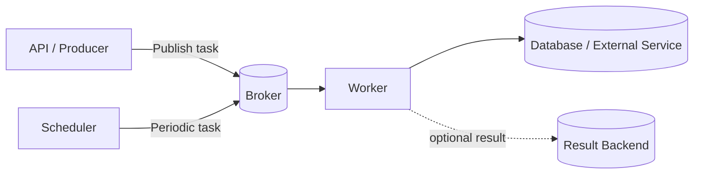
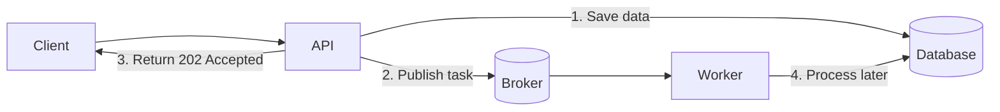
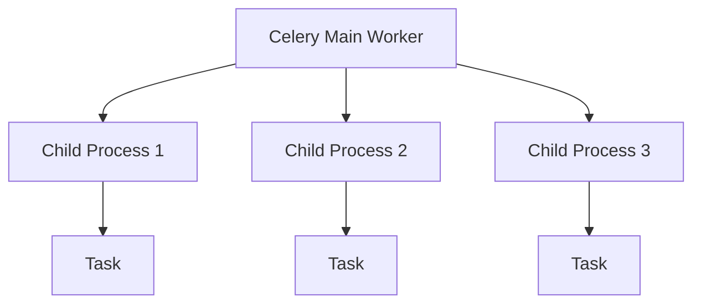
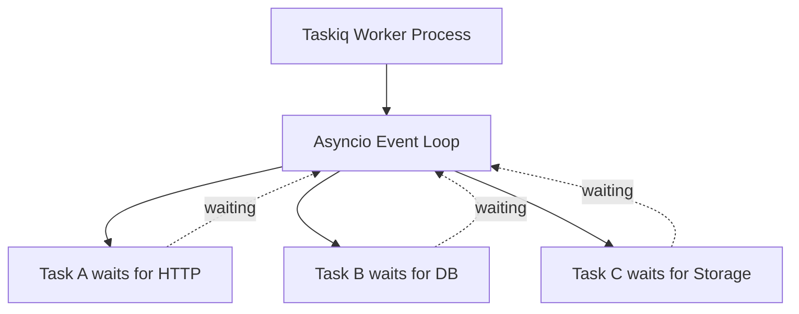
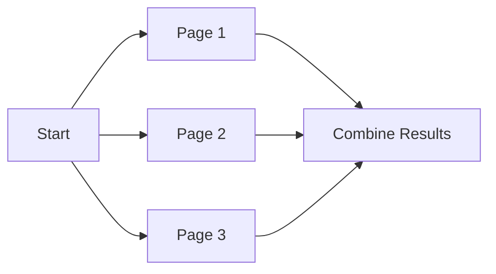
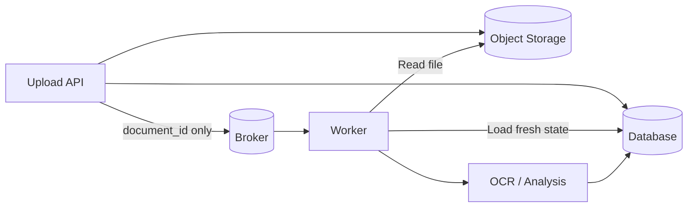
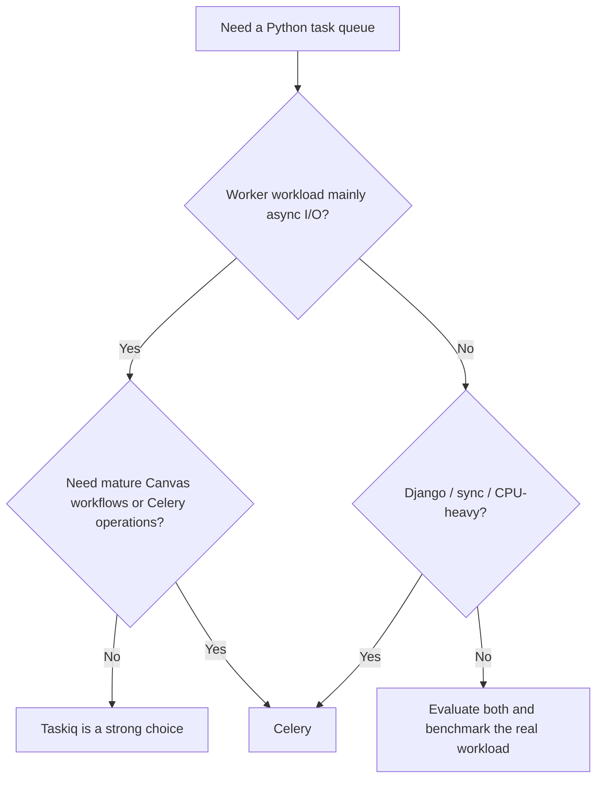

# Celery vs Taskiq

> Celery and Taskiq both move slow or independent work out of the HTTP request cycle. The main difference is their **execution model**: Celery is mature and process-oriented by default, while Taskiq is designed around **asyncio**.
>
> **Version snapshot (August 2026):** Celery **5.6.3** · Taskiq **0.12.4**

## In Short

- **Celery** is the safer default for Django, synchronous code, CPU-heavy work, complex workflows, mature routing, monitoring, and operational control.
- **Taskiq** is a strong fit for async-first services using FastAPI/AioHTTP, async database drivers, and async HTTP clients.
- Celery's default `prefork` pool uses multiple child processes. Its built-in pools do not provide a native asyncio worker pool.
- Taskiq runs `async def` tasks directly on an asyncio event loop. Regular `def` tasks use a thread pool by default, with a process-pool option for CPU-heavy synchronous work.
- Both depend on a **broker** for task delivery, and both may use a **result backend** when task results need to be stored.
- Do not assume exactly-once execution. Important tasks should be **idempotent** because retries or redelivery can cause the same business operation to run more than once.



---

# 1. Why Background Task Queues Are Used

A web request should normally return quickly. Long-running work inside the request-response cycle increases latency and makes failures harder to manage.

Typical background jobs include:

- Sending emails or notifications
- Processing uploaded files
- OCR and document extraction
- Generating reports
- Calling slow third-party APIs
- Image or video processing
- Data exports
- Scheduled cleanup jobs

Without a queue, the API waits for the slow operation. With a queue, the API publishes a small task message and returns immediately while a worker handles the work separately.



---

# 2. Common Architecture

Both Celery and Taskiq use the same basic components.

## Producer

The application that submits work, such as a Django view, FastAPI endpoint, CLI command, or another task.

## Broker

The transport between producers and workers.

Common choices include:

- RabbitMQ
- Redis
- AWS SQS
- NATS or other framework-specific integrations

## Worker

A separate process that consumes task messages and executes the task function.

## Result Backend

Optional storage for task state or returned values. Avoid storing results when the application does not need them.

## Scheduler

Publishes tasks at predefined times.

- Celery: **Celery Beat**
- Taskiq: **TaskiqScheduler**

The scheduler sends tasks; it does not perform the business work itself.

---

# 3. Celery

Celery is a mature distributed task queue with a large ecosystem and strong Django support.

## Core Strengths

- Production-proven ecosystem
- First-class Django integration
- Natural fit for synchronous Python code
- `prefork` multiprocessing by default
- Retries, routing, priorities, revocation, and remote worker control
- Canvas workflows: `chain`, `group`, and `chord`
- Periodic tasks with Celery Beat
- Monitoring through events, CLI tools, and Flower

## Basic Example

```python
from celery import Celery

app = Celery(
    "tasks",
    broker="redis://localhost:6379/0",
    backend="redis://localhost:6379/1",
)


@app.task
def add(x: int, y: int) -> int:
    return x + y
```

Publish the task:

```python
result = add.delay(10, 20)
print(result.id)
```

Run the worker:

```bash
celery -A tasks worker --loglevel=INFO
```

The important point is that `add.delay(...)` does **not** execute `add()` in the current web process. It serializes a task message and sends it to the broker.

---

# 4. Taskiq

Taskiq is an async-first distributed task queue designed around modern Python and `asyncio`.

## Core Strengths

- Native `async`/`await` task execution
- Supports both `async def` and regular `def` tasks
- Strong typing and editor autocompletion
- Dependency injection
- FastAPI and AioHTTP integrations
- Retry middleware
- Prometheus and OpenTelemetry integration
- Task scheduling support
- Modular broker/backend ecosystem

## Basic Example

```python
from taskiq_redis import RedisStreamBroker

broker = RedisStreamBroker("redis://localhost:6379/0")


@broker.task
async def add(x: int, y: int) -> int:
    return x + y
```

Publish the task from async code:

```python
result = await add.kiq(10, 20)
print(result.task_id)
```

Run the worker:

```bash
taskiq worker tasks:broker
```

Taskiq is especially natural when the worker itself uses async libraries such as `httpx.AsyncClient`, async SQLAlchemy, `asyncpg`, or other non-blocking I/O clients.

---

# 5. The Main Difference: Execution Model

This is the most interview-relevant difference.

## Celery: Process-Oriented by Default

Celery's default worker pool is `prefork`.



This is a strong fit for:

- Django ORM work
- Existing synchronous libraries
- CPU-heavy Python processing
- PDF/image processing
- Workloads that benefit from process isolation

Celery 5.6 includes pools such as `prefork`, `eventlet`, `gevent`, `threads`, and `solo`, but no built-in native asyncio worker pool.

If a Celery task must call async code, a synchronous task can bridge to an event loop, but this is not the same as running an async-native worker.

```python
import asyncio

@app.task
def sync_task() -> dict:
    return asyncio.run(fetch_remote_data())
```

Use this pattern only when needed; do not choose it as the main architecture for a heavily async worker workload.

## Taskiq: Asyncio-Oriented

Taskiq runs asynchronous tasks on an asyncio event loop.



While one task waits for network I/O, the event loop can continue executing other tasks.

For synchronous functions, Taskiq uses a `ThreadPoolExecutor` by default. CPU-heavy synchronous work can be moved to a `ProcessPoolExecutor` using worker configuration.

---

# 6. Celery vs Taskiq

| Area | Celery | Taskiq |
|---|---|---|
| Current snapshot | 5.6.3 | 0.12.4 |
| Minimum Python | 3.9 | 3.10 |
| Main model | Mature distributed queue | Async-first distributed queue |
| Default execution style | Prefork processes | Asyncio + worker processes |
| Native `async def` tasks | No built-in asyncio pool | Yes |
| Sync tasks | Excellent | Yes, executor-based |
| Django | Excellent fit | Possible, less common |
| FastAPI async stack | Works, but APIs are mostly sync-oriented | Natural fit |
| CPU-heavy jobs | Strong default | Possible with process pool |
| High-concurrency async I/O | Less natural | Strong fit |
| Workflow primitives | Mature Canvas | Smaller pipeline ecosystem |
| Scheduling | Celery Beat | TaskiqScheduler |
| Monitoring/control | Flower, events, inspect/control | Metrics/tracing middleware |
| Typing | More dynamic | Strong typing focus |
| Ecosystem maturity | Very high | Smaller/newer |

A practical rule: **choose based on what the worker does, not only which web framework the API uses**.

A FastAPI application whose workers mostly run synchronous PDF generation may still be better served by Celery. A FastAPI service making thousands of concurrent async API calls is a much stronger Taskiq candidate.

---

# 7. Broker Reliability

The task framework alone does not determine reliability. Broker behavior and acknowledgement support matter just as much.

## Celery

Common broker choices include RabbitMQ, Redis, and AWS SQS.

RabbitMQ is often preferred when advanced routing and stronger message-queue semantics are important. Redis is simpler and very common for application background jobs.

## Taskiq Redis Brokers

`taskiq-redis` provides different broker strategies:

| Broker | Acknowledgements | Practical Meaning |
|---|---:|---|
| Pub/Sub | No | Worker crash during processing can lose the message |
| ListQueue | No | Message can be lost after it is removed from the list |
| Redis Stream | Yes | Better fit when task durability matters |

For durable processing, do not select a broker only because it is easy to configure.

---

# 8. Retries and Idempotency

Retries should be used for **temporary failures**, such as:

- Network timeouts
- HTTP `429`
- HTTP `503`
- Temporary database unavailability
- Temporary storage failures

Do not repeatedly retry permanent failures such as invalid input or unsupported business data.

## Celery Retry

```python
@app.task(
    autoretry_for=(TemporaryServiceError,),
    retry_backoff=True,
    retry_jitter=True,
    max_retries=5,
)
def sync_customer(customer_id: str) -> None:
    call_external_service(customer_id)
```

## Taskiq Retry

Taskiq commonly applies retries through `SmartRetryMiddleware`, with options for retry count, delay, jitter, and exponential backoff.

## Why Idempotency Matters

A task can run more than once because of retries, worker crashes, redelivery, scheduler duplication, or manual retry.

Bad design:

```python
def charge_card(order_id: str) -> None:
    payment_gateway.charge(order_id)
```

Safer design:

```python
def charge_card(order_id: str) -> None:
    payment = get_payment(order_id)

    if payment.status == "captured":
        return

    payment_gateway.charge(
        order_id=order_id,
        idempotency_key=f"order:{order_id}",
    )

    mark_payment_captured(order_id)
```

For distributed task systems, think in terms of **at-least-once execution**, then design the business operation so duplicate execution is safe.

---

# 9. Scheduling and Workflows

## Periodic Tasks

Celery Beat and TaskiqScheduler both publish scheduled tasks to the broker.


Keep scheduler and worker responsibilities separate in production.

## Complex Workflows

Celery is stronger when workflows require mature orchestration primitives.

- `chain` → run tasks sequentially
- `group` → run tasks in parallel
- `chord` → run parallel tasks, then a final callback



Taskiq has pipeline support, but Celery Canvas is more established for complex fan-out/fan-in task graphs.

For long-running business workflows that must persist state for hours or days, consider whether a workflow engine such as Temporal or AWS Step Functions is a better abstraction than a task queue.

---

# 10. Practical Example: Document Processing

Assume an API accepts a document upload and performs OCR in the background.

The preferred design is:



Do **not** place the entire PDF or base64 payload inside the task message. Store the file first, then publish only an identifier.

### Celery Submission

```python
result = process_document.delay(str(document.id))
```

### Taskiq Submission

```python
result = await process_document.kiq(str(document.id))
```

The worker should then:

1. Load the latest document state using `document_id`.
2. Return early if processing is already complete.
3. Perform OCR or analysis.
4. Persist the result.
5. Retry only temporary failures.

This pattern keeps messages small and makes idempotency much easier.

---

# 11. Django and FastAPI Guidance

## Django

Celery is normally the first choice for Django because it provides mature integration, task autodiscovery, Django settings integration, and transaction-aware task publishing.

A particularly useful API is `delay_on_commit()`, which publishes a task only after the surrounding Django database transaction commits.

```python
send_email.delay_on_commit(user.pk)
```

This avoids a race where a worker starts before the database record is committed.

## FastAPI

Taskiq is especially attractive when the entire dependency stack is asynchronous.

```python
@router.post("/documents/{document_id}/analyze", status_code=202)
async def start_analysis(document_id: str):
    task = await analyze_document.kiq(document_id)
    return {"task_id": task.task_id, "status": "queued"}
```

Do not send the FastAPI `Request`, database session, open file handle, or HTTP client through the broker. Workers execute in another process and may run on another machine.

Pass serializable identifiers and reconstruct dependencies inside the worker.

---

# 12. Production Practices

Keep these rules in mind for either framework:

- **Pass IDs, not large objects.** Store large payloads in a database or object storage.
- **Make important tasks idempotent.** Duplicate execution must not corrupt business state.
- **Publish after database commit.** Avoid workers reading records that are not committed yet.
- **Separate queues by workload.** Short notifications and ten-minute OCR jobs should not share identical worker settings.
- **Set external-call timeouts.** Task timeouts do not replace HTTP/database timeouts.
- **Use exponential backoff and jitter.** Prevent retry storms.
- **Retry selected transient errors only.** Do not retry every exception.
- **Control concurrency.** The bottleneck may be the database, CPU, memory, or external API rate limit.
- **Expire task results.** Do not keep unnecessary Redis results forever.
- **Monitor queue age, not only queue length.** Oldest-message age is often a better signal of backlog health.
- **Use structured logs.** Include task ID, task name, business entity ID, retry number, duration, and correlation ID.
- **Protect sensitive data.** Avoid secrets and unnecessary customer data in messages, results, logs, and monitoring tools.

---

# 13. Choosing Between Them



## Recommended Starting Point

| Stack / Requirement | Starting Choice |
|---|---|
| Django + PostgreSQL + Redis | **Celery** |
| Django + CPU-heavy processing | **Celery** |
| FastAPI + async SQLAlchemy + async HTTP | **Taskiq** |
| FastAPI + existing Celery infrastructure | **Celery** |
| Complex fan-out/fan-in workflows | **Celery** |
| High-volume async API calls | **Taskiq** |
| Small async microservice | **Taskiq** |
| Mature worker inspection/control required | **Celery** |
| Long-running durable business workflow | Consider a workflow engine |

## Final Takeaway

The choice is less about `.delay()` versus `.kiq()` and more about the **runtime model and operational requirements**.

- Choose **Celery** when maturity, Django integration, multiprocessing, complex workflows, routing, and operational tooling matter most.
- Choose **Taskiq** when the worker is genuinely async-first and spends most of its time waiting on network I/O.
- In both cases, production reliability comes from good broker semantics, idempotent task design, controlled retries, observability, and correct transaction boundaries.
