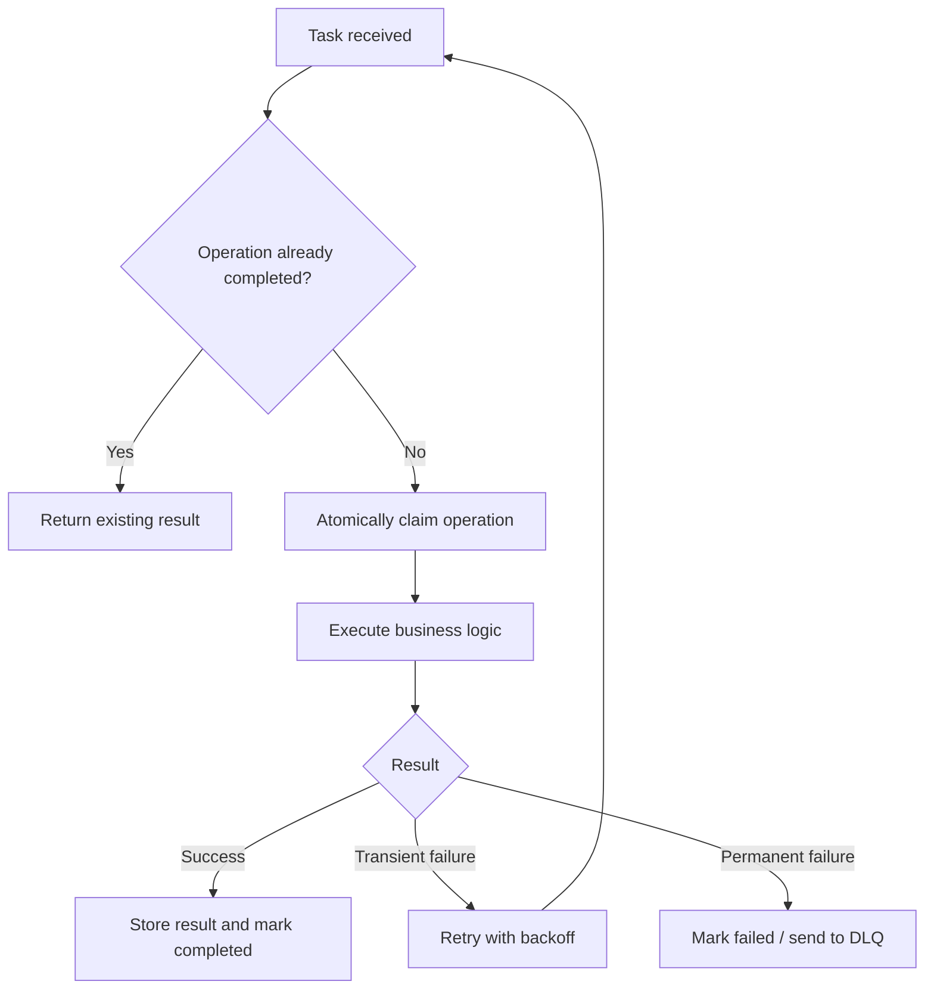
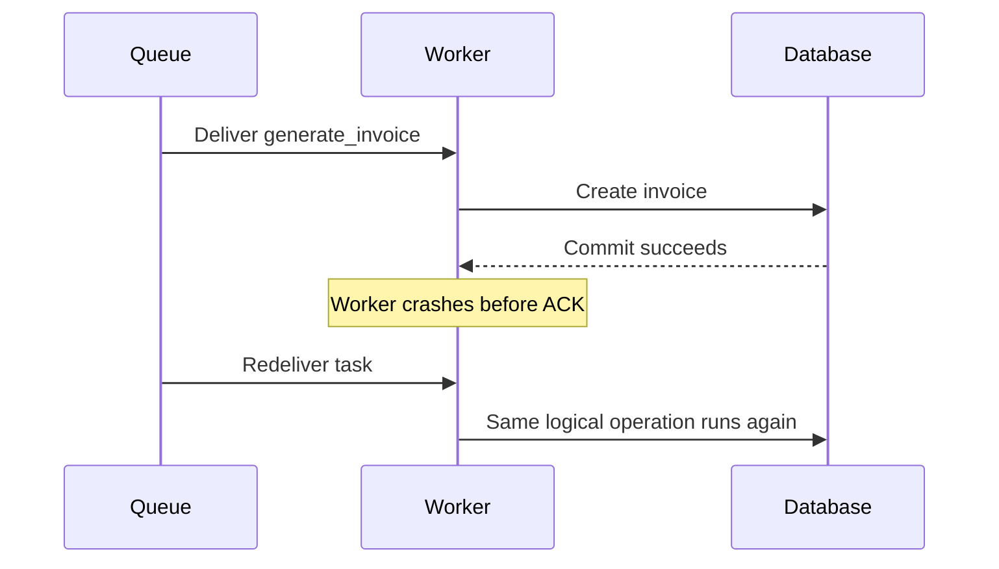
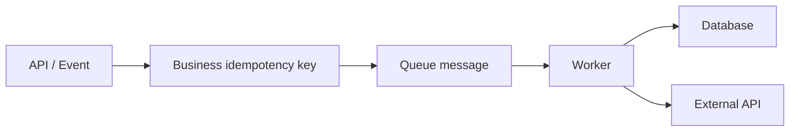

# Idempotency in Background Tasks

> Design background tasks so retries, duplicate delivery, worker crashes, and concurrent execution do not create duplicate business effects.

## In short

- Background queues commonly behave with **at-least-once delivery**, so a task may run more than once.
- The goal is not “the task executes once”; the goal is **the business operation has one correct final effect**.
- Use a **stable business idempotency key**, such as `invoice:{customer_id}:{billing_period}`.
- Enforce correctness using the **database**: unique constraints, atomic upserts, or conditional state transitions.
- Locks and message deduplication can reduce duplicate work, but they are not the final correctness guarantee.
- External APIs should receive the same idempotency key on every retry when the provider supports it.
- A timeout from an external service does **not** prove the operation failed.
- Long workflows should persist step/state progress so retries resume safely.

```text
At-least-once delivery
        +
Idempotent processing
        =
Effectively-once business outcome
```



---

# Index

1. [What Idempotency Means](#1-what-idempotency-means)
2. [Why Background Tasks Run More Than Once](#2-why-background-tasks-run-more-than-once)
3. [Idempotency vs Related Concepts](#3-idempotency-vs-related-concepts)
4. [Stable Idempotency Keys](#4-stable-idempotency-keys)
5. [Database-Enforced Idempotency](#5-database-enforced-idempotency)
6. [Retries and External Side Effects](#6-retries-and-external-side-effects)
7. [Practical Celery Example](#7-practical-celery-example)
8. [Long-Running Workflows](#8-long-running-workflows)
9. [Production Checklist](#9-production-checklist)

---

# 1. What Idempotency Means

An operation is **idempotent** when running the same logical operation multiple times leaves the system in the same final business state as running it once.

For background jobs:

> The same task may be retried or delivered multiple times without creating duplicate records, duplicate payments, repeated inventory changes, or other unwanted side effects.

## Naturally idempotent

```python
user.is_verified = True
order.status = "CANCELLED"
```

Repeating these assignments keeps the same final value.

## Not naturally idempotent

```python
wallet.balance -= 100
inventory.quantity -= 1
send_email(...)
create_invoice(...)
```

Each execution can create another effect, so these operations need explicit protection.

---

# 2. Why Background Tasks Run More Than Once

A task may be executed again when:

- A worker completes the database operation but crashes before acknowledging the message.
- A message acknowledgment is lost.
- A task exceeds a broker visibility timeout.
- The application retries a transient failure.
- A scheduler or producer publishes the same logical job twice.
- A dead-letter queue is replayed.
- Two workers process equivalent events concurrently.

## Common failure timeline



Without idempotency, the second execution can create a duplicate invoice.

With idempotency, the retry discovers that the logical operation is already completed and returns the existing result.

---

# 3. Idempotency vs Related Concepts

## 3.1 Idempotency vs Deduplication

**Deduplication** tries to prevent duplicate messages from reaching business logic.

**Idempotency** makes duplicate execution harmless.

Deduplication is useful for efficiency, but idempotency should remain the correctness layer because duplicates can still appear after cache expiry, replay, worker failure, or concurrent delivery.

## 3.2 Idempotency vs Atomicity

**Atomicity** means a group of database operations completes fully or rolls back.

**Idempotency** means repeating the logical operation does not create an additional effect.

Example:

```python
account.balance += 100
```

This can run inside an atomic transaction and still be non-idempotent because running it twice adds `200`.

## 3.3 Idempotency vs Locking

A lock prevents or reduces concurrent execution.

It does not protect against every later retry or replay.

Use a lock when useful for coordination, but keep a durable database rule such as a unique constraint or conditional update as the correctness guarantee.

## 3.4 Exactly-once vs Effectively-once

Exactly-once execution across a broker, worker, database, and third-party API is difficult because they usually do not share one atomic transaction.

In normal application design, the practical target is:

```text
Message may execute more than once
            ↓
Every execution uses the same business identity
            ↓
Database / downstream service accepts the effect once
            ↓
Effectively-once business result
```

---

# 4. Stable Idempotency Keys

An idempotency key should identify the **logical business operation**, not one execution attempt.

## Good keys

```text
invoice:{customer_id}:{billing_period}
payment:{order_id}
refund:{payment_id}
welcome-email:{user_id}
webhook:{provider_event_id}
report:{account_id}:{report_date}
```

Example:

```python
task_key = f"invoice:{customer_id}:{billing_period}"
```

If the same customer invoice for the same billing period is retried five times, all five attempts use the same key.

## Weak keys

Avoid using only:

```text
Celery task ID
random UUID generated inside the worker
current timestamp
worker process ID
queue delivery tag
```

These identify an **attempt**, so a new publication or replay can generate a different value and bypass protection.

## Key rule

Generate or derive the key at the earliest stable business boundary and preserve it through:



---

# 5. Database-Enforced Idempotency

The database is normally the strongest place to enforce idempotency for backend applications.

## 5.1 Unique business constraint

For invoices:

```python
class Invoice(models.Model):
    customer_id = models.IntegerField()
    billing_period = models.CharField(max_length=7)

    class Meta:
        constraints = [
            models.UniqueConstraint(
                fields=["customer_id", "billing_period"],
                name="uniq_customer_billing_period",
            )
        ]
```

Now two workers cannot create two invoices for the same logical billing operation.

## 5.2 Conditional state transition

When an operation should occur only from one state:

```sql
UPDATE orders
SET status = 'PROCESSING'
WHERE id = 101
  AND status = 'PENDING';
```

The first worker changes the row.

A concurrent or repeated execution affects `0` rows and knows another execution already claimed or completed the transition.

## 5.3 Avoid check-then-act

Unsafe pattern:

```python
if not Invoice.objects.filter(
    customer_id=customer_id,
    billing_period=billing_period,
).exists():
    Invoice.objects.create(...)
```

Two workers can both read “not found” before either inserts.

Prefer a database constraint plus an atomic operation such as `get_or_create()`, `INSERT ... ON CONFLICT`, or a conditional update.

## 5.4 Idempotency record

For operations that need explicit tracking:

```python
class IdempotencyRecord(models.Model):
    key = models.CharField(max_length=255, unique=True)
    status = models.CharField(max_length=20)
    result = models.JSONField(null=True)
    locked_until = models.DateTimeField(null=True)
    created_at = models.DateTimeField(auto_now_add=True)
    updated_at = models.DateTimeField(auto_now=True)
```

Typical states:

```text
PROCESSING → COMPLETED
     │
     ├──→ RETRYABLE
     └──→ FAILED
```

A lease such as `locked_until` helps recover a task if a worker crashes while the record remains in `PROCESSING`.

---

# 6. Retries and External Side Effects

## 6.1 Retry only suitable failures

Typical transient failures:

- network timeout
- connection reset
- temporary database/broker unavailability
- HTTP `429`
- HTTP `502`, `503`, `504`

Typical permanent failures:

- invalid payload
- failed business validation
- unsupported operation
- missing required data
- permission failure that requires configuration changes

For transient failures, use:

```text
bounded retries
+ exponential backoff
+ jitter
```

This prevents many workers from retrying at the same moment.

## 6.2 External API idempotency

A database transaction cannot roll back a completed payment or third-party call.

When the provider supports idempotency, reuse the same key:

```python
payment_client.create_charge(
    amount=12000,
    currency="usd",
    idempotency_key=f"payment:order:{order.id}",
)
```

Also store the provider reference:

```text
order_id: 781
idempotency_key: payment:order:781
provider_payment_id: pay_987
status: SUCCEEDED
```

## 6.3 Timeout does not mean failure

Consider:

```text
Worker sends payment
        ↓
Provider charges customer
        ↓
Network response is lost
        ↓
Worker receives timeout
```

The result is **unknown**, not definitely failed.

Safe approaches:

- retry using the same downstream idempotency key;
- query by a stable merchant/business reference;
- reconcile using provider webhooks or settlement data;
- keep local state such as `PENDING_CONFIRMATION`.

This is especially important for payments, refunds, emails, and other irreversible side effects.

---

# 7. Practical Celery Example

Consider a monthly invoice task.

The logical rule is:

> A customer must have only one invoice for one billing period.

## 7.1 Celery task

```python
from celery import shared_task
from django.db import transaction


@shared_task(
    bind=True,
    autoretry_for=(TimeoutError, ConnectionError),
    retry_backoff=True,
    retry_jitter=True,
    max_retries=5,
    acks_late=True,
)
def generate_invoice(self, customer_id: int, billing_period: str):
    task_key = f"invoice:{customer_id}:{billing_period}"

    with transaction.atomic():
        invoice, created = Invoice.objects.get_or_create(
            customer_id=customer_id,
            billing_period=billing_period,
            defaults={"status": "CREATED"},
        )

    return {
        "invoice_id": invoice.id,
        "status": invoice.status,
        "idempotency_key": task_key,
        "created": created,
    }
```

The important part is **not** `acks_late=True`.

The important correctness guarantee is the unique business constraint on:

```text
(customer_id, billing_period)
```

`acks_late` changes acknowledgment behavior, but task logic must still be safe when a message is redelivered.

## 7.2 Relevant Celery configuration

```python
task_acks_late = True
task_reject_on_worker_lost = True

# Often useful for long-running tasks; tune based on workload.
worker_prefetch_multiplier = 1
```

These settings influence delivery and worker behavior. They do not replace idempotency.

## Interview-ready explanation

A strong explanation is:

> Background jobs can be delivered more than once, especially when a worker completes a database change and crashes before acknowledgment. I design the task around a stable business key, such as `invoice:{customer_id}:{billing_period}`, and enforce that identity in the database with a unique constraint or conditional state transition. Retries then become safe because the duplicate execution cannot create another business effect. For external APIs, I propagate the same idempotency key and store the provider reference so timeout outcomes can be reconciled.

---

# 8. Long-Running Workflows

A multi-step workflow should not depend only on in-memory progress.

Example:


Persist the workflow state after each successful step.

On retry:

1. Read the current state.
2. Skip steps already completed.
3. Execute only the next valid transition.
4. Store external references.
5. Persist the next state.

Example:

```python
def process_order(order):
    if order.state == "PENDING":
        reserve_inventory_once(order)
        transition(order, "INVENTORY_RESERVED")

    if order.state == "INVENTORY_RESERVED":
        capture_payment_once(order)
        transition(order, "PAYMENT_CAPTURED")

    if order.state == "PAYMENT_CAPTURED":
        create_shipment_once(order)
        transition(order, "SHIPMENT_CREATED")
```

For complex, long-running business workflows, a durable state machine or workflow engine is usually easier to operate than one very large task.

---

# 9. Production Checklist

## Task identity

- Use a stable business idempotency key.
- Preserve the same key across retries and replays.
- Do not depend only on a queue-generated task ID.

## Database

- Add a unique constraint where the business rule is naturally unique.
- Prefer atomic upserts or conditional updates over check-then-act.
- Make concurrent duplicate execution safe.
- Recover abandoned `PROCESSING` records using a lease/timeout strategy when needed.

## Retries

- Retry transient failures only.
- Use exponential backoff and jitter.
- Limit retry attempts.
- Provide a dead-letter or manual-review path.

## External side effects

- Reuse provider-supported idempotency keys.
- Store downstream operation IDs.
- Treat timeouts as uncertain outcomes.
- Add reconciliation where duplicate effects are high risk.

## Multi-step tasks

- Persist workflow state.
- Make each step independently retryable.
- Make compensation operations idempotent too.

## Observability

Useful log fields:

```text
task_name
task_id
idempotency_key
business_entity_id
attempt_number
status
external_reference
retry_reason
duration_ms
```

Useful metrics:

- duplicate execution attempts;
- idempotency conflicts/hits;
- retry count;
- tasks stuck in `PROCESSING`;
- dead-letter queue size;
- unknown external outcomes;
- task completion latency.

---

# References

- [Celery 5.6.3 Documentation — Tasks](https://docs.celeryq.dev/en/stable/userguide/tasks.html)
- [Celery Documentation — Optimizing](https://docs.celeryq.dev/en/stable/userguide/optimizing.html)
- [AWS Well-Architected — Make Mutating Operations Idempotent](https://docs.aws.amazon.com/wellarchitected/latest/framework/rel_prevent_interaction_failure_idempotent.html)
- [AWS Well-Architected — Control and Limit Retry Calls](https://docs.aws.amazon.com/wellarchitected/latest/framework/rel_mitigate_interaction_failure_limit_retries.html)
- [Stripe API — Idempotent Requests](https://docs.stripe.com/api/idempotent_requests)
- [Google Cloud Tasks — Understand Cloud Tasks](https://docs.cloud.google.com/tasks/docs/dual-overview)
