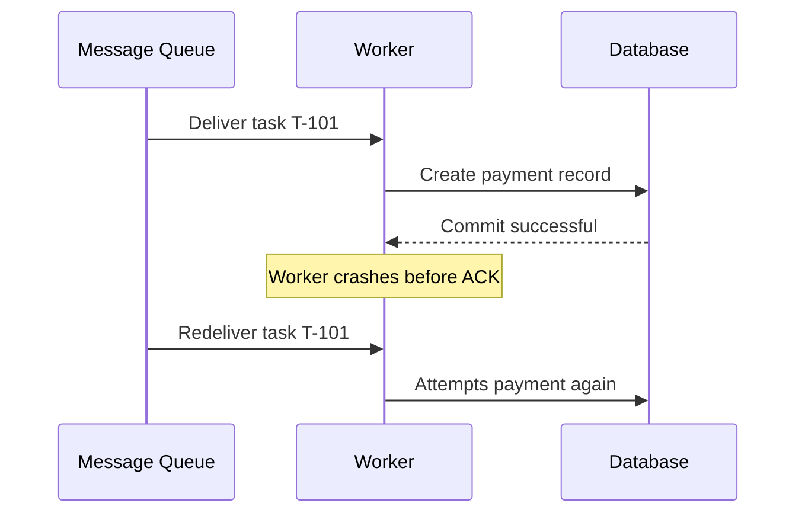
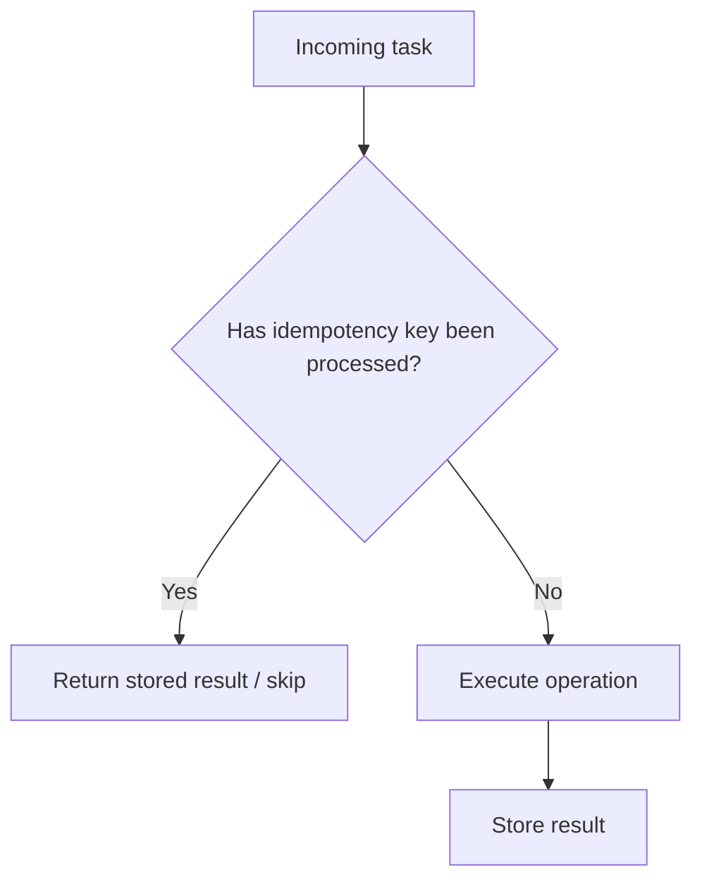
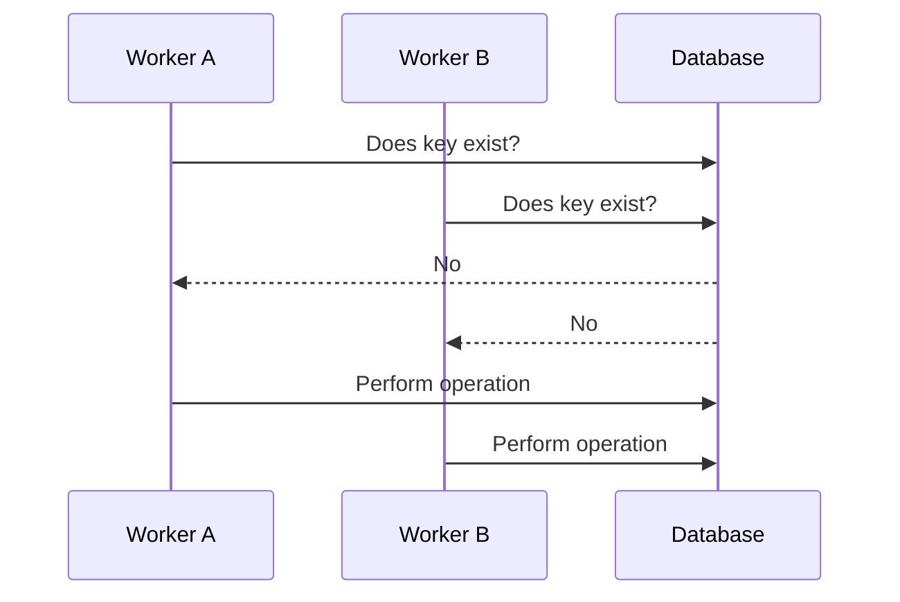
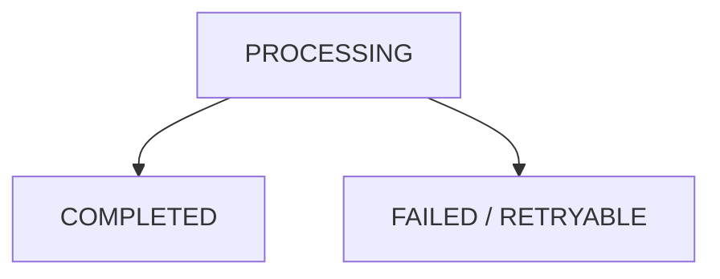
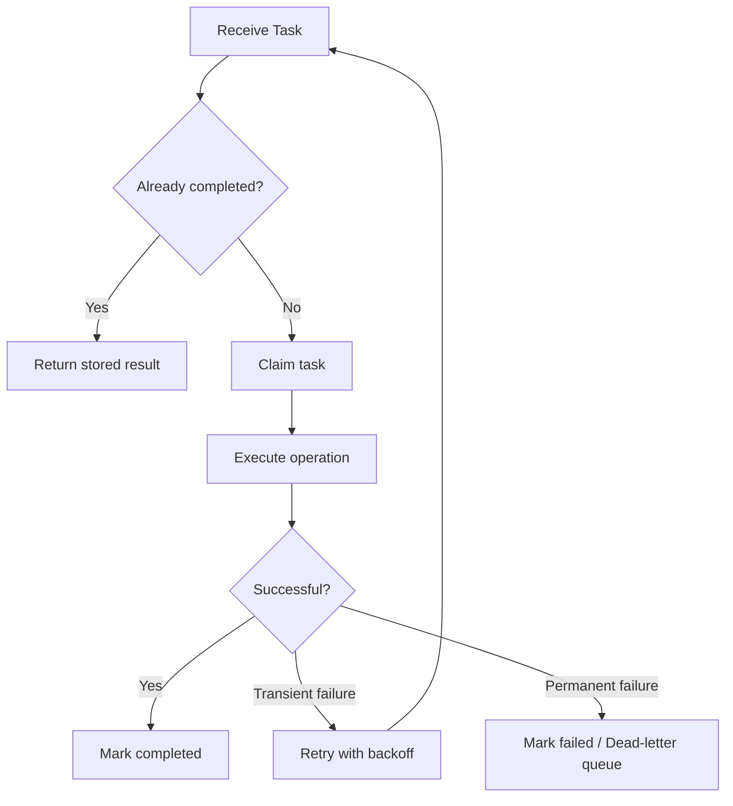
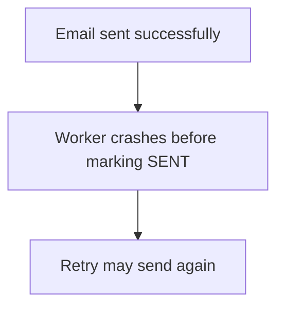
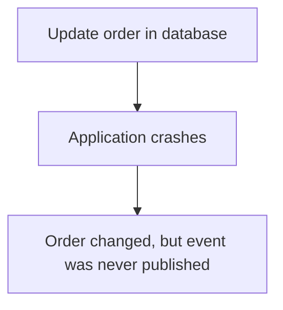
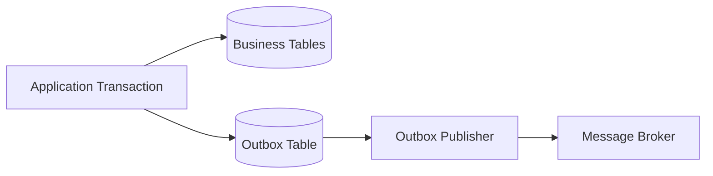
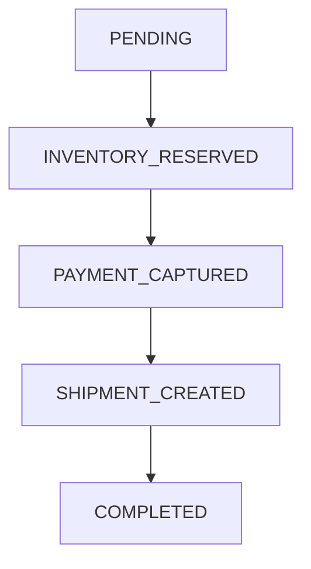
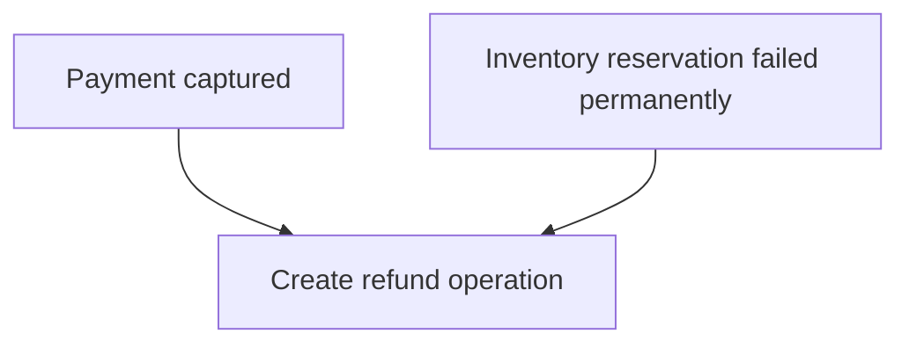

# Idempotency in Background Tasks

> **Category:** Async & Task Processing  
> **Audience:** Developers with 3+ years of experience  
> **Goal:** Design background tasks that remain correct when messages are retried, redelivered, duplicated, or processed concurrently.

---

# 1. What Idempotency Means

An operation is **idempotent** when executing it multiple times has the same final effect as executing it once.

```text
process(task) once  → final state X
process(task) twice → final state X
process(task) N times → final state X
```

Idempotency does **not always mean** that every execution returns exactly the same runtime response. It means repeated executions do not create additional unwanted side effects.

## Simple Example

Setting an order status to `SHIPPED` is naturally idempotent:

```python
order.status = "SHIPPED"
order.save()
```

Running this operation multiple times still leaves the order in the same state.

Incrementing a value is not naturally idempotent:

```python
order.notification_count += 1
order.save()
```

Every retry changes the state again.

## Practical Definition

For background processing, idempotency means:

> The same logical task can be retried or delivered multiple times without producing duplicate records, duplicate payments, repeated emails, corrupted counters, or inconsistent business state.

---

# 2. Why Background Tasks Run More Than Once

Most queue-based systems provide **at-least-once delivery**, not a perfect guarantee that a message is processed exactly once.

A task may be delivered again when:

- The worker finishes the operation but crashes before acknowledging the message.
- The acknowledgment is lost because of a network failure.
- The task exceeds its visibility timeout.
- The broker redelivers an unacknowledged message.
- The application explicitly retries after a temporary failure.
- A scheduler accidentally publishes the same task twice.
- Two producers create the same logical job.
- An administrator replays messages from a dead-letter queue.
- A consumer restarts while processing a task.
- Multiple workers race to process equivalent events.

## Failure Timeline



Without idempotency, one queue message can create two business operations.

With idempotency, the second execution detects that `T-101` has already been completed and safely returns the original result.

---

# 3. Idempotency vs Related Concepts

## 3.1 Idempotency vs Deduplication

**Deduplication** attempts to stop duplicate messages from being processed.

**Idempotency** makes duplicate processing harmless.

Deduplication is useful, but it is usually time-bound or storage-dependent. Idempotency should remain the final correctness layer.

```text
Duplicate prevention     → Optimization
Idempotent processing    → Correctness guarantee
```

## 3.2 Idempotency vs Exactly-Once Processing

“Exactly once” is difficult across distributed components because the broker, worker, database, and external services cannot usually commit one shared atomic transaction.

A more realistic design is:

```text
At-least-once delivery
        +
Idempotent consumer
        =
Effectively-once business outcome
```

## 3.3 Idempotency vs Atomicity

**Atomicity** means an operation completes fully or not at all.

**Idempotency** means repeating the operation does not create additional effects.

A task can be:

- Atomic but not idempotent
- Idempotent but not atomic
- Both atomic and idempotent
- Neither

Example:

```python
account.balance += 100
```

This may run inside an atomic transaction, but repeating it still adds the amount twice. Atomicity alone does not provide idempotency.

## 3.4 Idempotency vs Distributed Locking

A distributed lock reduces concurrent execution, but it is not a complete idempotency solution.

Locks can expire, workers can crash, and messages can be replayed later. Use locks to control concurrency, while using durable database state to guarantee correctness.

---

# 4. Identifying Safe and Unsafe Operations

## Naturally Idempotent Operations

These operations usually produce the same final state when repeated:

```python
user.is_verified = True
order.status = "CANCELLED"
cache.set("product:42", serialized_product)
storage.put("reports/monthly.pdf", report_bytes)
```

The operation replaces or sets a known value.

## Non-Idempotent Operations

These operations produce additional effects on every execution:

```python
wallet.balance -= 100
inventory.quantity -= 1
send_email(...)
create_invoice(...)
append_to_file(...)
publish_event(...)
```

These require an explicit idempotency strategy.

## Conditionally Idempotent Operations

Some operations become idempotent only when combined with a condition.

Example:

```sql
UPDATE orders
SET status = 'PROCESSING'
WHERE id = 101
  AND status = 'PENDING';
```

Only the first execution changes the row. Later executions affect zero rows.

---

# 5. Core Idempotency Patterns

## 5.1 Store a Processed Task Record

Store a unique identifier for each logical task.



Example table:

```sql
CREATE TABLE idempotency_records (
    idempotency_key VARCHAR(255) PRIMARY KEY,
    status VARCHAR(30) NOT NULL,
    response JSONB,
    created_at TIMESTAMPTZ NOT NULL DEFAULT NOW(),
    completed_at TIMESTAMPTZ
);
```

The primary key prevents two workers from registering the same task successfully.

## 5.2 Use a Business-Level Unique Constraint

Often the best idempotency key already exists in the business domain.

Examples:

- One invoice per `(customer_id, billing_period)`
- One refund per `payment_id`
- One welcome-email record per `user_id`
- One event processing record per `event_id`
- One settlement per `(merchant_id, settlement_date)`

```sql
CREATE UNIQUE INDEX unique_monthly_invoice
ON invoices(customer_id, billing_period);
```

Then use an upsert or handle the uniqueness conflict.

```sql
INSERT INTO invoices(customer_id, billing_period, amount)
VALUES (42, '2026-07', 2500)
ON CONFLICT (customer_id, billing_period)
DO NOTHING;
```

This is stronger than checking first and inserting later.

## 5.3 Compare-and-Set State Transition

Update data only when it is in an expected state.

```sql
UPDATE orders
SET status = 'CHARGING'
WHERE id = :order_id
  AND status = 'PAYMENT_PENDING';
```

The worker checks the affected row count:

```python
if updated_rows == 0:
    # Another execution already moved the order forward,
    # or the order is no longer eligible.
    return
```

This pattern is useful for workflows and state machines.

## 5.4 Store the Original Result

Sometimes duplicate requests should return the result produced by the first execution.

```text
Key: payment:order-781
Status: COMPLETED
Result: {"payment_id": "pay_987", "amount": 120}
```

A retry can return the stored `payment_id` instead of creating another payment.

## 5.5 Make the Destination Idempotent

Push correctness into the final data store when possible.

Examples:

- Upsert by a unique business key
- Replace an object at a deterministic storage path
- Set a cache value instead of appending
- Update an aggregate to a calculated value instead of incrementing it
- Use a ledger entry with a unique transaction reference

Instead of:

```python
account.balance += payment.amount
```

Prefer an immutable ledger:

```sql
INSERT INTO ledger_entries(reference_id, account_id, amount)
VALUES (:payment_id, :account_id, :amount)
ON CONFLICT (reference_id) DO NOTHING;
```

The account balance can be calculated from unique ledger entries.

---

# 6. Database-Backed Implementation

A reliable implementation normally uses the database as the source of truth.

## 6.1 Unsafe Check-Then-Act

```python
if not IdempotencyRecord.objects.filter(key=task_key).exists():
    perform_side_effect()
    IdempotencyRecord.objects.create(key=task_key)
```

This contains a race condition:



Both workers can observe that the key is missing.

## 6.2 Safe Insert-First Approach

Attempt to claim the key using a unique constraint.

```python
from django.db import IntegrityError, transaction

def claim_task(task_key: str) -> bool:
    try:
        with transaction.atomic():
            IdempotencyRecord.objects.create(
                key=task_key,
                status="PROCESSING",
            )
        return True
    except IntegrityError:
        return False
```

Only one worker can insert the unique key.

## 6.3 Status Model

A useful idempotency record may contain:



Example model:

```python
class IdempotencyRecord(models.Model):
    key = models.CharField(max_length=255, unique=True)
    status = models.CharField(max_length=20)
    result = models.JSONField(null=True)
    error = models.TextField(null=True)
    locked_until = models.DateTimeField(null=True)
    created_at = models.DateTimeField(auto_now_add=True)
    updated_at = models.DateTimeField(auto_now=True)
```

`locked_until` helps recover tasks abandoned by crashed workers.

## 6.4 Transaction Boundary

Whenever possible, update the business data and the idempotency record in the same database transaction.

```python
from django.db import transaction

@transaction.atomic
def process_order(task_key: str, order_id: int) -> dict:
    record = IdempotencyRecord.objects.select_for_update().get(key=task_key)

    if record.status == "COMPLETED":
        return record.result

    order = Order.objects.select_for_update().get(id=order_id)

    if order.status == "PENDING":
        order.status = "PROCESSED"
        order.save(update_fields=["status"])

    result = {"order_id": order.id, "status": order.status}

    record.status = "COMPLETED"
    record.result = result
    record.save(update_fields=["status", "result", "updated_at"])

    return result
```

This protects database changes, but it cannot automatically include an external API call in the same transaction.

---

# 7. Idempotency Keys

An idempotency key identifies one **logical business operation**.

## Good Keys

```text
payment:{order_id}
refund:{payment_id}:{refund_reason_code}
invoice:{customer_id}:{billing_period}
welcome-email:{user_id}
webhook:{provider_event_id}
report:{account_id}:{report_date}
```

## Weak Keys

```text
current_timestamp
random_uuid_generated_by_worker
worker_process_id
queue_delivery_tag
```

These identify an execution attempt, not the logical business action. Every retry may get a different value and bypass protection.

## Key Generation Rule

Generate the key at the earliest stable boundary, normally when the request or event is first created.


The same key should flow through every retry and downstream call.

## Payload Validation

A key should not be reused for a different operation.

Store a hash of important request fields:

```python
import hashlib
import json

def payload_hash(payload: dict) -> str:
    canonical = json.dumps(payload, sort_keys=True, separators=(",", ":"))
    return hashlib.sha256(canonical.encode()).hexdigest()
```

If the same key arrives with a different payload, reject it instead of silently returning an unrelated result.

---

# 8. Handling Concurrency and Race Conditions

Idempotency must work when duplicate tasks execute **at the same time**, not only one after another.

## Database Techniques

Use one or more of these:

- Unique constraints
- Atomic upserts
- Conditional updates
- Row-level locks
- Optimistic version columns
- Serializable transactions for rare high-risk workflows

## Example: Atomic Inventory Reservation

Unsafe:

```python
product = Product.objects.get(id=product_id)

if product.available_quantity >= quantity:
    product.available_quantity -= quantity
    product.save()
```

Two workers can read the same quantity.

Safer conditional update:

```python
from django.db.models import F

updated = (
    Product.objects
    .filter(
        id=product_id,
        available_quantity__gte=quantity,
    )
    .update(
        available_quantity=F("available_quantity") - quantity,
    )
)

if updated == 0:
    raise InsufficientInventory()
```

To make the reservation itself idempotent, also create a reservation with a unique business key:

```sql
CREATE UNIQUE INDEX unique_order_reservation
ON inventory_reservations(order_id, product_id);
```

## Distributed Locks

A Redis lock can reduce duplicate work:

```python
with redis.lock(f"task-lock:{task_key}", timeout=60):
    process_task()
```

However, it should not be the only protection because:

- The lock may expire while the task is still running.
- The worker may pause or lose connectivity.
- Redis may restart or fail over.
- A duplicate may arrive after the lock is released.
- Incorrect lock ownership handling can release another worker's lock.

Use a database uniqueness rule or state transition as the correctness mechanism.

---

# 9. Retries, Backoff, and Dead-Letter Queues

Retries are safe only when the operation is idempotent or when the retry occurs before any side effect.

## Retry Only Transient Failures

Usually retry:

- Network timeout
- Connection reset
- HTTP `429`
- HTTP `502`, `503`, or `504`
- Temporary database connection failure
- Broker availability issue

Usually do not retry without correction:

- Invalid payload
- Missing required data
- Permission failure
- Business rule violation
- Unsupported operation
- Permanent `4xx` response

## Exponential Backoff

```text
Attempt 1 → wait 2 seconds
Attempt 2 → wait 4 seconds
Attempt 3 → wait 8 seconds
Attempt 4 → wait 16 seconds
```

Add jitter so thousands of workers do not retry simultaneously.

```python
import random

def retry_delay(attempt: int, base: int = 2, cap: int = 300) -> float:
    maximum = min(cap, base ** attempt)
    return random.uniform(0, maximum)
```

## Retry Flow



## Dead-Letter Queue

A dead-letter queue stores tasks that exceeded retry limits or failed permanently.

Replaying a dead-letter queue can deliver old messages again. Therefore, replay tooling must preserve the original business idempotency key.

---

# 10. External APIs and Side Effects

External side effects are the most difficult part because your database transaction cannot normally roll back a payment, email, or third-party API call.

## 10.1 Pass an Idempotency Key Downstream

When the external provider supports idempotency, send the same key on every attempt.

```python
response = payment_client.create_charge(
    amount=12000,
    currency="usd",
    idempotency_key=f"charge:order:{order.id}",
)
```

This is the preferred approach for payment creation and other high-risk operations.

## 10.2 Record Provider References

Store the external operation ID:

```text
order_id: 781
payment_provider_id: pay_987
idempotency_key: charge:order:781
status: SUCCEEDED
```

Retries can query or return the existing provider operation.

## 10.3 The Uncertain Outcome Problem

Consider this sequence:

```text
1. Worker sends payment request.
2. Provider successfully charges the customer.
3. Network times out before the worker receives the response.
4. Worker does not know whether payment succeeded.
```

Never assume a timeout means failure.

Correct approaches:

- Retry with the same provider idempotency key.
- Query the provider using a stable merchant reference.
- Reconcile through provider webhooks or settlement reports.
- Mark the local operation as `UNKNOWN` or `PENDING_CONFIRMATION`.

## 10.4 Emails and Notifications

Email providers may not always offer request-level idempotency.

Use a notification record:

```sql
CREATE TABLE notifications (
    id BIGSERIAL PRIMARY KEY,
    notification_key VARCHAR(255) UNIQUE NOT NULL,
    recipient VARCHAR(320) NOT NULL,
    template_name VARCHAR(100) NOT NULL,
    status VARCHAR(30) NOT NULL,
    provider_message_id VARCHAR(255)
);
```

Claim the notification before sending.

Be aware of the failure window:



Possible mitigations:

- Provider idempotency support
- Deterministic provider message reference
- Provider delivery lookup
- Acceptable duplicate semantics for low-risk notifications
- A reconciliation process

Some side effects cannot be made perfectly duplicate-free without support from the destination system.

---

# 11. Celery Example

Celery can retry tasks, and late acknowledgment can cause a task to be redelivered after a worker failure. Therefore, task code should be idempotent.

## Celery Task with Database Idempotency

```python
from celery import shared_task
from django.db import IntegrityError, transaction
from django.utils import timezone

@shared_task(
    bind=True,
    autoretry_for=(TimeoutError, ConnectionError),
    retry_backoff=True,
    retry_jitter=True,
    max_retries=5,
    acks_late=True,
)
def generate_invoice(self, customer_id: int, billing_period: str):
    task_key = f"invoice:{customer_id}:{billing_period}"

    try:
        with transaction.atomic():
            record = IdempotencyRecord.objects.create(
                key=task_key,
                status="PROCESSING",
            )
    except IntegrityError:
        existing = IdempotencyRecord.objects.get(key=task_key)

        if existing.status == "COMPLETED":
            return existing.result

        # Another worker may currently own the task.
        # A production implementation should use a lease/timeout policy.
        return {"status": existing.status}

    try:
        with transaction.atomic():
            invoice, _ = Invoice.objects.get_or_create(
                customer_id=customer_id,
                billing_period=billing_period,
                defaults={"status": "CREATED"},
            )

            result = {
                "invoice_id": invoice.id,
                "status": invoice.status,
            }

            record.status = "COMPLETED"
            record.result = result
            record.completed_at = timezone.now()
            record.save(
                update_fields=[
                    "status",
                    "result",
                    "completed_at",
                    "updated_at",
                ]
            )

        return result

    except Exception as exc:
        IdempotencyRecord.objects.filter(id=record.id).update(
            status="RETRYABLE",
            error=str(exc),
        )
        raise
```

## Celery Configuration Considerations

```python
task_acks_late = True
task_reject_on_worker_lost = True
worker_prefetch_multiplier = 1
```

These settings affect delivery and failure behavior. They do not replace idempotent task logic.

## Important Design Detail

Do not use Celery's generated task ID as the only business idempotency key when two separate task publications may represent the same logical operation.

Prefer:

```python
task_key = f"invoice:{customer_id}:{billing_period}"
```

over:

```python
task_key = self.request.id
```

The Celery task ID identifies one message publication. The business key identifies the operation that must happen once.

---

# 12. Outbox and Inbox Patterns

## 12.1 Transactional Outbox

A common problem is updating the database and publishing an event reliably.

Unsafe flow:



Reversing the order creates the opposite problem: the event may be published while the database transaction later fails.

The transactional outbox stores the business change and event in one transaction.



Example:

```python
from django.db import transaction

with transaction.atomic():
    order.status = "PAID"
    order.save(update_fields=["status"])

    OutboxEvent.objects.create(
        event_id=event_id,
        event_type="OrderPaid",
        payload={"order_id": order.id},
    )
```

A separate publisher sends unsent outbox rows. Publishing may happen more than once, so consumers must still be idempotent.

## 12.2 Inbox / Processed-Message Pattern

A consumer stores every processed message ID.

```sql
CREATE TABLE consumer_inbox (
    consumer_name VARCHAR(100) NOT NULL,
    message_id VARCHAR(255) NOT NULL,
    processed_at TIMESTAMPTZ NOT NULL DEFAULT NOW(),
    PRIMARY KEY (consumer_name, message_id)
);
```

The inbox insert and business update should occur in the same transaction.

```python
with transaction.atomic():
    InboxMessage.objects.create(
        consumer_name="inventory-service",
        message_id=event["id"],
    )

    apply_inventory_change(event)
```

A duplicate message causes a uniqueness conflict and the handler can skip processing.

---

# 13. Long-Running and Multi-Step Tasks

A task that performs multiple side effects needs step-level idempotency.

Example workflow:

```text
1. Reserve inventory
2. Charge payment
3. Create shipment
4. Send confirmation
```

A retry may begin after step 2 has completed.

## Persist Workflow State



Each step should:

1. Check whether the step is already completed.
2. Execute only when the current state allows it.
3. Save the external reference and next state.
4. Be independently retryable.

## Example

```python
def process_order(order_id: int):
    order = Order.objects.get(id=order_id)

    if order.state == "PENDING":
        reserve_inventory_once(order)
        order.state = "INVENTORY_RESERVED"
        order.save(update_fields=["state"])

    if order.state == "INVENTORY_RESERVED":
        capture_payment_once(order)
        order.state = "PAYMENT_CAPTURED"
        order.save(update_fields=["state"])

    if order.state == "PAYMENT_CAPTURED":
        create_shipment_once(order)
        order.state = "SHIPMENT_CREATED"
        order.save(update_fields=["state"])
```

For complex workflows, use a durable workflow engine or a carefully designed state machine instead of one large task with hidden in-memory progress.

## Compensation

Some workflows require a compensating action:



The compensation must also be idempotent:

```text
refund:{original_payment_id}
```

---

# 14. Observability and Testing

## Useful Log Fields

Include these in structured logs:

```text
task_name
task_id
idempotency_key
business_entity_id
attempt_number
worker_id
status
previous_status
external_reference
duration_ms
retry_reason
```

Example:

```python
logger.info(
    "background_task_completed",
    task_name="generate_invoice",
    idempotency_key=task_key,
    invoice_id=invoice.id,
    attempt=self.request.retries + 1,
)
```

## Useful Metrics

Track:

- Total task executions
- Unique logical tasks
- Duplicate execution attempts
- Idempotency cache/database hits
- Tasks stuck in `PROCESSING`
- Retry count by failure type
- Dead-letter queue size
- External calls with unknown outcomes
- Idempotency key conflicts with mismatched payloads
- Lock wait time
- Task completion latency

## Testing Strategy

### Repeat Execution Test

```python
def test_task_is_idempotent():
    first = generate_invoice(customer_id=42, billing_period="2026-07")
    second = generate_invoice(customer_id=42, billing_period="2026-07")

    assert Invoice.objects.filter(
        customer_id=42,
        billing_period="2026-07",
    ).count() == 1

    assert first["invoice_id"] == second["invoice_id"]
```

### Concurrent Execution Test

Start several workers or threads with the same key and verify:

- Only one business record is created.
- Only one external operation is accepted.
- All callers receive a valid final state.
- No records remain permanently stuck in `PROCESSING`.

### Crash-Point Testing

Simulate failure:

- Before the database transaction
- After the business update
- Before acknowledgment
- After the external request but before saving its response
- During completion-state update
- During dead-letter replay

The task should recover correctly at every boundary.

---

# 15. Production Design Checklist

## Task Identity

- Does the task have a stable business idempotency key?
- Is the same key preserved across all retries?
- Can two producers derive the same logical key?
- Is key reuse with a different payload rejected?

## Storage and Concurrency

- Is there a database unique constraint?
- Are check-and-write operations atomic?
- Can two workers safely run concurrently?
- Is abandoned `PROCESSING` state recoverable?
- Is there a lease or timeout policy for stuck tasks?

## Side Effects

- Does the external API support idempotency keys?
- Is the downstream operation reference stored?
- Can an uncertain timeout be reconciled?
- Are emails, payments, webhooks, and file writes protected separately?

## Retries

- Are only transient failures retried?
- Is exponential backoff used?
- Is jitter enabled?
- Is there a maximum retry count?
- Is there a dead-letter or manual-review path?

## Workflow Design

- Are long tasks divided into retryable steps?
- Is each step idempotent?
- Is workflow state persisted?
- Are compensating actions idempotent?
- Are events published using an outbox when consistency matters?

## Operations

- Are duplicate attempts observable?
- Can support teams search by idempotency key?
- Can failed tasks be replayed without changing their keys?
- Are idempotency records retained long enough for the replay window?
- Is there a cleanup policy for old records?

---

# 16. Key Takeaways

1. Background tasks must be designed with the assumption that they may execute more than once.
2. At-least-once delivery plus an idempotent consumer gives an effectively-once business outcome.
3. A stable business key is more useful than a queue-generated task ID.
4. Database unique constraints are stronger than application-level “check then insert” logic.
5. Atomicity, locking, and deduplication help, but none of them replaces idempotency.
6. External side effects require downstream idempotency keys, durable references, or reconciliation.
7. Long workflows need persisted state and step-level idempotency.
8. Retries should use backoff, jitter, limits, and clear handling for permanent failures.
9. Duplicate execution should be measured and tested deliberately.
10. The final source of truth should enforce the business invariant whenever possible.

---

# Quick Reference

```text
Reliable Background Task
│
├── Stable business idempotency key
├── Unique database constraint
├── Atomic state transition
├── Stored result or external reference
├── Safe retry policy
├── Concurrency protection
├── Reconciliation for uncertain outcomes
└── Observability and replay support
```

---

# References

- [Celery Documentation — Optimizing and Late Acknowledgment](https://docs.celeryq.dev/en/latest/userguide/optimizing.html)
- [Celery Documentation — Canvas and Idempotent Tasks](https://docs.celeryq.dev/en/latest/userguide/canvas.html)
- [AWS Well-Architected Framework — Make Mutating Operations Idempotent](https://docs.aws.amazon.com/wellarchitected/latest/reliability-pillar/rel_prevent_interaction_failure_idempotent.html)
- [AWS Prescriptive Guidance — Retry with Backoff Pattern](https://docs.aws.amazon.com/prescriptive-guidance/latest/cloud-design-patterns/retry-backoff.html)
- [Stripe API — Idempotent Requests](https://docs.stripe.com/api/idempotent_requests)
- [Google Cloud Tasks — Understand Cloud Tasks](https://docs.cloud.google.com/tasks/docs/dual-overview)
- [Google Cloud Run — Job Retries and Checkpoints](https://docs.cloud.google.com/run/docs/jobs-retries)
