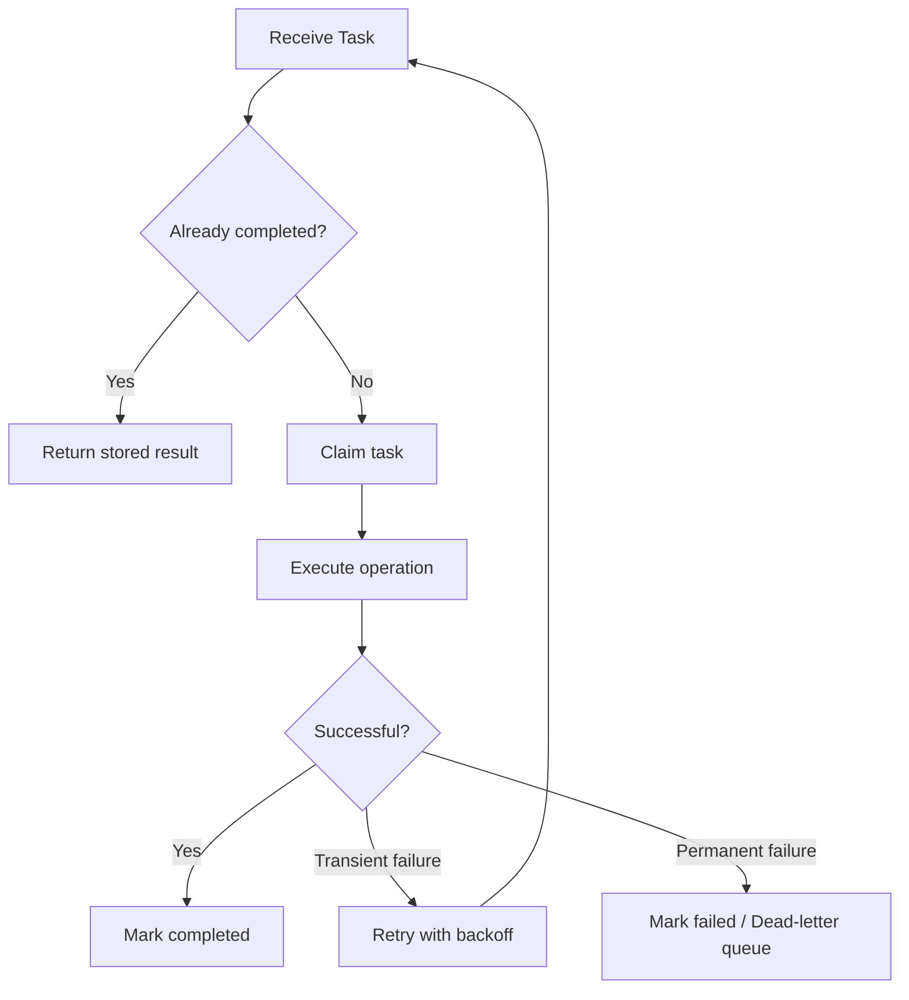
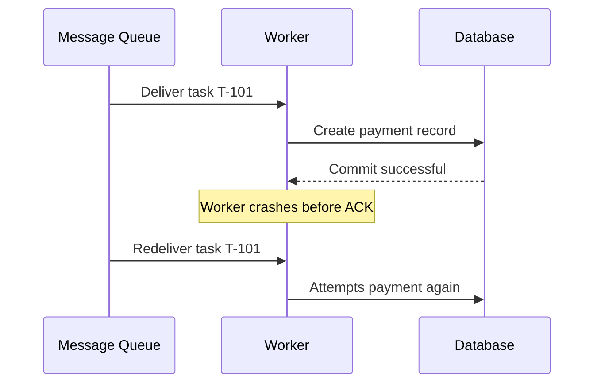
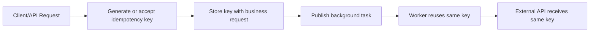
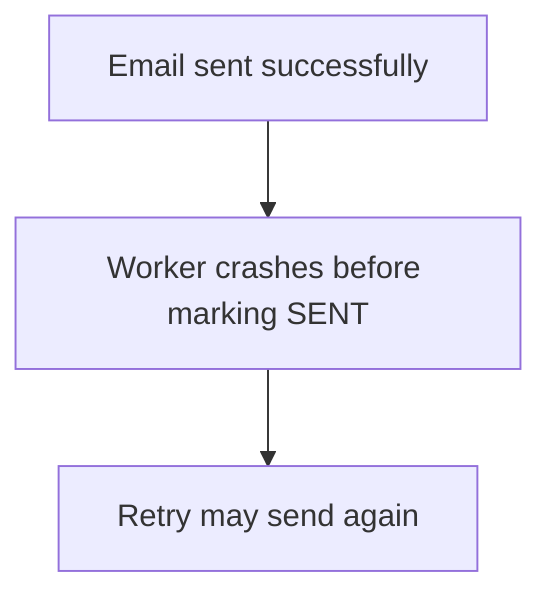
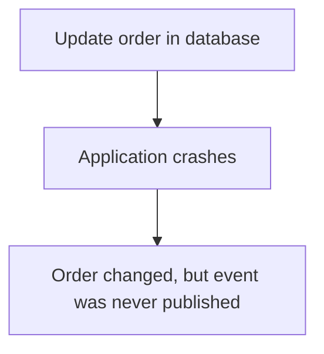
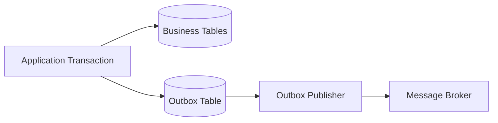
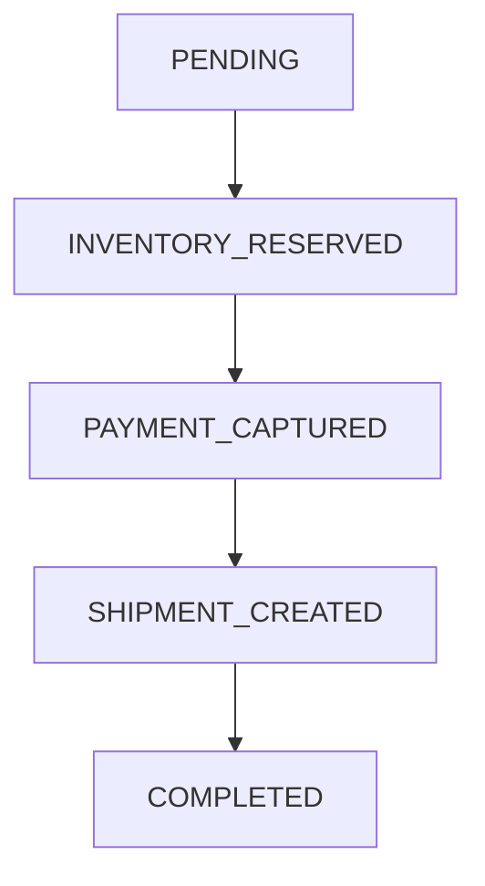
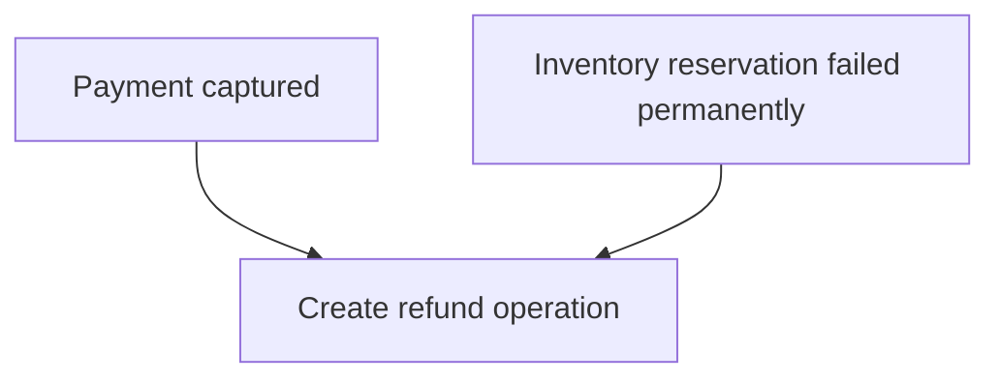

# Idempotency in Background Tasks

> Design background tasks that remain correct when messages are retried, redelivered, duplicated, or processed concurrently.

## In short

- Queues deliver **at-least-once**, so assume every task can run more than once: worker crashes, lost acknowledgments, visibility timeouts, application retries and dead-letter replays all cause redelivery.
- At-least-once delivery plus an idempotent consumer gives an *effectively-once* business outcome; true exactly-once is not achievable across broker, worker, and database.
- Key on a **stable business identity** such as `invoice:{customer_id}:{billing_period}`, never on the Celery task ID, which identifies one message publication rather than one logical operation.
- Enforce correctness in the database with a unique constraint or a conditional state transition, not with a check-then-act read followed by a write.
- Locks, deduplication, and atomicity reduce duplicate work, but none of them replaces idempotency.
- External side effects need a downstream idempotency key, a stored provider reference, or reconciliation; a timeout never means failure.
- Multi-step tasks need persisted workflow state so a retry resumes at the step that has not completed.



**Interview answer:** Background workers run on at-least-once delivery, so a task must be safe to execute more than once — a worker can commit its database change and then crash before acknowledging, and the broker will redeliver. I make the task idempotent by deriving a stable business key for the logical operation and enforcing it in the database, either with a unique constraint or with a conditional state transition, so a second execution either returns the stored result or updates zero rows. Locks and deduplication are optimisations layered on top; the database constraint is the actual correctness guarantee.

**Gotcha:** Using the queue's generated task ID as the idempotency key. It identifies one message publication, so two publications of the same logical operation — a producer retry, a dead-letter replay, a duplicated scheduler tick — get different IDs and both execute.

---

# 1. What Idempotency Means

An operation is **idempotent** when executing it multiple times has the same final effect as executing it once: `process(task)` run once, twice, or N times leaves the same final state. Idempotency does **not** mean every execution returns exactly the same runtime response — it means repeated executions do not create additional unwanted side effects.

For background processing, the practical definition is:

> The same logical task can be retried or delivered multiple times without producing duplicate records, duplicate payments, repeated emails, corrupted counters, or inconsistent business state.

Setting `order.status = "SHIPPED"` is naturally idempotent because it replaces a known value. Incrementing `order.notification_count += 1` is not, because every retry changes the state again.

For the full treatment — safe vs idempotent methods, the HTTP method matrix, and the general theory — see [HTTP Idempotency](../api-design/idempotency-http-methods.md). This note covers what changes when the caller is a queue rather than a client.

---

# 2. Why Background Tasks Run More Than Once

Most queue-based systems provide **at-least-once delivery**, not a perfect guarantee that a message is processed exactly once.

A task may be delivered again when:

- The worker finishes the operation but crashes before acknowledging the message.
- The acknowledgment is lost because of a network failure.
- The task exceeds its visibility timeout.
- The broker redelivers an unacknowledged message.
- The application explicitly retries after a temporary failure.
- A scheduler accidentally publishes the same task twice.
- Two producers create the same logical job.
- An administrator replays messages from a dead-letter queue.
- A consumer restarts while processing a task.
- Multiple workers race to process equivalent events.

## Failure Timeline



Without idempotency, one queue message can create two business operations.

With idempotency, the second execution detects that `T-101` has already been completed and safely returns the original result.

---

# 3. Idempotency vs Related Concepts

## 3.1 Idempotency vs Deduplication

**Deduplication** attempts to stop duplicate messages from being processed. **Idempotency** makes duplicate processing harmless.

Deduplication is useful, but it is usually time-bound or storage-dependent, which makes it an optimization. Idempotent processing is the correctness guarantee and should remain the final layer.

## 3.2 Idempotency vs Exactly-Once Processing

"Exactly once" is difficult across distributed components because the broker, worker, database, and external services cannot usually commit one shared atomic transaction.

A more realistic design is:

```text
At-least-once delivery
        +
Idempotent consumer
        =
Effectively-once business outcome
```

## 3.3 Idempotency vs Atomicity

**Atomicity** means an operation completes fully or not at all.

**Idempotency** means repeating the operation does not create additional effects.

A task can be:

- Atomic but not idempotent
- Idempotent but not atomic
- Both atomic and idempotent
- Neither

Example: `account.balance += 100`

This may run inside an atomic transaction, but repeating it still adds the amount twice. Atomicity alone does not provide idempotency.

## 3.4 Idempotency vs Distributed Locking

A distributed lock reduces concurrent execution, but it is not a complete idempotency solution.

Locks can expire, workers can crash, and messages can be replayed later. Use locks to control concurrency, while using durable database state to guarantee correctness.

---

# 4. Identifying Safe and Unsafe Operations

## Naturally Idempotent Operations

These operations usually produce the same final state when repeated:

```python
user.is_verified = True
order.status = "CANCELLED"
cache.set("product:42", serialized_product)
storage.put("reports/monthly.pdf", report_bytes)
```

The operation replaces or sets a known value.

## Non-Idempotent Operations

These operations produce additional effects on every execution:

```python
wallet.balance -= 100
inventory.quantity -= 1
send_email(...)
create_invoice(...)
append_to_file(...)
publish_event(...)
```

These require an explicit idempotency strategy.

## Conditionally Idempotent Operations

Some operations become idempotent only when combined with a condition.

Example:

```sql
UPDATE orders
SET status = 'PROCESSING'
WHERE id = 101
  AND status = 'PENDING';
```

Only the first execution changes the row. Later executions affect zero rows.

---

# 5. Core Idempotency Mechanics

The patterns, storage schema, key design, and concurrency handling below are covered in depth in [HTTP Idempotency](../api-design/idempotency-http-methods.md). This section is a recap of what carries over to workers, plus the parts that differ.

## 5.1 Core Patterns

| Pattern | Mechanism |
|---|---|
| Store a processed-task record | Insert the idempotency key as a primary key; a duplicate insert fails |
| Business-level unique constraint | `UNIQUE (customer_id, billing_period)` plus `ON CONFLICT DO NOTHING` |
| Compare-and-set state transition | `UPDATE ... WHERE status = 'PAYMENT_PENDING'`; check the affected row count |
| Store the original result | A retry returns the first execution's result instead of creating a second one |
| Make the destination idempotent | Upsert by business key, replace at a deterministic path, or append a ledger entry keyed by a unique reference instead of mutating a balance |

## 5.2 Database-Backed Implementation

Claim the key **before** doing the work, using a unique constraint rather than a check-then-act read. A read that asks "does this key exist?" and then writes is a race: two workers can both observe that the key is missing.

The worker-specific addition to the request-scoped schema is a **lease**:

```python
class IdempotencyRecord(models.Model):
    key = models.CharField(max_length=255, unique=True)
    status = models.CharField(max_length=20)
    result = models.JSONField(null=True)
    error = models.TextField(null=True)
    locked_until = models.DateTimeField(null=True)
    created_at = models.DateTimeField(auto_now_add=True)
    updated_at = models.DateTimeField(auto_now=True)
```

`locked_until` matters more for workers than for API requests: a crashed worker leaves a record stuck in `PROCESSING` with no client waiting to notice, so a lease and timeout policy are required to make abandoned tasks recoverable.

Where possible, update the business data and the idempotency record in the same database transaction. That protects database changes, but it cannot include an external API call in the same transaction.

## 5.3 Idempotency Keys

An idempotency key identifies one **logical business operation**, so it must be derived from business identity:

```text
payment:{order_id}
refund:{payment_id}:{refund_reason_code}
invoice:{customer_id}:{billing_period}
welcome-email:{user_id}
webhook:{provider_event_id}
report:{account_id}:{report_date}
```

A timestamp, a worker-generated UUID, a process ID, or a queue delivery tag are all weak keys: they identify an execution attempt, so every retry gets a different value and bypasses protection.

Generate the key at the earliest stable boundary — normally when the request or event is first created — and keep it identical through every retry and downstream call.



Store a hash of the important request fields alongside the key so that the same key arriving with a different payload is rejected rather than silently returning an unrelated result.

## 5.4 Concurrency and Race Conditions

Idempotency must hold when duplicate tasks execute **at the same time**, not only one after another. Use unique constraints, atomic upserts, conditional updates, row-level locks, optimistic version columns, or — for rare high-risk workflows — serializable transactions.

A Redis lock such as `redis.lock(f"task-lock:{task_key}", timeout=60)` reduces duplicate work, but it must not be the only protection: the lock may expire while the task is still running, the worker may pause or lose connectivity, Redis may restart or fail over, a duplicate may arrive after the lock is released, and incorrect ownership handling can release another worker's lock. See section 3.4 — the database uniqueness rule or state transition is the correctness mechanism.

---

# 6. Retries, Backoff, and Dead-Letter Queues

Retries are safe only when the operation is idempotent, or when the retry occurs before any side effect.

The rules in one paragraph: retry transient failures (network timeout, connection reset, HTTP `429`, `502`, `503`, `504`, temporary database or broker unavailability); do not retry permanent ones (invalid payload, missing data, permission failure, business rule violation) without correction. Back off exponentially, add jitter so thousands of workers do not retry in lockstep, cap the attempts, and send whatever is left to a dead-letter queue.

Replaying a dead-letter queue delivers old messages again, so replay tooling must preserve the original business idempotency key — this is the point where the two topics meet.

Full treatment of failure classification, the backoff variants (full, equal, and decorrelated jitter), retry budgets, DLQ design, and redrive: [Retries and Dead-Letter Queues](retries-dead-letter-queues.md).

---

# 7. External APIs and Side Effects

External side effects are the most difficult part because your database transaction cannot normally roll back a payment, email, or third-party API call.

## 7.1 Pass an Idempotency Key Downstream

When the external provider supports idempotency, send the same key on every attempt.

```python
response = payment_client.create_charge(
    amount=12000,
    currency="usd",
    idempotency_key=f"charge:order:{order.id}",
)
```

This is the preferred approach for payment creation and other high-risk operations.

## 7.2 Record Provider References

Store the external operation ID against the local record, so a retry can query or return the existing provider operation instead of creating a second one:

```text
order_id: 781
payment_provider_id: pay_987
idempotency_key: charge:order:781
status: SUCCEEDED
```

## 7.3 The Uncertain Outcome Problem

Consider this sequence:

1. Worker sends payment request.
2. Provider successfully charges the customer.
3. Network times out before the worker receives the response.
4. Worker does not know whether payment succeeded.

Never assume a timeout means failure.

Correct approaches:

- Retry with the same provider idempotency key.
- Query the provider using a stable merchant reference.
- Reconcile through provider webhooks or settlement reports.
- Mark the local operation as `UNKNOWN` or `PENDING_CONFIRMATION`.

## 7.4 Emails and Notifications

Email providers may not always offer request-level idempotency.

Use a notification record:

```sql
CREATE TABLE notifications (
    id BIGSERIAL PRIMARY KEY,
    notification_key VARCHAR(255) UNIQUE NOT NULL,
    recipient VARCHAR(320) NOT NULL,
    template_name VARCHAR(100) NOT NULL,
    status VARCHAR(30) NOT NULL,
    provider_message_id VARCHAR(255)
);
```

Claim the notification before sending.

Be aware of the failure window:



Possible mitigations:

- Provider idempotency support
- Deterministic provider message reference
- Provider delivery lookup
- Acceptable duplicate semantics for low-risk notifications
- A reconciliation process

Some side effects cannot be made perfectly duplicate-free without support from the destination system.

---

# 8. Celery Example

Celery can retry tasks, and late acknowledgment can cause a task to be redelivered after a worker failure. Therefore, task code should be idempotent.

## Celery Task with Database Idempotency

```python
from celery import shared_task
from django.db import IntegrityError, transaction
from django.utils import timezone

@shared_task(
    bind=True,
    autoretry_for=(TimeoutError, ConnectionError),
    retry_backoff=True,
    retry_jitter=True,
    max_retries=5,
    acks_late=True,
)
def generate_invoice(self, customer_id: int, billing_period: str):
    task_key = f"invoice:{customer_id}:{billing_period}"

    try:
        with transaction.atomic():
            record = IdempotencyRecord.objects.create(
                key=task_key,
                status="PROCESSING",
            )
    except IntegrityError:
        existing = IdempotencyRecord.objects.get(key=task_key)

        if existing.status == "COMPLETED":
            return existing.result

        # Another worker may currently own the task.
        # A production implementation should use a lease/timeout policy.
        return {"status": existing.status}

    try:
        with transaction.atomic():
            invoice, _ = Invoice.objects.get_or_create(
                customer_id=customer_id,
                billing_period=billing_period,
                defaults={"status": "CREATED"},
            )

            result = {
                "invoice_id": invoice.id,
                "status": invoice.status,
            }

            record.status = "COMPLETED"
            record.result = result
            record.completed_at = timezone.now()
            record.save(
                update_fields=[
                    "status",
                    "result",
                    "completed_at",
                    "updated_at",
                ]
            )

        return result

    except Exception as exc:
        IdempotencyRecord.objects.filter(id=record.id).update(
            status="RETRYABLE",
            error=str(exc),
        )
        raise
```

## Celery Configuration Considerations

```python
task_acks_late = True
task_reject_on_worker_lost = True
worker_prefetch_multiplier = 1
```

These settings affect delivery and failure behavior. They do not replace idempotent task logic.

## Important Design Detail

Do not use Celery's generated task ID as the only business idempotency key when two separate task publications may represent the same logical operation. Prefer `task_key = f"invoice:{customer_id}:{billing_period}"` over `task_key = self.request.id`.

The Celery task ID identifies one message publication. The business key identifies the operation that must happen once.

---

# 9. Outbox and Inbox Patterns

## 9.1 Transactional Outbox

A common problem is updating the database and publishing an event reliably.

Unsafe flow:



Reversing the order creates the opposite problem: the event may be published while the database transaction later fails.

The transactional outbox stores the business change and event in one transaction.



Example:

```python
from django.db import transaction

with transaction.atomic():
    order.status = "PAID"
    order.save(update_fields=["status"])

    OutboxEvent.objects.create(
        event_id=event_id,
        event_type="OrderPaid",
        payload={"order_id": order.id},
    )
```

A separate publisher sends unsent outbox rows. Publishing may happen more than once, so consumers must still be idempotent.

## 9.2 Inbox / Processed-Message Pattern

A consumer stores every processed message ID.

```sql
CREATE TABLE consumer_inbox (
    consumer_name VARCHAR(100) NOT NULL,
    message_id VARCHAR(255) NOT NULL,
    processed_at TIMESTAMPTZ NOT NULL DEFAULT NOW(),
    PRIMARY KEY (consumer_name, message_id)
);
```

The inbox insert and business update should occur in the same transaction.

```python
with transaction.atomic():
    InboxMessage.objects.create(
        consumer_name="inventory-service",
        message_id=event["id"],
    )

    apply_inventory_change(event)
```

A duplicate message causes a uniqueness conflict and the handler can skip processing.

---

# 10. Long-Running and Multi-Step Tasks

A task that performs multiple side effects needs step-level idempotency. Consider a workflow that reserves inventory, charges payment, creates a shipment, and sends a confirmation: a retry may begin after the payment step has already completed.

## Persist Workflow State



Each step should:

1. Check whether the step is already completed.
2. Execute only when the current state allows it.
3. Save the external reference and next state.
4. Be independently retryable.

## Example

```python
def process_order(order_id: int):
    order = Order.objects.get(id=order_id)

    if order.state == "PENDING":
        reserve_inventory_once(order)
        order.state = "INVENTORY_RESERVED"
        order.save(update_fields=["state"])

    if order.state == "INVENTORY_RESERVED":
        capture_payment_once(order)
        order.state = "PAYMENT_CAPTURED"
        order.save(update_fields=["state"])

    if order.state == "PAYMENT_CAPTURED":
        create_shipment_once(order)
        order.state = "SHIPMENT_CREATED"
        order.save(update_fields=["state"])
```

For complex workflows, use a durable workflow engine or a carefully designed state machine instead of one large task with hidden in-memory progress.

## Compensation

Some workflows require a compensating action:



The compensation must also be idempotent, keyed on `refund:{original_payment_id}`.

---

# 11. Observability and Testing

## Useful Log Fields

Include these in structured logs:

```text
task_name
task_id
idempotency_key
business_entity_id
attempt_number
worker_id
status
previous_status
external_reference
duration_ms
retry_reason
```

Example:

```python
logger.info(
    "background_task_completed",
    task_name="generate_invoice",
    idempotency_key=task_key,
    invoice_id=invoice.id,
    attempt=self.request.retries + 1,
)
```

## Useful Metrics

Track:

- Total task executions
- Unique logical tasks
- Duplicate execution attempts
- Idempotency cache/database hits
- Tasks stuck in `PROCESSING`
- Retry count by failure type
- Dead-letter queue size
- External calls with unknown outcomes
- Idempotency key conflicts with mismatched payloads
- Lock wait time
- Task completion latency

## Testing Strategy

### Repeat Execution Test

```python
def test_task_is_idempotent():
    first = generate_invoice(customer_id=42, billing_period="2026-07")
    second = generate_invoice(customer_id=42, billing_period="2026-07")

    assert Invoice.objects.filter(
        customer_id=42,
        billing_period="2026-07",
    ).count() == 1

    assert first["invoice_id"] == second["invoice_id"]
```

### Concurrent Execution Test

Start several workers or threads with the same key and verify:

- Only one business record is created.
- Only one external operation is accepted.
- All callers receive a valid final state.
- No records remain permanently stuck in `PROCESSING`.

### Crash-Point Testing

Simulate failure:

- Before the database transaction
- After the business update
- Before acknowledgment
- After the external request but before saving its response
- During completion-state update
- During dead-letter replay

The task should recover correctly at every boundary.

---

# 12. Production Design Checklist

## Task Identity

- Does the task have a stable business idempotency key?
- Is the same key preserved across all retries?
- Can two producers derive the same logical key?
- Is key reuse with a different payload rejected?

## Storage and Concurrency

- Is there a database unique constraint?
- Are check-and-write operations atomic?
- Can two workers safely run concurrently?
- Is abandoned `PROCESSING` state recoverable?
- Is there a lease or timeout policy for stuck tasks?

## Side Effects

- Does the external API support idempotency keys?
- Is the downstream operation reference stored?
- Can an uncertain timeout be reconciled?
- Are emails, payments, webhooks, and file writes protected separately?

## Retries

- Are only transient failures retried?
- Is exponential backoff used?
- Is jitter enabled?
- Is there a maximum retry count?
- Is there a dead-letter or manual-review path?

## Workflow Design

- Are long tasks divided into retryable steps?
- Is each step idempotent?
- Is workflow state persisted?
- Are compensating actions idempotent?
- Are events published using an outbox when consistency matters?

## Operations

- Are duplicate attempts observable?
- Can support teams search by idempotency key?
- Can failed tasks be replayed without changing their keys?
- Are idempotency records retained long enough for the replay window?
- Is there a cleanup policy for old records?

---

# References

- [Celery Documentation — Optimizing and Late Acknowledgment](https://docs.celeryq.dev/en/latest/userguide/optimizing.html)
- [Celery Documentation — Canvas and Idempotent Tasks](https://docs.celeryq.dev/en/latest/userguide/canvas.html)
- [AWS Well-Architected Framework — Make Mutating Operations Idempotent](https://docs.aws.amazon.com/wellarchitected/latest/reliability-pillar/rel_prevent_interaction_failure_idempotent.html)
- [AWS Prescriptive Guidance — Retry with Backoff Pattern](https://docs.aws.amazon.com/prescriptive-guidance/latest/cloud-design-patterns/retry-backoff.html)
- [Stripe API — Idempotent Requests](https://docs.stripe.com/api/idempotent_requests)
- [Google Cloud Tasks — Understand Cloud Tasks](https://docs.cloud.google.com/tasks/docs/dual-overview)
- [Google Cloud Run — Job Retries and Checkpoints](https://docs.cloud.google.com/run/docs/jobs-retries)
