# Message Brokers: Redis vs RabbitMQ vs AWS SQS

> Understand how Redis, RabbitMQ, and Amazon SQS work as message brokers, what delivery guarantees really mean, and how to choose the right broker for production background processing.
>
> **Current reference versions:** Redis Open Source 8.8.x, RabbitMQ 4.3.4, Celery 5.6.x.

## In short

- A **message broker** sits between a producer and a consumer so work can happen asynchronously.
- The broker stores or routes messages; the **worker performs the actual business work**.
- Most production task systems should be designed for **at-least-once delivery**, which means duplicate processing is possible.
- The safe processing order is:

```text
Receive -> Process -> Commit business change -> ACK/Delete
```

- Because a worker can crash after committing but before acknowledging, consumers must be **idempotent**.
- **Redis** is a good fit when it is already in the stack and tasks are simple and short.
- **RabbitMQ** is a good fit when routing, acknowledgments, dead-lettering, broker control, and low-latency messaging are important.
- **Amazon SQS** is a good fit for AWS-native systems that want durable queues without operating broker infrastructure.

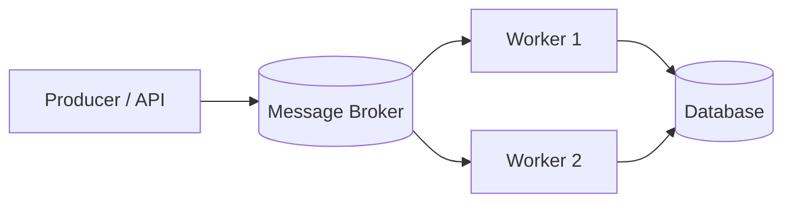

---

# 1. Why Message Brokers Are Needed

Consider an API request that must create an order, generate an invoice, send an email, and update analytics.

Doing everything synchronously makes the request slower and tightly couples the API to every downstream dependency.

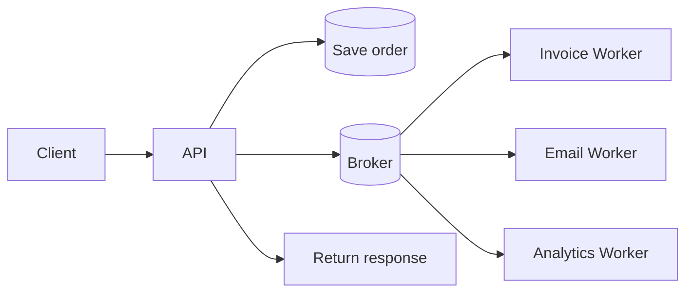

The API performs the critical transaction, publishes background work, and returns. Workers process the remaining tasks independently.

## What a broker gives you

A broker commonly provides:

- Producer-consumer decoupling
- Temporary message storage
- Traffic buffering
- Worker distribution
- Acknowledgment or delete semantics
- Retry/redelivery support
- Routing
- Failure isolation
- Horizontal scaling

> **Important:** A broker is not a worker. It transports messages; workers execute tasks.

---

# 2. Core Architecture and Concepts

## 2.1 Main components

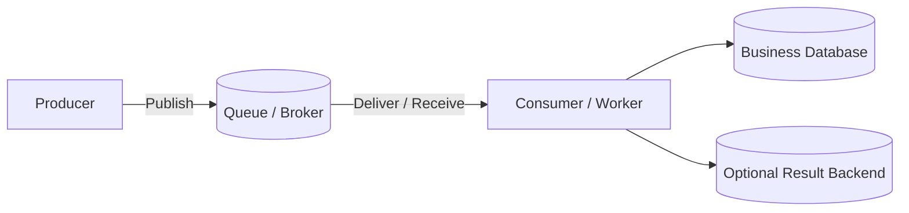

### Producer

Creates the task or event.

```python
generate_invoice.delay(invoice_id=4821)
```

Prefer sending IDs and small metadata instead of full database rows or large files.

### Broker

Stores or routes the message until a consumer can handle it.

Examples:

- Redis
- RabbitMQ
- Amazon SQS

### Worker / Consumer

Receives the message and performs the actual work.

### Result backend

Stores task state or return values when the application needs them.

The broker and result backend are separate concepts.

```python
broker_url = "amqp://rabbitmq:5672//"
result_backend = "redis://redis:6379/1"
```

RabbitMQ transports the task; Redis stores the result.

---

## 2.2 Acknowledgment

An acknowledgment tells the broker that processing finished successfully.

For important work:

```text
Receive -> Process -> Commit -> ACK/Delete
```

Avoid:

```text
Receive -> ACK -> Process
```

If the worker crashes after the early ACK, the task can be lost.

---

## 2.3 Visibility timeout

SQS and Celery transports such as Redis/SQS use a visibility-timeout model.

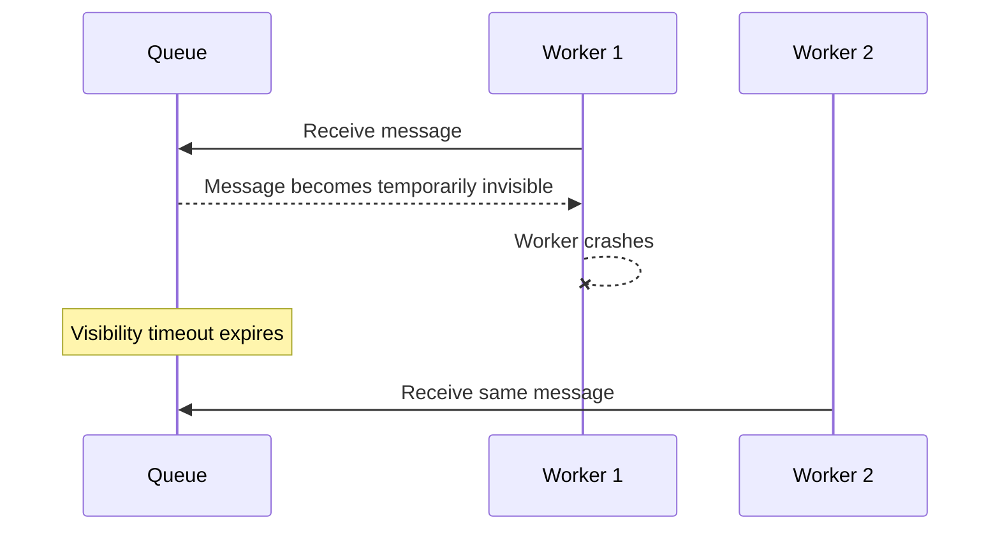

If the timeout is shorter than task execution time, the same task may be processed concurrently.

---

## 2.4 Delivery semantics

### At-most-once

A message is processed zero or one time.

Possible message loss is accepted.

Example: Redis Pub/Sub for non-critical live notifications.

### At-least-once

A message is processed one or more times.

Duplicates are possible, but the system prefers redelivery over losing work.

Typical production examples:

- RabbitMQ with manual acknowledgments
- SQS Standard
- Redis Streams consumer groups
- Celery Redis/SQS transports

### Exactly-once

End-to-end exactly-once business processing is difficult because the broker and business database are separate systems.

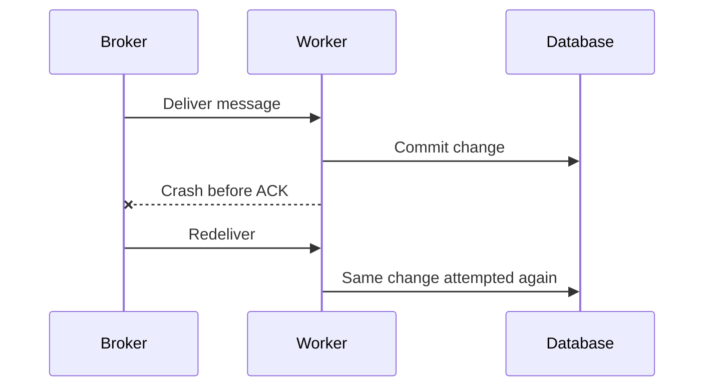

The practical design is:

```text
At-least-once delivery + idempotent consumer
```

---

## 2.5 Ordering is not completion order

A queue may deliver `A -> B -> C`, but parallel workers can finish in another order.

```text
A takes 10s
B takes 1s
C takes 2s

Completion: B -> C -> A
```

Strict processing order usually reduces concurrency and throughput.

---

# 3. Redis as a Broker

Redis is primarily an in-memory data platform, but several Redis structures can support messaging.

## 3.1 Redis Lists

Lists can implement a simple FIFO-style queue with commands such as `LPUSH`, `RPUSH`, `BLPOP`, and `BRPOP`.

A naive pop removes the message before processing. If the worker crashes after the pop, the task can be lost.

Reliable production use therefore needs a processing/acknowledgment pattern or a framework such as Celery/Kombu.

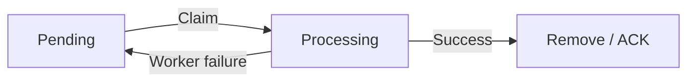

---

## 3.2 Redis Pub/Sub

Pub/Sub broadcasts to subscribers that are connected **right now**.

Characteristics:

- Fire-and-forget
- No durable history
- No replay
- No consumer acknowledgment
- Disconnected subscribers miss messages
- At-most-once delivery

Good use cases:

- WebSocket notifications
- Cache invalidation
- Presence updates
- Non-critical real-time signals

Do not use Pub/Sub for durable background jobs such as payments or invoice generation.

---

## 3.3 Redis Streams

Redis Streams provide a durable append-only stream with:

- Ordered entry IDs
- Consumer groups
- Acknowledgments
- Pending entries
- Replay
- Retention/trimming
- Recovery of unacknowledged work

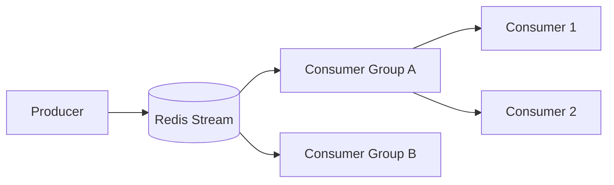

Streams are a better fit than Pub/Sub when messages must survive consumer downtime or be replayed.

---

## 3.4 Redis with Celery

```python
from celery import Celery

app = Celery(
    "app",
    broker="redis://redis:6379/0",
    backend="redis://redis:6379/1",
)

app.conf.broker_transport_options = {
    "visibility_timeout": 3600,
}
```

Celery documents a **1-hour default Redis visibility timeout**.

A long `countdown` or ETA that exceeds the visibility timeout can cause repeated redelivery. For distant scheduling, prefer a durable scheduler instead of keeping a task reserved in the broker for hours or days.

### Production guidance

- Use authentication and TLS.
- Avoid eviction for broker data.
- Do not mix an aggressively evicting cache with critical broker queues.
- Monitor memory and persistence.
- Use replication/Sentinel or a managed Redis service where availability matters.
- Keep tasks idempotent.

### Choose Redis when

- Redis already exists in your stack.
- Tasks are short and straightforward.
- Low latency is useful.
- You want a simple Celery setup.
- Advanced broker routing is not required.

---

# 4. RabbitMQ as a Broker

RabbitMQ is a dedicated message and streaming broker. Its core model is:

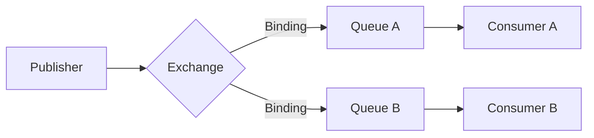

The producer publishes to an **exchange**. Bindings route the message to one or more queues.

---

## 4.1 Exchange types

| Exchange | Routing behavior | Typical use |
|---|---|---|
| Direct | Exact routing-key match | Commands/task categories |
| Topic | Pattern match such as `order.*` | Domain events |
| Fanout | Copy to every bound queue | Broadcast/fan-out |
| Headers | Match message headers | Metadata-based routing |

Topic exchanges are especially useful in microservice architectures.

Example:

```text
order.created  -> Billing + Inventory + Audit
order.shipped  -> Notification + Audit
payment.failed -> Alerts + Audit
```

---

## 4.2 ACK, NACK, and publisher confirms

### Consumer acknowledgment

With manual ACK, RabbitMQ removes a message only after the consumer confirms successful processing.

```text
ACK               -> success
Reject/NACK       -> reject or requeue depending on configuration
```

Avoid unlimited immediate requeue loops.

### Publisher confirms

Publisher confirms tell the producer that RabbitMQ accepted the message according to the configured durability path.

They protect the producer side, while consumer acknowledgments protect the consumer side.

Duplicates are still possible if a confirmation is lost and the producer republishes.

---

## 4.3 Quorum queues

Quorum queues are RabbitMQ's durable, replicated queue type based on Raft.

Use them when the queue is long-lived and message loss would materially affect the business.

Key points in RabbitMQ 4.3:

- Replicated and designed for data safety
- Manual acknowledgments are recommended
- Publisher confirms are important
- Default delivery limit is **20**
- RabbitMQ 4.3 bases that limit on genuine delivery failures
- Quorum queues support delayed-retry behavior and dead-lettering

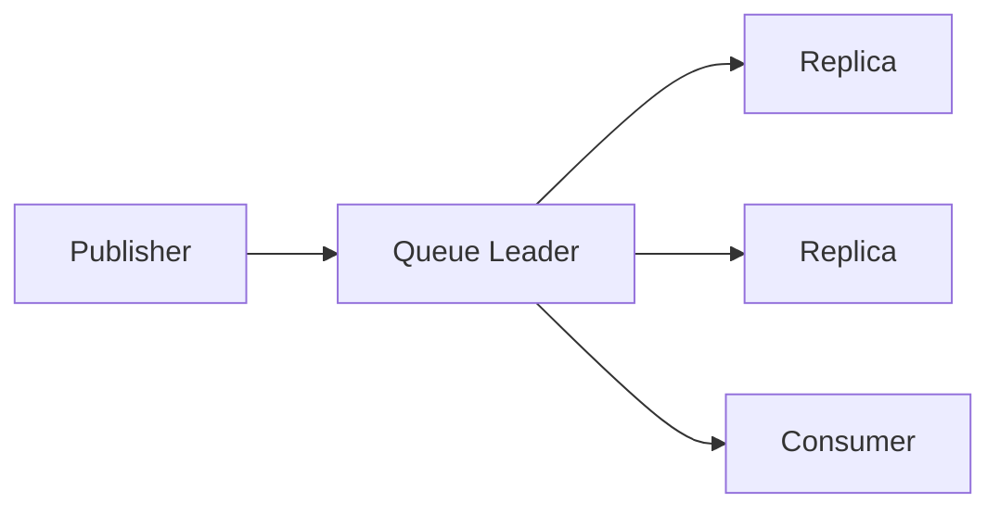

---

## 4.4 Dead-lettering

Messages that cannot continue through normal processing can be routed to a dead-letter exchange and then to a dead-letter queue.

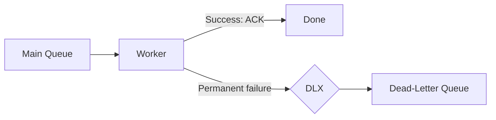

A DLQ needs monitoring, investigation, and a controlled replay process.

### Choose RabbitMQ when

- Routing is a core requirement.
- Low delivery latency matters.
- You need manual ACK/NACK and publisher confirms.
- You need broker-controlled dead-letter/retry behavior.
- You need a cloud-neutral or on-premises broker.
- Your Celery setup needs full event/worker-control capabilities.

---

# 5. Amazon SQS as a Broker

Amazon SQS is a fully managed AWS queue service.

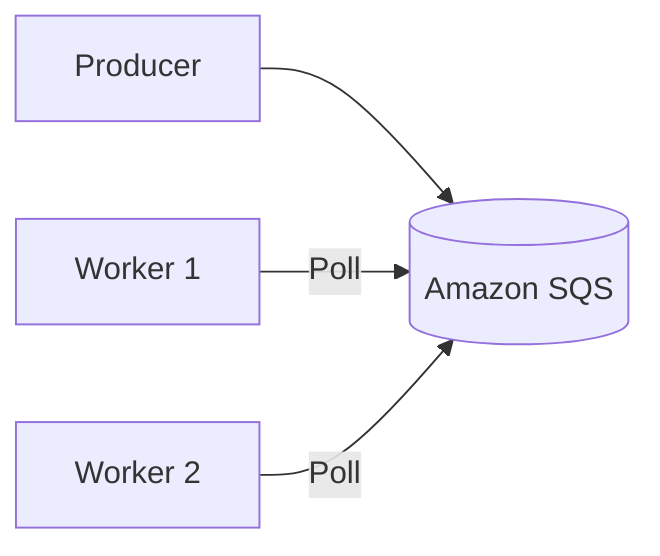

Consumers poll the queue with `ReceiveMessage`.

Long polling waits for messages instead of continuously returning empty responses.

---

## 5.1 Message lifecycle

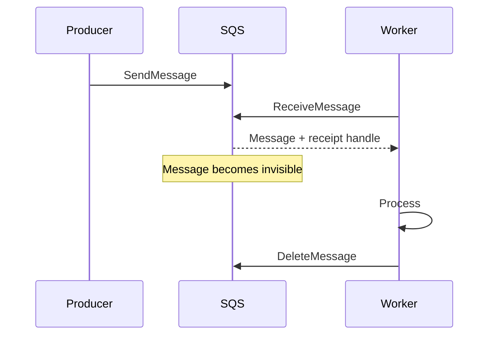

Receiving does **not** delete the message.

If the worker does not delete it before visibility expires, it becomes available for another receive.

---

## 5.2 Important SQS limits

| Property | Current behavior |
|---|---|
| Maximum message size | 1 MiB |
| Messages per batch | Up to 10 |
| Default retention | 4 days |
| Retention range | 1 minute to 14 days |
| AWS queue default visibility timeout | 30 seconds |
| Maximum visibility timeout | 12 hours |
| Maximum delay | 15 minutes |
| Maximum long-poll wait | 20 seconds |
| Standard queue delivery | At least once |
| Standard ordering | Best effort |
| FIFO ordering | Ordered within a `MessageGroupId` |

> **Celery-specific distinction:** Celery 5.6 documents a **30-minute default visibility timeout** for its SQS transport when it creates the queue. If you use predefined queues, configure visibility on the SQS queue itself.

For large payloads, store the file in S3 and send only its key.

```json
{
  "message_id": "job-4821",
  "task_type": "document.ocr",
  "bucket": "incoming-documents",
  "key": "claims/4821.pdf"
}
```

---

## 5.3 Standard vs FIFO

### Standard queue

- At-least-once delivery
- Best-effort ordering
- Very high throughput
- Best when messages can be processed independently

### FIFO queue

- Ordering within a `MessageGroupId`
- Different groups can process in parallel
- Supports producer-side deduplication

```text
MessageGroupId = customer-101

payment-1
payment-2
payment-3
```

One message group is sequential, so use multiple business-meaningful groups for concurrency.

---

## 5.4 SQS dead-letter queue

A redrive policy moves repeatedly failing messages to a DLQ after `maxReceiveCount` is exceeded.

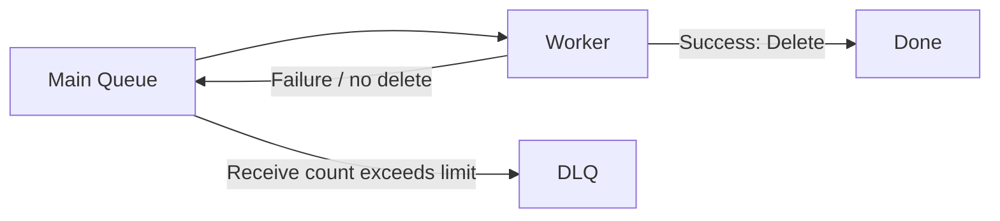

Monitor the DLQ and define a safe replay procedure.

---

## 5.5 SQS with Celery

```python
from celery import Celery

app = Celery("app")

app.conf.update(
    broker_url="sqs://",
    broker_transport_options={
        "region": "ap-south-1",
        "wait_time_seconds": 20,
        "queue_name_prefix": "myapp-",
    },
)
```

Prefer IAM roles over long-lived access keys.

Current Celery SQS caveats include:

- No worker remote-control commands
- No Celery events/event-based monitors
- Visibility timeout must match task behavior
- FIFO publishing may require `MessageGroupId` and `MessageDeduplicationId`

### Choose SQS when

- The application is AWS-native.
- You want almost no broker administration.
- Traffic is bursty.
- Managed durability and scaling matter more than advanced routing.
- ECS, EKS, EC2, or Lambda workers consume tasks.

For richer event routing, combine SQS with SNS or EventBridge.

---

# 6. Redis vs RabbitMQ vs SQS

## 6.1 Main comparison

| Area | Redis | RabbitMQ | Amazon SQS |
|---|---|---|---|
| Primary role | In-memory data platform with messaging features | Dedicated broker | Managed cloud queue |
| Operations | Self/managed | Self/managed | AWS-managed |
| Delivery style | Blocking operations / transport dependent | Primarily push-based | Poll-based |
| Routing | Basic | Excellent | Basic; SNS/EventBridge for richer routing |
| Acknowledgment | Depends on structure/framework | First-class ACK/NACK | Delete after success |
| Retry | Framework/Streams design | Requeue, delayed retry, DLX | Visibility + redrive |
| DLQ | Usually application/framework managed | Strong DLX/DLQ | Managed DLQ |
| Ordering | Structure + concurrency dependent | Queue order with concurrency caveats | Standard best effort; FIFO per group |
| Replay | Streams support replay | Streams for log-style replay | Not a general replay log |
| High availability | Requires replication/managed service | Quorum queues | Built into service |
| Celery control/events | Supported | Supported | Not supported |
| Best fit | Simple short tasks | Rich controlled messaging | AWS-native low-ops workloads |

---

## 6.2 Quick decision flow

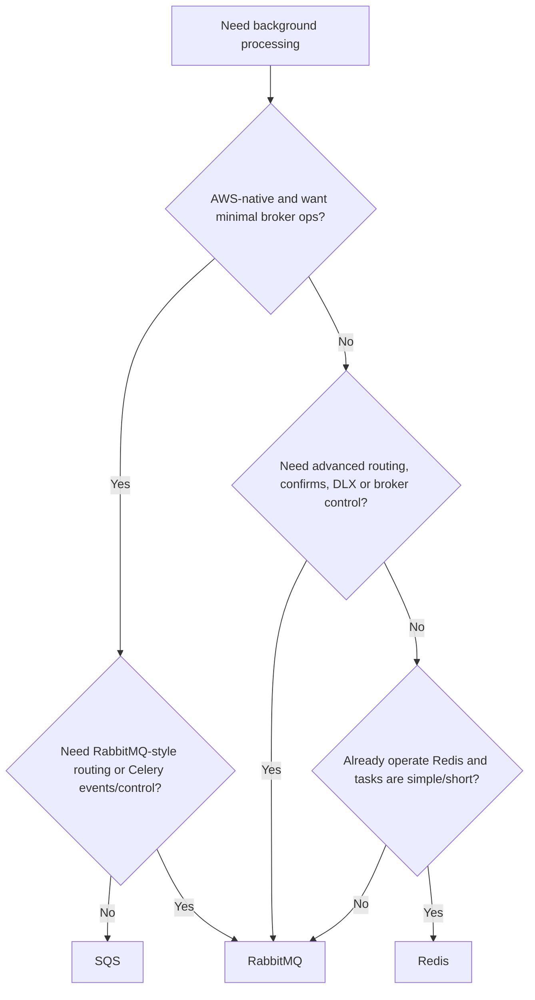

---

# 7. Reliability Patterns You Should Know

These patterns matter more in interviews than memorizing broker commands.

## 7.1 Idempotent consumers

A duplicate message must not duplicate the business effect.

Example using a state guard:

```sql
UPDATE invoices
SET status = 'generated'
WHERE id = 4821
  AND status = 'pending';
```

If zero rows are updated, the invoice was already processed or is no longer eligible.

Other common techniques:

- Unique `message_id`
- Database uniqueness constraints
- Idempotency keys for external APIs
- Conditional state transitions
- Deduplication table

---

## 7.2 Bounded retries

Retry transient failures such as timeouts, rate limits, or temporary service unavailability.

Do not retry invalid business data forever.

```text
Attempt 1 -> 5s
Attempt 2 -> 30s
Attempt 3 -> 2m
Attempt 4 -> 10m
Attempt 5 -> DLQ
```

Use:

- Maximum attempts
- Backoff
- Jitter
- Maximum delay
- DLQ
- Alerting

---

## 7.3 Transactional outbox

A common failure is:

```text
1. Save order in database
2. Process crashes
3. order.created message is never published
```

The transactional outbox writes the business record and outgoing event in the same database transaction.

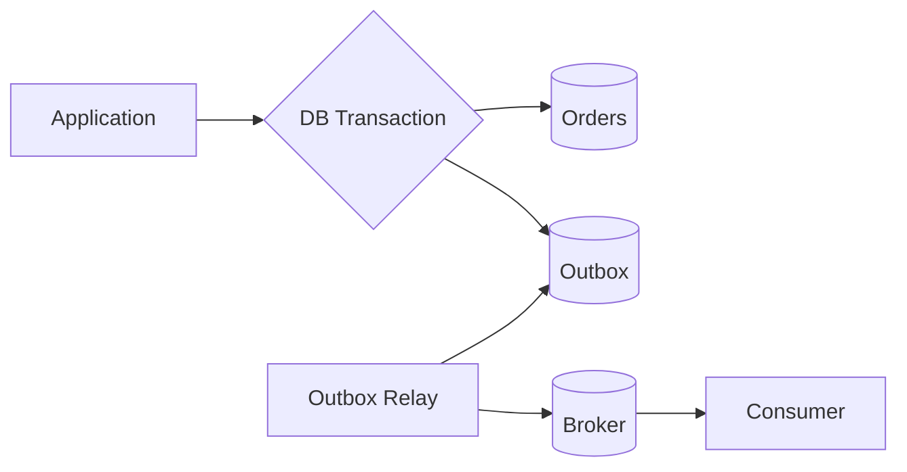

The relay can still publish twice after a crash, so consumers remain idempotent.

---

# 8. One Practical Example: Order Processing

Suppose an order API must:

1. Save the order.
2. Charge payment.
3. Send confirmation email.
4. Update analytics.

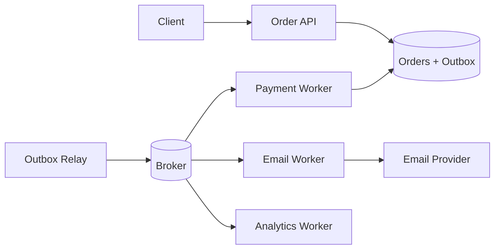

A good message contains identifiers, not the complete order object.

```json
{
  "message_id": "2d4d40f5-437c-4f18-9ef9-df6340cf57af",
  "event_type": "order.created",
  "payload_version": 1,
  "correlation_id": "request-4821",
  "idempotency_key": "order:4821:created:v1",
  "payload": {
    "order_id": 4821
  }
}
```

### Broker choice for this example

- **Redis:** good when this is a smaller Django/Celery system, Redis already exists, and routing is simple.
- **RabbitMQ:** good when billing, inventory, audit, and notification services need different routing rules and strong broker control.
- **SQS:** good when services run on AWS and the team prefers managed queues; use separate queues or SNS/EventBridge fan-out when multiple services need the event.

---

# 9. Production Checklist

Keep these rules in mind regardless of broker:

- Design every consumer for duplicate delivery.
- ACK/Delete only after the business change is committed.
- Keep messages small and versioned.
- Store large files in object storage and send references.
- Separate fast, slow, priority, and rate-limited work into different queues.
- Bound retries and send exhausted work to a DLQ.
- Monitor **oldest message age**, backlog, retries, DLQ depth, and processing duration.
- Include `message_id`, `correlation_id`, and `idempotency_key`.
- Use TLS, least-privilege credentials, and private networking.
- Test worker crashes, broker/network failures, duplicate messages, and graceful shutdown.
- Provision queues, policies, alarms, and DLQs through infrastructure as code.

---

# 10. Final Mental Model

```text
Redis
  -> simplest when Redis already exists
  -> very low latency
  -> understand Lists vs Pub/Sub vs Streams
  -> reliability depends on structure/framework/configuration

RabbitMQ
  -> dedicated messaging system
  -> best routing and broker control
  -> ACK/NACK + publisher confirms + DLX + quorum queues
  -> more operational responsibility

Amazon SQS
  -> fully managed AWS queue
  -> visibility timeout + DeleteMessage + DLQ
  -> Standard = at-least-once, best-effort ordering
  -> FIFO = ordering per MessageGroupId
  -> simple operations, but less broker-level routing/control
```

The most important interview takeaway is not which broker is "best." It is understanding the reliability model:

```text
Producer publishes
        ↓
Broker stores/routes
        ↓
Worker receives
        ↓
Business transaction commits
        ↓
ACK/Delete
        ↓
If duplicate delivery happens, idempotency keeps the result correct
```
