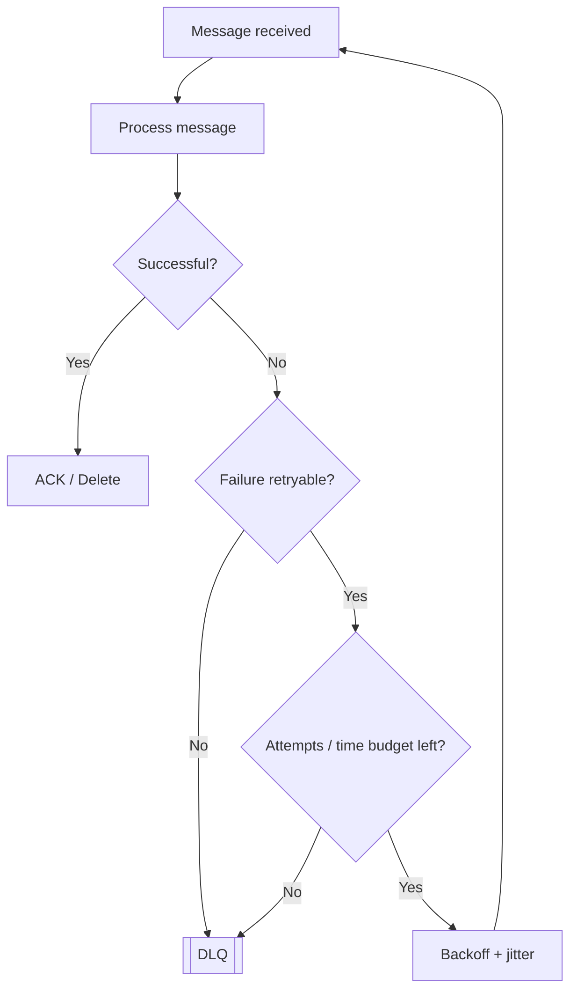
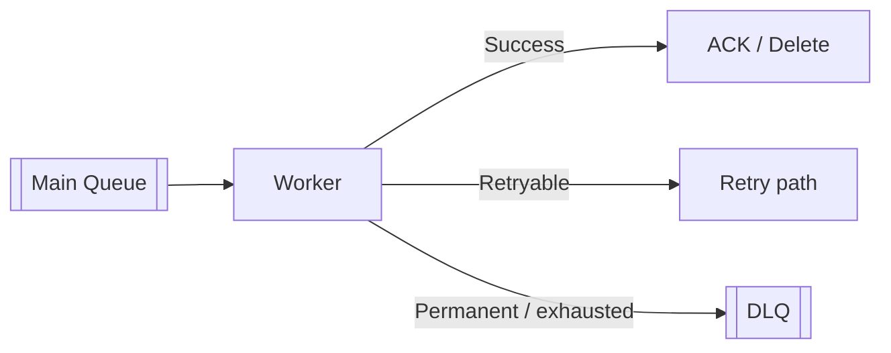
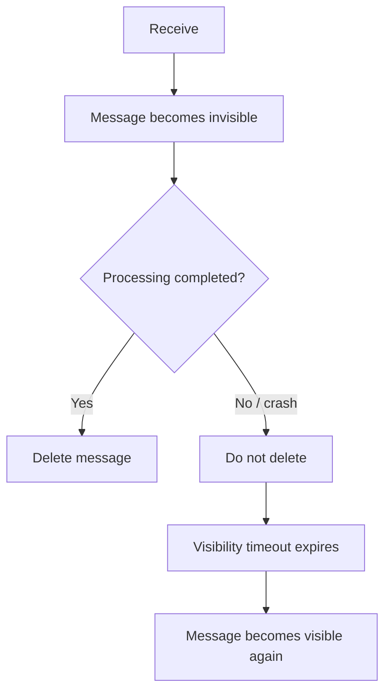
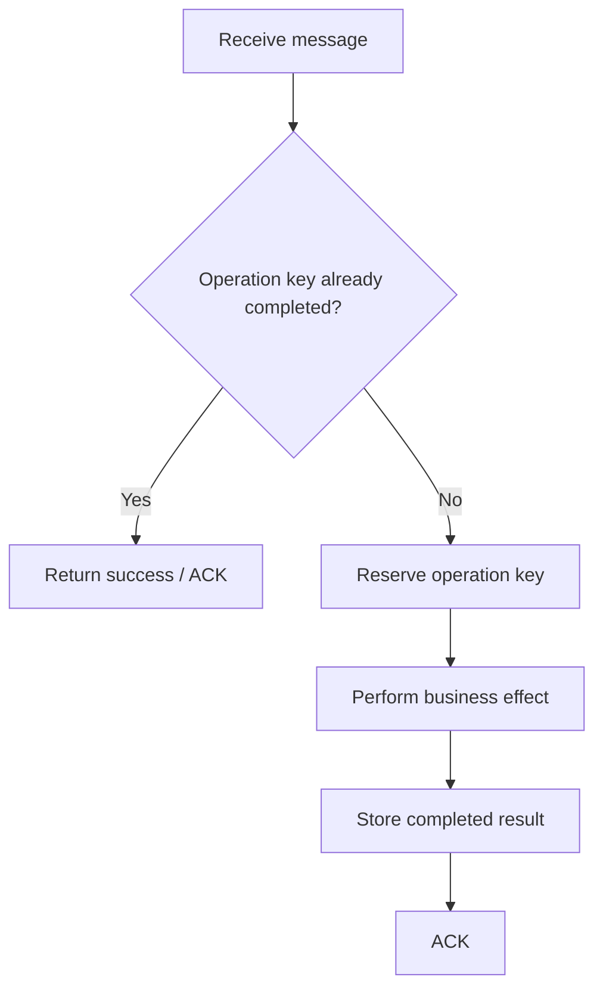
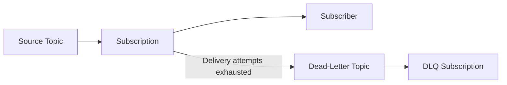
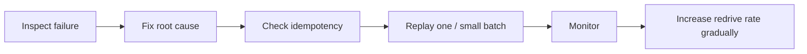
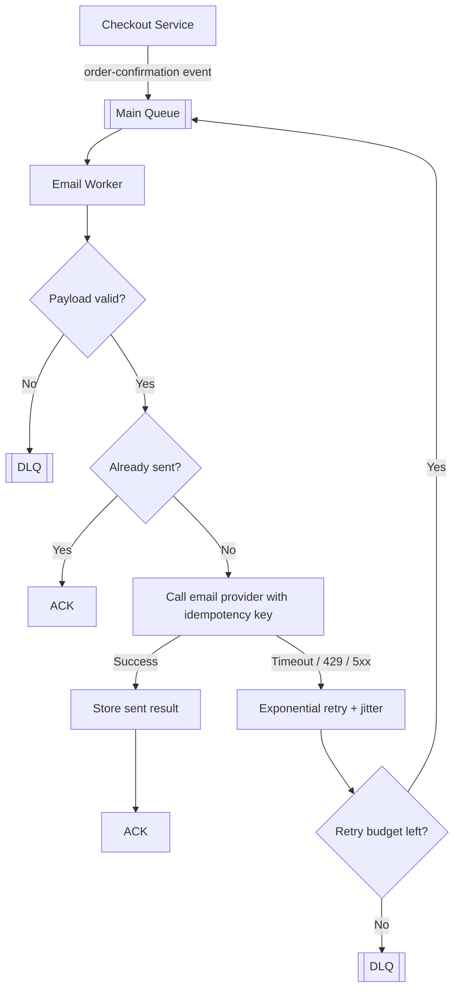

# Retry Strategies and Dead-Letter Queues (DLQ)

> Understand how production systems retry failed work safely, avoid retry storms, isolate poison messages, and recover failed messages through a Dead-Letter Queue (DLQ).

> **Reviewed against current official documentation:** August 2026

## In short

Retries are useful only when a failure may recover. A production retry design should therefore:

- Retry **transient failures** such as timeouts, temporary network errors, `429`, `502`, `503`, `504`, and some database deadlocks.
- Avoid retrying **permanent failures** such as malformed payloads, missing required fields, unsupported data, or business-rule rejection.
- Use **exponential backoff with jitter** for distributed systems so failed tasks do not retry at the same moment.
- Bound retries with **maximum attempts, a total time budget, and per-attempt timeouts**.
- Keep retry ownership clear because retries at the task, HTTP-client, SDK, and broker layers can multiply.
- Use a **DLQ** to isolate messages that cannot be processed successfully.
- Treat **redrive** as controlled recovery after fixing the root cause, not as another automatic retry.
- Make handlers **idempotent**, because brokers and workers commonly provide at-least-once processing rather than exactly-once execution.



---

# 1. Why Retries Need a Strategy

Background work fails for normal reasons:

- A downstream service temporarily returns `503 Service Unavailable`.
- An API rate limit returns `429 Too Many Requests`.
- A network call times out.
- A database transaction hits a deadlock.
- A worker crashes before acknowledging a message.
- A message contains invalid data.
- A code or configuration issue causes the same task to fail every time.

The key idea is simple:

> **Retry only when another attempt has a reasonable chance of succeeding.**

Retrying every exception is dangerous. If 5,000 tasks fail because a dependency is down and every task immediately retries, the retry traffic can make the dependency even less likely to recover.

A reliable design separates failures into:

```text
Failure
│
├── Transient ───────────────> Retry with controlled delay
│
├── Permanent ───────────────> Terminal failure / DLQ
│
└── Unknown ─────────────────> Small retry budget, then DLQ + investigation
```

---

# 2. Classifying Failures

## 2.1 Transient failures

Transient failures are temporary conditions where repeating the same logical operation may work later.

Common examples:

| Failure | Typical action |
|---|---|
| Network timeout | Retry |
| Connection reset | Retry |
| HTTP `408` | Usually retry |
| HTTP `429` | Retry and respect `Retry-After` |
| HTTP `502`, `503`, `504` | Retry |
| Database deadlock | Usually retry transaction |
| Temporary broker/network interruption | Redelivery or retry |

For external dependencies, retry with a delay rather than immediately.

## 2.2 Permanent failures

Permanent failures do not become valid just because time passes.

Examples:

- Malformed JSON.
- Missing mandatory fields.
- Unsupported file format.
- Invalid email address.
- Business rule rejected the request.
- Referenced entity is permanently absent.
- Credentials were revoked and require operational intervention.

Typical action:

```text
Permanent failure
      │
      ├── Record failure context
      ├── Stop automatic retries
      └── DLQ / terminal-failure workflow
```

## 2.3 Context matters

HTTP status codes alone are not enough to determine retryability.

For example:

- `404` may be permanent when a customer does not exist.
- The same `404` may be temporary when a newly created resource is still propagating through an eventually consistent system.
- `401` may be recoverable if the application can refresh an expired token.
- `401` is not recoverable by retrying the same permanently invalid credential.

The application should classify errors using **business and dependency semantics**, not only exception type.

---

# 3. Retry Strategies

A retry strategy decides **when the next attempt should run**.

## 3.1 Immediate retry

```text
Attempt 1 -> fail -> Attempt 2 -> fail -> Attempt 3
```

Useful only for very short-lived local conflicts such as a small optimistic-concurrency race.

Avoid repeated immediate retries against an unhealthy remote dependency.

## 3.2 Fixed delay

```text
10s -> 10s -> 10s -> 10s
```

Simple and predictable, but many messages that fail together may also retry together.

## 3.3 Linear backoff

Delay grows by a fixed amount.

```text
5s -> 10s -> 15s -> 20s
```

Useful when retry delay should grow gradually.

## 3.4 Exponential backoff

A common formula is:

```text
delay = min(max_delay, base_delay × 2^(retry_number - 1))
```

Example with `base_delay = 2s`:

| Retry | Delay |
|---:|---:|
| 1 | 2s |
| 2 | 4s |
| 3 | 8s |
| 4 | 16s |
| 5 | 32s |

This reduces pressure on an unhealthy dependency.

## 3.5 Exponential backoff with jitter

Exponential backoff alone can still synchronize thousands of workers.

Without jitter:

```text
2s        4s        8s
│         │         │
AAAA      AAAA      AAAA
```

With jitter:

```text
0-----2s------4s-----------8s
 A A      A A    A   A  A
```

A common full-jitter approach is:

```text
cap = min(max_delay, base_delay × 2^(retry_number - 1))
delay = random(0, cap)
```

For distributed background jobs, **exponential backoff + jitter + maximum delay** is a strong default.

---

# 4. A Complete Retry Policy

`max_retries` alone is not enough.

A production retry policy should usually define:

| Control | Why it matters |
|---|---|
| Maximum attempts | Prevents infinite retries |
| Maximum elapsed time | Stops retrying after the business deadline |
| Per-attempt timeout | Prevents one request from hanging |
| Initial/base delay | Controls first retry |
| Maximum delay | Caps excessive waiting |
| Jitter | Spreads distributed retries |
| Task expiration | Prevents stale work from executing |
| Retryable error set | Avoids retrying permanent failures |

## Attempts vs retries

Be precise:

```text
1 initial attempt + 3 retries = 4 total attempts
```

Some systems expose `max_retries`; others expose `max_attempts`, delivery count, receive count, or a similar setting. Their semantics are not always identical.

## Retry time budget

Suppose a payment-status synchronization task is useful for only five minutes.

A better policy is:

```text
Maximum attempts:       6
Maximum elapsed time:   5 minutes
HTTP timeout:           10 seconds
Backoff:                exponential + jitter
Maximum retry delay:    60 seconds
```

A retry should not outlive the business usefulness of the operation.

## Respect server retry guidance

When an API returns a valid `Retry-After`, prefer it when appropriate, while still applying your own upper bound.

```python
delay = min(retry_after_seconds, application_max_delay)
```

---

# 5. Dead-Letter Queue (DLQ)

A **Dead-Letter Queue** stores or routes messages that could not be processed successfully after the allowed processing policy.

Typical reasons include:

- Retry or delivery limit exhausted.
- Consumer explicitly marks the message as non-retryable.
- Message expires.
- Broker dead-letter policy is triggered.
- Payload is valid enough to preserve but cannot be processed safely.



## What a DLQ provides

A DLQ helps to:

- Stop poison messages from consuming worker capacity forever.
- Preserve failed work for investigation.
- Separate healthy traffic from repeatedly failing messages.
- Support controlled recovery after a fix.

Useful failure context includes:

```text
message_id
operation_id / idempotency_key
correlation_id
attempt_count
failure_category
last_error
first_failed_at
last_failed_at
schema_version
```

Avoid copying secrets, access tokens, passwords, card data, or unnecessary sensitive information into the DLQ.

## A DLQ is not an automatic fix

A DLQ does **not** guarantee:

- The payload is safe to replay.
- A partial side effect did not already happen.
- Duplicate processing cannot occur.
- The current consumer can still understand the old schema.
- The dependency can absorb a large redrive.

It needs monitoring, ownership, and a defined recovery process.

---

# 6. ACK, Visibility Timeout, and Redelivery

Retries are closely connected to how a broker decides whether processing finished.

## 6.1 ACK-based brokers

A simplified acknowledgement flow is:

```text
Receive message
    ↓
Perform business operation
    ↓
Commit side effect
    ↓
ACK message
```

Acknowledging before the business operation is committed can lose work.

However, this sequence can still create duplicates:

```text
1. Worker updates database successfully.
2. Worker crashes before ACK.
3. Broker sees no ACK.
4. Broker delivers the message again.
```

That is why retry-safe consumers must be idempotent.

## 6.2 SQS visibility timeout

Amazon SQS uses a visibility timeout rather than a traditional AMQP acknowledgement protocol.



The visibility timeout should normally be longer than expected processing time.

If processing legitimately takes longer, extend the visibility timeout while the worker is still making progress.

## 6.3 Broker redelivery vs application retry

These are different mechanisms:

- **Broker redelivery:** The same message returns because it was not acknowledged or deleted.
- **Application retry:** The application intentionally schedules another attempt.

If both are configured without coordination, total executions can multiply.

Example:

```text
4 task attempts × 3 HTTP-client attempts × 2 SDK attempts
= 24 downstream calls
```

Give one layer ownership of the broad retry window and keep lower-level retries small.

---

# 7. Idempotency Makes Retries Safe

Retries and at-least-once delivery mean the same logical operation can run more than once.

An idempotent handler should produce the same business outcome when the same operation is delivered again.

Example operation key:

```text
order-confirmation:{order_id}
```

A common pattern is:



Important principles:

- Keep the idempotency key stable across retries.
- Store the key close to the business transaction when possible.
- Pass the same idempotency key to downstream providers that support it.
- Retain deduplication state long enough to cover normal retries, broker redelivery, and possible DLQ recovery.

---

# 8. Current Platform Behavior

The high-level reliability model is shared, but each platform exposes different retry and dead-letter mechanisms.

## 8.1 Celery 5.6

Celery 5.6 supports:

- `Task.retry()`
- `autoretry_for`
- `max_retries`
- `retry_backoff`
- `retry_backoff_max`
- `retry_jitter`

Current stable Celery documentation states that:

- `retry_backoff=True` enables exponential backoff.
- `retry_backoff_max` defaults to `600` seconds.
- `retry_jitter` defaults to `True`.
- With jitter enabled, the calculated backoff becomes a maximum and the actual delay is randomized from zero to that maximum.

Example:

```python
from celery import shared_task
import httpx


@shared_task(
    autoretry_for=(httpx.TimeoutException, httpx.NetworkError),
    retry_kwargs={"max_retries": 5},
    retry_backoff=True,
    retry_backoff_max=300,
    retry_jitter=True,
)
def sync_customer(customer_id: str) -> None:
    response = httpx.post(
        "https://crm.example.com/customers/sync",
        json={"customer_id": customer_id},
        timeout=10.0,
    )
    response.raise_for_status()
```

Do not use `autoretry_for=(Exception,)` unless every exception produced by the task is genuinely retryable.

Celery task retry and the underlying broker's DLQ/redelivery behavior are separate layers.

---

## 8.2 Amazon SQS

Important concepts:

- A received message becomes temporarily invisible.
- The consumer deletes it after successful processing.
- If it is not deleted, it becomes visible again after the visibility timeout.
- A redrive policy uses `maxReceiveCount` to decide when a repeatedly received message should move to a DLQ.
- AWS recommends choosing a value high enough to tolerate normal transient failures.
- For standard queues, the original enqueue timestamp is preserved when the message moves to a DLQ, so DLQ retention should generally be longer than source-queue retention.
- For FIFO queues, the enqueue timestamp resets when the message moves to the DLQ.
- Moving messages to a DLQ can affect strict business ordering for FIFO workflows.

SQS DLQ redrive supports controlled redrive velocity. Start with a small rate and increase gradually while monitoring the destination workload.

---

## 8.3 RabbitMQ 4.3

RabbitMQ uses a **Dead Letter Exchange (DLX)** to route dead-lettered messages to another exchange/queue.

Messages can be dead-lettered for reasons such as:

- Rejection according to consumer/broker semantics.
- Expiration.
- Queue limit behavior.
- Quorum-queue delivery limit.

For quorum queues, RabbitMQ 4.0+ has a default delivery limit of `20` unless configured otherwise.

### RabbitMQ 4.3 delayed retries

RabbitMQ 4.3 adds **native delayed retries for quorum queues**.

Previously, delayed retry designs commonly required:

```text
Main Queue -> Retry Queue with TTL -> DLX -> Main Queue
```

RabbitMQ 4.3 can instead keep a returned message inside the quorum queue until its retry delay expires.

The delay can use linear backoff:

```text
delay = min(delayed_retry_min × delivery_count, delayed_retry_max)
```

This reduces the need for TTL/DLX retry cycles for supported quorum-queue use cases.

RabbitMQ 4.3 also separates `acquired-count` from `delivery-count`, so returning a message does not always count as a failed delivery. Poison-message handling remains tied to failed delivery counting.

DLX is still the mechanism for terminal dead-letter routing.

---

## 8.4 Google Cloud Pub/Sub

Pub/Sub configures dead lettering on a **subscription**, not directly on the source topic.



Current Pub/Sub documentation states:

- Dead-letter maximum delivery attempts can be configured from `5` to `100`.
- The default is `5`.
- Delivery-attempt forwarding is best-effort, so the configured maximum is approximate.
- A subscription should be attached to the dead-letter topic so failed messages can actually be consumed later.
- Correct Pub/Sub service-account IAM permissions are required for dead-letter forwarding.
- Subscription retry policies can use exponential backoff.

---

# 9. Safe DLQ Redrive

**Redrive** means moving failed messages from the DLQ back into processing after the underlying problem has been understood.

A safe sequence is:



Before redrive, verify:

- Is the message still relevant?
- Did part of the operation already succeed?
- Is the handler idempotent?
- Does the message use an old schema?
- Can the downstream dependency handle the replay rate?
- Has the business deadline already passed?

Useful recovery choices:

| Situation | Recovery |
|---|---|
| Code/dependency fixed | Redrive unchanged |
| Old but convertible schema | Transform, then replay |
| Manual validation required | Recovery workflow |
| Message no longer useful | Discard with audit record |
| Original effect is unsafe to repeat | Compensating workflow |

Preserve the original logical identity during redrive:

```text
original_message_id
operation_id
correlation_id
schema_version
first_enqueued_at
redrive_count
redrive_batch_id
```

---

# 10. Practical Example: Order Confirmation

Assume an order-confirmation worker must send an email after checkout.

Requirements:

- Provider timeout or `503` is retryable.
- Invalid email is permanent.
- Duplicate email should be avoided.
- Failed messages must remain recoverable.

## Flow



## Example policy

```text
Logical operation key:   order-confirmation:{order_id}

Attempt timeout:         10 seconds
Maximum attempts:        6
Backoff:                 exponential + jitter
Maximum retry delay:     60 seconds
Permanent validation:    no retry
Exhausted transient:     DLQ
Redrive:                 controlled small batches
```

The most important part is not the exact delay values. It is the combination of:

```text
failure classification
+ bounded retries
+ jitter
+ idempotency
+ DLQ
+ controlled redrive
```

---

# 11. Observability and Production Best Practices

A retry system should be observable before the DLQ becomes large.

Useful metrics:

| Metric | What it tells you |
|---|---|
| Success rate | Overall worker health |
| Retry rate | Early dependency instability |
| Attempts per successful task | Hidden retry cost |
| Main queue depth | Current backlog |
| Oldest main-queue message age | User-facing delay |
| DLQ ingress rate | New unresolved failures |
| DLQ message count | Failure backlog |
| Oldest DLQ message age | Operational debt |
| Failure count by category | Root-cause grouping |
| Redrive success rate | Recovery quality |

Useful structured log fields:

```json
{
  "event": "task_retry_scheduled",
  "message_id": "8ea7...",
  "operation_id": "order-confirmation:8451",
  "attempt": 3,
  "max_attempts": 6,
  "error_type": "ProviderTimeout",
  "retry_delay_seconds": 18.4,
  "queue": "email-main"
}
```

## Production rules to remember

1. **Classify before retrying.**
2. **Use backoff and jitter for distributed retries.**
3. **Bound retries by attempts and elapsed time.**
4. **Set timeouts for every external call.**
5. **Avoid retry multiplication across layers.**
6. **Make side-effecting consumers idempotent.**
7. **ACK/delete only after the required business effect is safely committed.**
8. **Treat DLQ growth as an operational signal, not normal storage.**
9. **Fix the cause before redrive.**
10. **Replay gradually and monitor downstream health.**

---

# 12. Quick Comparison

| Technology | Retry / redelivery | Dead-letter mechanism | Key point |
|---|---|---|---|
| Celery 5.6 | `retry()`, `autoretry_for`, backoff/jitter | Depends on task handling and broker | Task retry and broker DLQ are separate |
| Amazon SQS | Visibility timeout + redelivery / app scheduling | DLQ redrive policy | Delete only after successful processing |
| RabbitMQ 4.3 | Requeue/return, native quorum delayed retries, app retry | Dead Letter Exchange | Quorum queues now support native delayed retry |
| Google Pub/Sub | Immediate or exponential-backoff subscription retry | Dead-letter topic on subscription | Delivery-attempt maximum is approximate |

---

## Final mental model

```text
Receive work
   ↓
Process
   ↓
Failure?
   ├── No  -> Commit -> ACK/Delete
   │
   └── Yes
        ↓
   Retryable?
   ├── No  -> DLQ / terminal workflow
   │
   └── Yes
        ↓
   Retry budget left?
   ├── Yes -> Backoff + jitter -> Retry
   │
   └── No  -> DLQ
                  ↓
             Diagnose + fix
                  ↓
             Controlled redrive
```

A reliable retry system is not defined by how many times it retries. It is defined by **when it retries, when it stops, how safely duplicate execution is handled, and how failed work is recovered**.
