# Pytest: Fixtures, Parametrize, and Mocking

> **Category:** Testing  
> **Level:** Intermediate Python developer  
> **Version reference:** pytest **9.1.1** and Python **3.10+** as of August 3, 2026

---

# 1. Why These Three Features Matter

Pytest becomes especially powerful when you combine three ideas:

- **Fixtures** prepare reusable test data and resources.
- **Parametrization** runs one test logic against many input cases.
- **Mocking** replaces external or slow dependencies with controlled test doubles.

Together, they help you write tests that are:

- easier to read;
- less repetitive;
- isolated from databases, APIs, clocks, files, and external services;
- fast enough to run during normal development;
- expressive when a failure occurs.

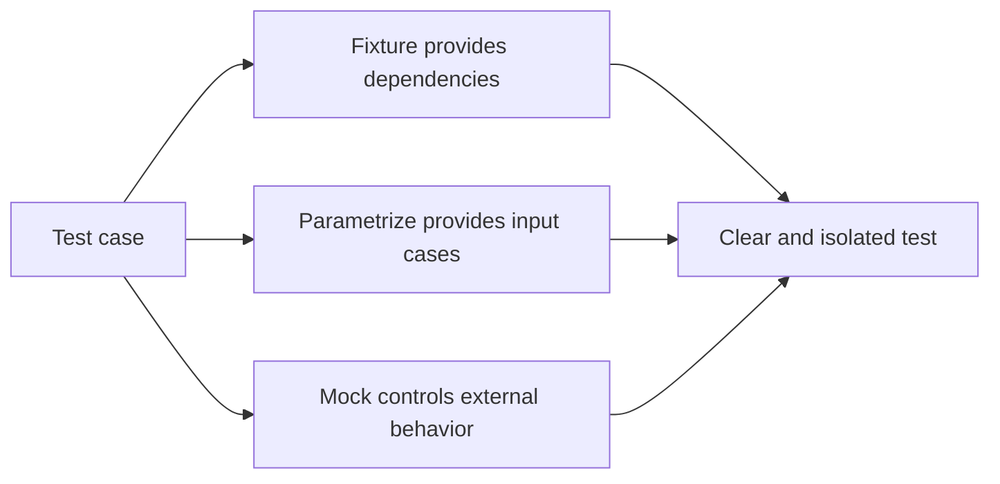

A simple way to remember the difference is:

```text
Fixture     = What does the test need?
Parametrize = Which input cases should run?
Mock        = Which real dependency should be replaced?
```

---

# 2. Project Setup

## 2.1 Installation

For a reproducible project using the current major release:

```bash
python -m pip install "pytest>=9.1,<10"
```

Check the installed version:

```bash
python -m pytest --version
```

Run the complete test suite:

```bash
python -m pytest
```

Using `python -m pytest` is useful because it runs pytest with the same Python interpreter as the current environment.

## 2.2 Common Project Layout

```text
project/
├── pyproject.toml
├── src/
│   └── shop/
│       ├── __init__.py
│       ├── pricing.py
│       └── payment_service.py
└── tests/
    ├── conftest.py
    ├── test_pricing.py
    └── test_payment_service.py
```

A minimal `pyproject.toml` configuration:

```toml
[tool.pytest.ini_options]
testpaths = ["tests"]
pythonpath = ["src"]
addopts = "-ra"
```

- `testpaths` tells pytest where tests normally live.
- `pythonpath` makes the `src` package importable during tests.
- `-ra` displays a useful summary for skipped, xfailed, and other non-standard results.

---

# 3. Fixtures

A fixture is a function that prepares something a test needs. The test requests the fixture by declaring its name as a function argument.

## 3.1 Fixture Mental Model

Consider this test:

```python
def test_create_order(order_service, sample_customer):
    order = order_service.create(customer=sample_customer)
    assert order.customer_id == sample_customer.id
```

Pytest sees the argument names and searches for fixtures with matching names.

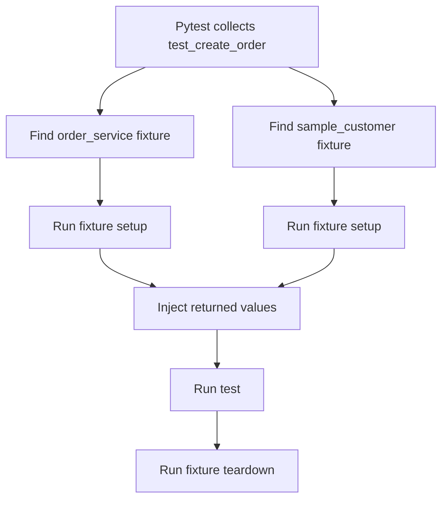

Fixtures provide **dependency injection for tests**. The test does not manually create every dependency; pytest resolves and supplies them.

## 3.2 Basic Fixtures

```python
import pytest


@pytest.fixture
def sample_user() -> dict[str, object]:
    return {
        "id": 101,
        "name": "Aarav",
        "active": True,
    }


def test_sample_user_is_active(sample_user: dict[str, object]) -> None:
    assert sample_user["active"] is True
```

Execution flow:

```text
1. pytest finds test_sample_user_is_active
2. It notices the sample_user argument
3. It executes the sample_user fixture
4. It passes the returned dictionary into the test
5. It executes the assertion
```

The fixture name should describe the resource or state it provides, such as:

```text
sample_user
authenticated_client
db_session
payment_gateway
order_factory
frozen_clock
```

## 3.3 Setup and Teardown with `yield`

Use `yield` when a resource must be cleaned up after the test.

```python
import pytest


class FakeConnection:
    def __init__(self) -> None:
        self.closed = False

    def close(self) -> None:
        self.closed = True


@pytest.fixture
def connection() -> FakeConnection:
    connection = FakeConnection()

    # Setup phase
    yield connection

    # Teardown phase
    connection.close()


def test_connection_is_available(connection: FakeConnection) -> None:
    assert connection.closed is False
```

The code before `yield` is setup. The code after `yield` is teardown.

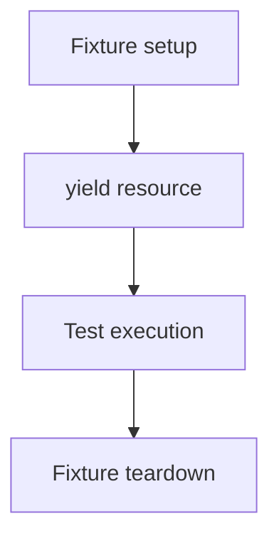

Teardown still runs when the test assertion fails, which makes `yield` fixtures suitable for:

- database transactions;
- temporary application instances;
- files and directories;
- network clients;
- containers or emulators;
- environment configuration;
- resources that require `close()`, `stop()`, or rollback.

For resources that already implement context managers, combine `with` and `yield`:

```python
import pytest
from pathlib import Path
from tempfile import TemporaryDirectory


@pytest.fixture
def workspace() -> Path:
    with TemporaryDirectory() as directory:
        yield Path(directory)
```

The context manager handles cleanup after the fixture finishes.

## 3.4 Fixture Scopes

Fixture scope controls how often pytest creates the fixture.

| Scope | Created | Typical use |
|---|---|---|
| `function` | Once per test function | Mutable data, isolated records, mocks |
| `class` | Once per test class | Shared class-level setup |
| `module` | Once per test module | Expensive module-level resource |
| `package` | Once per test package | Package-wide integration setup |
| `session` | Once per entire test session | Containers, application configuration, expensive clients |

Example:

```python
import pytest


@pytest.fixture(scope="session")
def application_config() -> dict[str, str]:
    return {
        "environment": "test",
        "currency": "INR",
    }
```

A `session` fixture is reused across the whole test run. It should not contain mutable per-test state unless that state is carefully reset.

### Scope selection guideline

Use the narrowest practical scope:

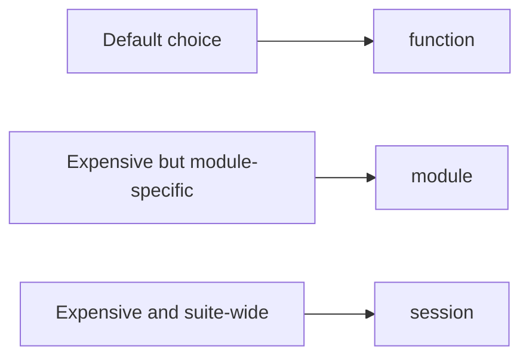

Wider scope improves speed but increases the chance of shared-state coupling.

## 3.5 Fixture Dependencies

A fixture can request another fixture exactly like a test does.

```python
import pytest


class UserRepository:
    def __init__(self, connection: dict[str, str]) -> None:
        self.connection = connection


@pytest.fixture
def db_connection() -> dict[str, str]:
    return {"database": "test_db"}


@pytest.fixture
def user_repository(db_connection: dict[str, str]) -> UserRepository:
    return UserRepository(connection=db_connection)


def test_repository_uses_test_database(
    user_repository: UserRepository,
) -> None:
    assert user_repository.connection["database"] == "test_db"
```

Dependency graph:

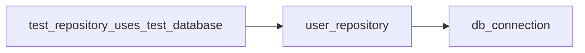

Pytest resolves the graph before running the test.

When fixtures use `yield`, teardown happens in reverse dependency order:

```text
Setup:    db_connection → user_repository → test
Teardown: test → user_repository → db_connection
```

This ordering is important when one resource depends on another resource remaining available during cleanup.

## 3.6 Sharing Fixtures with `conftest.py`

Fixtures used by several test files usually belong in `conftest.py`.

```python
# tests/conftest.py

import pytest


@pytest.fixture
def sample_customer() -> dict[str, object]:
    return {
        "id": 501,
        "name": "Neha",
        "tier": "gold",
    }
```

The fixture is automatically discoverable by tests in the same directory and its child directories.

```python
# tests/test_customer.py


def test_customer_tier(sample_customer: dict[str, object]) -> None:
    assert sample_customer["tier"] == "gold"
```

Do not import fixtures from `conftest.py` into the test module. Pytest discovers them automatically.

A practical placement strategy:

```text
tests/conftest.py
    Shared across most tests

tests/api/conftest.py
    Shared only by API tests

tests/integration/conftest.py
    Shared only by integration tests
```

Keep fixtures close to the tests that use them. A large root-level `conftest.py` with unrelated fixtures becomes difficult to navigate.

## 3.7 Factory Fixtures

A factory fixture returns a function that can build customized test data.

```python
from collections.abc import Callable
import pytest


UserFactory = Callable[..., dict[str, object]]


@pytest.fixture
def user_factory() -> UserFactory:
    def create_user(
        *,
        user_id: int = 1,
        name: str = "Default User",
        active: bool = True,
    ) -> dict[str, object]:
        return {
            "id": user_id,
            "name": name,
            "active": active,
        }

    return create_user


def test_inactive_user(user_factory: UserFactory) -> None:
    user = user_factory(user_id=10, name="Riya", active=False)

    assert user == {
        "id": 10,
        "name": "Riya",
        "active": False,
    }
```

Factory fixtures are useful when tests need similar data with small variations.

Without a factory, developers often create many nearly identical fixtures:

```text
active_user
inactive_user
admin_user
premium_user
blocked_user
```

A factory keeps the common defaults in one place while allowing each test to state only the important differences.

## 3.8 Autouse Fixtures

An autouse fixture runs automatically for every test in its visible scope.

```python
import pytest


@pytest.fixture(autouse=True)
def set_test_environment(monkeypatch: pytest.MonkeyPatch) -> None:
    monkeypatch.setenv("APP_ENV", "test")
```

Tests do not need to request `set_test_environment` explicitly.

Autouse is appropriate for truly universal test behavior, such as:

- setting a mandatory test environment variable;
- blocking accidental network requests;
- resetting a global registry;
- applying a consistent timezone.

Prefer explicit fixture arguments when the dependency matters to understanding the test. Hidden setup can make test behavior less obvious.

## 3.9 Parametrized Fixtures

A fixture itself can run with several parameter values.

```python
import pytest


@pytest.fixture(params=["sqlite", "postgresql"], ids=["sqlite-db", "postgres-db"])
def database_engine(request: pytest.FixtureRequest) -> str:
    return str(request.param)


def test_database_engine_is_supported(database_engine: str) -> None:
    assert database_engine in {"sqlite", "postgresql"}
```

Pytest creates two test instances:

```text
test_database_engine_is_supported[sqlite-db]
test_database_engine_is_supported[postgres-db]
```

Use parametrized fixtures when the **resource configuration** varies. Use `@pytest.mark.parametrize` when the **test input or expected output** varies.

## 3.10 Useful Built-in Fixtures

Pytest includes several fixtures that solve common testing tasks.

| Fixture | Purpose |
|---|---|
| `tmp_path` | Creates a unique temporary directory as a `pathlib.Path` |
| `monkeypatch` | Temporarily changes attributes, dictionaries, environment variables, paths, or working directory |
| `capsys` | Captures writes to `stdout` and `stderr` |
| `caplog` | Captures log records and messages |
| `request` | Provides information about the requesting test or fixture |
| `pytestconfig` | Exposes the pytest configuration object |
| `cache` | Stores values across test runs |

### Example: `tmp_path`

```python
from pathlib import Path


def write_report(directory: Path, content: str) -> Path:
    report_path = directory / "report.txt"
    report_path.write_text(content, encoding="utf-8")
    return report_path


def test_write_report(tmp_path: Path) -> None:
    report_path = write_report(tmp_path, "completed")

    assert report_path.read_text(encoding="utf-8") == "completed"
```

### Example: `capsys`

```python
def greet(name: str) -> None:
    print(f"Hello, {name}")


def test_greet(capsys) -> None:
    greet("Avadh")

    captured = capsys.readouterr()
    assert captured.out == "Hello, Avadh\n"
    assert captured.err == ""
```

---

# 4. Parametrization

Parametrization runs the same test logic with multiple data sets.

Instead of this repetition:

```python
def test_add_positive_numbers() -> None:
    assert add(2, 3) == 5


def test_add_zero() -> None:
    assert add(0, 7) == 7


def test_add_negative_numbers() -> None:
    assert add(-2, -3) == -5
```

Use one parametrized test.

## 4.1 Basic `@pytest.mark.parametrize`

```python
import pytest


def add(left: int, right: int) -> int:
    return left + right


@pytest.mark.parametrize(
    "left,right,expected",
    [
        (2, 3, 5),
        (0, 7, 7),
        (-2, -3, -5),
    ],
)
def test_add(left: int, right: int, expected: int) -> None:
    assert add(left, right) == expected
```

Pytest reports each row as a separate test case. One failing row does not hide the result of the others.

## 4.2 Multiple Inputs

The parameter names can be written as a comma-separated string:

```python
@pytest.mark.parametrize(
    "subtotal,discount_percent,expected",
    [
        (1000, 0, 1000),
        (1000, 10, 900),
        (2500, 20, 2000),
    ],
)
def test_apply_discount(
    subtotal: int,
    discount_percent: int,
    expected: int,
) -> None:
    result = subtotal - (subtotal * discount_percent // 100)
    assert result == expected
```

Keep each row focused on a meaningful behavior or boundary:

```text
normal value
zero value
minimum boundary
maximum boundary
invalid input
special business rule
```

## 4.3 Readable Test IDs

Readable IDs make terminal output and CI reports easier to understand.

```python
import pytest


@pytest.mark.parametrize(
    "subtotal,discount_percent,expected",
    [
        pytest.param(1000, 0, 1000, id="no-discount"),
        pytest.param(1000, 10, 900, id="standard-discount"),
        pytest.param(2500, 20, 2000, id="premium-discount"),
    ],
)
def test_apply_discount(
    subtotal: int,
    discount_percent: int,
    expected: int,
) -> None:
    result = subtotal - (subtotal * discount_percent // 100)
    assert result == expected
```

Output becomes similar to:

```text
test_apply_discount[no-discount]
test_apply_discount[standard-discount]
test_apply_discount[premium-discount]
```

IDs should describe the behavior, not merely repeat raw values.

## 4.4 Marks on Individual Cases

`pytest.param` can attach marks to one specific row.

```python
import pytest


@pytest.mark.parametrize(
    "value,expected",
    [
        pytest.param(4, 2, id="positive"),
        pytest.param(0, 0, id="zero"),
        pytest.param(
            -1,
            0,
            marks=pytest.mark.xfail(reason="Negative input not supported yet"),
            id="negative",
        ),
    ],
)
def test_half(value: int, expected: int) -> None:
    assert value // 2 == expected
```

This is useful when one known case is expected to fail or should be skipped for a documented reason.

## 4.5 Stacked Parametrization

Stacking decorators creates the Cartesian product of values.

```python
import pytest


@pytest.mark.parametrize("currency", ["INR", "USD"])
@pytest.mark.parametrize("payment_method", ["card", "upi"])
def test_supported_payment_combinations(
    currency: str,
    payment_method: str,
) -> None:
    assert currency in {"INR", "USD"}
    assert payment_method in {"card", "upi"}
```

This runs four combinations:

```text
INR + card
USD + card
INR + upi
USD + upi
```

Use stacked parametrization when every combination is meaningful. If only selected combinations are valid, list explicit rows instead.

## 4.6 Indirect Parametrization

Indirect parametrization sends a parameter value into a fixture through `request.param`.

```python
import pytest


class FakeDatabase:
    def __init__(self, engine: str) -> None:
        self.engine = engine


@pytest.fixture
def database(request: pytest.FixtureRequest) -> FakeDatabase:
    engine = str(request.param)
    return FakeDatabase(engine=engine)


@pytest.mark.parametrize(
    "database",
    ["sqlite", "postgresql"],
    indirect=True,
)
def test_database_configuration(database: FakeDatabase) -> None:
    assert database.engine in {"sqlite", "postgresql"}
```

Flow:

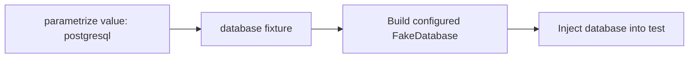

Indirect parametrization is valuable when a simple input value must be converted into an expensive or structured resource during test setup.

### Important behavior of parameter values

Pytest passes parameter objects as-is. It does not copy mutable values.

```python
import pytest


@pytest.mark.parametrize("items", [[1, 2]])
def test_mutable_parameter(items: list[int]) -> None:
    items.append(3)
    assert items == [1, 2, 3]
```

Avoid mutating shared parameter objects, or create a copy inside the test:

```python
local_items = items.copy()
```

---

# 5. Mocking

Mocking replaces a real dependency with a controlled object during a test.

## 5.1 What Mocking Solves

Assume a service performs an HTTP request:

```python
def fetch_exchange_rate() -> float:
    response = requests.get("https://example.test/rates", timeout=5)
    response.raise_for_status()
    return float(response.json()["rate"])
```

A unit test should usually not depend on:

- internet availability;
- a live third-party API;
- API rate limits;
- real payment processing;
- the current system clock;
- sending email or SMS;
- slow database operations.

A mock lets the test define exactly what the dependency returns or raises.

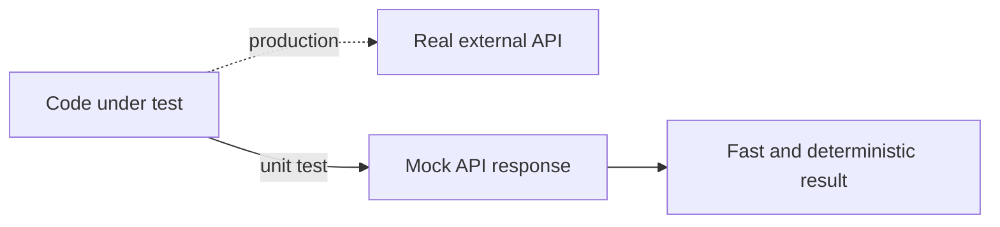

Mocking is mainly about controlling the boundary around the unit being tested.

## 5.2 `Mock`, `MagicMock`, and `AsyncMock`

Python provides these classes in `unittest.mock`.

| Type | Use |
|---|---|
| `Mock` | Normal methods and callable dependencies |
| `MagicMock` | Objects using magic methods such as `__enter__`, `__iter__`, or `__len__` |
| `AsyncMock` | Async functions and awaitable dependencies |

### Basic `Mock`

```python
from unittest.mock import Mock


repository = Mock()
repository.get_user.return_value = {"id": 1, "name": "Meera"}

user = repository.get_user(1)

assert user["name"] == "Meera"
repository.get_user.assert_called_once_with(1)
```

### `MagicMock` for a context manager

```python
from unittest.mock import MagicMock


resource = MagicMock()
resource.__enter__.return_value = "connected"

with resource as connection:
    assert connection == "connected"

resource.__enter__.assert_called_once_with()
resource.__exit__.assert_called_once()
```

### `AsyncMock`

```python
from unittest.mock import AsyncMock


async def test_async_client() -> None:
    client = AsyncMock()
    client.fetch_user.return_value = {"id": 7}

    result = await client.fetch_user(7)

    assert result == {"id": 7}
    client.fetch_user.assert_awaited_once_with(7)
```

Async tests normally require an async pytest plugin such as `pytest-asyncio`, or a framework-specific async test setup.

## 5.3 `return_value` and `side_effect`

### Fixed return value

```python
from unittest.mock import Mock


calculator = Mock()
calculator.total.return_value = 500

assert calculator.total() == 500
```

### Raise an exception

```python
from unittest.mock import Mock


payment_gateway = Mock()
payment_gateway.charge.side_effect = TimeoutError("Gateway timeout")
```

Calling `payment_gateway.charge()` now raises `TimeoutError`.

### Return different values on consecutive calls

```python
from unittest.mock import Mock


status_client = Mock()
status_client.get_status.side_effect = ["pending", "processing", "completed"]

assert status_client.get_status() == "pending"
assert status_client.get_status() == "processing"
assert status_client.get_status() == "completed"
```

### Compute behavior from arguments

```python
from unittest.mock import Mock


def calculate_fee(amount: int) -> int:
    return amount // 100


fee_service = Mock()
fee_service.calculate.side_effect = calculate_fee

assert fee_service.calculate(1000) == 10
assert fee_service.calculate(2500) == 25
```

Use `return_value` for one stable result. Use `side_effect` for exceptions, sequences, or argument-based behavior.

## 5.4 Verifying Interactions

Mocks record how they were called.

```python
from unittest.mock import Mock, call


notifier = Mock()

notifier.send("user-1", "Order created")
notifier.send("user-1", "Payment completed")
```

Common assertions:

```python
notifier.send.assert_called()
notifier.send.assert_called_with("user-1", "Payment completed")
notifier.send.assert_called_once()  # Fails here because it was called twice
```

Check all calls:

```python
assert notifier.send.call_count == 2
assert notifier.send.call_args_list == [
    call("user-1", "Order created"),
    call("user-1", "Payment completed"),
]
```

Use interaction assertions when the behavior includes an important collaboration, for example:

- charging the correct amount;
- publishing the correct event;
- passing the expected timeout;
- not sending a notification after a failed transaction.

Do not assert every internal call. Tests become fragile when they duplicate the exact implementation rather than verify meaningful behavior.

## 5.5 Using `patch`

`patch` temporarily replaces an object for the duration of a test.

### As a context manager

```python
from unittest.mock import patch


def test_generate_reference() -> None:
    with patch("orders.reference.uuid4", return_value="fixed-id"):
        result = generate_reference()

    assert result == "fixed-id"
```

### As a decorator

```python
from unittest.mock import patch


@patch("orders.notifications.send_email", autospec=True)
def test_order_confirmation(mock_send_email) -> None:
    create_order(customer_email="user@example.com")

    mock_send_email.assert_called_once_with(
        "user@example.com",
        "Order confirmed",
    )
```

### Patching a class

```python
from unittest.mock import patch


@patch("orders.service.PaymentClient", autospec=True)
def test_payment_client_is_used(mock_client_class) -> None:
    mock_client = mock_client_class.return_value
    mock_client.charge.return_value = {"status": "paid"}

    result = process_payment(amount=1000)

    assert result == {"status": "paid"}
    mock_client.charge.assert_called_once_with(amount=1000)
```

When a class is patched, its instance is normally accessed through:

```python
mock_class.return_value
```

## 5.6 Where to Patch

Patch the name **where the code under test looks it up**.

Suppose the application contains:

```python
# app/payment_service.py
from app.gateway import charge


def process(amount: int) -> str:
    return charge(amount)
```

The correct patch target is:

```python
@patch("app.payment_service.charge")
```

It is not:

```python
@patch("app.gateway.charge")
```

Why?

```text
app.payment_service imported charge into its own namespace.
process() looks up app.payment_service.charge.
Therefore, replace app.payment_service.charge.
```

Another import style behaves differently:

```python
# app/payment_service.py
import app.gateway


def process(amount: int) -> str:
    return app.gateway.charge(amount)
```

Now the lookup is through `app.gateway.charge`, so that is the correct target.

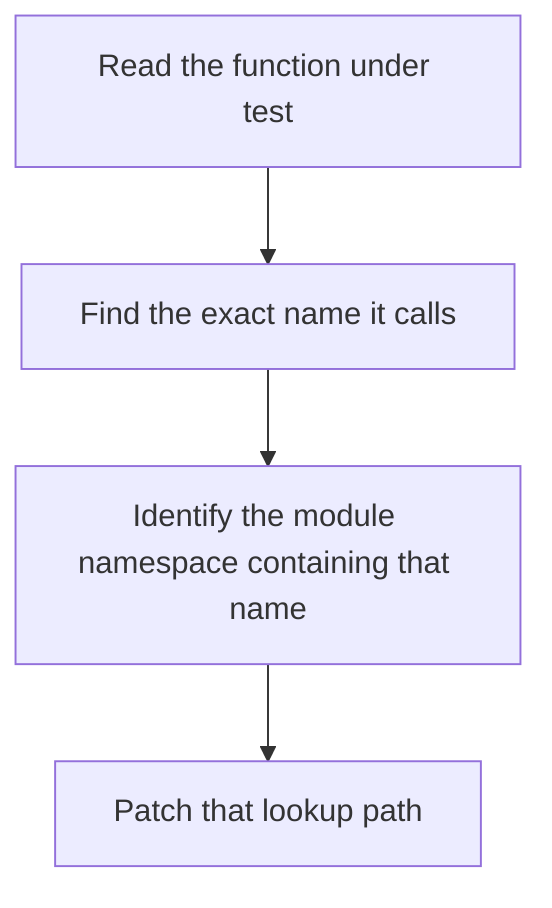

This is the most important practical rule in Python mocking.

## 5.7 `spec`, `spec_set`, and `autospec`

Plain mocks allow arbitrary attributes, which can hide typos or outdated APIs.

```python
from unittest.mock import Mock


service = Mock()
service.send_emial("hello")  # Typo, but a plain Mock accepts it
```

### `spec`

```python
class EmailService:
    def send_email(self, recipient: str, message: str) -> None:
        pass


service = Mock(spec=EmailService)
service.send_email("a@example.com", "Hello")
```

Accessing an attribute absent from `EmailService` raises `AttributeError`.

### `spec_set`

`spec_set` is stricter. It prevents both getting and setting attributes that are not defined by the specification.

```python
service = Mock(spec_set=EmailService)
```

### `autospec=True`

`autospec` also checks callable signatures.

```python
from unittest.mock import patch


@patch("app.notifications.EmailService", autospec=True)
def test_email_service(mock_email_service_class) -> None:
    service = mock_email_service_class.return_value

    service.send_email("a@example.com", "Hello")

    service.send_email.assert_called_once_with(
        "a@example.com",
        "Hello",
    )
```

Calling `send_email` with an incompatible signature raises `TypeError`.

General preference:

```text
patch(..., autospec=True)
Mock(spec_set=RealType)
AsyncMock(spec=AsyncDependency)
```

These options keep mocks closer to the real interface and make tests fail when production APIs change.

## 5.8 The `monkeypatch` Fixture

`monkeypatch` is pytest’s built-in fixture for temporary modifications. Pytest automatically undoes changes after the test or fixture finishes.

### Change an environment variable

```python
import os
import pytest


def get_environment() -> str:
    return os.getenv("APP_ENV", "development")


def test_environment(monkeypatch: pytest.MonkeyPatch) -> None:
    monkeypatch.setenv("APP_ENV", "test")

    assert get_environment() == "test"
```

### Remove an environment variable

```python
def test_missing_environment(monkeypatch: pytest.MonkeyPatch) -> None:
    monkeypatch.delenv("APP_ENV", raising=False)

    assert get_environment() == "development"
```

### Replace an attribute

```python
from pathlib import Path
import pytest


def get_config_path() -> Path:
    return Path.home() / ".myapp" / "config.toml"


def test_config_path(monkeypatch: pytest.MonkeyPatch) -> None:
    monkeypatch.setattr(Path, "home", lambda: Path("/test-user"))

    assert get_config_path() == Path("/test-user/.myapp/config.toml")
```

### Change a dictionary

```python
import pytest


SETTINGS = {"currency": "INR", "tax_rate": 18}


def test_currency_override(monkeypatch: pytest.MonkeyPatch) -> None:
    monkeypatch.setitem(SETTINGS, "currency", "USD")

    assert SETTINGS["currency"] == "USD"
```

### `monkeypatch` vs `patch`

| Need | Good choice |
|---|---|
| Change environment variables | `monkeypatch.setenv` |
| Change dictionary entries | `monkeypatch.setitem` |
| Change current directory | `monkeypatch.chdir` |
| Replace a simple attribute or function | Either |
| Create a mock and assert calls | `unittest.mock.patch` |
| Enforce the real call signature | `patch(..., autospec=True)` |

The tools complement each other. `monkeypatch` manages temporary state changes; `Mock` and `patch` provide rich behavior and interaction assertions.

---

# 6. Complete Practical Example

This example combines fixtures, parametrization, and mocking in a small payment flow.

## 6.1 Production Code

```python
# src/shop/payment_service.py

from dataclasses import dataclass
from typing import Protocol


class PaymentGateway(Protocol):
    def charge(self, *, customer_id: int, amount: int) -> str:
        """Return a payment transaction ID."""
        ...


class AuditPublisher(Protocol):
    def publish(self, event: dict[str, object]) -> None:
        ...


@dataclass(frozen=True)
class PaymentResult:
    transaction_id: str
    amount: int


class PaymentService:
    def __init__(
        self,
        gateway: PaymentGateway,
        audit_publisher: AuditPublisher,
    ) -> None:
        self._gateway = gateway
        self._audit_publisher = audit_publisher

    def pay(self, *, customer_id: int, amount: int) -> PaymentResult:
        if amount <= 0:
            raise ValueError("amount must be greater than zero")

        transaction_id = self._gateway.charge(
            customer_id=customer_id,
            amount=amount,
        )

        self._audit_publisher.publish(
            {
                "event": "payment.completed",
                "customer_id": customer_id,
                "amount": amount,
                "transaction_id": transaction_id,
            }
        )

        return PaymentResult(
            transaction_id=transaction_id,
            amount=amount,
        )
```

The service uses constructor injection. This design reduces the amount of patching required because test doubles can be passed directly.

## 6.2 Shared Fixtures

```python
# tests/conftest.py

from unittest.mock import Mock

import pytest

from shop.payment_service import (
    AuditPublisher,
    PaymentGateway,
    PaymentService,
)


@pytest.fixture
def payment_gateway() -> Mock:
    gateway = Mock(spec_set=PaymentGateway)
    gateway.charge.return_value = "txn-123"
    return gateway


@pytest.fixture
def audit_publisher() -> Mock:
    return Mock(spec_set=AuditPublisher)


@pytest.fixture
def payment_service(
    payment_gateway: Mock,
    audit_publisher: Mock,
) -> PaymentService:
    return PaymentService(
        gateway=payment_gateway,
        audit_publisher=audit_publisher,
    )
```

Fixture dependency graph:

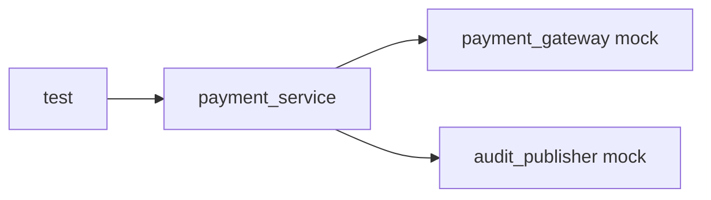

## 6.3 Successful Payment Test

```python
# tests/test_payment_service.py

from unittest.mock import Mock

from shop.payment_service import PaymentService


def test_pay_charges_customer_and_publishes_event(
    payment_service: PaymentService,
    payment_gateway: Mock,
    audit_publisher: Mock,
) -> None:
    result = payment_service.pay(customer_id=42, amount=1500)

    assert result.transaction_id == "txn-123"
    assert result.amount == 1500

    payment_gateway.charge.assert_called_once_with(
        customer_id=42,
        amount=1500,
    )
    audit_publisher.publish.assert_called_once_with(
        {
            "event": "payment.completed",
            "customer_id": 42,
            "amount": 1500,
            "transaction_id": "txn-123",
        }
    )
```

This test verifies both:

- the returned business result;
- the important interactions with dependencies.

## 6.4 Parametrized Validation Test

```python
import pytest

from shop.payment_service import PaymentService


@pytest.mark.parametrize(
    "invalid_amount",
    [
        pytest.param(0, id="zero"),
        pytest.param(-1, id="negative-one"),
        pytest.param(-500, id="negative-value"),
    ],
)
def test_pay_rejects_non_positive_amounts(
    payment_service: PaymentService,
    invalid_amount: int,
) -> None:
    with pytest.raises(ValueError, match="amount must be greater than zero"):
        payment_service.pay(customer_id=42, amount=invalid_amount)
```

One test definition now covers the complete invalid range represented by the selected cases.

## 6.5 Confirm Dependencies Are Not Called on Validation Failure

```python
from unittest.mock import Mock

import pytest

from shop.payment_service import PaymentService


def test_invalid_payment_has_no_external_side_effects(
    payment_service: PaymentService,
    payment_gateway: Mock,
    audit_publisher: Mock,
) -> None:
    with pytest.raises(ValueError):
        payment_service.pay(customer_id=42, amount=0)

    payment_gateway.charge.assert_not_called()
    audit_publisher.publish.assert_not_called()
```

This protects an important business guarantee: invalid input must not create external side effects.

## 6.6 Simulate a Gateway Failure

```python
from unittest.mock import Mock

import pytest

from shop.payment_service import PaymentService


def test_gateway_timeout_is_propagated_without_audit_event(
    payment_service: PaymentService,
    payment_gateway: Mock,
    audit_publisher: Mock,
) -> None:
    payment_gateway.charge.side_effect = TimeoutError("gateway unavailable")

    with pytest.raises(TimeoutError, match="gateway unavailable"):
        payment_service.pay(customer_id=42, amount=1500)

    audit_publisher.publish.assert_not_called()
```

The fixture provides a default successful gateway, and this test overrides only the behavior relevant to the failure scenario.

## 6.7 What Each Feature Contributes

```text
Fixtures
    Build PaymentService and reusable dependency mocks

Parametrize
    Run validation behavior for several invalid amounts

Mocking
    Control gateway results and verify external interactions
```

The resulting tests remain small because setup, data variation, and dependency behavior are handled separately.

---

# 7. Fixtures vs Parametrize vs Mocking

| Requirement | Use | Example |
|---|---|---|
| Reuse setup across tests | Fixture | Create service, repository, client, or sample model |
| Clean up after a test | `yield` fixture | Roll back transaction or close a resource |
| Run one behavior with many cases | Parametrize | Valid and invalid amounts |
| Test several resource configurations | Parametrized fixture | SQLite and PostgreSQL |
| Replace an external dependency | Mock or patch | Payment gateway or email sender |
| Temporarily change environment state | `monkeypatch` | `APP_ENV`, current directory, configuration dictionary |
| Verify a dependency call | Mock assertion | `assert_called_once_with(...)` |

Decision flow:

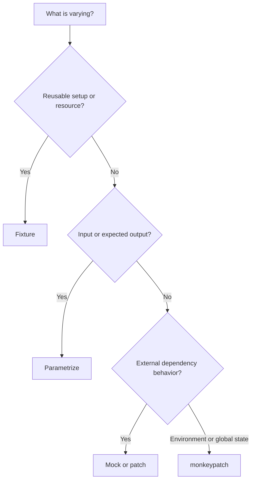

These features are often used together rather than selected exclusively.

---

# 8. Recommended Test Structure

A readable test usually follows **Arrange, Act, Assert**.

```python
def test_payment_is_completed(payment_service, payment_gateway) -> None:
    # Arrange
    payment_gateway.charge.return_value = "txn-900"

    # Act
    result = payment_service.pay(customer_id=42, amount=1500)

    # Assert
    assert result.transaction_id == "txn-900"
```

When setup is already clear from fixture names, comments are optional. The separation should still be visually obvious.

## 8.1 Test One Behavior at a Time

Prefer:

```python
def test_invalid_amount_does_not_call_gateway(...):
    ...
```

Over a test that checks validation, successful payment, timeout handling, event publication, and logging in one long function.

## 8.2 Name Tests by Behavior

Useful pattern:

```text
test_<action>_<expected_result>
```

Examples:

```text
test_pay_returns_transaction_id
test_pay_rejects_zero_amount
test_gateway_timeout_does_not_publish_event
test_gold_customer_receives_discount
```

A good name makes the test suite read like executable documentation.

## 8.3 Keep Unit-Test Boundaries Small

A typical unit test should control dependencies at the boundary:

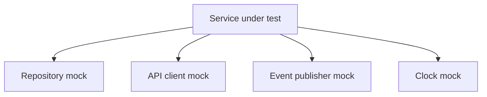

Integration tests can then verify that real components are wired together correctly.

Mocks do not remove the need for integration tests. They answer a different question:

```text
Unit test        → Does this component behave correctly in isolation?
Integration test → Do real components work correctly together?
```

---

# 9. Useful Commands

Run all tests:

```bash
python -m pytest
```

Run with concise output:

```bash
python -m pytest -q
```

Run one file:

```bash
python -m pytest tests/test_payment_service.py
```

Run one test:

```bash
python -m pytest tests/test_payment_service.py::test_pay_charges_customer_and_publishes_event
```

Run one parametrized case by its ID:

```bash
python -m pytest "tests/test_payment_service.py::test_pay_rejects_non_positive_amounts[zero]"
```

Stop after the first failure:

```bash
python -m pytest -x
```

Show local variables in tracebacks:

```bash
python -m pytest -l
```

Show print output during execution:

```bash
python -m pytest -s
```

List available fixtures:

```bash
python -m pytest --fixtures
```

Show setup and fixture execution:

```bash
python -m pytest --setup-show
```

Run tests matching a name expression:

```bash
python -m pytest -k "payment and not timeout"
```

Run tests with a custom marker:

```bash
python -m pytest -m integration
```

---

# 10. Best Practices

## 10.1 Prefer Explicit Dependencies

Constructor or function injection often produces cleaner tests than global imports.

```python
service = PaymentService(gateway=fake_gateway)
```

This is usually simpler than patching several global objects.

## 10.2 Keep Fixtures Focused

A fixture should have one clear responsibility.

```text
Good:
    customer
    payment_gateway
    payment_service

Harder to maintain:
    complete_test_environment_with_customer_order_payment_and_notifications
```

Compose small fixtures through fixture dependencies.

## 10.3 Use Function Scope by Default

Function-scoped fixtures provide the strongest isolation. Increase scope only when resource creation is expensive and shared state is safe.

## 10.4 Put Cleanup in the Fixture

The fixture that creates a resource should normally own its cleanup.

```python
@pytest.fixture
def resource():
    resource = create_resource()
    yield resource
    resource.close()
```

This keeps lifecycle management in one place.

## 10.5 Give Parametrized Cases Meaningful IDs

```python
pytest.param(0, id="zero")
pytest.param(-1, id="negative")
```

Readable IDs reduce investigation time when CI reports a single failing case.

## 10.6 Parametrize Behavior, Not Unrelated Scenarios

Rows should exercise the same behavior. When cases require very different setup or assertions, separate tests are clearer.

## 10.7 Patch the Lookup Location

Read the import inside the module under test and patch the exact name that the function uses.

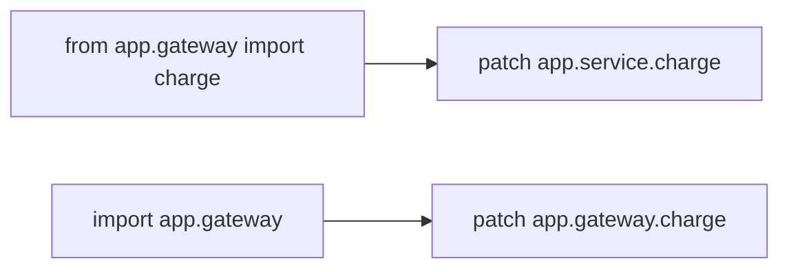

## 10.8 Prefer `autospec` or `spec_set`

Stricter mocks catch invalid attribute names and incompatible calls earlier.

```python
patch("app.service.Client", autospec=True)
Mock(spec_set=ClientProtocol)
```

## 10.9 Mock External Boundaries, Not Simple Internal Logic

Good candidates:

- third-party APIs;
- payment gateways;
- email and SMS providers;
- message brokers;
- current time;
- random IDs;
- filesystem or cloud storage when not under integration test.

Simple pure functions are usually easier to call directly than to mock.

## 10.10 Assert Observable Behavior First

Prefer assertions about returned values, state changes, raised exceptions, or emitted events. Add call assertions when the interaction itself is part of the contract.

## 10.11 Avoid Shared Mutable Fixture State

A session-scoped mutable dictionary can leak changes across tests. Return fresh objects from function-scoped fixtures or copy shared templates.

## 10.12 Use Realistic but Minimal Test Data

Include only fields relevant to the behavior being tested. Large production-like payloads make tests noisy and harder to understand.

---

# 11. Final Summary

```text
Fixtures
    Reusable setup and dependency injection
    Support setup/teardown with yield
    Can depend on other fixtures
    Can be shared through conftest.py

Parametrize
    Runs one test with multiple data sets
    Supports readable IDs and per-case marks
    Can parametrize tests or fixtures
    Indirect mode sends values through fixtures

Mocking
    Replaces external or unpredictable dependencies
    Controls return values and exceptions
    Verifies important interactions
    Works through Mock, MagicMock, AsyncMock, patch, and monkeypatch
```

The most maintainable pytest suites usually follow this pattern:

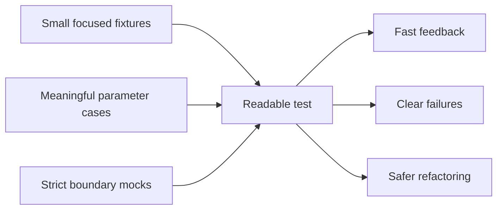

The central idea is separation of responsibility:

- fixtures manage **test dependencies and lifecycle**;
- parametrization manages **data variation**;
- mocks manage **controlled collaboration with dependencies**.

---

## Official References

- [pytest documentation](https://docs.pytest.org/en/stable/)
- [How to use fixtures](https://docs.pytest.org/en/stable/how-to/fixtures.html)
- [Fixtures reference](https://docs.pytest.org/en/stable/reference/fixtures.html)
- [How to parametrize fixtures and test functions](https://docs.pytest.org/en/stable/how-to/parametrize.html)
- [How to monkeypatch/mock modules and environments](https://docs.pytest.org/en/stable/how-to/monkeypatch.html)
- [Python `unittest.mock` documentation](https://docs.python.org/3/library/unittest.mock.html)
- [pytest on PyPI](https://pypi.org/project/pytest/)
