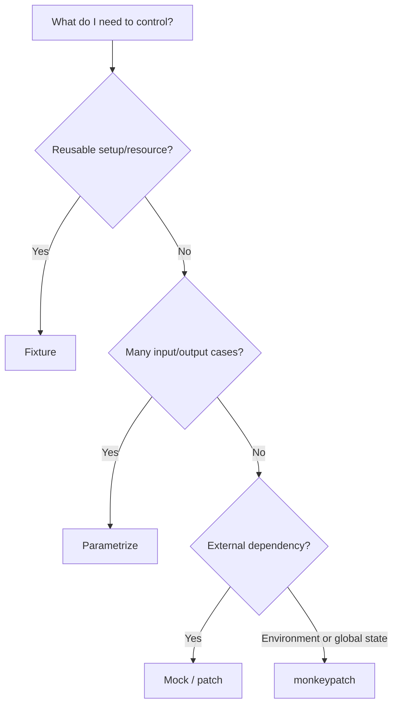
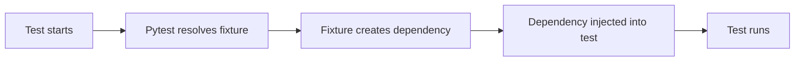
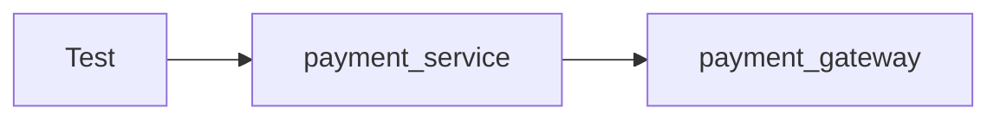
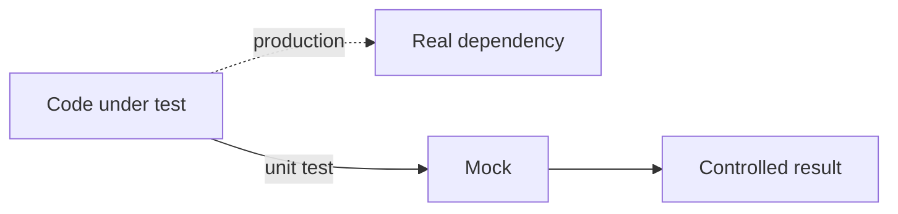
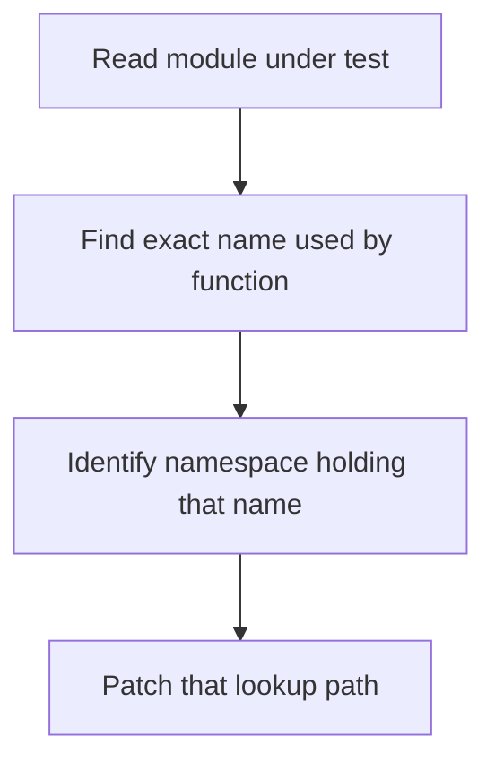
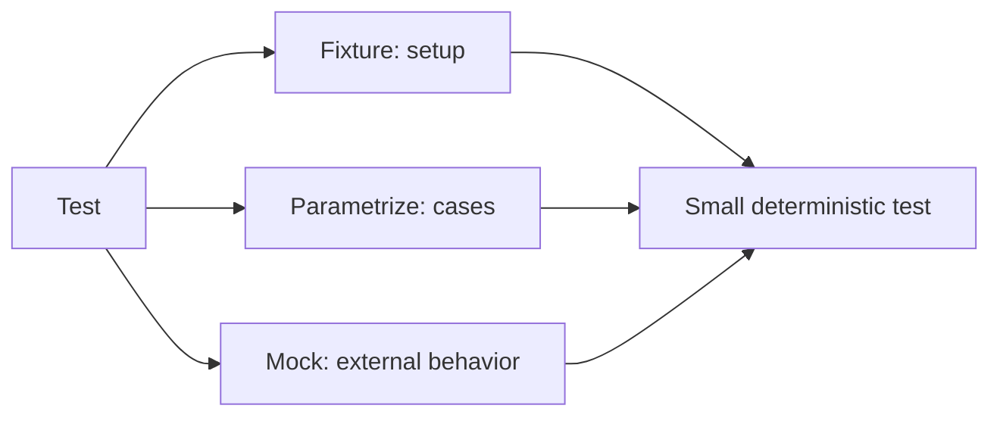

# Pytest: Fixtures, Parametrize, and Mocking

> Pytest keeps tests readable by separating **setup**, **test cases**, and **external dependency behavior**.

> **Version reference:** pytest **9.1.1** and Python **3.10+**, verified August 20, 2026.

## In Short

```text
Fixture     -> What does the test need?
Parametrize -> Which cases should run?
Mock        -> Which real dependency should be replaced?
monkeypatch -> Which temporary environment/global value should change?
```



The most important practical rules are:

- Use **fixtures** for reusable setup and dependency injection.
- Use `yield` fixtures when setup also needs cleanup.
- Keep fixtures **function-scoped by default**.
- Use `@pytest.mark.parametrize` when the same behavior should run against several inputs.
- Use a **parametrized fixture** when the resource configuration itself changes.
- Mock external boundaries such as APIs, payment gateways, email, clocks, storage, or message brokers.
- Patch the name **where the code under test looks it up**.
- Prefer `autospec=True` or `spec_set` so mocks stay close to the real interface.

---

# 1. Fixtures

A fixture is a function that prepares data or a resource needed by a test.

Instead of manually creating dependencies inside every test, the test requests them as function arguments and pytest injects them.

## 1.1 Basic Fixture

```python
import pytest


@pytest.fixture
def sample_user() -> dict[str, object]:
    return {
        "id": 101,
        "name": "Aarav",
        "active": True,
    }


def test_user_is_active(sample_user: dict[str, object]) -> None:
    assert sample_user["active"] is True
```

Pytest sees `sample_user` in the test signature, finds the fixture with that name, runs it, and injects the returned value.



This is why fixtures are often described as **dependency injection for tests**.

## 1.2 Setup and Teardown with `yield`

Use `yield` when the fixture owns a resource that must be cleaned up.

```python
import pytest


class FakeConnection:
    def __init__(self) -> None:
        self.closed = False

    def close(self) -> None:
        self.closed = True


@pytest.fixture
def connection() -> FakeConnection:
    conn = FakeConnection()   # setup
    yield conn                # test runs here
    conn.close()              # teardown
```


If the fixture successfully reaches `yield`, its teardown code runs even when the test fails.

Common uses:

- database transaction rollback;
- temporary files;
- network/application clients;
- containers or emulators;
- resources requiring `close()`, `stop()`, or cleanup.

## 1.3 Fixture Scope

Scope controls how often pytest creates a fixture.

| Scope | Created | Typical use |
|---|---|---|
| `function` | Once per test | Normal default, mocks, mutable data |
| `class` | Once per test class | Shared class setup |
| `module` | Once per test module | Expensive module resource |
| `package` | Once per package | Package-level integration setup |
| `session` | Once per test run | Containers or expensive shared infrastructure |

Example:

```python
@pytest.fixture(scope="session")
def app_config() -> dict[str, str]:
    return {"environment": "test"}
```

**Rule:** use the narrowest practical scope. Wider scopes improve setup speed but also increase shared-state risk.

## 1.4 Fixture Dependencies

Fixtures can depend on other fixtures.

```python
@pytest.fixture
def payment_gateway():
    return FakePaymentGateway()


@pytest.fixture
def payment_service(payment_gateway):
    return PaymentService(gateway=payment_gateway)
```



Pytest resolves the dependency graph automatically.

## 1.5 `conftest.py`

Put shared fixtures in `conftest.py`.

```text
tests/
├── conftest.py
├── test_orders.py
└── api/
    ├── conftest.py
    └── test_users.py
```

Fixtures in a `conftest.py` are automatically discoverable by tests in that directory scope and below it.

Do **not** normally import fixtures from `conftest.py`.

A useful structure is:

- `tests/conftest.py` → fixtures shared broadly;
- `tests/api/conftest.py` → API-only fixtures;
- `tests/integration/conftest.py` → integration-only fixtures.

Keep fixtures close to where they are used.

## 1.6 Factory Fixtures

A factory fixture returns a function that creates customized test data.

```python
import pytest


@pytest.fixture
def user_factory():
    def create_user(
        *,
        user_id: int = 1,
        active: bool = True,
    ) -> dict[str, object]:
        return {
            "id": user_id,
            "active": active,
        }

    return create_user


def test_inactive_user(user_factory) -> None:
    user = user_factory(user_id=10, active=False)

    assert user["active"] is False
```

This is better than maintaining many almost-identical fixtures such as `active_user`, `inactive_user`, `premium_user`, and `blocked_user`.

## 1.7 Autouse Fixtures

An autouse fixture runs automatically in its visible scope.

```python
@pytest.fixture(autouse=True)
def set_test_environment(monkeypatch):
    monkeypatch.setenv("APP_ENV", "test")
```

Use autouse only for behavior that is genuinely universal. Prefer explicit fixture arguments when the dependency is important for understanding the test.

---

# 2. Parametrization

Parametrization runs the same test behavior with multiple input sets.

## 2.1 Basic `@pytest.mark.parametrize`

```python
import pytest


@pytest.mark.parametrize(
    "amount,expected",
    [
        (1000, 1000),
        (0, 0),
        (-10, -10),
    ],
)
def test_amount_is_preserved(amount: int, expected: int) -> None:
    assert amount == expected
```

Each row becomes an independent test case in pytest output.

This reduces duplication while keeping failures isolated.

## 2.2 Use Readable IDs

```python
@pytest.mark.parametrize(
    "amount",
    [
        pytest.param(0, id="zero"),
        pytest.param(-1, id="negative-one"),
        pytest.param(-500, id="negative-value"),
    ],
)
def test_invalid_amount(amount: int) -> None:
    assert amount <= 0
```

CI output becomes easier to read:

```text
test_invalid_amount[zero]
test_invalid_amount[negative-one]
test_invalid_amount[negative-value]
```

Prefer behavioral IDs over raw values when possible.

## 2.3 `pytest.param` for Per-Case Marks

```python
@pytest.mark.parametrize(
    "value,expected",
    [
        pytest.param(4, 2, id="positive"),
        pytest.param(
            -1,
            0,
            marks=pytest.mark.xfail(reason="Negative values not supported"),
            id="negative",
        ),
    ],
)
def test_half(value: int, expected: int) -> None:
    assert value // 2 == expected
```

A single row can be marked with `xfail`, `skip`, or another marker.

## 2.4 Parametrize vs Parametrized Fixture

Use `@pytest.mark.parametrize` when the **test input or expected output** changes.

Use a parametrized fixture when the **resource configuration** changes.

```python
@pytest.fixture(
    params=["sqlite", "postgresql"],
    ids=["sqlite-db", "postgres-db"],
)
def database_engine(request) -> str:
    return request.param
```

```text
Input/expected output varies -> @pytest.mark.parametrize
Resource/backend varies      -> @pytest.fixture(params=[...])
```

## 2.5 Indirect Parametrization

`indirect=True` sends the parameter value through a fixture.

```python
@pytest.fixture
def database(request):
    return FakeDatabase(engine=request.param)


@pytest.mark.parametrize(
    "database",
    ["sqlite", "postgresql"],
    indirect=True,
)
def test_database(database) -> None:
    assert database.is_ready()
```

This is useful when a simple test parameter must be converted into a structured or expensive resource during setup.

One important behavior: pytest passes parameter values **as-is**. Mutable values such as lists or dictionaries are not copied automatically.

---

# 3. Mocking

Mocking replaces a real dependency with controlled test behavior.

A unit test should normally avoid depending on:

- a live third-party API;
- real payment processing;
- current system time;
- email or SMS delivery;
- cloud storage;
- message brokers;
- slow external services.



## 3.1 `Mock`, `MagicMock`, and `AsyncMock`

| Type | Use |
|---|---|
| `Mock` | Normal methods and callable dependencies |
| `MagicMock` | Magic methods such as `__enter__`, `__iter__`, `__len__` |
| `AsyncMock` | Async functions and awaitable dependencies |

Example:

```python
from unittest.mock import Mock

repository = Mock()
repository.get_user.return_value = {"id": 1, "name": "Meera"}

user = repository.get_user(1)

assert user["name"] == "Meera"
repository.get_user.assert_called_once_with(1)
```

For async code:

```python
from unittest.mock import AsyncMock


async def test_fetch_user() -> None:
    client = AsyncMock()
    client.fetch_user.return_value = {"id": 7}

    result = await client.fetch_user(7)

    assert result == {"id": 7}
    client.fetch_user.assert_awaited_once_with(7)
```

## 3.2 `return_value` vs `side_effect`

Use `return_value` for one stable result.

```python
gateway = Mock()
gateway.charge.return_value = "txn-123"
```

Use `side_effect` when you need an exception, sequence, or custom behavior.

```python
gateway.charge.side_effect = TimeoutError("gateway unavailable")
```

```python
client.get_status.side_effect = [
    "pending",
    "processing",
    "completed",
]
```

## 3.3 Verify Important Interactions

Mocks record how they were called.

```python
gateway.charge.assert_called_once_with(
    customer_id=42,
    amount=1500,
)
```

Useful assertions include:

```python
mock.assert_called()
mock.assert_called_once()
mock.assert_called_with(...)
mock.assert_called_once_with(...)
mock.assert_not_called()
```

Assert interactions only when the interaction itself matters to the behavior, such as:

- correct payment amount;
- expected event publication;
- correct timeout;
- no email after validation failure.

Do not assert every internal method call because that makes tests tightly coupled to implementation details.

## 3.4 `patch`

`patch` temporarily replaces a name while a test runs.

```python
from unittest.mock import patch


@patch("orders.notifications.send_email", autospec=True)
def test_order_confirmation(mock_send_email) -> None:
    create_order(customer_email="user@example.com")

    mock_send_email.assert_called_once_with(
        "user@example.com",
        "Order confirmed",
    )
```

It can also be used as a context manager:

```python
with patch("orders.reference.uuid4", return_value="fixed-id"):
    result = generate_reference()
```

## 3.5 The Most Important Rule: Patch Where It Is Looked Up

Suppose production code does this:

```python
# app/payment_service.py
from app.gateway import charge


def process(amount: int) -> str:
    return charge(amount)
```

Correct:

```python
@patch("app.payment_service.charge")
```

Usually incorrect for this import style:

```python
@patch("app.gateway.charge")
```

`process()` looks up the local name `app.payment_service.charge`, so that is the name the test must replace.

If the module instead contains:

```python
import app.gateway


def process(amount: int) -> str:
    return app.gateway.charge(amount)
```

then patch:

```python
@patch("app.gateway.charge")
```



## 3.6 `spec`, `spec_set`, and `autospec`

A plain `Mock` accepts almost any attribute, which can hide typos.

```python
from unittest.mock import Mock


class EmailService:
    def send_email(self, recipient: str, message: str) -> None:
        ...


service = Mock(spec_set=EmailService)
```

`spec` restricts attributes to the real interface.

`spec_set` is stricter: it also prevents setting unknown attributes.

`autospec=True` also checks callable signatures when patching.

```python
@patch("app.notifications.EmailService", autospec=True)
def test_email_service(mock_email_service_class) -> None:
    service = mock_email_service_class.return_value
    service.send_email("a@example.com", "Hello")
```

Practical preference:

```text
patch(..., autospec=True)
Mock(spec_set=RealType)
AsyncMock(spec=AsyncDependency)
```

These options help tests fail when production interfaces change.

---

# 4. `monkeypatch`

`monkeypatch` is pytest's built-in fixture for temporary changes to environment or global state.

Changes are automatically undone after the requesting test or fixture finishes.

## 4.1 Environment Variables

```python
import os


def get_environment() -> str:
    return os.getenv("APP_ENV", "development")


def test_environment(monkeypatch) -> None:
    monkeypatch.setenv("APP_ENV", "test")

    assert get_environment() == "test"
```

Useful methods include:

```text
monkeypatch.setenv(...)
monkeypatch.delenv(...)
monkeypatch.setattr(...)
monkeypatch.delattr(...)
monkeypatch.setitem(...)
monkeypatch.delitem(...)
monkeypatch.chdir(...)
```

## 4.2 `monkeypatch` vs `patch`

| Need | Prefer |
|---|---|
| Environment variable | `monkeypatch.setenv` |
| Dictionary value | `monkeypatch.setitem` |
| Current directory | `monkeypatch.chdir` |
| Replace simple attribute/function | Either |
| Configure mock behavior and assert calls | `unittest.mock.patch` |
| Enforce real function signature | `patch(..., autospec=True)` |

They complement each other rather than compete.

---

# 5. Complete Practical Example

The following example combines fixtures, parametrization, and mocking in one payment service.

## 5.1 Production Code

```python
from dataclasses import dataclass
from typing import Protocol


class PaymentGateway(Protocol):
    def charge(self, *, customer_id: int, amount: int) -> str:
        ...


class AuditPublisher(Protocol):
    def publish(self, event: dict[str, object]) -> None:
        ...


@dataclass(frozen=True)
class PaymentResult:
    transaction_id: str
    amount: int


class PaymentService:
    def __init__(
        self,
        gateway: PaymentGateway,
        audit_publisher: AuditPublisher,
    ) -> None:
        self._gateway = gateway
        self._audit_publisher = audit_publisher

    def pay(self, *, customer_id: int, amount: int) -> PaymentResult:
        if amount <= 0:
            raise ValueError("amount must be greater than zero")

        transaction_id = self._gateway.charge(
            customer_id=customer_id,
            amount=amount,
        )

        self._audit_publisher.publish(
            {
                "event": "payment.completed",
                "customer_id": customer_id,
                "amount": amount,
                "transaction_id": transaction_id,
            }
        )

        return PaymentResult(
            transaction_id=transaction_id,
            amount=amount,
        )
```

Constructor injection makes the service easy to test because dependencies can be replaced directly without patching globals.

## 5.2 Fixtures

```python
from unittest.mock import Mock

import pytest


@pytest.fixture
def payment_gateway() -> Mock:
    gateway = Mock(spec_set=PaymentGateway)
    gateway.charge.return_value = "txn-123"
    return gateway


@pytest.fixture
def audit_publisher() -> Mock:
    return Mock(spec_set=AuditPublisher)


@pytest.fixture
def payment_service(
    payment_gateway: Mock,
    audit_publisher: Mock,
) -> PaymentService:
    return PaymentService(
        gateway=payment_gateway,
        audit_publisher=audit_publisher,
    )
```

## 5.3 Success Case

```python
def test_pay_charges_customer_and_publishes_event(
    payment_service,
    payment_gateway,
    audit_publisher,
) -> None:
    result = payment_service.pay(
        customer_id=42,
        amount=1500,
    )

    assert result.transaction_id == "txn-123"

    payment_gateway.charge.assert_called_once_with(
        customer_id=42,
        amount=1500,
    )

    audit_publisher.publish.assert_called_once()
```

## 5.4 Parametrized Validation

```python
@pytest.mark.parametrize(
    "invalid_amount",
    [
        pytest.param(0, id="zero"),
        pytest.param(-1, id="negative-one"),
        pytest.param(-500, id="negative-value"),
    ],
)
def test_pay_rejects_non_positive_amounts(
    payment_service,
    invalid_amount: int,
) -> None:
    with pytest.raises(
        ValueError,
        match="amount must be greater than zero",
    ):
        payment_service.pay(
            customer_id=42,
            amount=invalid_amount,
        )
```

## 5.5 Mock Failure Behavior

```python
def test_gateway_timeout_does_not_publish_event(
    payment_service,
    payment_gateway,
    audit_publisher,
) -> None:
    payment_gateway.charge.side_effect = TimeoutError(
        "gateway unavailable"
    )

    with pytest.raises(TimeoutError):
        payment_service.pay(
            customer_id=42,
            amount=1500,
        )

    audit_publisher.publish.assert_not_called()
```

The responsibilities are now clearly separated:

```text
Fixture     -> builds PaymentService and reusable mocks
Parametrize -> supplies validation cases
Mock        -> controls gateway behavior and verifies collaboration
```

---

# 6. Recommended Test Structure

Use **Arrange → Act → Assert**.

```python
def test_payment_is_completed(
    payment_service,
    payment_gateway,
) -> None:
    # Arrange
    payment_gateway.charge.return_value = "txn-900"

    # Act
    result = payment_service.pay(
        customer_id=42,
        amount=1500,
    )

    # Assert
    assert result.transaction_id == "txn-900"
```

The comments are optional when the test is already visually clear.

## 6.1 Test One Behavior at a Time

Prefer:

```text
test_pay_rejects_zero_amount
test_pay_returns_transaction_id
test_gateway_timeout_does_not_publish_event
```

over one large test that verifies validation, success, timeout handling, logging, and publishing together.

## 6.2 Assert Observable Behavior First

Prefer assertions about:

1. returned value;
2. changed state;
3. raised exception;
4. emitted event;
5. important dependency interaction.

Implementation-level call assertions should be added only when the interaction is part of the contract.

---

# 7. Frequently Used Built-in Fixtures

| Fixture | Purpose |
|---|---|
| `tmp_path` | Unique temporary directory as `pathlib.Path` |
| `monkeypatch` | Temporary environment/global changes |
| `capsys` | Capture stdout and stderr |
| `caplog` | Capture log records |
| `request` | Access requesting test/fixture and fixture parameters |
| `pytestconfig` | Access pytest configuration |

Example with `tmp_path`:

```python
from pathlib import Path


def test_report_file(tmp_path: Path) -> None:
    report = tmp_path / "report.txt"
    report.write_text("completed", encoding="utf-8")

    assert report.read_text(encoding="utf-8") == "completed"
```

---

# 8. Useful Commands

| Command | Purpose |
|---|---|
| `python -m pytest` | Run all tests |
| `python -m pytest -q` | Concise output |
| `python -m pytest tests/test_payment.py` | Run one file |
| `python -m pytest tests/test_payment.py::test_name` | Run one test |
| `python -m pytest -x` | Stop after first failure |
| `python -m pytest -l` | Show local variables in traceback |
| `python -m pytest -s` | Do not capture stdout/stderr |
| `python -m pytest --fixtures` | List available fixtures |
| `python -m pytest --setup-show` | Show fixture setup/teardown execution |
| `python -m pytest -k "payment and not timeout"` | Run tests matching a name expression |
| `python -m pytest -m integration` | Run tests with a marker |

Using `python -m pytest` is useful because it runs pytest with the same Python interpreter as the active environment.

---

# 9. Best Practices

## 9.1 Prefer Explicit Dependency Injection

This:

```python
service = PaymentService(gateway=fake_gateway)
```

is usually easier to test than code that requires patching several module globals.

## 9.2 Keep Fixtures Small

A fixture should have one clear responsibility.

Prefer composing:

```text
customer
payment_gateway
audit_publisher
payment_service
```

instead of building one huge `complete_test_environment` fixture.

## 9.3 Use Function Scope by Default

Function scope gives the strongest isolation. Widen scope only when setup is expensive and shared state is safe.

## 9.4 Let the Fixture Own Cleanup

If a fixture creates a resource, it should usually also close or clean it up.

```text
create -> yield -> cleanup
```

## 9.5 Parametrize the Same Behavior

Parametrized rows should exercise the same behavior with different data.

If setup and assertions are fundamentally different, separate tests are usually clearer.

## 9.6 Use Meaningful Parameter IDs

Prefer:

```python
pytest.param(0, id="zero")
```

over unreadable generated IDs when CI clarity matters.

## 9.7 Patch the Lookup Location

Always inspect the import style used by the module under test before choosing a patch path.

## 9.8 Prefer Strict Mocks

Use `autospec=True`, `spec`, or `spec_set` when practical so incorrect method names and signatures fail early.

## 9.9 Mock External Boundaries

Good mocking targets:

- payment gateways;
- third-party APIs;
- email/SMS providers;
- cloud storage;
- message brokers;
- clocks and UUID generators.

Pure internal functions are normally simpler to call directly.

## 9.10 Keep Unit and Integration Tests Separate

Mocks help test one component in isolation.

Integration tests are still needed to prove that the real database, API client, framework, and infrastructure are wired together correctly.

---

# 10. Final Mental Model



```text
Fixture
  Reusable test dependency or resource.

Parametrize
  Same behavior, multiple cases.

Mock
  Controlled replacement for an external dependency.

monkeypatch
  Temporary environment or global-state modification.

Most important mocking rule
  Patch where the code under test looks up the name.

Default fixture scope
  function.

Preferred strict mocks
  autospec=True or spec_set.
```
