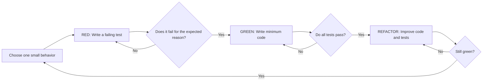
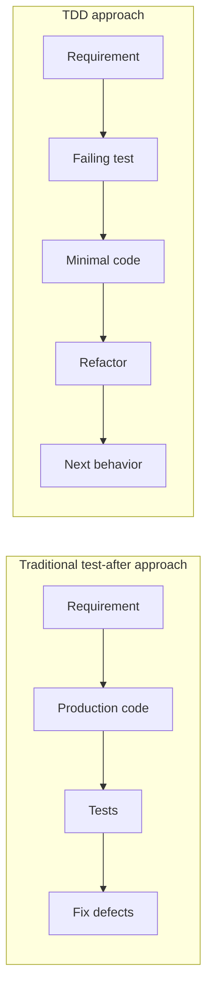
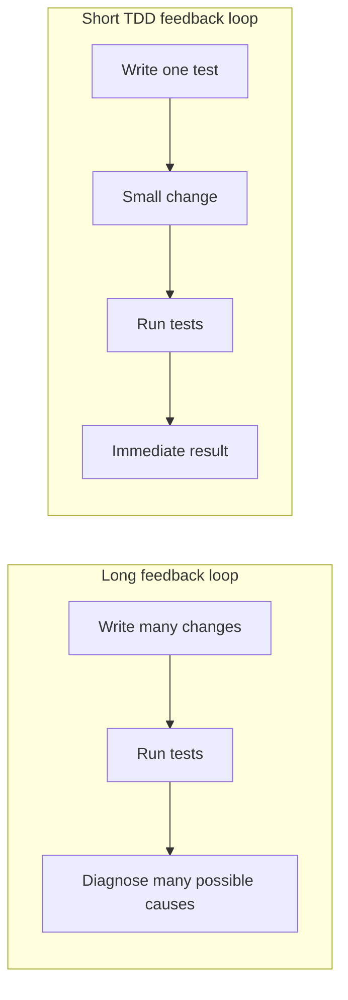
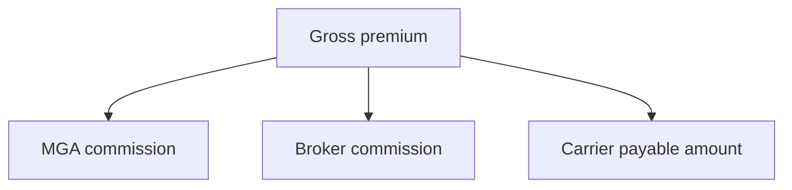
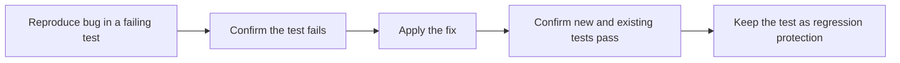
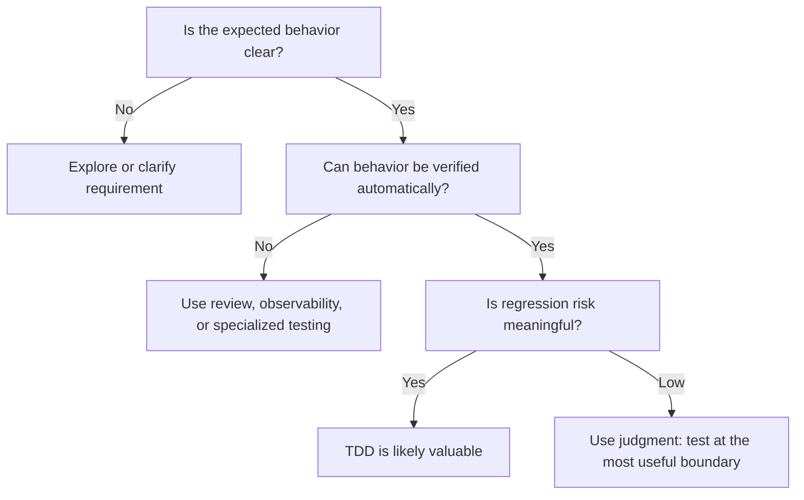
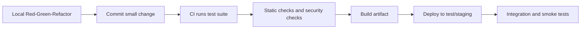
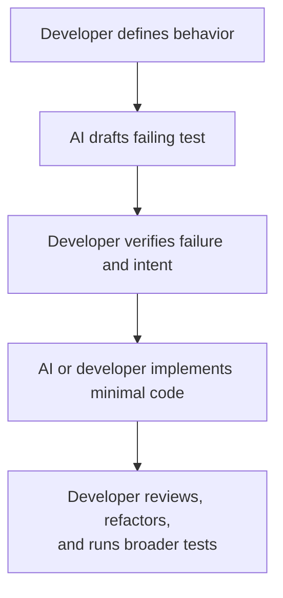
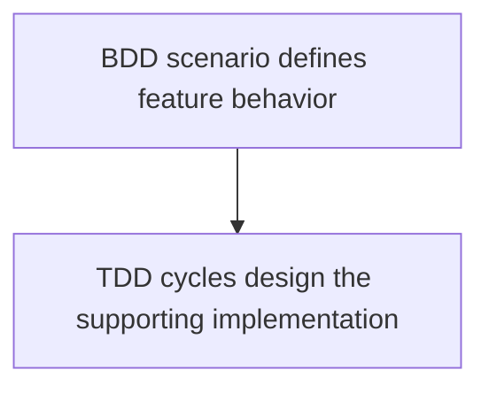
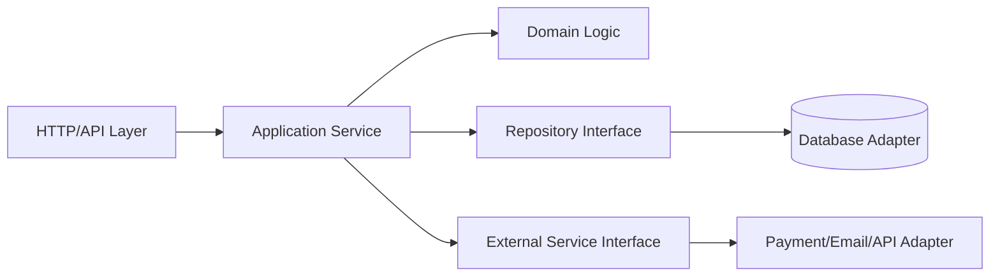

# Test-Driven Development (TDD): Concept and When It Is Useful

> Practical understanding, day-to-day usage, design impact, and interview-relevant concepts

## In short

- TDD is **Red → Green → Refactor**, repeated one small behaviour at a time — not "write unit tests before code".
- **Red:** the test must fail, and fail for the intended reason. A failure caused by a typo, a bad import, or a broken fixture proves nothing.
- **Green:** write the minimum code that satisfies the test. Minimum means no speculative features or abstractions, not deliberately bad code.
- **Refactor** is inside the cycle, not an optional fourth step. Skipping it produces code that passes and steadily rots.
- The third product of TDD is **design feedback**: a test that is hard to write usually signals hidden dependencies, too many responsibilities, or global state.
- Most valuable for business rules, bug fixes, parsers, algorithms, API contracts, and long-lived shared code; least valuable for spikes, visual UI work, and unclear requirements.
- TDD strengthens the developer feedback loop — it does not replace integration tests, code review, security testing, or monitoring.



**Interview answer:** TDD means writing one failing test for the next small piece of behaviour, watching it fail for the reason you expect, writing the least code that makes it pass, then refactoring while the suite stays green — and repeating. The test is doing three jobs at once: it specifies the behaviour, it verifies it, and the difficulty of writing it gives feedback on the design. I use it where behaviour can be stated as concrete examples — pricing rules, validation, parsers, and reproducible bug fixes — and I relax it during exploratory spikes or when the requirement itself is still unclear.

**Gotcha:** Never actually observing the red. A test written after the code, or accepted because it was green on first run, has never demonstrated that it can detect the behaviour being absent — so it may be asserting nothing at all. Watching the failure is the step that proves the test works.

---

# 1. What Is TDD?

**Test-Driven Development (TDD)** is a software-development technique in which a developer:

1. Writes a test for a small piece of expected behavior.
2. Confirms that the test fails for the expected reason.
3. Writes the minimum production code needed to make it pass.
4. Improves the design while keeping all tests passing.
5. Repeats the cycle for the next behavior.

The process is commonly called **Red–Green–Refactor**.



TDD is not simply “writing unit tests before code.” It combines three activities:

- **Specification:** The test describes the expected behavior.
- **Verification:** The test detects whether the behavior is implemented correctly.
- **Design feedback:** Difficulty writing a test often reveals excessive coupling or unclear responsibilities.

## 1.1 A Small Mental Model

Suppose the requirement is:

> Orders of ₹1,000 or more receive free delivery. Other orders pay ₹50.

Before implementing the calculation, a TDD developer writes an executable example:

```python
def test_order_below_threshold_has_delivery_fee():
    assert calculate_total(800) == 850
```

This test acts as a precise statement of the expected behavior. The production code is then written in response to that statement.

---

# 2. The Core TDD Cycle

The cycle diagram is in **In short** at the top of this note. Each full pass through it covers exactly one small behaviour.

## 2.1 Red: Write a Failing Test

Write one test that describes the next smallest useful behavior.

The test should fail because the behavior does not exist yet—not because of a syntax error, incorrect import, broken fixture, or test-environment issue.

Why the failure matters:

- It confirms that the test is actually capable of detecting the missing behavior.
- It prevents false confidence from a test that passes without exercising the intended code.
- It creates a clear development target.

## 2.2 Green: Make the Test Pass

Write the simplest reasonable code that satisfies the test.

At this stage:

- Do not implement imagined future requirements.
- Do not build a large abstraction before it is needed.
- Do not optimize prematurely.
- Keep the feedback loop short.

“Minimum code” does not mean intentionally poor code. It means avoiding unnecessary functionality and design complexity.

## 2.3 Refactor: Improve the Design

Once the test suite is green, improve the internal structure without changing observable behavior.

Typical refactoring activities include:

- Removing duplication.
- Renaming unclear variables or methods.
- Extracting cohesive functions or classes.
- Simplifying conditionals.
- Improving dependency boundaries.
- Cleaning up test setup and test names.

Refactoring belongs inside the TDD cycle. Without it, TDD can produce code that works but becomes progressively harder to maintain.

## 2.4 Repeat in Small Steps

A productive TDD cycle is normally small:

```text
One behavior → One failing test → Small implementation → Small refactor
```

Small steps make failures easier to understand. When a test fails, the developer has changed only a limited amount of code, so the cause is usually obvious.

---

# 3. What TDD Is Really Trying to Achieve

## 3.1 Executable Requirements

A well-named test records what the system should do.

```python
def test_premium_customer_receives_ten_percent_discount():
    ...
```

This is more precise than a vague comment such as: `# Apply discount when appropriate`

Tests become living examples of business behavior and are automatically checked whenever the suite runs.

## 3.2 Fast Feedback

TDD encourages developers to validate each small decision immediately.



Fast feedback reduces the amount of unfinished reasoning a developer must keep in their head.

## 3.3 Better Design Through Testability

Code that is easy to test often has useful design properties:

- Small, focused components.
- Explicit inputs and outputs.
- Limited hidden state.
- Dependencies passed from outside.
- Business logic separated from infrastructure.
- Fewer global variables and hard-coded integrations.

Consider this tightly coupled function:

```python
def register_user(email: str) -> None:
    database = ProductionDatabase()
    mailer = SmtpMailer()

    database.insert_user(email)
    mailer.send_welcome_email(email)
```

Testing it requires real infrastructure or complicated patching. A testable design makes dependencies explicit:

```python
def register_user(email: str, user_repository, mailer) -> None:
    user_repository.insert(email)
    mailer.send_welcome_email(email)
```

The second design is easier to test and also easier to configure, replace, and maintain.

## 3.4 Safer Refactoring

A good automated test suite provides rapid regression feedback while developers improve internal design.

However, tests do not make refactoring automatically safe. Confidence depends on whether the tests cover important behaviors and assert meaningful outcomes.

## 3.5 Controlled Scope

Writing only enough code to satisfy the current test helps prevent speculative features.

This supports the principle:

> Implement the behavior currently required, while keeping the design ready to evolve when a real requirement appears.

---

# 4. Practical TDD Example with Python and pytest

## 4.1 Requirement

Create a checkout calculation with these rules:

- Orders below ₹1,000 pay a ₹50 delivery fee.
- Orders of ₹1,000 or more receive free delivery.
- A negative subtotal is invalid.

We will build the behavior incrementally rather than implementing all rules at once.

## 4.2 Suggested Project Structure

```text
project/
├── checkout.py
└── tests/
    └── test_checkout.py
```

Install and run pytest:

```bash
python -m pip install pytest
pytest -q
```

---

## 4.3 Cycle 1: Delivery Fee Below the Threshold

### Red — Write the Test First

```python
# tests/test_checkout.py

from checkout import calculate_total

def test_order_below_free_delivery_threshold_adds_delivery_fee():
    result = calculate_total(subtotal=800)

    assert result == 850
```

Running the test should fail because `calculate_total` does not exist yet.

```text
RED: test fails
```

### Green — Write the Minimum Implementation

```python
# checkout.py

def calculate_total(subtotal: int) -> int:
    return subtotal + 50
```

The test now passes.

```text
GREEN: 800 + 50 = 850
```

At this point, always adding ₹50 is acceptable because it satisfies the only behavior currently specified by a test.

---

## 4.4 Cycle 2: Free Delivery at ₹1,000

### Red — Add the Next Behavior

```python
def test_order_at_free_delivery_threshold_has_no_delivery_fee():
    result = calculate_total(subtotal=1000)

    assert result == 1000
```

The existing implementation returns `1050`, so the new test fails for the expected reason.

### Green — Add the Smallest Required Branch

```python
def calculate_total(subtotal: int) -> int:
    if subtotal >= 1000:
        return subtotal

    return subtotal + 50
```

Both tests now pass.

---

## 4.5 Cycle 3: Reject Negative Values

### Red — Describe Invalid Input

```python
import pytest

def test_negative_subtotal_is_rejected():
    with pytest.raises(ValueError, match="subtotal cannot be negative"):
        calculate_total(subtotal=-1)
```

### Green — Implement Validation

```python
def calculate_total(subtotal: int) -> int:
    if subtotal < 0:
        raise ValueError("subtotal cannot be negative")

    if subtotal >= 1000:
        return subtotal

    return subtotal + 50
```

---

## 4.6 Refactor — Improve Clarity Without Changing Behavior

```python
# checkout.py

FREE_DELIVERY_THRESHOLD = 1000
STANDARD_DELIVERY_FEE = 50

def calculate_total(subtotal: int) -> int:
    """Return the payable order total after applying delivery rules."""
    if subtotal < 0:
        raise ValueError("subtotal cannot be negative")

    delivery_fee = (
        0
        if subtotal >= FREE_DELIVERY_THRESHOLD
        else STANDARD_DELIVERY_FEE
    )

    return subtotal + delivery_fee
```

Complete test file:

```python
# tests/test_checkout.py

import pytest

from checkout import calculate_total

def test_order_below_free_delivery_threshold_adds_delivery_fee():
    assert calculate_total(subtotal=800) == 850

def test_order_at_free_delivery_threshold_has_no_delivery_fee():
    assert calculate_total(subtotal=1000) == 1000

def test_order_above_free_delivery_threshold_has_no_delivery_fee():
    assert calculate_total(subtotal=1500) == 1500

def test_negative_subtotal_is_rejected():
    with pytest.raises(ValueError, match="subtotal cannot be negative"):
        calculate_total(subtotal=-1)
```

## 4.7 What This Example Demonstrates

```text
Test 1 forced the existence of the calculation.
Test 2 forced the free-delivery condition.
Test 3 forced input validation.
Refactoring improved readability without adding behavior.
```

The tests drove both the implementation and the shape of the API: `calculate_total(subtotal: int) -> int`

The function has an explicit input, a deterministic result, and no dependency on a database or external service.

---

# 5. When TDD Is Most Useful

TDD is not equally valuable for every task. It works especially well when the expected behavior can be expressed through clear, repeatable examples.

## 5.1 Business Rules and Calculation Logic

Examples:

- Pricing and discounts.
- Tax calculations.
- Insurance premiums.
- Commission distribution.
- Eligibility rules.
- Billing-period calculations.
- Workflow state transitions.
- Validation rules.

These areas usually contain many edge cases, and incorrect results can have direct business impact.

**Example: Commission calculation**



Each rule can be expressed as a small test before implementation.

## 5.2 Bug Fixes

TDD is highly practical for reproducible bugs.

Recommended flow:



The failing test proves that the bug exists. After the fix, the same test protects against the bug returning later.

## 5.3 APIs with Clear Contracts

TDD works well when inputs, outputs, errors, and side effects are understood.

Examples:

- A service method returns an order summary.
- An endpoint rejects an invalid status transition.
- A repository returns records in a defined order.
- A serializer validates required fields.
- A webhook handler ignores duplicate events.

For an HTTP API, tests can drive behavior such as:

```text
Given: An unauthenticated request
When:  POST /payments
Then:  Return 401 and create no payment
```

## 5.4 Data Transformations and Parsers

Examples:

- CSV import validation.
- JSON normalization.
- Date conversion.
- Report aggregation.
- Resume-field extraction rules.
- Mapping external values to internal enums.

Input/output examples make the expected transformation precise.

## 5.5 Algorithms and Edge-Case-Heavy Code

TDD is useful for:

- Search and filtering logic.
- Sorting rules.
- Pagination calculations.
- Retry and backoff policies.
- Rate-limiting logic.
- Cache-expiration decisions.
- Scheduling calculations.

Tests can cover boundary values before the implementation becomes complex.

## 5.6 Refactoring Existing Code

For legacy code, developers often need characterization tests before changing the implementation.

A characterization test records what the system currently does—even when the existing behavior is unusual.

```text
Existing behavior → Characterization tests → Refactor safely → Intentional behavior changes
```

This is not always strict test-first TDD, but it uses the same rapid-feedback principle.

## 5.7 Shared or Long-Lived Codebases

TDD provides more value when:

- Several developers modify the same modules.
- The product will be maintained for years.
- Requirements change frequently.
- Releases are frequent.
- Regression risk is high.
- The cost of a production defect is significant.

In these environments, tests become a shared safety net and a source of behavioral documentation.

## 5.8 Building Reusable Libraries

Libraries usually have explicit public contracts and many callers. TDD helps define:

- Accepted inputs.
- Returned values.
- Raised exceptions.
- Boundary behavior.
- Backward compatibility.

---

# 6. When Strict TDD May Be Less Useful

TDD is a technique, not a rule that must be applied identically to every line of code.

## 6.1 Exploratory Prototypes

During early experimentation, the team may not yet understand:

- What the feature should do.
- Whether the technical approach is viable.
- Which API shape is appropriate.
- Which parts of the prototype will survive.

A useful approach is:

```text
Explore quickly → Learn → Discard or stabilize → Add tests around retained behavior
```

A temporary spike should remain clearly separated from production-ready code.

## 6.2 Rapidly Changing User Interfaces

Strict unit-level TDD can be awkward for visual details such as:

- Spacing.
- Colors.
- Animation timing.
- Early-stage layout exploration.
- Subjective look and feel.

Use other feedback tools where appropriate:

- Component tests.
- Visual regression tests.
- Storybook examples.
- Accessibility tests.
- Browser tests for critical flows.
- Manual design review.

Business logic inside the UI can still be developed with TDD.

## 6.3 Third-Party Integration Discovery

When learning an unfamiliar SDK or external API, the developer may first need a small experiment to understand real behavior.

After the integration contract is understood:

- Isolate the external system behind an adapter.
- Test application behavior using a fake or stub.
- Add a smaller number of integration or contract tests against the real dependency.

## 6.4 Infrastructure and Configuration Changes

Declarative configuration, cloud resources, and deployment pipelines may be better verified with:

- Static validation.
- Policy checks.
- Infrastructure tests.
- Deployment smoke tests.
- Security scanning.
- Integration tests in a temporary environment.

The TDD mindset still applies, but the test tools and feedback loop differ from normal unit tests.

## 6.5 Extremely Simple Glue Code

A trivial mapping or framework declaration may not justify a dedicated test when:

- The framework already tests the behavior.
- There is no meaningful custom logic.
- A higher-level test already covers the contract.

Avoid testing implementation statements merely to increase a coverage number.

## 6.6 Unclear or Unstable Requirements

A test cannot replace requirement discovery. When the expected behavior is unclear, first clarify the rule with product owners, domain experts, or examples.

```text
Unclear requirement + precise test = precisely encoded misunderstanding
```

## 6.7 Decision Guide



---

# 7. Choosing the Right Test Boundary

TDD is often associated with unit tests, but behavior can be driven from any level. The short recap:

- **Unit-level** drives a function, class, or domain service — the fastest loop and the usual home for calculations, validation, and state transitions.
- **Component or service-level** drives a use case through its public interface with the internals real and only the far boundary faked; these cycles survive refactoring best.
- **Integration-level** drives a real boundary — database, broker, cache, filesystem — and is slower, so it stays focused.

The levels themselves, what each proves, and how to size the mix belong to [Unit vs Integration vs E2E](unit-integration-e2e.md). What matters for TDD is that the boundary you drive from is the boundary your tests become coupled to. Drive from too deep inside the component and the mocking required will couple the cycle to implementation details, which is exactly what the next point is about.

## 7.1 Prefer Observable Behavior over Internal Calls

Fragile test:

```python
def test_discount_service_calls_private_helper(mocker):
    helper = mocker.patch.object(service, "_calculate_percentage")

    service.apply_discount(order)

    helper.assert_called_once()
```

Behavior-focused test:

```python
def test_premium_customer_receives_ten_percent_discount():
    total = service.calculate_total(
        subtotal=1000,
        customer_type="premium",
    )

    assert total == 900
```

The second test allows internal refactoring as long as the public behavior remains correct.

---

# 8. Characteristics of Effective TDD Tests

## 8.1 Clear Structure: Arrange, Act, Assert

pytest describes a test using four possible phases: **Arrange, Act, Assert, and Cleanup**.

```python
def test_account_with_sufficient_balance_can_withdraw():
    # Arrange
    account = Account(balance=1000)

    # Act
    account.withdraw(300)

    # Assert
    assert account.balance == 700
```

The important point is not the comments. The test should make the setup, action, and expected outcome easy to recognize.

## 8.2 One Coherent Behavior per Test

A test can contain multiple assertions when they verify one result.

```python
def test_created_invoice_contains_expected_summary():
    invoice = create_invoice(subtotal=1000, tax_rate=0.18)

    assert invoice.subtotal == 1000
    assert invoice.tax == 180
    assert invoice.total == 1180
```

Avoid combining unrelated scenarios in one test because a failure becomes harder to diagnose.

## 8.3 Fast Feedback

The tests used in the inner TDD loop should usually run in seconds or less.

```text
Developer loop: fast unit/component tests
Commit/CI loop: broader integration tests
Release loop: end-to-end and environment validation
```

A slow suite discourages frequent execution and weakens the TDD workflow.

## 8.4 Deterministic, Independent, and Clearly Named

These three properties are what make a cycle repeatable, and they are the same properties that make any test good:

- **Deterministic:** the same code produces the same result, so current time, random values, network responses, external API state, environment configuration, and shared database records must be injected or controlled rather than read from the ambient environment.
- **Independent:** each test creates and cleans up the state it needs, so it can run alone, in any order, and in parallel. `Test A creates user → Test B expects that user` is the shape to avoid.
- **Clearly named:** the name states behavior and context — `test_duplicate_payment_reference_is_rejected` rather than `test_payment_2` — so a red run in CI is readable without opening the file.

Worked examples of all three, and the assertion patterns that go with them, are in [Coverage & Good Tests](test-coverage-good-tests.md).

## 8.5 Minimal Necessary Mocking

Mock external or expensive boundaries when appropriate:

- Payment gateway.
- Email provider.
- Cloud storage.
- Current time.
- Message publisher.

Do not mock every internal collaborator. Excessive mocking makes tests verify the current implementation structure instead of useful behavior.

## 8.6 Tests Are Production Assets

Test code should be maintained with the same care as production code:

- Remove duplication thoughtfully.
- Use clear helper functions and fixtures.
- Keep abstractions understandable.
- Delete obsolete tests.
- Refactor tests when the domain language changes.

---

# 9. TDD in Real Development Workflows

## 9.1 TDD and CI/CD

TDD is a local development practice. CI validates the combined work of the team.



TDD does not replace:

- Code review.
- Integration testing.
- Security testing.
- Performance testing.
- Observability.
- Production monitoring.

It strengthens the developer feedback loop within a broader quality strategy.

## 9.2 TDD for a User Story

Consider the story:

> As an account owner, I want duplicate payment requests to be ignored so that I am not charged twice.

Possible development sequence:

```text
1. Reject a second request with the same idempotency key.
2. Return the original response for the duplicate request.
3. Allow a new request with a different key.
4. Handle concurrent requests safely.
5. Persist the key and result atomically.
```

Each item can become one or more small TDD cycles. Unit tests may drive application logic, while integration tests verify the database constraint and transaction behavior.

## 9.3 TDD and Code Review

Small TDD-driven commits can make review easier because each change has:

- A clearly described behavior.
- A test demonstrating the requirement.
- A focused implementation.
- Limited unrelated changes.

Reviewers should evaluate both production and test code. A passing test does not prove that the asserted behavior is the correct requirement.

## 9.4 TDD with AI Coding Tools

AI tools can help draft tests and implementation code, but the developer remains responsible for:

- Defining the correct behavior.
- Confirming the test initially fails.
- Checking that assertions are meaningful.
- Detecting overfitted implementations.
- Reviewing security and edge cases.
- Preventing generated mocks from hiding integration problems.

A safe AI-assisted TDD loop is:



Never accept a newly generated test merely because it is green. A test that never failed may be testing the wrong behavior or no meaningful behavior at all.

---

# 10. TDD Compared with Related Approaches

## 10.1 TDD vs Test-After Development

| Aspect | TDD | Test-After |
|---|---|---|
| Test timing | Before production behavior | After implementation |
| Primary role | Specification, feedback, and verification | Verification and regression coverage |
| Design influence | High | Usually lower |
| Failure confirmation | Test is intentionally observed failing first | May never be observed failing |
| Typical risk | Over-isolated design or excessive mocking | Tests shaped around existing implementation |

Both approaches can produce valuable tests. TDD adds a disciplined feedback and design process.

## 10.2 TDD vs BDD

**Behavior-Driven Development (BDD)** emphasizes behavior in domain language and collaboration among developers, testers, and business stakeholders.

Example BDD-style scenario:

```gherkin
Scenario: Free delivery at the threshold
  Given an order subtotal of ₹1,000
  When the checkout total is calculated
  Then the delivery fee should be ₹0
```

TDD and BDD can work together:



## 10.3 TDD vs Acceptance Test-Driven Development

**Acceptance Test-Driven Development (ATDD)** starts from acceptance criteria that describe a feature from the user or business perspective.

- ATDD commonly works at a feature or system boundary.
- TDD commonly works at unit or component boundaries.
- Both are test-first approaches but operate at different levels.

## 10.4 TDD vs “Write Tests for Everything”

TDD does not require every method, branch, or framework declaration to have a dedicated test.

The goal is confidence in valuable behavior, not maximum test count: useful coverage means important behavior protected by meaningful tests, which is not the same thing as every line being executed by some test. How to read a coverage percentage, and what it can and cannot prove, belongs to [Coverage & Good Tests](test-coverage-good-tests.md).

---

# 11. Practical Adoption Strategy

A team does not need to convert every task to strict TDD immediately.

## 11.1 Start with High-Value Areas

Choose code with clear behavior and meaningful regression risk:

- Bug fixes.
- Business calculations.
- Validation.
- Parsers.
- State transitions.
- Service-layer rules.

## 11.2 Keep the First Cycles Very Small

Instead of implementing an entire feature, choose one example:

```text
Too large:
“Implement the complete subscription system.”

Small enough:
“A cancelled subscription cannot be renewed without reactivation.”
```

## 11.3 Run a Focused Test Continuously

During development: `pytest tests/test_checkout.py -q`

Before committing: `pytest -q`

The exact command depends on the project, but the idea is to keep the local loop fast and run the broader suite before integration.

## 11.4 Separate Business Logic from Infrastructure

A practical architecture is:



TDD is easiest around the application and domain layers. Focused integration tests then verify the adapters.

## 11.5 Review the Feedback from Difficult Tests

When a test is hard to write, ask:

- Is the behavior unclear?
- Does the component have too many responsibilities?
- Is an external dependency hidden inside the code?
- Is global state involved?
- Is the public API too complicated?
- Am I testing an internal implementation detail?

The answer may indicate a design improvement—or it may indicate that a different test boundary is more appropriate.

## 11.6 Use TDD Selectively but Consistently

A mature approach is not “TDD everywhere” or “TDD nowhere.” It is:

> Use TDD where executable examples and rapid feedback materially improve correctness, design, and maintainability.

---

# 12. References

The following sources were reviewed for the concepts and current guidance in this document:

1. Martin Fowler — **Test-Driven Development**  
   https://martinfowler.com/bliki/TestDrivenDevelopment.html

2. Google Testing Blog — **The Way of TDD** (2026)  
   https://testing.googleblog.com/2026/03/the-way-of-tdd.html

3. pytest Documentation — **Anatomy of a Test**  
   https://docs.pytest.org/en/stable/explanation/anatomy.html

4. Agile Alliance — **Test-Driven Development (TDD)**  
   https://agilealliance.org/glossary/tdd/

5. UK Government Digital Service — **Test-Driven Development**  
   https://gds-way.digital.cabinet-office.gov.uk/standards/test-driven-development.html

6. Santos et al. — **A Family of Experiments on Test-Driven Development**  
   https://arxiv.org/abs/2011.11942

---

**End of document**
