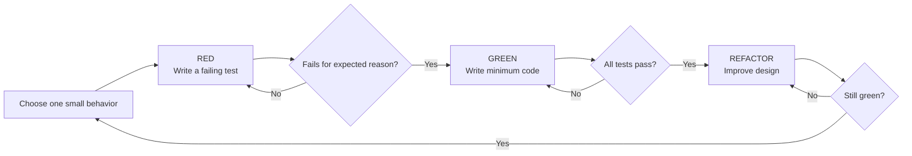
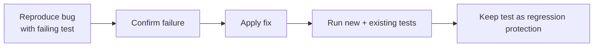
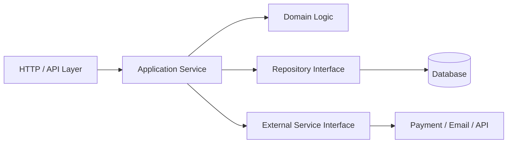
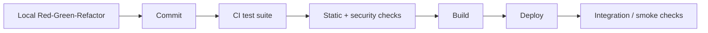

# Test-Driven Development (TDD)

> A practical guide to Red–Green–Refactor, test design, and where TDD fits in real development.

## In short

**Test-Driven Development (TDD)** is a development technique where you write a small test before implementing the related production behavior.

The core loop is:

1. **Red** — write one test and confirm it fails for the expected reason.
2. **Green** — write the minimum reasonable production code that makes it pass.
3. **Refactor** — improve the design while keeping the tests green.
4. Repeat for the next behavior.

TDD is most useful when behavior can be described clearly: business rules, validation, bug fixes, parsers, APIs, algorithms, and long-lived domain logic.

TDD is not simply “writing tests first.” The test also helps define the public behavior and gives feedback about the design of the code.



---

# Index

1. [What TDD Means](#1-what-tdd-means)
2. [Red–Green–Refactor](#2-redgreenrefactor)
3. [Practical Python Example](#3-practical-python-example)
4. [Why TDD Is Useful](#4-why-tdd-is-useful)
5. [When to Use TDD](#5-when-to-use-tdd)
6. [Choosing the Right Test Boundary](#6-choosing-the-right-test-boundary)
7. [TDD in Real Development](#7-tdd-in-real-development)
8. [TDD vs Related Approaches](#8-tdd-vs-related-approaches)
9. [Key Takeaways](#9-key-takeaways)
10. [References](#10-references)

---

# 1. What TDD Means

TDD combines **testing, implementation, and design** in one short feedback loop.

Instead of writing a complete feature and then adding tests, you work one behavior at a time:

```text
Expected behavior
      ↓
Failing test
      ↓
Small implementation
      ↓
Refactor
      ↓
Next behavior
```

A useful TDD test performs three jobs:

- **Specification** — describes what the code should do.
- **Verification** — checks whether the behavior works.
- **Design feedback** — reveals when code is difficult to use or too tightly coupled.

For example, if testing a pricing function requires a real database, network request, environment variable, and global object, the design may contain more dependencies than the business rule actually needs.

## 1.1 TDD Is Behavior-Focused

A good test describes an observable result rather than an internal implementation detail.

Prefer:

```python
def test_premium_customer_receives_ten_percent_discount():
    assert calculate_total(1000, customer_type="premium") == 900
```

Instead of testing whether a private helper was called.

This keeps tests useful even when the internal implementation is refactored.

---

# 2. Red–Green–Refactor

## 2.1 Red — Write a Failing Test

Write the smallest test that describes the next useful behavior.

The important part is to **run it and observe the failure**.

The failure should happen because the behavior is missing, not because of:

- a syntax error,
- an incorrect import,
- a broken fixture,
- or a misconfigured test environment.

If you never see the test fail, you have not proved that the test can detect the missing behavior.

## 2.2 Green — Make the Test Pass

Write enough production code to satisfy the test.

“Minimum code” means:

- no speculative future features,
- no unnecessary abstraction,
- no premature optimization.

It does **not** mean intentionally poor code.

The goal is to keep the feedback loop small and focused.

## 2.3 Refactor — Improve the Design

Once the suite is green, improve the code without changing its observable behavior.

Typical refactoring includes:

- removing duplication,
- improving names,
- simplifying conditions,
- extracting cohesive functions,
- improving dependency boundaries,
- cleaning test setup.

Refactoring is part of TDD, not an optional activity after TDD.

---

# 3. Practical Python Example

Suppose a checkout service has these rules:

- Orders below **₹1,000** pay a **₹50 delivery fee**.
- Orders of **₹1,000 or more** receive free delivery.
- A negative subtotal is invalid.

We will build the behavior incrementally with `pytest`.

## 3.1 Project Structure

```text
project/
├── checkout.py
└── tests/
    └── test_checkout.py
```

Run tests with:

```bash
pytest -q
```

## 3.2 Cycle 1 — Add the Delivery Fee

### Red

```python
# tests/test_checkout.py

from checkout import calculate_total


def test_order_below_threshold_adds_delivery_fee():
    assert calculate_total(800) == 850
```

The test initially fails because `calculate_total` does not exist.

### Green

```python
# checkout.py

def calculate_total(subtotal: int) -> int:
    return subtotal + 50
```

This is enough for the currently specified behavior.

## 3.3 Cycle 2 — Free Delivery at the Threshold

### Red

```python
def test_order_at_threshold_has_free_delivery():
    assert calculate_total(1000) == 1000
```

The existing implementation returns `1050`, so the new test fails for the correct reason.

### Green

```python
def calculate_total(subtotal: int) -> int:
    if subtotal >= 1000:
        return subtotal

    return subtotal + 50
```

## 3.4 Cycle 3 — Reject Invalid Input

### Red

```python
import pytest


def test_negative_subtotal_is_rejected():
    with pytest.raises(ValueError, match="subtotal cannot be negative"):
        calculate_total(-1)
```

### Green

```python
def calculate_total(subtotal: int) -> int:
    if subtotal < 0:
        raise ValueError("subtotal cannot be negative")

    if subtotal >= 1000:
        return subtotal

    return subtotal + 50
```

## 3.5 Refactor

Now the behavior is protected by tests, so the implementation can be cleaned up safely.

```python
FREE_DELIVERY_THRESHOLD = 1000
STANDARD_DELIVERY_FEE = 50


def calculate_total(subtotal: int) -> int:
    if subtotal < 0:
        raise ValueError("subtotal cannot be negative")

    delivery_fee = (
        0
        if subtotal >= FREE_DELIVERY_THRESHOLD
        else STANDARD_DELIVERY_FEE
    )

    return subtotal + delivery_fee
```

The important idea is not the final implementation. It is how each new behavior caused a small test and a small production change.

---

# 4. Why TDD Is Useful

## 4.1 Fast Feedback

TDD keeps the amount of new code between test runs small.

```text
Large change:
Many changes → Run tests → Many possible failure causes

TDD:
One behavior → Small change → Run tests → Immediate feedback
```

This usually makes failures easier to diagnose.

## 4.2 Executable Behavior

A test records an example of expected behavior in code.

```python
def test_order_at_threshold_has_free_delivery():
    ...
```

That is more precise than a vague comment such as:

```python
# Give free delivery when appropriate.
```

Tests can become useful documentation because they are continuously checked by the test runner.

## 4.3 Design Feedback

TDD often encourages:

- explicit inputs and outputs,
- small components,
- fewer hidden dependencies,
- separation of business logic from infrastructure,
- replaceable external dependencies.

Consider:

```python
def register_user(email: str):
    database = ProductionDatabase()
    mailer = SmtpMailer()

    database.insert_user(email)
    mailer.send_welcome_email(email)
```

This function creates infrastructure internally, so isolated testing is difficult.

A more testable design makes dependencies explicit:

```python
def register_user(email: str, user_repository, mailer):
    user_repository.insert(email)
    mailer.send_welcome_email(email)
```

The second version is easier to test and easier to configure in different environments.

## 4.4 Safer Refactoring

A meaningful automated test suite gives quick regression feedback while internal code is reorganized.

Tests do not make every refactor automatically safe; confidence still depends on whether important behavior is actually covered.

---

# 5. When to Use TDD

TDD provides the most value when expected behavior is clear and regression risk matters.

## 5.1 Strong Use Cases

Common examples include:

- pricing and discount rules,
- tax or commission calculations,
- validation,
- workflow state transitions,
- payment/idempotency rules,
- parsers and data transformations,
- retry/backoff logic,
- API/service contracts,
- reproducible bug fixes,
- reusable libraries.

### Bug Fix Workflow

A particularly useful pattern is:



The failing test proves the defect can be reproduced. After the fix, the same test protects against the bug returning.

## 5.2 Situations Where Strict TDD Is Less Useful

Strict TDD may provide less value during:

- exploratory spikes,
- early UI/visual experimentation,
- unfamiliar third-party API discovery,
- rapidly changing requirements,
- simple framework configuration with no meaningful custom behavior.

A practical approach is:

```text
Explore → Learn → Stabilize the behavior → Add automated tests
```

TDD is a technique for improving feedback, not a rule that every line of code must be created test-first.

---

# 6. Choosing the Right Test Boundary

TDD is often associated with unit tests, but the test can drive behavior at different boundaries.

| Boundary | Best For | Feedback Speed |
|---|---|---|
| **Unit / Domain** | Calculations, validation, state transitions | Fastest |
| **Component / Service** | Use cases through a public interface | Fast |
| **Integration** | Database, cache, broker, filesystem, external adapter | Slower |

For day-to-day backend development, a useful pattern is:



Use fast TDD cycles mainly around domain and application behavior. Use focused integration tests to verify real infrastructure boundaries.

## 6.1 Characteristics of Effective Tests

### Arrange, Act, Assert

`pytest` describes tests using **Arrange, Act, Assert, and Cleanup**.

```python
def test_account_with_sufficient_balance_can_withdraw():
    # Arrange
    account = Account(balance=1000)

    # Act
    account.withdraw(300)

    # Assert
    assert account.balance == 700
```

### Keep Tests Deterministic

Control things such as:

- current time,
- random values,
- external API responses,
- shared database state,
- environment-dependent behavior.

The same test should produce the same result when the code has not changed.

### Keep Tests Independent

A test should create the state it needs and should not depend on another test running first.

Avoid:

```text
Test A creates user
        ↓
Test B assumes that user already exists
```

### Mock Boundaries, Not Everything

Mocks are useful for external or expensive boundaries such as:

- payment providers,
- email services,
- cloud storage,
- time,
- message publishers.

Avoid mocking every internal method. Excessive mocking makes tests depend on implementation structure rather than behavior.

---

# 7. TDD in Real Development

## 7.1 TDD and CI/CD

TDD is mainly an **inner development loop**. CI/CD provides broader project-level validation.



TDD does not replace:

- code review,
- integration testing,
- security testing,
- performance testing,
- observability,
- production monitoring.

It strengthens the developer feedback loop inside that larger quality strategy.

## 7.2 TDD with AI Coding Tools

AI coding tools can help generate tests and implementations, but the developer still needs to control the behavior being specified.

A practical AI-assisted loop is:

```text
Developer defines behavior
        ↓
AI drafts a test
        ↓
Developer runs it and confirms the expected failure
        ↓
AI or developer writes the implementation
        ↓
Developer reviews, refactors, and runs broader tests
```

The important rule remains the same: **do not trust a new test only because it is green**. Confirm that it can fail when the expected behavior is absent or incorrect.

---

# 8. TDD vs Related Approaches

## 8.1 TDD vs Test-After

| Aspect | TDD | Test-After |
|---|---|---|
| Test timing | Before the related production behavior | After implementation |
| Main role | Specification, feedback, verification | Verification and regression protection |
| Design influence | Usually higher | Usually lower |
| Test failure observed first | Yes | Not necessarily |

Both approaches can produce good automated tests. TDD adds a disciplined design and feedback cycle.

## 8.2 TDD vs BDD

**Behavior-Driven Development (BDD)** emphasizes behavior in domain language and collaboration around examples.

Example:

```gherkin
Scenario: Free delivery at the threshold
  Given an order subtotal of ₹1,000
  When the checkout total is calculated
  Then the delivery fee should be ₹0
```

A BDD scenario can describe feature behavior, while smaller TDD cycles implement the code supporting that behavior.

## 8.3 TDD vs ATDD

**Acceptance Test-Driven Development (ATDD)** starts from feature-level acceptance criteria, usually from the user or business perspective.

A simple mental model:

```text
ATDD / BDD → What should the feature do?
TDD        → How do we incrementally build the supporting code?
```

The approaches can complement each other.

---

# 9. Key Takeaways

- TDD is **Red → Green → Refactor**, repeated in small steps.
- Always confirm the new test fails for the expected reason.
- Write enough production code to satisfy the current behavior, not imagined future requirements.
- Refactor while the suite is green.
- Prefer tests that verify **observable behavior** rather than private implementation details.
- TDD is especially effective for business logic, validation, parsers, bug fixes, APIs, and reusable code.
- Use fast unit/component tests for the inner loop and focused integration tests for infrastructure boundaries.
- TDD improves feedback and design confidence, but it remains one part of a broader testing and quality strategy.

---

# 10. References

Current guidance reviewed for this note:

1. Google Testing Blog — **The Way of TDD** (March 10, 2026)  
   https://testing.googleblog.com/2026/03/the-way-of-tdd.html

2. pytest Documentation — **Anatomy of a test**  
   https://docs.pytest.org/en/stable/explanation/anatomy.html

3. Martin Fowler — **Test-Driven Development**  
   https://martinfowler.com/bliki/TestDrivenDevelopment.html

4. Agile Alliance — **Test-Driven Development (TDD)**  
   https://agilealliance.org/glossary/tdd/

5. UK Government Digital Service — **Test-driven development (TDD)**  
   https://gds-way.digital.cabinet-office.gov.uk/standards/test-driven-development.html

---

**End of document**
