# Test Coverage & What Makes a Good Test

> What a coverage percentage does and does not tell you, and what separates a test that catches real regressions from one that only inflates the number.
>
> **Examples:** Python, `pytest`, `pytest-cov`, and `coverage.py`

## In short

- Coverage measures **execution, not correctness**. A test with no assertion at all still reports 100% line coverage for the code it runs.
- **Branch coverage** is the more useful number: a compact function can show 100% line coverage while half its decision outcomes were never taken.
- Code coverage is only one kind of coverage. Requirements, risk, data, platform, and integration coverage are separate questions a percentage cannot answer.
- A good test verifies **observable behaviour** through a public interface, asserts exact outcomes, is deterministic and independent, and covers one rule — so it fails for exactly one reason.
- Thresholds are guardrails, not goals. Prefer **diff coverage** on changed lines plus risk-based targeting over forcing every module to the same global percentage.
- **Mutation testing** answers the stronger question: would the suite notice if `>=` became `>`? A surviving mutant is a weak assertion the coverage report cannot see.
- The mental model: coverage shows where tests went, assertions show what they proved, mutation testing shows what they can detect, risk analysis shows what must be protected.

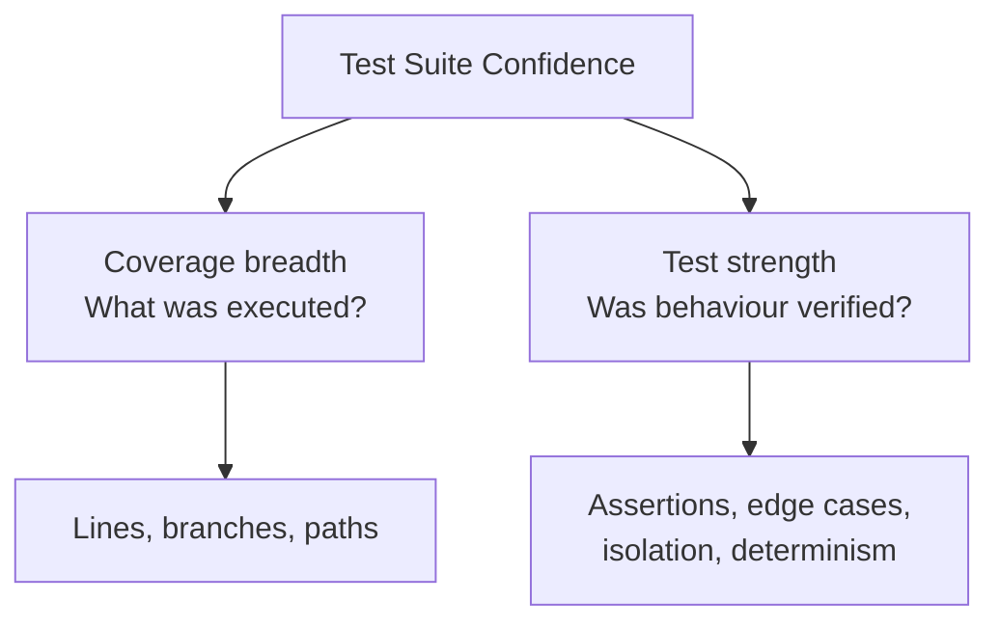

**Interview answer:** Coverage tells me which lines and branches the suite executed, which is useful for finding code no test reaches at all — but it says nothing about whether the result was checked, so a test with a weak assertion inflates it just as well as a strong one. I use branch coverage rather than line coverage, apply the threshold to changed code in a pull request rather than to the whole project, and target depth by risk: payments, authorization, and idempotency get far more attention than a formatting helper with the same line count. To judge whether the tests are actually strong, the question I ask is "would this test fail if the behaviour became wrong?" — and mutation testing answers it mechanically.

**Gotcha:** Treating a high percentage as a quality result. `def test_add_tax(): add_tax(100, 0.18)` executes every line of the function and asserts nothing; so does `assert result is not None`. Both report full coverage on that code and would survive any regression in it.

---

# 1. Why This Topic Matters

A test suite gives developers confidence to change code without silently breaking existing behaviour.

However, two different questions must be answered:

1. **How much code is exercised by tests?**
2. **How well do the tests verify the behaviour?**

Test coverage mainly helps answer the first question. Test quality answers the second. A healthy project needs both, and the diagram in **In short** above shows how the two halves divide.

---

# 2. What Is Test Coverage?

**Test coverage** is a measurement showing which parts of an application are exercised while automated tests run.

A coverage tool usually:

1. Observes the application while tests execute.
2. Records the lines and branches that run.
3. Compares executed code with executable code.
4. Produces a percentage and identifies missing areas.

For example:

```python
def calculate_discount(amount: float, is_premium: bool) -> float:
    if is_premium:
        return amount * 0.90

    return amount
```

Suppose the test suite only calls: `calculate_discount(100, True)`

The premium branch is executed, but the non-premium branch is not.

Coverage helps reveal that missing path.

> Coverage tells you that code was executed. It does not prove that the result was checked correctly.

---

# 3. How Coverage Is Calculated

A simplified line-coverage formula is:

```text
Coverage Percentage
        =
Executed Statements / Total Executable Statements
        × 100
```

Example:

```text
Total executable statements: 100
Statements executed by tests: 82

Line coverage = 82 / 100 × 100 = 82%
```

Branch coverage uses decision outcomes:

```text
Branch Coverage
       =
Executed Branch Outcomes / Total Branch Outcomes
       × 100
```

Consider:

```python
if user.is_active:
    allow_login()
else:
    reject_login()
```

This decision has two branch outcomes:

- `user.is_active == True`
- `user.is_active == False`

Executing only the first path gives incomplete branch coverage, even when every visible source line appears to have run in a compact implementation.

---

# 4. Types of Code Coverage

## 4.1 Statement or Line Coverage

Statement coverage checks whether executable statements were run.

```python
def shipping_cost(total: float) -> int:
    cost = 50

    if total >= 1000:
        cost = 0

    return cost
```

Test:

```python
def test_shipping_is_free_for_large_order():
    assert shipping_cost(1200) == 0
```

The test runs:

- `cost = 50`
- the `if` condition
- `cost = 0`
- `return cost`

Line coverage may be 100%, but the behaviour for an order below `1000` remains unverified.

### What line coverage is useful for

- Finding completely untested modules.
- Finding functions never reached by tests.
- Detecting forgotten error-handling code.
- Identifying dead or obsolete code.
- Guiding focused test additions.

### What line coverage cannot prove

- The correct output was asserted.
- Every branch was tested.
- Boundary values were tested.
- Tests would detect a regression.
- The implementation matches business requirements.

---

## 4.2 Function Coverage

Function coverage checks whether each function or method was called at least once.

```python
class InvoiceService:
    def create_invoice(self):
        ...

    def cancel_invoice(self):
        ...

    def refund_invoice(self):
        ...
```

If tests call only `create_invoice()`, function coverage shows that `cancel_invoice()` and `refund_invoice()` remain untouched.

Function coverage is helpful at a high level, but calling a function once does not mean all its behaviour is tested.

---

## 4.3 Branch Coverage

Branch coverage checks whether every possible decision outcome was taken.

```python
def can_withdraw(balance: int, amount: int) -> bool:
    if amount <= 0:
        return False

    if amount > balance:
        return False

    return True
```

Important branches include:

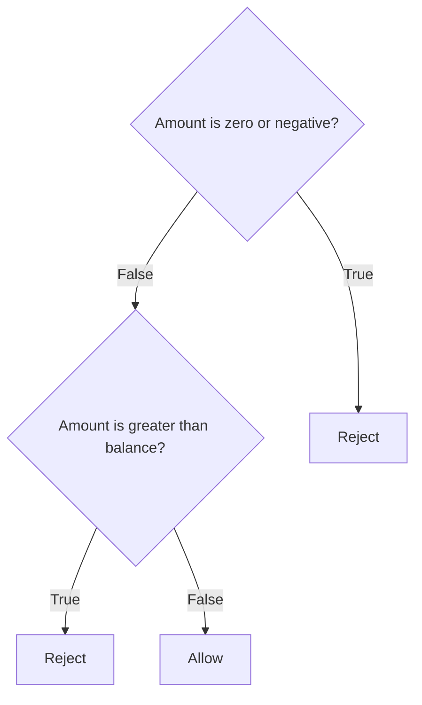

A stronger test set is:

```python
import pytest

@pytest.mark.parametrize(
    ("balance", "amount", "expected"),
    [
        (1000, 500, True),    # valid withdrawal
        (1000, 1500, False),  # insufficient balance
        (1000, 0, False),     # zero amount
        (1000, -100, False),  # negative amount
    ],
)
def test_can_withdraw(balance, amount, expected):
    assert can_withdraw(balance, amount) is expected
```

Branch coverage is generally more informative than line coverage because it exposes missing decision outcomes.

---

## 4.4 Condition Coverage

Condition coverage examines individual Boolean expressions inside a compound decision.

```python
if user.is_active and user.has_permission:
    allow_access()
```

There are two conditions:

- `user.is_active`
- `user.has_permission`

Useful cases include:

| `is_active` | `has_permission` | Expected result |
|---|---:|---|
| `True` | `True` | Allow |
| `True` | `False` | Reject |
| `False` | `True` | Reject |
| `False` | `False` | Reject |

Branch coverage may only require the overall expression to become `True` and `False`. Condition-focused testing checks whether the individual Boolean parts are meaningfully exercised.

In Python, short-circuit evaluation also matters:

```text
False and anything
       |
       └── Second condition may not execute
```

---

## 4.5 Path Coverage

Path coverage checks combinations of branches through a function.

```python
def process_order(paid: bool, in_stock: bool) -> str:
    if not paid:
        return "payment_required"

    if not in_stock:
        return "backorder"

    return "ready"
```

Possible paths:

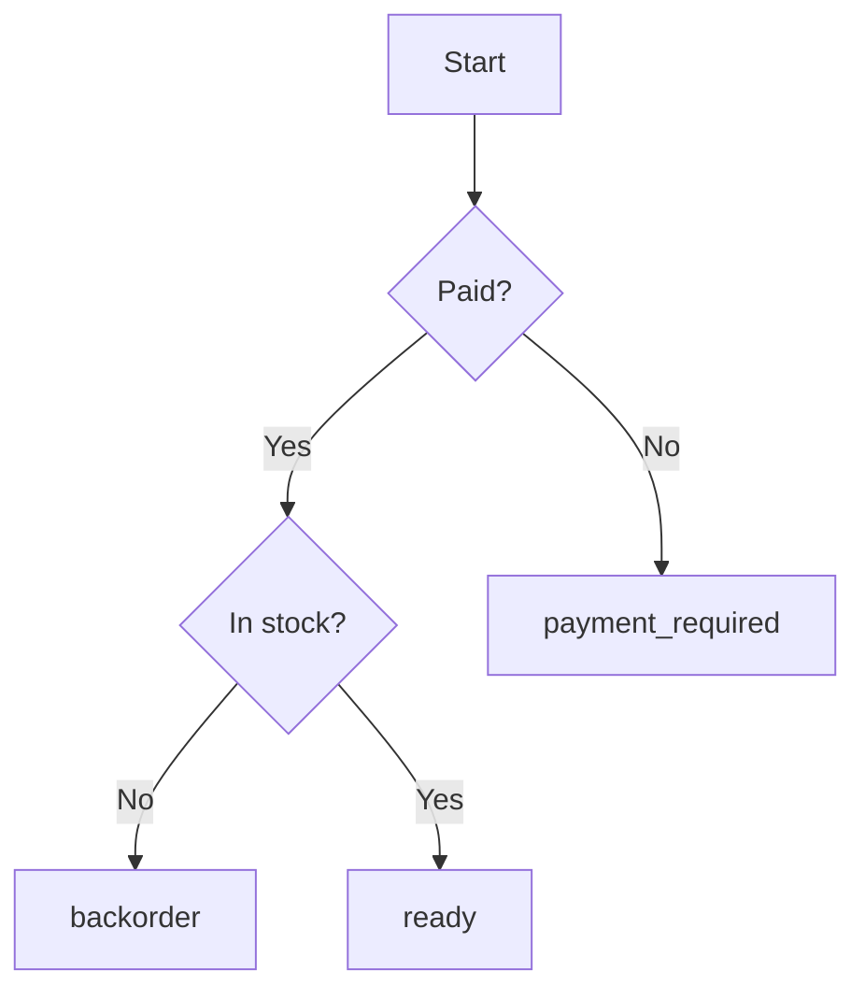

Path coverage becomes expensive as decisions increase.

With `n` independent binary decisions, the number of possible combinations can approach: `2^n`

Ten independent conditions can produce up to `1024` combinations. Testing every possible path is often unrealistic, so teams prioritize:

- Business-critical paths.
- Boundary conditions.
- Failure scenarios.
- Security-sensitive paths.
- Historically unstable areas.

---

# 5. Code Coverage vs Test Coverage

The terms are sometimes used interchangeably, but they can represent different ideas.

| Concept | Main question | Examples |
|---|---|---|
| Code coverage | Which implementation code executed? | Lines, statements, functions, branches |
| Requirements coverage | Which business requirements are verified? | Refund rules, KYC checks, payment limits |
| Risk coverage | Which important risks are tested? | Duplicate payment, data leak, race condition |
| Platform coverage | Which environments are tested? | Browser, OS, database version |
| Data coverage | Which meaningful input categories are tested? | Empty, normal, boundary, malformed |
| Integration coverage | Which component interactions are verified? | API–DB, service–queue, app–payment gateway |

A project can have excellent line coverage and still miss a major requirement.

Example:

```text
Requirement:
"A refunded invoice must not be charged again."

Coverage report:
invoice_service.py = 96%

Missing test:
Refunded invoice enters the recurring billing job.
```

The implementation may be heavily executed while the most important business rule remains untested.

---

# 6. Why High Coverage Does Not Guarantee Good Tests

Consider this function:

```python
def add_tax(amount: float, tax_rate: float) -> float:
    return amount + amount * tax_rate
```

A weak test can execute every line:

```python
def test_add_tax():
    add_tax(100, 0.18)
```

This test may produce 100% line coverage, but it contains no assertion.

Even this test is weak:

```python
def test_add_tax():
    result = add_tax(100, 0.18)
    assert result is not None
```

It checks almost nothing. The implementation could return `1`, `999`, or `"wrong"` and still satisfy a poorly chosen assertion in some cases.

A meaningful test verifies behaviour:

```python
def test_add_tax_returns_amount_including_tax():
    result = add_tax(100, 0.18)

    assert result == 118
```

The distinction is:

```text
Coverage:
"Did the test reach this code?"

Good assertion:
"Would the test fail if this behaviour became wrong?"
```

That second question is one of the best ways to evaluate a test.

---

# 7. What Makes a Good Test?

A good automated test is:

```text
Readable
   +
Behaviour-focused
   +
Deterministic
   +
Independent
   +
Meaningfully asserted
   +
Appropriately fast
   +
Easy to maintain
```

## 7.1 It verifies observable behaviour

Prefer testing outcomes visible through a public interface.

Better:

```python
def test_deposit_increases_account_balance():
    account = Account(balance=100)

    account.deposit(50)

    assert account.balance == 150
```

More fragile:

```python
def test_deposit_calls_private_recalculate_method(mocker):
    account = Account(balance=100)
    spy = mocker.spy(account, "_recalculate_balance")

    account.deposit(50)

    spy.assert_called_once()
```

The first test checks the result users and callers care about. The second is coupled to an internal implementation detail.

---

## 7.2 It fails for the right reason

A test should have a clear purpose.

```python
def test_inactive_user_cannot_log_in():
    ...
```

When it fails, the developer should immediately understand which behaviour broke.

A large test that validates registration, login, profile updates, invoice creation, and logout can fail for many unrelated reasons. Such a test is harder to diagnose and maintain.

---

## 7.3 It has meaningful assertions

Assertions should verify the essential outcome.

```python
response = client.post("/payments", json=payload)

assert response.status_code == 201
assert response.json()["status"] == "completed"
assert response.json()["amount"] == 500
```

For a payment operation, it may also be important to verify the persisted state:

```python
payment = payment_repository.get_by_id(response.json()["id"])

assert payment.status == "completed"
assert payment.amount == 500
```

Do not add assertions only to increase assertion count. Verify the behaviour that matters.

---

## 7.4 It is deterministic

A deterministic test produces the same result for the same code.

Avoid uncontrolled dependencies on:

- Current date and time.
- Random numbers.
- Network availability.
- Test execution order.
- Shared database records.
- Machine timezone.
- External APIs.
- Background jobs that may finish at different times.

---

## 7.5 It is independent

A test should not require another test to run first.

Bad dependency:

```python
def test_create_user():
    global created_user
    created_user = create_user()

def test_update_user():
    update_user(created_user)
```

Better:

```python
def test_update_user(user_factory):
    user = user_factory(name="Old Name")

    updated = update_user(user.id, name="New Name")

    assert updated.name == "New Name"
```

Each test arranges its own required state.

---

## 7.6 It is concise but complete

A test should contain enough information to understand the scenario without unnecessary noise.

Fixtures, factories, and helper functions can remove repetitive setup, but excessive abstraction can make tests difficult to read.

A reader should be able to answer:

1. What scenario is being tested?
2. What action is performed?
3. What result is expected?

---

## 7.7 It tests one behaviour or rule

“One behaviour” does not always mean “one assertion.”

This is reasonable:

```python
def test_create_invoice_returns_complete_invoice():
    invoice = create_invoice(customer_id=10, amount=500)

    assert invoice.customer_id == 10
    assert invoice.amount == 500
    assert invoice.status == "draft"
```

All assertions describe one behaviour: creating a correct invoice.

This is too broad:

```python
def test_complete_invoice_lifecycle():
    # create invoice
    # send invoice
    # accept payment
    # issue refund
    # create credit note
    # close customer account
```

Use broader end-to-end tests intentionally, but do not make every test a complete workflow.

---

# 8. Arrange–Act–Assert Pattern

A clear test commonly follows the **Arrange–Act–Assert** structure.

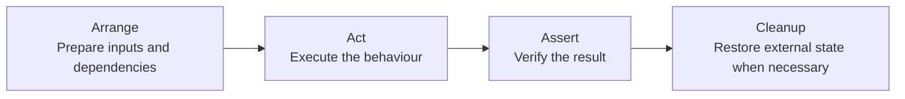

Example:

```python
def test_premium_customer_receives_ten_percent_discount():
    # Arrange
    customer = Customer(is_premium=True)
    order = Order(total=1000, customer=customer)

    # Act
    final_total = calculate_final_total(order)

    # Assert
    assert final_total == 900
```

The visual flow is:

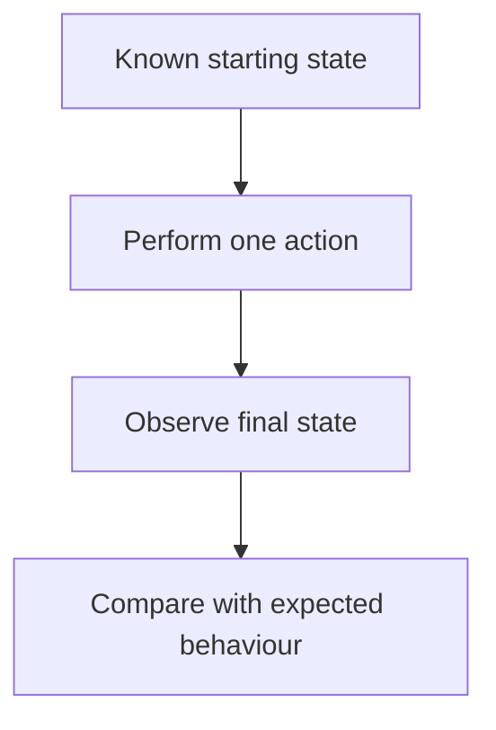

Other naming styles include:

- **Given–When–Then**
- **Setup–Exercise–Verify**
- **Input–Action–Output**

The principle is the same: make the test's story obvious.

---

# 9. Good Test vs Weak Test

Production code:

```python
def apply_coupon(total: float, coupon: str | None) -> float:
    if coupon == "SAVE10":
        return total * 0.90

    if coupon is None:
        return total

    raise ValueError("Invalid coupon")
```

## Weak test

```python
def test_coupon():
    result = apply_coupon(100, "SAVE10")

    assert result
```

Problems:

- The name does not describe the rule.
- `assert result` only checks truthiness.
- It does not verify the exact discount.
- It does not test no-coupon behaviour.
- It does not test invalid coupons.

## Stronger tests

```python
import pytest

def test_save10_coupon_reduces_total_by_ten_percent():
    assert apply_coupon(100, "SAVE10") == 90

def test_missing_coupon_keeps_original_total():
    assert apply_coupon(100, None) == 100

def test_invalid_coupon_is_rejected():
    with pytest.raises(ValueError, match="Invalid coupon"):
        apply_coupon(100, "UNKNOWN")
```

The stronger tests are:

- Behaviour-oriented.
- Easy to diagnose.
- Precise.
- Focused on meaningful branches.
- Able to detect realistic regressions.

---

# 10. Testing Happy Paths, Edge Cases, and Failure Paths

A good test suite covers more than normal input.

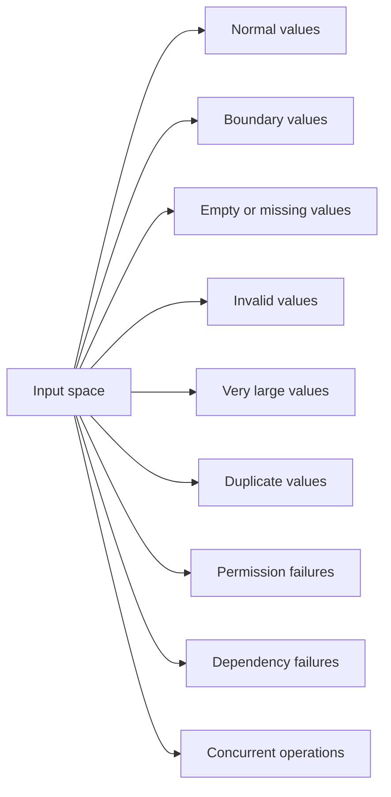

Example requirement:

> A user may withdraw an amount greater than zero and not greater than the available balance.

Test categories:

| Category | Example | Expected |
|---|---|---|
| Normal | Balance `1000`, amount `500` | Allowed |
| Lower boundary | Amount `1` | Allowed |
| Exact boundary | Amount `1000` | Allowed |
| Above boundary | Amount `1001` | Rejected |
| Zero | Amount `0` | Rejected |
| Negative | Amount `-1` | Rejected |

Boundary tests are especially important because comparison operators are common regression points:

```python
# Correct
amount <= balance

# Possible regression
amount < balance
```

The exact-balance test catches this change.

---

# 11. Test Independence and Isolation

Independent tests can run:

- Individually.
- In any order.
- In parallel.
- Repeatedly.
- On a clean CI machine.

## Common sources of coupling

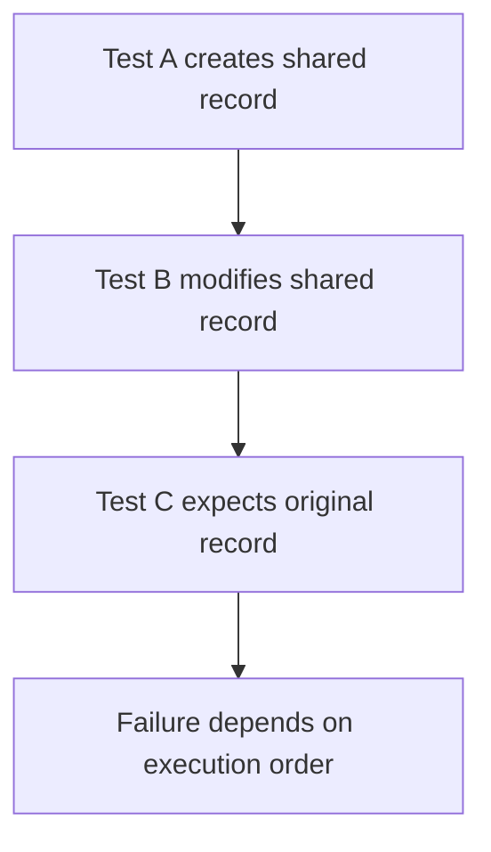

## Better isolation techniques

- Create unique test data.
- Roll back database transactions after each test.
- Reset caches and queues.
- Use temporary directories.
- Avoid module-level mutable state.
- Restore patched environment variables.
- Use dependency injection for external services.
- Freeze or inject time.
- Seed random generators where randomness is intentional.

Example with a temporary path:

```python
def test_export_creates_csv_file(tmp_path):
    output_file = tmp_path / "users.csv"

    export_users(output_file)

    assert output_file.exists()
```

The test does not write to a shared project directory.

---

# 12. Deterministic Tests

## 12.1 Time-dependent code

Fragile production code:

```python
from datetime import datetime

def is_offer_active(expiry):
    return datetime.now() < expiry
```

The result depends on the machine clock.

A more testable design injects the current time:

```python
from datetime import datetime

def is_offer_active(expiry: datetime, now: datetime) -> bool:
    return now < expiry
```

Test:

```python
from datetime import datetime, timezone

def test_offer_is_active_before_expiry():
    now = datetime(2026, 8, 3, 10, 0, tzinfo=timezone.utc)
    expiry = datetime(2026, 8, 3, 11, 0, tzinfo=timezone.utc)

    assert is_offer_active(expiry, now) is True
```

## 12.2 Randomness

Inject or seed randomness:

```python
import random

def generate_otp(rng: random.Random) -> str:
    return str(rng.randint(100000, 999999))
```

Test:

```python
def test_generate_otp_returns_six_digits():
    rng = random.Random(42)

    otp = generate_otp(rng)

    assert otp.isdigit()
    assert len(otp) == 6
```

## 12.3 External networks

Do not make ordinary unit tests depend on a live payment gateway.

Use:

- A fake implementation.
- A controlled local test server.
- A mock at the system boundary.
- A separate integration or contract test for the real protocol.

---

# 13. Test Naming and Readability

A useful name describes: `Scenario + Action + Expected result`

Examples:

```python
def test_active_user_with_valid_password_can_log_in():
    ...

def test_locked_user_is_rejected_even_with_valid_password():
    ...

def test_transfer_above_daily_limit_is_rejected():
    ...
```

Avoid names such as:

```python
def test_login_1():
    ...

def test_method():
    ...

def test_success():
    ...
```

A test file should read like executable documentation of the system's behaviour.

### Naming patterns

```text
test_<action>_<expected_result>

test_<scenario>_<expected_result>

test_<unit>_when_<condition>_then_<result>
```

Use the pattern that remains natural for the project. Consistency matters more than forcing one style everywhere.

---

# 14. Assertions: Quality Over Quantity

## 14.1 Assert exact outcomes

Weak: `assert response`

Stronger: `assert response.status_code == 201`

More complete when relevant:

```python
assert response.json() == {
    "id": "pay_123",
    "status": "completed",
    "amount": 500,
}
```

## 14.2 Assert state changes

For commands that update data:

```python
def test_cancel_order_changes_status_and_releases_stock():
    order = order_factory(status="confirmed")
    stock = stock_factory(reserved=2)

    cancel_order(order.id)

    assert order_repository.get(order.id).status == "cancelled"
    assert stock_repository.get(stock.id).reserved == 0
```

## 14.3 Assert important side effects

Examples:

- Message published.
- Audit log created.
- Email queued.
- Transaction committed.
- Cache invalidated.

Do not assert every internal call. Assert side effects only when they are part of the contract.

## 14.4 Avoid oversized snapshots

Snapshot tests can be useful for stable, structured output, but large snapshots may hide meaningful changes inside noisy diffs.

Prefer focused assertions for critical fields.

---

# 15. Mocking Without Hiding Real Problems

Mocks are useful when a dependency is:

- Slow.
- Expensive.
- Unreliable.
- Non-deterministic.
- Outside the process.
- Difficult to reproduce safely.

Example boundary:

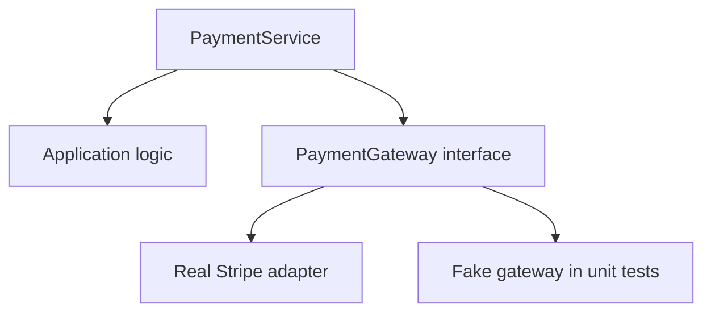

Example:

```python
class FakePaymentGateway:
    def __init__(self, result):
        self.result = result
        self.requests = []

    def charge(self, amount):
        self.requests.append(amount)
        return self.result
```

Test:

```python
def test_successful_gateway_charge_marks_payment_completed():
    gateway = FakePaymentGateway(result={"id": "ch_123", "status": "paid"})
    service = PaymentService(gateway=gateway)

    payment = service.pay(amount=500)

    assert payment.status == "completed"
    assert gateway.requests == [500]
```

## Avoid over-mocking

A test that mocks every collaborator may only prove that mocks return configured values.

Warning signs:

- The test knows the exact sequence of many private method calls.
- A harmless refactor breaks many tests.
- Real domain logic is replaced by mocks.
- Repository methods are mocked in integration tests that should verify persistence.
- The test duplicates the implementation step by step.

Use mocks at architectural boundaries, not automatically for every class.

---

# 16. Coverage Targets and Practical Thresholds

There is no universal percentage that guarantees a safe system.

A practical interpretation:

| Coverage level | Possible meaning |
|---|---|
| Very low | Large parts of the code may be untested |
| Moderate | Core paths may be covered, but gaps need review |
| High | Broad execution coverage, but test strength still needs evaluation |
| 100% | Every measured item executed; correctness is still not guaranteed |

A team may use a threshold to prevent coverage from decreasing: `pytest --cov=app --cov-branch --cov-fail-under=80`

However, a global threshold should be a guardrail, not the primary goal.

### Why blindly chasing 100% can be harmful

It can encourage:

- Low-value tests.
- Assertions that prove little.
- Testing trivial getters and framework-generated code.
- Excessive mocking.
- Suppression of legitimate uncovered paths.
- Time spent on low-risk code instead of critical behaviour.

### Better goal

```text
Protect important behaviour
        +
Cover changed code
        +
Prevent unexplained regression
        +
Review meaningful gaps
```

---

# 17. Risk-Based Coverage

Not every line has equal business importance.

Compare:

```text
Formatting helper fails
Impact: Minor UI inconsistency

Payment idempotency fails
Impact: Customer charged twice
```

The payment logic deserves deeper testing even when both modules contain the same number of lines.

## Risk dimensions

Evaluate code using:

| Dimension | Questions |
|---|---|
| Business impact | What happens if this fails? |
| Probability | How likely is failure? |
| Complexity | How many branches and states exist? |
| Change frequency | How often is this code modified? |
| Dependency risk | Does it call external systems? |
| Security sensitivity | Does it handle auth, secrets, or PII? |
| Recoverability | Can failure be reversed easily? |

A simple priority model: `Testing Priority = Impact × Likelihood × Complexity`

This is not a precise mathematical truth. It is a decision aid.

### High-priority examples

- Authentication and authorization.
- Billing and payments.
- Financial calculations.
- KYC and PII handling.
- Data migrations.
- Retry and idempotency logic.
- Permission boundaries.
- Concurrency-sensitive updates.
- External API error handling.

---

# 18. Changed-Code or Diff Coverage

Project-wide coverage can hide the quality of a new change.

Example:

```text
Existing project:
10,000 lines
8,500 covered
Overall coverage = 85%

New pull request:
100 new lines
10 covered

New overall coverage:
8,510 / 10,100 ≈ 84.3%
```

The global percentage drops only slightly, even though the new code is mostly untested.

**Diff coverage** measures only lines added or changed in a pull request.

```text
Changed lines: 100
Covered changed lines: 90
Diff coverage: 90%
```

A useful policy is:

```text
Existing legacy code:
Improve incrementally

New or changed code:
Expect strong coverage unless there is a documented reason
```

This avoids demanding an immediate rewrite of the entire legacy suite while maintaining standards for new work.

---

# 19. Mutation Testing

Mutation testing checks whether tests can detect small, intentional defects.

Original code:

```python
def is_adult(age: int) -> bool:
    return age >= 18
```

A mutation tool may change it to:

```python
def is_adult(age: int) -> bool:
    return age > 18
```

Then it runs the test suite.

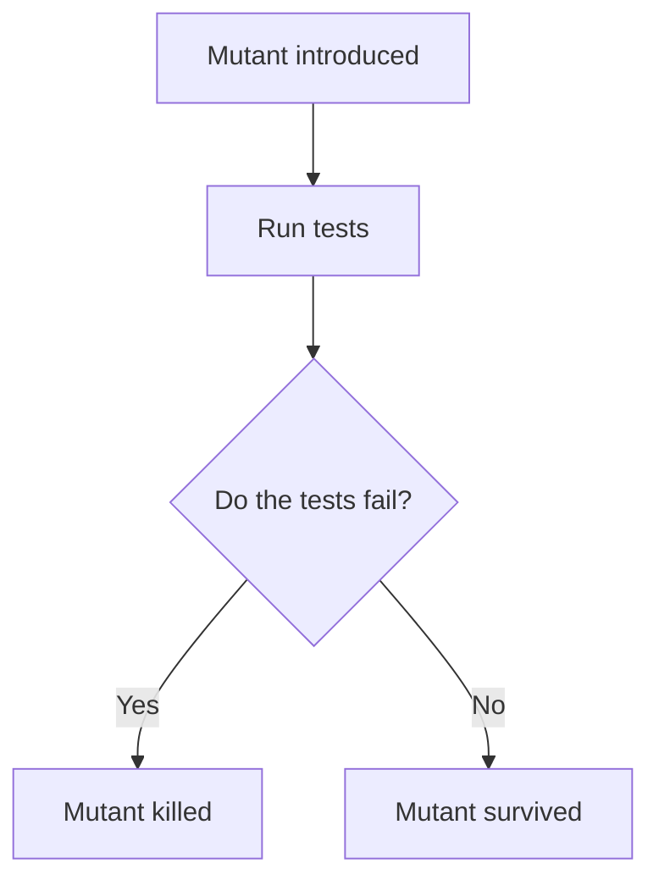

A surviving mutant may indicate that the tests do not distinguish the intended behaviour from the broken behaviour.

For this example, the missing test is likely:

```python
def test_age_18_is_considered_adult():
    assert is_adult(18) is True
```

## Mutation score

A simplified formula is:

```text
Mutation Score
      =
Killed Mutants / Relevant Generated Mutants
      × 100
```

Mutation testing answers a stronger question than ordinary coverage:

```text
Coverage:
"Did tests execute the line?"

Mutation testing:
"Would tests detect a realistic change to the line?"
```

## Practical use

Mutation testing can be computationally expensive. Use it selectively for:

- Core domain services.
- Financial calculations.
- Authorization rules.
- Validation logic.
- Code with high coverage but uncertain test strength.
- Changed modules in CI.
- Scheduled quality checks.

Python tools include `mutmut`. JavaScript and TypeScript projects commonly use Stryker.

---

# 20. Test Pyramid and Coverage

A balanced suite usually has more small tests and fewer broad tests.

```text
                    /\
                   /  \
                  / E2E\        Few, slow, high-fidelity
                 /------\
                /Integration\   Some, component interaction
               /------------\
              /  Unit Tests   \ Many, fast, focused
             /________________\
```

| Level | Best for |
|---|---|
| Unit | Domain rules, calculations, validation, branch-heavy logic, error mapping, state transitions |
| Integration | Database queries, ORM mappings, transactions, API serialization, queue publishing, cache behaviour, external adapter protocol |
| End-to-end | Critical user journeys, application wiring, authentication flow, payment or checkout flow, deployment-level confidence |

The levels themselves — what each one proves, where the boundary falls, and how to size the mix — belong to [Unit vs Integration vs E2E](unit-integration-e2e.md).

Coverage collected only from unit tests may look high while integrations are broken. Coverage should be interpreted together with the types of tests producing it.

---

# 21. Measuring Coverage with Pytest

Install the tools: `python -m pip install pytest pytest-cov`

Run tests with terminal coverage: `pytest --cov=app --cov-report=term-missing`

Include branch coverage:

```bash
pytest \
  --cov=app \
  --cov-branch \
  --cov-report=term-missing
```

Generate an HTML report:

```bash
pytest \
  --cov=app \
  --cov-branch \
  --cov-report=term-missing \
  --cov-report=html
```

Open: `htmlcov/index.html`

Generate XML for CI platforms: `pytest --cov=app --cov-branch --cov-report=xml`

Fail when total coverage falls below a threshold:

```bash
pytest \
  --cov=app \
  --cov-branch \
  --cov-report=term-missing \
  --cov-fail-under=80
```

Run a specific test while investigating: `pytest tests/services/test_payment_service.py -v`

Run tests matching a name: `pytest -k "refund" -v`

---

# 22. Configuration Example

Coverage configuration can be placed in `pyproject.toml`.

```toml
[tool.pytest.ini_options]
testpaths = ["tests"]
addopts = [
    "-ra",
    "--strict-markers",
]

[tool.coverage.run]
source = ["app"]
branch = true
parallel = true
omit = [
    "*/migrations/*",
    "*/tests/*",
]

[tool.coverage.report]
show_missing = true
skip_covered = false
precision = 2
fail_under = 80
exclude_lines = [
    "pragma: no cover",
    "if TYPE_CHECKING:",
    "if __name__ == .__main__.:",
]

[tool.coverage.html]
directory = "htmlcov"

[tool.coverage.xml]
output = "coverage.xml"
```

Run: `pytest --cov=app --cov-report=term-missing --cov-report=html`

## Be careful with exclusions

Only exclude code when there is a clear reason.

Reasonable candidates may include:

- Type-checking-only blocks.
- Defensive code that is impossible under a guaranteed invariant.
- Platform-specific code not applicable to the current target.
- Generated files.
- Framework migrations.

Do not use exclusions to hide difficult or low-quality tests.

---

# 23. Reading a Coverage Report

Example:

```text
Name                         Stmts   Miss Branch BrPart  Cover   Missing
------------------------------------------------------------------------
app/services/payment.py         80      8     24      3  87.50%  44-48, 72
app/services/refund.py          45     20     12      4  51.72%  18-35, 60
app/models/invoice.py           30      0      4      0 100.00%
------------------------------------------------------------------------
TOTAL                          155     28     40      7  80.51%
```

Interpretation:

- `Stmts`: executable statements.
- `Miss`: statements not executed.
- `Branch`: measured branch destinations.
- `BrPart`: partially covered branches.
- `Cover`: combined reported percentage.
- `Missing`: source locations needing review.

## Review process

Do not immediately write tests for every red line.

Ask:

1. Is this code reachable in production?
2. Is it obsolete or dead?
3. Which business behaviour does it represent?
4. What risk exists if it fails?
5. Which test level should cover it?
6. Is the missing path an error, boundary, or permission case?
7. Would a new test detect a realistic regression?

Example:

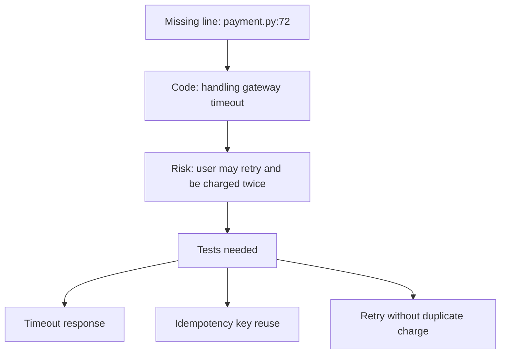

Coverage becomes valuable when it triggers this kind of analysis.

---

# 24. Coverage in CI/CD

A typical pipeline:

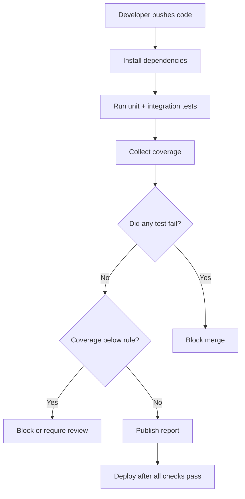

Example GitHub Actions workflow:

```yaml
name: tests

on:
  pull_request:
  push:
    branches: [main]

jobs:
  test:
    runs-on: ubuntu-latest

    steps:
      - name: Check out repository
        uses: actions/checkout@v4

      - name: Set up Python
        uses: actions/setup-python@v5
        with:
          python-version: "3.12"

      - name: Install dependencies
        run: |
          python -m pip install --upgrade pip
          pip install -r requirements.txt
          pip install pytest pytest-cov

      - name: Run tests with coverage
        run: |
          pytest \
            --cov=app \
            --cov-branch \
            --cov-report=term-missing \
            --cov-report=xml \
            --cov-fail-under=80
```

## Recommended CI principles

- Always fail when tests fail.
- Track branch coverage where practical.
- Publish an inspectable report.
- Prevent unexplained large coverage drops.
- Evaluate changed-code coverage.
- Keep exclusions reviewed.
- Separate fast pull-request checks from expensive scheduled checks.
- Run mutation testing selectively rather than on every large full-suite build.

---

# 25. A Practical Testing Strategy

## Step 1: Identify behaviour

Start from a business rule or observable contract.

Example:

> A payment request with the same idempotency key must not create a second charge.

## Step 2: List meaningful scenarios

```text
1. First request succeeds
2. Same key and same payload returns original result
3. Same key and different payload is rejected
4. First request times out after provider accepted charge
5. Retry does not create duplicate charge
```

## Step 3: Select the right test level

| Scenario | Suitable level |
|---|---|
| Key comparison rule | Unit |
| Database uniqueness | Integration |
| Provider adapter behaviour | Contract/integration |
| Full retry journey | End-to-end or component |

## Step 4: Write focused tests

Use clear names and meaningful assertions.

## Step 5: Review coverage gaps

Check whether important branches and error paths remain unexecuted.

## Step 6: Challenge test strength

Ask:

> What small bug could I introduce that this test should catch?

Examples:

- Change `>=` to `>`.
- Remove a permission check.
- Reverse a condition.
- Return the wrong status.
- Skip saving the database record.
- Publish the wrong event.
- Retry one extra time.

## Step 7: Add mutation testing for critical logic

Use mutation results to detect weak assertions and missing boundaries.

## Step 8: Keep the suite maintainable

Delete duplicate tests, improve fixtures, and avoid coupling tests to private implementation details.

---

# 26. Review Checklist

Use this during code review.

## Behaviour

- [ ] Does each test verify a meaningful behaviour?
- [ ] Are business-critical rules represented?
- [ ] Are happy, boundary, and failure paths covered?
- [ ] Would the test fail for a realistic regression?

## Readability

- [ ] Does the name explain the scenario and expected result?
- [ ] Is Arrange–Act–Assert easy to identify?
- [ ] Is unnecessary setup removed?
- [ ] Are fixtures understandable without excessive navigation?

## Reliability

- [ ] Is the test deterministic?
- [ ] Can it run independently?
- [ ] Does it avoid shared mutable state?
- [ ] Is time, randomness, and network behaviour controlled?
- [ ] Can tests run in parallel safely?

## Assertions

- [ ] Are assertions precise?
- [ ] Are important state changes checked?
- [ ] Are expected exceptions and messages verified where useful?
- [ ] Are assertions focused on public behaviour?

## Mocking

- [ ] Are mocks used mainly at external boundaries?
- [ ] Does the test avoid copying the implementation?
- [ ] Would a harmless internal refactor keep the test valid?
- [ ] Is there integration coverage for important real interactions?

## Coverage

- [ ] Are important uncovered lines reviewed?
- [ ] Is branch coverage enabled where useful?
- [ ] Does new or changed code have adequate coverage?
- [ ] Are exclusions justified?
- [ ] Is the team avoiding percentage-only decision making?

---

# 27. References

- [Coverage.py documentation](https://coverage.readthedocs.io/en/latest/)
- [Coverage.py — Branch coverage measurement](https://coverage.readthedocs.io/en/latest/branch.html)
- [pytest documentation](https://docs.pytest.org/en/stable/)
- [pytest — Anatomy of a test](https://docs.pytest.org/en/stable/explanation/anatomy.html)
- [pytest — Good integration practices](https://docs.pytest.org/en/stable/explanation/goodpractices.html)
- [pytest-cov documentation](https://pytest-cov.readthedocs.io/en/latest/)
- [pytest-cov reporting options](https://pytest-cov.readthedocs.io/en/latest/reporting.html)
- [Google Testing Blog — Code Coverage Best Practices](https://testing.googleblog.com/2020/08/code-coverage-best-practices.html)
- [Martin Fowler — Test Coverage](https://martinfowler.com/bliki/TestCoverage.html)
- [Martin Fowler — The Practical Test Pyramid](https://martinfowler.com/articles/practical-test-pyramid.html)
- [Stryker — What is mutation testing?](https://stryker-mutator.io/docs/)
- [mutmut documentation](https://mutmut.readthedocs.io/)
