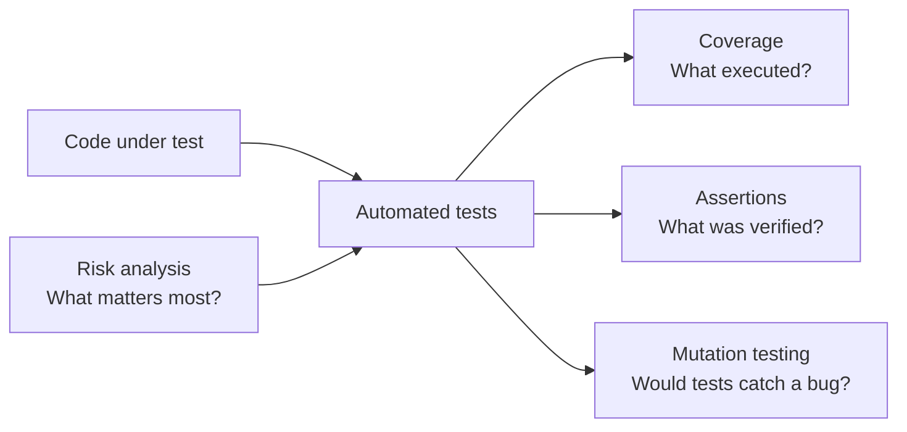
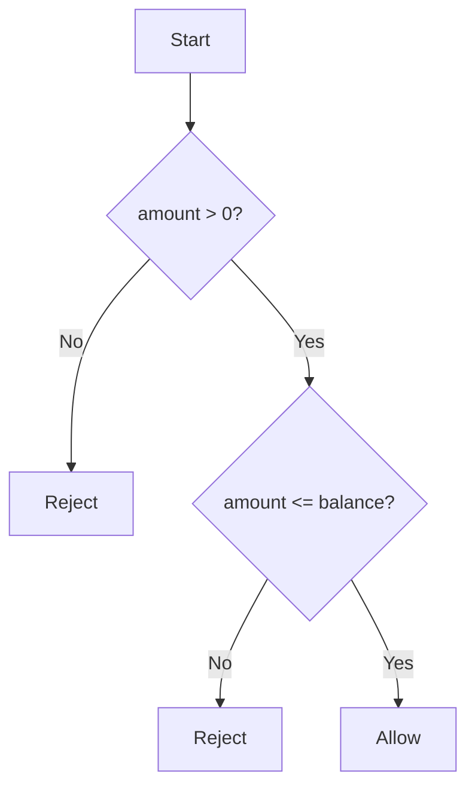
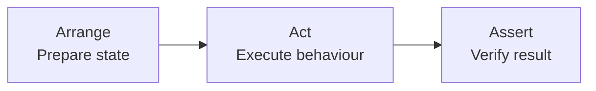
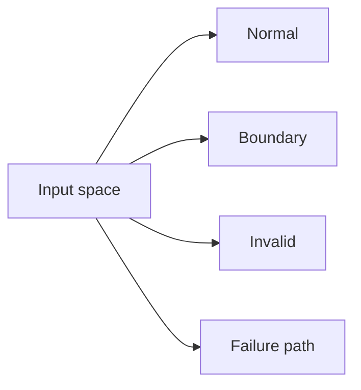
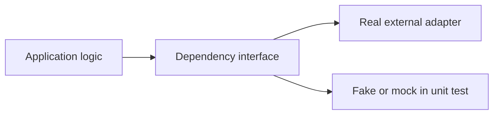
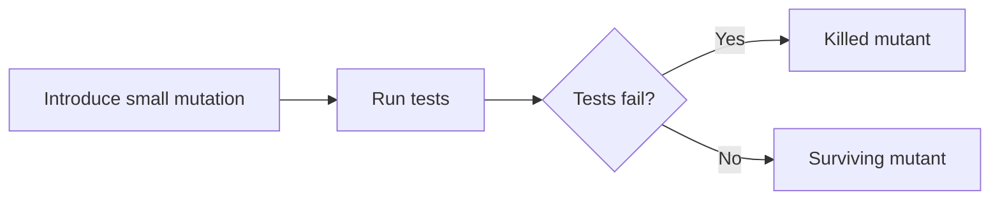
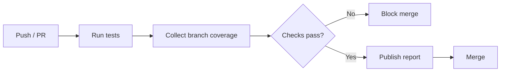

# Test Coverage & What Makes a Good Test

> Coverage tells you **what code tests executed**. Good tests tell you **whether the behaviour was actually verified**.

**Examples:** Python, `pytest`, `pytest-cov`, `coverage.py`

> **Verified August 2026:** pytest **9.1.1** is the latest released pytest version; pytest 9.2 is still an unreleased draft. Current pytest-cov is **7.1.0**, and coverage.py is **7.15.4**.

---

# 1. In Short

- **Coverage measures execution, not correctness.**
- Prefer **branch coverage** over looking only at line coverage.
- A high percentage does not prove that assertions are meaningful.
- A good test is **behaviour-focused, deterministic, independent, readable, and precise**.
- Test normal cases, boundaries, and important failure paths.
- Use mocks mainly at **external or architectural boundaries**.
- Treat coverage thresholds as **guardrails**, not the definition of quality.
- For existing projects, **diff coverage** is often more useful than forcing every old file to reach the same target.
- Use **mutation testing** selectively to check whether tests can detect realistic code changes.
- Spend more testing effort on high-risk code such as payments, authorization, idempotency, data integrity, and security-sensitive logic.



The key mental model is:

```text
Coverage      -> Where did tests go?
Assertions    -> What did tests prove?
Mutation      -> What bugs can tests detect?
Risk analysis -> What behaviour must be protected?
```

---

# 2. What Is Test Coverage?

**Test coverage** measures which parts of the application execute while automated tests run.

A coverage tool typically:

1. Runs alongside the test suite.
2. Records executed statements and branches.
3. Compares them with code that could have executed.
4. Reports covered and missing areas.

A simplified line-coverage formula is:

```text
Line Coverage =
Executed Statements / Total Executable Statements × 100
```

Coverage is useful for discovering **untested code**, but it cannot answer whether the expected result was checked correctly.

> **Important:** Reaching a line is not the same as verifying its behaviour.

---

# 3. Main Coverage Types

## 3.1 Line or Statement Coverage

Checks whether executable statements were run.

Useful for finding:

- Untested functions or modules.
- Forgotten error handling.
- Code that no test reaches.
- Dead or obsolete areas worth reviewing.

It does **not** prove that:

- The output was correct.
- Every decision outcome was tested.
- Boundary values were covered.
- Business requirements were satisfied.

---

## 3.2 Function Coverage

Checks whether a function or method was called at least once.

This is useful as a high-level signal, but calling a function once says very little about its different behaviours.

---

## 3.3 Branch Coverage

Checks whether different outcomes of decisions such as `if`, `else`, and similar branches were executed.

Example production code used throughout this note:

```python
def can_withdraw(balance: int, amount: int) -> bool:
    if amount <= 0:
        return False

    if amount > balance:
        return False

    return True
```

Its important decision paths are:



Branch coverage is usually more informative than line coverage because it highlights **missing decision outcomes**.

---

## 3.4 Condition and Path Coverage

For a compound condition such as:

```python
if user.is_active and user.has_permission:
    ...
```

**Condition coverage** asks whether the individual Boolean conditions were meaningfully exercised.

**Path coverage** considers combinations of branches through the function.

Path coverage grows quickly as decisions increase, so normal development focuses on:

- Important business paths.
- Boundary conditions.
- Failure scenarios.
- Security-sensitive logic.
- Historically unstable areas.

Trying to execute every theoretical path is usually unnecessary.

---

# 4. Coverage Is Not Test Quality

Consider this test:

```python
def test_can_withdraw():
    can_withdraw(1000, 500)
```

It executes production code but verifies nothing.

This is also weak:

```python
def test_can_withdraw():
    result = can_withdraw(1000, 500)
    assert result is not None
```

The assertion does not prove the withdrawal rule.

A meaningful test checks the expected behaviour:

```python
def test_valid_withdrawal_is_allowed():
    assert can_withdraw(1000, 500) is True
```

The most useful question when reviewing a test is:

> **Would this test fail if the behaviour became wrong?**

That question is more valuable than asking only whether the file is covered.

---

# 5. What Makes a Good Test?

A good automated test should have the following qualities.

## 5.1 Behaviour-Focused

Test observable behaviour rather than private implementation details.

Prefer:

```python
assert can_withdraw(1000, 500) is True
```

over checking which private helper methods were called internally.

This keeps tests useful even when the internal implementation is refactored.

---

## 5.2 Precise Assertions

Assertions should check the actual contract.

Weak:

```python
assert result
```

Stronger:

```python
assert result is True
```

For APIs or database operations, also verify important state changes or externally visible side effects when they are part of the behaviour.

---

## 5.3 Deterministic

The same code and input should give the same test result.

Control dependencies such as:

- Current time.
- Random values.
- Network calls.
- Shared database state.
- Environment variables.
- Background jobs.
- Machine timezone.

Inject, fake, freeze, or isolate them when necessary.

---

## 5.4 Independent

Each test should prepare its own required state.

A test should be able to run:

- By itself.
- In any order.
- Repeatedly.
- In parallel where supported.
- On a clean CI environment.

Avoid making one test depend on data created by another test.

---

## 5.5 Focused

A test should normally verify **one behaviour or rule**.

This does not mean one assertion per test.

Several assertions are fine when they describe the same outcome. The problem is a single test that combines many unrelated workflows and can fail for many different reasons.

---

## 5.6 Readable

A test should make three things obvious:

1. What state is being prepared?
2. What action is performed?
3. What result is expected?

A common structure is **Arrange–Act–Assert**.



---

# 6. One Practical Pytest Example

The withdrawal rule is:

> An amount must be greater than zero and must not exceed the available balance.

A compact test set is:

```python
import pytest


@pytest.mark.parametrize(
    ("balance", "amount", "expected"),
    [
        (1000, 500, True),    # normal case
        (1000, 1, True),      # lower valid boundary
        (1000, 1000, True),   # exact balance boundary
        (1000, 1001, False),  # above balance
        (1000, 0, False),     # zero
        (1000, -1, False),    # negative
    ],
)
def test_can_withdraw(balance, amount, expected):
    assert can_withdraw(balance, amount) is expected
```

This small test set is strong because it covers:

| Category | Example | Expected |
|---|---|---|
| Normal | `500` from `1000` | Allow |
| Lower boundary | `1` | Allow |
| Exact boundary | `1000` | Allow |
| Above boundary | `1001` | Reject |
| Zero | `0` | Reject |
| Negative | `-1` | Reject |

The exact-boundary case is particularly valuable because it catches a common regression:

```python
# Correct
amount > balance

# Accidental change
amount >= balance
```

If the comparison changes incorrectly, `amount == balance` should fail.

---

# 7. Testing Normal, Boundary, and Failure Behaviour

For important rules, think in categories rather than random inputs.



Common categories include:

- Normal valid input.
- Minimum and maximum valid values.
- Just below or above a boundary.
- Empty or missing input.
- Invalid format.
- Duplicate request.
- Permission failure.
- Dependency failure.
- Concurrent or retry behaviour when relevant.

You do not need every imaginable value. Choose cases that protect meaningful behaviour and likely regression points.

---

# 8. Mocking Without Hiding Real Problems

Mocks are useful when a dependency is:

- External.
- Slow.
- Expensive.
- Unreliable.
- Non-deterministic.
- Difficult to reproduce safely.

Typical examples are payment providers, email services, cloud APIs, or third-party HTTP services.



## Practical rule

Use mocks at **boundaries**, not automatically for every class.

Too much mocking can create tests that only verify that mocked methods were called in a specific sequence.

Warning signs:

- A harmless refactor breaks many tests.
- The test knows several private method calls.
- The test repeats the implementation step by step.
- Integration behaviour is mocked even though persistence or protocol correctness is what matters.

For important integrations, complement unit tests with real integration or contract tests.

---

# 9. Coverage Targets, Diff Coverage, and Risk

There is no universal coverage percentage that guarantees quality.

A threshold such as:

```bash
pytest --cov=app --cov-branch --cov-fail-under=80
```

can stop coverage from falling unexpectedly, but **80%, 90%, or even 100% does not prove correctness**.

## 9.1 Prefer Risk-Based Testing

Not every line has equal importance.

Prioritize deeper testing for code involving:

- Authentication and authorization.
- Payments and billing.
- Financial calculations.
- Idempotency and retries.
- Data integrity.
- PII or security-sensitive logic.
- Concurrency.
- External API error handling.

A useful mental model is:

```text
Testing Priority ≈ Impact × Likelihood × Complexity
```

This is a prioritization aid, not a strict formula.

## 9.2 Diff Coverage

Large legacy projects can keep a good global percentage while newly added code is poorly tested.

**Diff coverage** measures coverage only on added or changed lines.

Practical policy:

```text
Existing code:
Improve incrementally.

New or changed code:
Expect strong coverage unless there is a justified exception.
```

This is often more useful in pull requests than demanding the same coverage target from every legacy module.

---

# 10. Mutation Testing

Mutation testing intentionally makes small code changes and checks whether the test suite notices.

Original:

```python
if amount > balance:
    return False
```

Possible mutant:

```python
if amount >= balance:
    return False
```

Then the suite runs.



A **killed mutant** means the tests detected the change.

A **surviving mutant** suggests a missing scenario or weak assertion.

Mutation testing answers a stronger question than normal coverage:

```text
Coverage:
Did the test execute this code?

Mutation testing:
Would the test detect a realistic mistake in this code?
```

For Python, `mutmut` is a commonly used tool.

Run it selectively on critical domain logic because mutation testing is much more expensive than normal test execution.

```bash
pip install mutmut
mutmut run
mutmut browse
```

---

# 11. Measuring Coverage with Pytest

Install:

```bash
python -m pip install pytest pytest-cov
```

Run tests with missing lines shown:

```bash
pytest --cov=app --cov-report=term-missing
```

Include branch coverage:

```bash
pytest \
  --cov=app \
  --cov-branch \
  --cov-report=term-missing
```

Generate HTML and XML reports:

```bash
pytest \
  --cov=app \
  --cov-branch \
  --cov-report=html \
  --cov-report=xml
```

Fail below a threshold:

```bash
pytest \
  --cov=app \
  --cov-branch \
  --cov-fail-under=80
```

Useful pytest commands during development:

```bash
pytest tests/services/test_payment_service.py -v
pytest -k "withdraw" -v
```

---

# 12. Practical Configuration

A small `pyproject.toml` setup is enough for most projects:

```toml
[tool.pytest.ini_options]
testpaths = ["tests"]
addopts = [
    "-ra",
    "--strict-markers",
]

[tool.coverage.run]
source = ["app"]
branch = true
omit = [
    "*/migrations/*",
    "*/tests/*",
]

[tool.coverage.report]
show_missing = true
precision = 2
fail_under = 80

[tool.coverage.html]
directory = "htmlcov"

[tool.coverage.xml]
output = "coverage.xml"
```

Keep exclusions small and intentional. Do not exclude code simply because it is difficult to test.

---

# 13. Coverage in CI/CD

A normal pull-request pipeline looks like:



Recommended practice:

- Fail the pipeline when tests fail.
- Collect branch coverage for important application code.
- Publish an inspectable report.
- Prevent unexplained coverage drops.
- Prefer changed-code coverage for pull requests.
- Keep expensive mutation checks limited to high-risk or scheduled workflows.
- Do not make coverage percentage the only merge-quality signal.

---

# 14. How to Review a Coverage Report

When coverage shows an uncovered line, do not immediately add a test only to make the line green.

Ask:

1. What behaviour does this line represent?
2. Is the code reachable in production?
3. What risk exists if it fails?
4. Is the missing path a boundary, permission, or failure case?
5. Which test level should protect it?
6. Would the new test detect a realistic regression?

Coverage becomes valuable when it leads to **better scenarios**, not merely a larger percentage.

---

# 15. Quick Review Checklist

## Behaviour

- [ ] Tests verify meaningful observable behaviour.
- [ ] Important normal, boundary, and failure paths are covered.
- [ ] Business-critical rules receive deeper testing.
- [ ] A realistic regression would make the test fail.

## Reliability

- [ ] Tests are deterministic.
- [ ] Tests can run independently.
- [ ] Shared mutable state is avoided.
- [ ] Time, randomness, and external networks are controlled where necessary.

## Assertions

- [ ] Assertions verify exact outcomes where practical.
- [ ] Important state changes are checked.
- [ ] Tests are not coupled unnecessarily to private implementation details.

## Coverage

- [ ] Branch coverage is reviewed, not only line coverage.
- [ ] Important uncovered paths are understood.
- [ ] New or changed code has adequate coverage.
- [ ] Coverage exclusions are justified.
- [ ] The team is not treating a percentage as proof of correctness.

---

# 16. Key Takeaway

A strong test suite combines **breadth and strength**.

```text
Good test confidence
=
Useful coverage
+ meaningful assertions
+ boundary/failure scenarios
+ deterministic tests
+ appropriate integration testing
+ risk-based prioritization
```

Use coverage to find **where tests are missing**.

Use good test design to prove **behaviour is correct**.

Use mutation testing selectively to check **whether the suite can detect realistic defects**.

That combination is much more valuable than chasing 100% coverage.

---

# 17. References

- [pytest documentation](https://docs.pytest.org/en/stable/)
- [pytest changelog](https://docs.pytest.org/en/latest/changelog.html)
- [pytest-cov documentation](https://pytest-cov.readthedocs.io/en/latest/)
- [pytest-cov on PyPI](https://pypi.org/project/pytest-cov/)
- [coverage.py documentation](https://coverage.readthedocs.io/en/latest/)
- [coverage.py branch coverage](https://coverage.readthedocs.io/en/latest/branch.html)
- [mutmut documentation](https://mutmut.readthedocs.io/en/latest/)
- [Google Testing Blog — Code Coverage Best Practices](https://testing.googleblog.com/2020/08/code-coverage-best-practices.html)
- [Martin Fowler — Test Coverage](https://martinfowler.com/bliki/TestCoverage.html)
