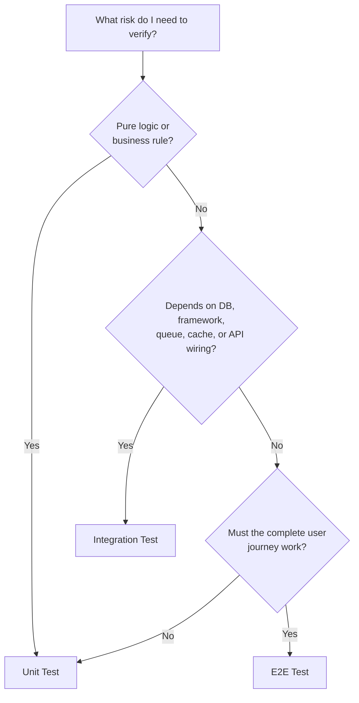
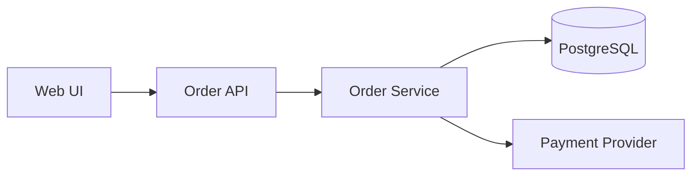
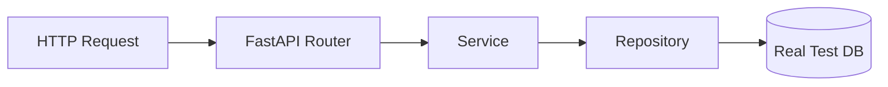
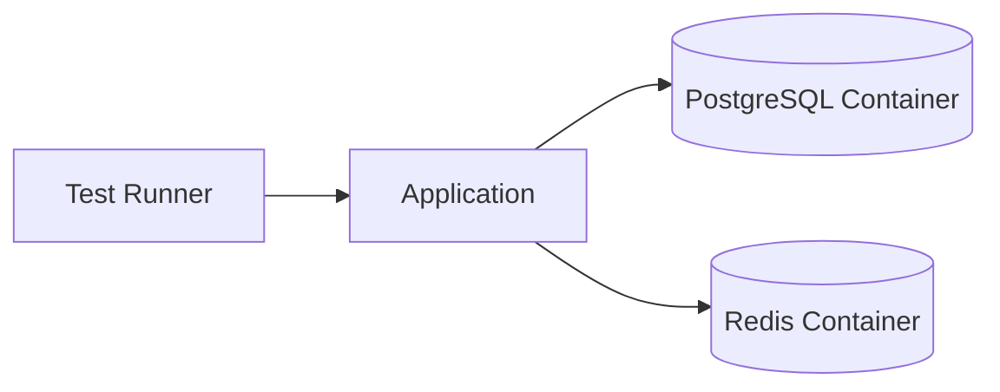
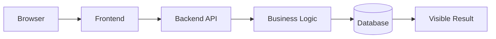
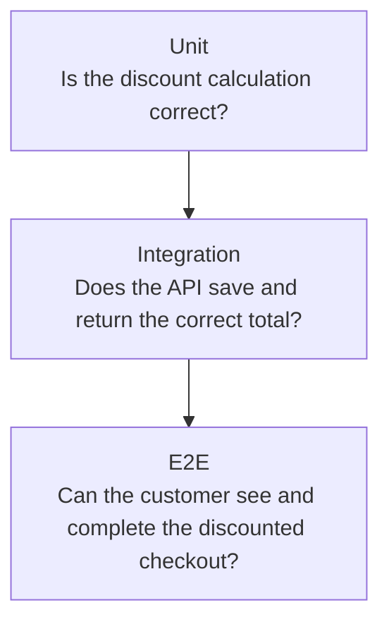
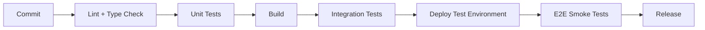

# Unit vs Integration vs End-to-End (E2E) Tests

> Understand test types by their **boundary**, not only by their folder name or tool.

## In Short

- **Unit test** → verifies one small behavior with dependencies controlled or replaced.
- **Integration test** → verifies that real components work together correctly.
- **E2E test** → verifies a complete user workflow through the application.
- Use the **smallest test boundary that can confidently catch the production risk**.
- Keep many fast lower-level tests and fewer broad E2E tests.
- Test names differ between teams, so define what **unit**, **integration**, and **E2E** mean in your project.



---

# 1. The Main Difference: Test Boundary

Suppose an order flow looks like this:



The same feature can be tested at different boundaries:

```text
Unit
OrderService + mocked/fake dependencies

Integration
API + Service + Repository + real test database

E2E
Browser + Frontend + API + Service + Database
```

The important question is:

> **How much real application behavior must execute for this test to detect the failure I care about?**

---

# 2. Unit Tests

## 2.1 What They Verify

A unit test checks a small piece of behavior in a controlled boundary.

Typical targets:

- Business rules
- Calculations
- Validation logic
- Permission decisions
- Data transformations
- State transitions
- Error handling
- Edge cases

Example:

```python
from decimal import Decimal


def calculate_total(subtotal: Decimal, is_premium: bool) -> Decimal:
    if subtotal < 0:
        raise ValueError("Subtotal cannot be negative")

    if is_premium:
        return (subtotal * Decimal("0.90")).quantize(Decimal("0.01"))

    return subtotal.quantize(Decimal("0.01"))
```

```python
from decimal import Decimal

import pytest


def test_premium_customer_receives_ten_percent_discount() -> None:
    result = calculate_total(
        subtotal=Decimal("1000.00"),
        is_premium=True,
    )

    assert result == Decimal("900.00")


def test_rejects_negative_subtotal() -> None:
    with pytest.raises(ValueError, match="Subtotal cannot be negative"):
        calculate_total(
            subtotal=Decimal("-1.00"),
            is_premium=False,
        )
```

## 2.2 Typical Characteristics

| Area | Unit Test |
|---|---|
| Scope | Small behavior |
| Database | Normally not used |
| Network | Normally not used |
| Dependencies | Mocks, stubs, or fakes when needed |
| Speed | Very fast |
| Failure diagnosis | Easy |
| Best for | Logic and edge cases |

## 2.3 What Unit Tests Cannot Prove

A passing unit test does **not** prove that:

- SQL works against the real database.
- Dependency injection is configured correctly.
- API routes are registered.
- Serialization matches the real contract.
- Infrastructure configuration is correct.
- The complete workflow works for the user.

Those require wider boundaries.

---

# 3. Integration Tests

## 3.1 What They Verify

An integration test checks whether multiple real components collaborate correctly.

Common boundaries:

- API route + service
- Service + repository
- Repository + PostgreSQL
- Application + Redis
- Producer + message broker
- Consumer + database
- Application + external-service sandbox or stub

Example boundary:



## 3.2 Example

```python
import pytest


@pytest.mark.asyncio
async def test_order_api_saves_discounted_total(client, database) -> None:
    response = await client.post(
        "/orders",
        json={
            "customer_id": "premium-customer-1",
            "subtotal": "1000.00",
        },
    )

    assert response.status_code == 201
    assert response.json()["total"] == "900.00"

    order = await database.get_order(response.json()["id"])

    assert order.total == Decimal("900.00")
```

This test can detect problems that a mocked repository cannot:

- Invalid SQL
- Wrong column names
- Broken joins
- Database constraints
- Incorrect transaction behavior
- Serialization mismatches
- Route or dependency wiring problems

## 3.3 Use Real Dependencies Where Their Behavior Matters

For PostgreSQL, Redis, RabbitMQ, Kafka, and similar infrastructure, temporary test containers are commonly useful:



Use the same database engine as production when database-specific behavior matters. SQLite is not a perfect substitute for PostgreSQL when queries, types, constraints, or transactions depend on PostgreSQL behavior.

For third-party APIs, prefer:

- Provider sandbox/test mode
- Official emulator
- Local stub server
- Contract tests

Avoid calling production services from automated tests.

---

# 4. End-to-End Tests

## 4.1 What They Verify

An E2E test verifies an important workflow from the system's external point of view.

For a web application:



E2E tests provide the highest realism, but they also have the highest execution and maintenance cost.

Good candidates include:

- Login
- Registration
- Password reset
- Checkout
- Payment
- Document upload
- Insurance claim submission
- Multi-step onboarding
- Approval workflows

Do **not** use browser tests to exhaustively cover every validation rule, calculation variation, or permission branch. Those variations usually belong at lower levels.

## 4.2 Playwright Example

```typescript
import { test, expect } from '@playwright/test';

test('premium customer completes discounted checkout', async ({ page }) => {
  await page.goto('/checkout');

  await expect(page.getByText('Premium discount: 10%')).toBeVisible();
  await expect(page.getByText('Total: ₹900.00')).toBeVisible();

  await page.getByRole('button', { name: 'Place order' }).click();

  await expect(
    page.getByRole('heading', { name: 'Order confirmed' })
  ).toBeVisible();
});
```

Prefer user-facing locators such as:

```typescript
page.getByRole('button', { name: 'Place order' });
page.getByLabel('Email');
page.getByText('Order confirmed');
```

Avoid brittle DOM-dependent selectors when possible:

```typescript
page.locator('.checkout > div:nth-child(2) > button.primary');
```

Playwright locators provide auto-waiting and retry behavior, and Playwright Test creates an isolated browser context for each test by default.

---

# 5. One Feature Across All Three Levels

Requirement:

> A premium customer receives a 10% discount, and the final total must be saved and shown correctly during checkout.



| Test Level | What It Proves |
|---|---|
| Unit | `1000 × 90% = 900` and edge cases behave correctly |
| Integration | API, service, repository, and DB store/return `900.00` correctly |
| E2E | The user sees the discount and successfully places the order |

The E2E test proves the important journey once. It should **not** repeat every discount percentage, rounding case, and invalid subtotal scenario already covered by unit tests.

---

# 6. Unit vs Integration vs E2E

| Area | Unit | Integration | E2E |
|---|---|---|---|
| Main purpose | Verify isolated behavior | Verify component collaboration | Verify complete workflow |
| Typical boundary | Function/class/service | API + service + DB | Browser through deployed app |
| Real DB | No | Often | Usually |
| External dependencies | Mock/fake | Real test dependency, sandbox, emulator, or stub | Test-environment integrations |
| Speed | Fastest | Medium | Slowest |
| Failure diagnosis | Easiest | Moderate | Hardest |
| Realism | Lowest | Medium/high | Highest |
| Maintenance cost | Low | Medium | High |
| Typical quantity | Most | Moderate | Fewest |

A useful rule:

> **Move upward only when the lower level cannot give enough confidence.**

---

# 7. Test Doubles: Mock, Stub, Fake, Spy

A **test double** replaces a real dependency during testing.

| Type | Purpose | Example |
|---|---|---|
| Stub | Returns predefined data | Payment API always returns success |
| Mock | Verifies an interaction | Assert `send_email()` was called once |
| Fake | Simplified working implementation | In-memory repository |
| Spy | Records calls for later inspection | Track emitted events |

Typical use by level:

```text
Unit        -> application code + mocks/fakes
Integration -> application code + selected real dependencies
E2E         -> complete application + mostly real test environment
```

### Avoid Over-Mocking

If your mock behaves differently from the real dependency, the test may pass while production fails.

Reduce that risk with:

- Typed interfaces
- Realistic fixtures
- Schema validation
- Contract tests
- Sandbox integration tests

Also, do not mock the subject you are trying to test.

If testing `OrderService`, keep `OrderService` real and replace only its external collaborators when isolation is required.

---

# 8. Test Pyramid

The test pyramid is guidance about **cost and granularity**, not a mandatory percentage such as `70/20/10`.

```text
             /\
            /E2E\          Few, broad, expensive
           /------\
          /Integration\    Moderate
         /------------\
        /  Unit Tests  \   Many, fast, focused
       /________________\
```

The practical idea is:

1. Write many fast, focused tests.
2. Add integration tests where real boundaries matter.
3. Keep broad E2E coverage focused on critical journeys.

Avoid the **ice-cream cone**:

```text
       Many manual / E2E tests
      -------------------------
         Few integration tests
          -----------------
            Few unit tests
             -----------
```

Too many broad tests usually create:

- Slow feedback
- More flaky failures
- Harder debugging
- Higher maintenance cost
- Duplicate coverage

The exact shape depends on the application. A CRUD API may benefit from more integration tests, while a calculation-heavy library may naturally contain mostly unit tests.

---

# 9. Reliable Test Design

## 9.1 Test Behavior, Not Implementation

Prefer:

```python
assert calculate_total(Decimal("1000"), True) == Decimal("900.00")
```

over checking private implementation details.

A refactor that preserves behavior should not require rewriting unrelated tests.

## 9.2 Keep Tests Independent

Each test should create the state it needs.

```text
Bad
Test 1 creates user
Test 2 assumes that user exists
Test 3 assumes Test 2 created an order

Good
Every test prepares its own required state
```

For browser tests, Playwright provides a fresh browser context per test by default. Reusable authenticated storage state can speed up login-heavy suites, but the state file may contain sensitive cookies and should not be committed.

## 9.3 Prefer Deterministic Inputs

Control unstable values such as:

- Time
- Randomness
- External responses
- Generated IDs where relevant
- Background jobs
- Shared test data

## 9.4 Avoid Fixed Sleeps

Avoid:

```typescript
await page.waitForTimeout(5000);
```

Prefer waiting for the actual expected condition:

```typescript
await expect(page.getByText('Order confirmed')).toBeVisible();
```

## 9.5 Use Arrange, Act, Assert

A readable test usually follows:

```text
Arrange -> prepare required state
Act     -> execute the behavior
Assert  -> verify the observable result
```

Keep each test focused on one behavior even if that behavior needs multiple assertions.

---

# 10. CI/CD Placement

Run cheap and precise checks before broad expensive tests.



A practical strategy:

| Stage | Typical Tests |
|---|---|
| Local development | Relevant unit + focused integration tests |
| Pull request | Full unit + integration + critical E2E |
| Main branch | Full automated suite |
| Post-deployment | Smoke E2E tests |
| Scheduled runs | Broader regression/browser coverage |

Tests can run in parallel only when their data and shared resources are isolated.

---

# 11. Choosing the Right Test Level

Start with the production failure you want to prevent.

| Risk | Best Starting Level |
|---|---|
| Discount calculation is wrong | Unit |
| Validation/business rule fails | Unit |
| SQL query does not match schema | Integration |
| Transaction rollback is incorrect | Integration |
| API route or dependency wiring is broken | Integration |
| Redis/queue integration is incorrect | Integration |
| External request schema is wrong | Contract / Integration |
| User cannot complete checkout | E2E |
| Deployed login flow is broken | E2E smoke |

Before writing a test, ask:

1. What failure am I trying to detect?
2. What is the smallest boundary that can detect it?
3. Which dependencies need to be real?
4. Can the test run independently?
5. Does it assert observable behavior?
6. Will the failure clearly indicate what broke?

---

# 12. Practical Project Structure

```text
project/
├── backend/
│   ├── app/
│   └── tests/
│       ├── unit/
│       ├── integration/
│       ├── conftest.py
│       └── factories/
│
├── frontend/
│   └── tests/
│       ├── unit/
│       └── integration/
│
├── e2e/
│   ├── tests/
│   └── playwright.config.ts
│
└── compose.test.yml
```

With pytest, custom markers can separate suites:

```python
import pytest


@pytest.mark.unit
def test_calculates_total() -> None:
    ...


@pytest.mark.integration
async def test_saves_order_to_database() -> None:
    ...
```

Register custom markers:

```toml
[tool.pytest.ini_options]
markers = [
    "unit: isolated and fast tests",
    "integration: tests involving connected components",
]
```

Run them independently:

```bash
pytest -m unit
pytest -m integration
```

---

# Key Takeaway

```text
Unit
"Is this behavior correct?"

Integration
"Do these real components work together?"

E2E
"Can the user complete the important workflow?"
```

Choose the **lowest test level that gives sufficient confidence**, then use broader tests only for risks that lower-level tests cannot prove.

---

# References

- pytest — Documentation: https://docs.pytest.org/en/stable/
- Playwright — Best Practices: https://playwright.dev/docs/best-practices
- Playwright — Locators: https://playwright.dev/docs/locators
- Playwright — Test Isolation: https://playwright.dev/docs/browser-contexts
- Playwright — Authentication: https://playwright.dev/docs/auth
- Martin Fowler — The Practical Test Pyramid: https://martinfowler.com/articles/practical-test-pyramid.html
- Martin Fowler — Test Pyramid: https://martinfowler.com/bliki/TestPyramid.html
