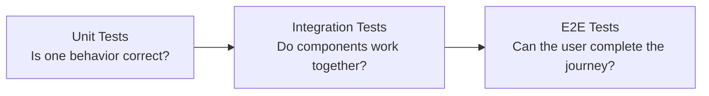
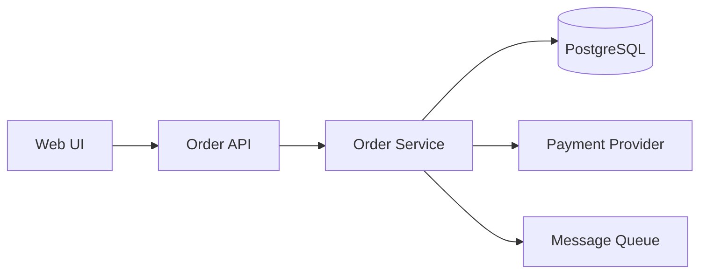
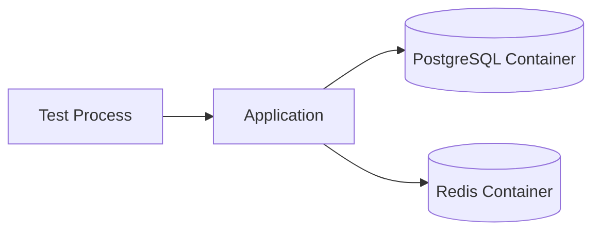
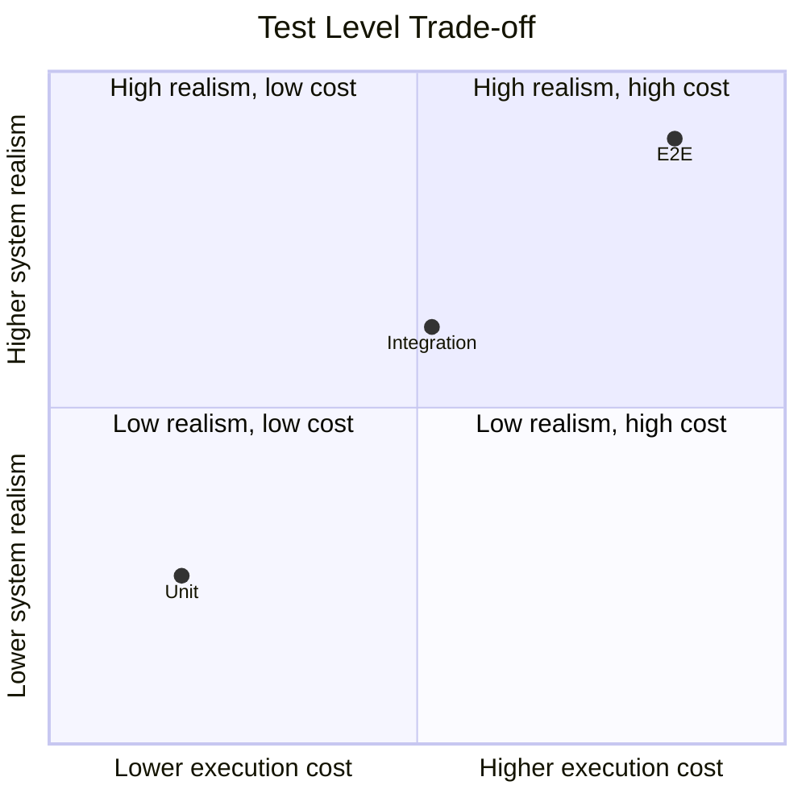
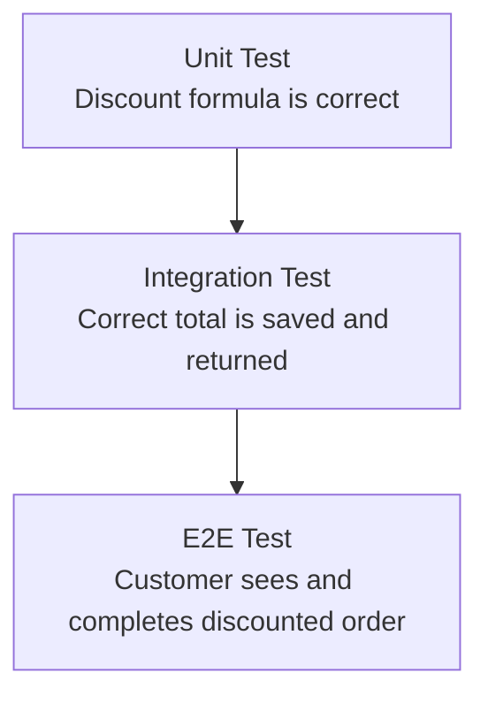
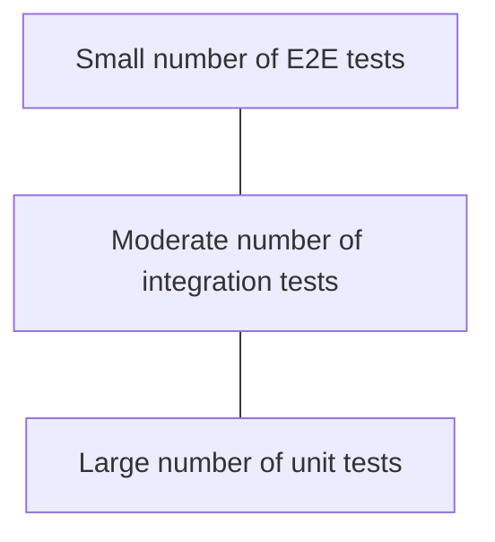
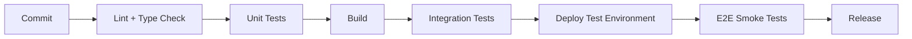
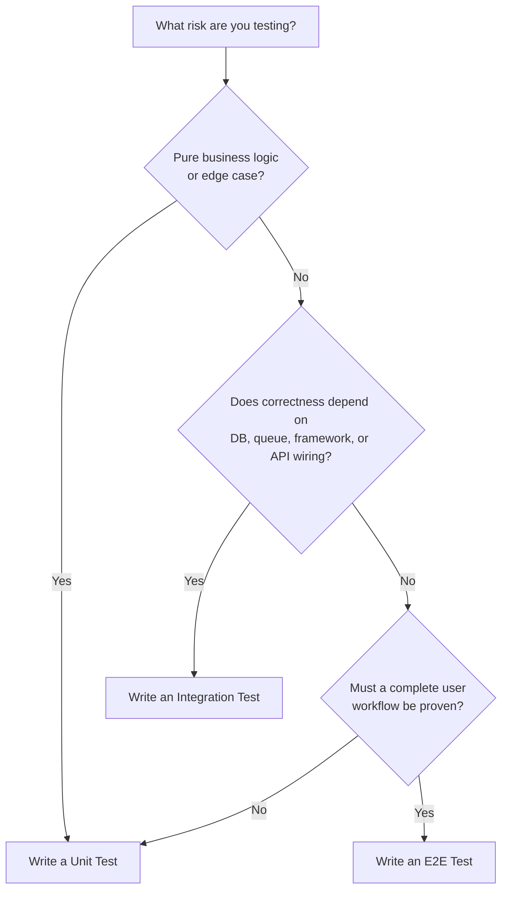

# Unit vs Integration vs End-to-End (E2E) Tests

> **Category:** Testing  
> **Audience:** Developers with 3+ years of experience  
> **Updated:** August 2026

---

# 1. Why We Need Multiple Test Levels

A production application contains different types of risk:

- A calculation may be incorrect.
- A service may send the wrong data to a repository.
- A database query may not match the actual schema.
- Two microservices may disagree about an API contract.
- A user may be unable to complete checkout in the browser.

No single test type handles all these risks efficiently.

A healthy test suite uses different levels of testing:



The levels provide different kinds of confidence:

- **Unit tests** give fast and precise feedback.
- **Integration tests** find problems at component boundaries.
- **E2E tests** prove that important workflows work through the deployed system.

---

# 2. The Main Difference: Test Boundary

The easiest way to classify a test is to ask:

> **How much of the system does this test execute, and which dependencies are real?**

Consider an order placement flow:



The same feature can be tested with different boundaries:

```text
Unit test
┌─────────────────────┐
│ Order Service       │──> Mock repository
│ discount calculation│──> Fake payment client
└─────────────────────┘

Integration test
┌──────────────────────────────────────┐
│ API + Service + Real Test Database   │
└──────────────────────────────────────┘

E2E test
┌────────────────────────────────────────────────────┐
│ Browser → API → Service → Database → Result in UI  │
└────────────────────────────────────────────────────┘
```

The labels are sometimes used differently across teams. Therefore, teams should document their test boundaries instead of relying only on names.

---

# 3. Unit Tests

## 3.1 What Is a Unit Test?

A unit test verifies one small unit of behavior in isolation.

A unit may be:

- A function
- A method
- A class
- A domain object
- A small service with controlled dependencies

The important point is not that the test contains only one function. The important point is that the test has a **small, controlled boundary** and failures are easy to diagnose.

## 3.2 Typical Characteristics

| Characteristic | Unit Test |
|---|---|
| Scope | Small behavior or component |
| Dependencies | Usually mocked, stubbed, or replaced with fakes |
| Database | Normally not used |
| Network | Normally not used |
| Speed | Very fast |
| Failure diagnosis | Usually easy |
| Quantity | Usually the largest number of tests |

## 3.3 Unit Test Example with `pytest`

### Production code

```python
# pricing.py
from decimal import Decimal


def calculate_final_price(
    price: Decimal,
    discount_percent: Decimal,
) -> Decimal:
    if price < 0:
        raise ValueError("Price cannot be negative")

    if not Decimal("0") <= discount_percent <= Decimal("100"):
        raise ValueError("Discount must be between 0 and 100")

    discount = price * discount_percent / Decimal("100")
    return (price - discount).quantize(Decimal("0.01"))
```

### Unit tests

```python
# tests/unit/test_pricing.py
from decimal import Decimal

import pytest

from pricing import calculate_final_price


def test_calculates_discounted_price() -> None:
    result = calculate_final_price(
        price=Decimal("100.00"),
        discount_percent=Decimal("20"),
    )

    assert result == Decimal("80.00")


def test_rejects_negative_price() -> None:
    with pytest.raises(ValueError, match="Price cannot be negative"):
        calculate_final_price(
            price=Decimal("-1.00"),
            discount_percent=Decimal("10"),
        )
```

This is a unit test because it executes only the pricing behavior. It does not start an API server, connect to a database, or call an external service.

## 3.4 Unit Test with a Mocked Dependency

```python
# order_service.py
from dataclasses import dataclass
from decimal import Decimal
from typing import Protocol


class PaymentGateway(Protocol):
    def charge(self, customer_id: str, amount: Decimal) -> str:
        """Return the payment transaction ID."""


@dataclass
class OrderService:
    payment_gateway: PaymentGateway

    def pay(self, customer_id: str, amount: Decimal) -> str:
        if amount <= 0:
            raise ValueError("Amount must be positive")

        return self.payment_gateway.charge(customer_id, amount)
```

```python
# tests/unit/test_order_service.py
from decimal import Decimal
from unittest.mock import Mock

from order_service import OrderService


def test_pay_charges_customer() -> None:
    gateway = Mock()
    gateway.charge.return_value = "txn-123"
    service = OrderService(payment_gateway=gateway)

    transaction_id = service.pay("customer-1", Decimal("499.00"))

    assert transaction_id == "txn-123"
    gateway.charge.assert_called_once_with(
        "customer-1",
        Decimal("499.00"),
    )
```

The payment gateway is mocked because the unit test is checking the service logic, not the real payment integration.

## 3.5 Best Use Cases

Unit tests are ideal for:

- Business rules
- Validation logic
- Pricing and tax calculations
- Permission decisions
- Data transformations
- State transitions
- Error handling
- Edge cases
- Utility functions

## 3.6 What Unit Tests Do Not Prove

A passing unit test does not prove that:

- SQL queries work with PostgreSQL.
- Dependency injection is configured correctly.
- API routes are registered.
- JSON is serialized as expected.
- External APIs accept the generated request.
- The complete user journey works.

These risks require wider test boundaries.

---

# 4. Integration Tests

## 4.1 What Is an Integration Test?

An integration test verifies that two or more components work together correctly.

Common integration boundaries include:

- API route + service
- Service + repository
- Repository + database
- Application + Redis
- Producer + message broker
- Consumer + database
- Service + external API sandbox

An integration test should use the real dependency when that dependency's behavior is important to the risk being tested.

## 4.2 Typical Characteristics

| Characteristic | Integration Test |
|---|---|
| Scope | Multiple connected components |
| Dependencies | Mix of real and controlled dependencies |
| Database | Often a real test database |
| Network | May use local containers, sandbox services, or test servers |
| Speed | Slower than unit tests |
| Failure diagnosis | Moderate difficulty |
| Quantity | Fewer than unit tests, usually more than E2E tests |

## 4.3 Integration Test Example: FastAPI + Database

Assume this endpoint creates a user and checks that the email is unique.

```python
# tests/integration/test_create_user.py
import pytest
from httpx import ASGITransport, AsyncClient

from app.main import app


@pytest.mark.asyncio
async def test_create_user_persists_user(test_database) -> None:
    transport = ASGITransport(app=app)

    async with AsyncClient(
        transport=transport,
        base_url="http://test",
    ) as client:
        response = await client.post(
            "/users",
            json={
                "name": "Asha Patel",
                "email": "asha@example.com",
            },
        )

    assert response.status_code == 201
    body = response.json()
    assert body["email"] == "asha@example.com"

    saved_user = await test_database.fetch_user_by_email(
        "asha@example.com"
    )
    assert saved_user is not None
```

This test may execute:

```text
HTTP request
   ↓
FastAPI router
   ↓
Pydantic validation
   ↓
Service
   ↓
Repository
   ↓
Real test database
```

It is an integration test because several real application layers are working together.

## 4.4 Repository Integration Test

A repository test should normally use the same database engine as production when database-specific behavior matters.

```python
@pytest.mark.asyncio
async def test_repository_filters_active_users(user_repository) -> None:
    await user_repository.create(
        name="Active User",
        email="active@example.com",
        is_active=True,
    )
    await user_repository.create(
        name="Inactive User",
        email="inactive@example.com",
        is_active=False,
    )

    users = await user_repository.list_active()

    assert [user.email for user in users] == ["active@example.com"]
```

This can reveal issues that a mocked repository cannot detect:

- Wrong column name
- Invalid SQL
- Incorrect join
- Database constraint failure
- Transaction behavior
- PostgreSQL-specific type handling

## 4.5 Integration Testing with Containers

For dependencies such as PostgreSQL, Redis, RabbitMQ, or Kafka, teams commonly start temporary containers during tests.



This gives higher realism than mocks while keeping the environment disposable and repeatable.

## 4.6 External Service Integration Tests

Suppose the application integrates with Stripe, an identity provider, or another third-party API.

Possible approaches:

1. Use the provider's sandbox or test mode.
2. Run a local emulator when officially supported.
3. Use a stub server that validates expected requests and returns realistic responses.
4. Add contract tests to verify the API structure independently.

Do not call real production services from automated tests.

## 4.7 What Integration Tests Do Not Always Prove

A backend integration test may pass while:

- The frontend sends the wrong field name.
- Authentication cookies are not configured correctly in the browser.
- A reverse proxy routes the request incorrectly.
- The deployed environment has missing variables.
- The user cannot find or click the required button.

That is where E2E testing adds value.

---

# 5. End-to-End Tests

## 5.1 What Is an E2E Test?

An end-to-end test validates a complete workflow through the application from an external user's point of view.

For a web application, an E2E test commonly executes:

```text
Browser
  → Frontend
  → Backend API
  → Business services
  → Database
  → Response
  → Updated browser UI
```

The test should focus on observable behavior rather than internal implementation details.

## 5.2 Typical Characteristics

| Characteristic | E2E Test |
|---|---|
| Scope | Complete system or major user workflow |
| Dependencies | Mostly real application components |
| Database | Usually a dedicated test database |
| Browser | Real browser or browser engine |
| Speed | Slowest of the three levels |
| Failure diagnosis | Harder because many components are involved |
| Quantity | Smallest number of tests |

## 5.3 E2E Example with Playwright

```typescript
// tests/e2e/checkout.spec.ts
import { test, expect } from '@playwright/test';

test('customer completes checkout', async ({ page }) => {
  await page.goto('/products');

  await page.getByRole('link', { name: 'Noise-Cancelling Headphones' }).click();
  await page.getByRole('button', { name: 'Add to cart' }).click();
  await page.getByRole('link', { name: 'Cart' }).click();
  await page.getByRole('button', { name: 'Proceed to checkout' }).click();

  await page.getByLabel('Email').fill('asha@example.com');
  await page.getByLabel('Address').fill('Ahmedabad, Gujarat');
  await page.getByRole('button', { name: 'Place order' }).click();

  await expect(
    page.getByRole('heading', { name: 'Order confirmed' })
  ).toBeVisible();

  await expect(page.getByText(/Order ID:/)).toBeVisible();
});
```

This test checks the workflow in the same general way a user performs it.

Modern browser-testing guidance recommends locating elements through user-visible roles, labels, and text rather than fragile implementation details such as CSS class names.

## 5.4 Good E2E Test Candidates

E2E tests are most valuable for critical journeys such as:

- Login and logout
- User registration
- Password reset
- Checkout and payment
- Creating and approving an order
- Uploading a required document
- Submitting an insurance claim
- Completing a multi-step onboarding process
- A role-based approval workflow

## 5.5 Poor E2E Test Candidates

Avoid using E2E tests to exhaustively cover:

- Every validation edge case
- Every discount combination
- Every permission branch
- Every possible API error
- Small formatting functions
- Internal algorithms

Those cases are normally faster and clearer at unit or integration level.

## 5.6 Test Isolation

Each E2E test should be independently executable.

A test should not depend on another test to:

- Create its user
- Create its order
- Log in first
- Prepare shared browser state
- Leave records in a particular order

A reliable structure is:

```text
Arrange: create required test data
Act: perform the user workflow
Assert: verify the observable outcome
Cleanup: remove or expire test data
```

Playwright provides a fresh browser context per test by default, giving each test isolated cookies, local storage, and session storage.

---

# 6. Unit vs Integration vs E2E Comparison

| Area | Unit | Integration | E2E |
|---|---|---|---|
| Main purpose | Verify isolated behavior | Verify component collaboration | Verify complete user workflow |
| Typical boundary | Function, class, domain service | API + service + DB, service + queue | Browser to backend and back |
| Real database | No | Often | Usually |
| External services | Mock or fake | Sandbox, emulator, container, or stub | Test environment integrations |
| Execution speed | Milliseconds | Milliseconds to seconds | Seconds to minutes |
| Feedback precision | High | Medium | Lower |
| Maintenance cost | Low | Medium | High |
| Realism | Low to medium | Medium to high | Highest |
| Flakiness risk | Low | Medium | Highest |
| Best for | Logic and edge cases | Boundaries and infrastructure | Critical business journeys |
| Typical CI frequency | Every change | Every change or pull request | Pull request, deployment, scheduled suite |

## Confidence vs Cost



The goal is not to choose the test type with the highest realism for every case. The goal is to obtain enough confidence at the lowest reasonable cost.

---

# 7. One Feature Tested at All Three Levels

Consider this business requirement:

> A premium customer receives a 10% discount, but the order total must never become negative.

## 7.1 Unit Test

Test the discount rule directly:

```python
def test_premium_customer_receives_ten_percent_discount() -> None:
    total = calculate_order_total(
        subtotal=Decimal("1000.00"),
        is_premium=True,
    )

    assert total == Decimal("900.00")
```

**Risk covered:** Business rule implementation.

## 7.2 Integration Test

Call the order API and verify the persisted total:

```python
@pytest.mark.asyncio
async def test_order_api_saves_discounted_total(client, database) -> None:
    response = await client.post(
        "/orders",
        json={
            "customer_id": "premium-customer-1",
            "items": [{"product_id": "p-1", "quantity": 1}],
        },
    )

    assert response.status_code == 201
    assert response.json()["total"] == "900.00"

    order = await database.get_order(response.json()["id"])
    assert order.total == Decimal("900.00")
```

**Risk covered:** API, service, repository, and database integration.

## 7.3 E2E Test

Log in as the premium customer and place the order through the UI:

```typescript
test('premium customer sees discount during checkout', async ({ page }) => {
  await loginAsPremiumCustomer(page);
  await addProductToCart(page, 'Professional Monitor');
  await page.getByRole('link', { name: 'Checkout' }).click();

  await expect(page.getByText('Premium discount: 10%')).toBeVisible();
  await expect(page.getByText('Total: ₹900.00')).toBeVisible();

  await page.getByRole('button', { name: 'Place order' }).click();
  await expect(page.getByText('Order confirmed')).toBeVisible();
});
```

**Risk covered:** The complete user-visible flow.

## 7.4 Why All Three Are Useful



The E2E test alone could prove the happy path, but it would be expensive to use it for every percentage, rounding case, and invalid value. Those variations belong mainly in unit tests.

---

# 8. Mocks, Fakes, Stubs, and Real Dependencies

## 8.1 Test Double Overview

A **test double** replaces a real dependency during testing.

| Type | Purpose | Example |
|---|---|---|
| Stub | Returns predefined data | Payment client always returns success |
| Mock | Verifies interaction | Assert `send_email()` was called once |
| Fake | Working but simplified implementation | In-memory repository |
| Spy | Records calls to a real or wrapped object | Track emitted events |

## 8.2 Dependency Choice by Test Level

```text
Unit
Application code + mocks/fakes

Integration
Application code + selected real dependencies

E2E
Complete application + mostly real test environment
```

## 8.3 Avoid Over-Mocking

A test can pass while production fails when the mock behaves differently from the real dependency.

Example:

```python
# Weak mock: returns any shape the test author invented.
payment_client.charge.return_value = {"ok": True}
```

But the real provider may return:

```json
{
  "status": "succeeded",
  "transaction_id": "txn_123"
}
```

Reduce this risk with:

- Typed interfaces
- Provider test fixtures
- Contract tests
- Sandbox integration tests
- Realistic response samples
- Schema validation

## 8.4 Do Not Mock the Subject Under Test

If testing `OrderService`, mock its external collaborators—not `OrderService` itself.

```text
Correct:
OrderService → MockPaymentGateway

Incorrect:
MockOrderService → assert mocked value
```

The second test verifies only the mock configuration.

---

# 9. Testing Pyramid and Modern Test Strategy

## 9.1 Traditional Testing Pyramid

The traditional test pyramid recommends:

- Many fast, focused tests at the bottom
- Fewer integration tests in the middle
- A small number of broad E2E tests at the top



Conceptually:

```text
             /\
            /E2E\          Few, slow, broad
           /------\
          /Integration\    Moderate
         /------------\
        /  Unit Tests   \   Many, fast, focused
       /________________\
```

## 9.2 The Pyramid Is Guidance, Not a Fixed Percentage

There is no universal correct split such as 70% unit, 20% integration, and 10% E2E.

The right distribution depends on the system:

- A calculation-heavy library may have mostly unit tests.
- A CRUD API may gain more confidence from API and database integration tests.
- A frontend application may emphasize component integration tests.
- A microservice platform may add contract tests around service boundaries.
- A workflow product may need a focused set of E2E tests for critical journeys.

Use the pyramid's underlying principle:

> Test behavior at the lowest level that gives sufficient confidence.

## 9.3 Avoid the Ice-Cream Cone

An unhealthy test suite often has many manual and E2E tests but few lower-level tests.

```text
       Manual testing
    ───────────────────
       Many E2E tests
      ───────────────
    Few integration tests
       ───────────
       Few unit tests
          ─────
```

This commonly results in:

- Slow feedback
- Difficult debugging
- High maintenance
- Flaky builds
- Developers ignoring failures

## 9.4 A Practical Balanced Strategy

For most backend or full-stack applications:

1. Put business-rule variations in unit tests.
2. Test repositories against a real database.
3. Test important API flows with real application wiring.
4. Test external boundaries with contract or sandbox tests.
5. Keep E2E coverage focused on critical user journeys.

---

# 10. Where Tests Run in CI/CD

A common pipeline runs faster tests first and stops early when they fail.



## 10.1 Suggested Execution Strategy

| Stage | Tests |
|---|---|
| Local development | Relevant unit and focused integration tests |
| Pre-commit or fast check | Linting, formatting, selected unit tests |
| Pull request | Full unit suite + integration suite + critical E2E tests |
| Main branch | Full automated suite |
| Post-deployment | Smoke E2E tests against deployed environment |
| Scheduled run | Broader browser, device, and regression coverage |

## 10.2 Fail Fast

Run tests in roughly this order:

```text
Fast and precise
      ↓
Unit tests
      ↓
Integration tests
      ↓
E2E tests
      ↓
Slow and broad
```

There is little value in spending 20 minutes on E2E tests when a unit test can identify the failure in seconds.

## 10.3 Parallel Execution

Tests can run safely in parallel only when they are isolated.

Use:

- Unique test identifiers
- Independent database records
- Separate schemas or databases where needed
- Fresh browser contexts
- No dependence on execution order
- Controlled shared resources

---

# 11. How to Decide Which Test to Write

Use the following decision flow:



## 11.1 Decision Examples

| Requirement | Best Starting Level | Reason |
|---|---|---|
| Calculate GST and discount | Unit | Pure deterministic logic |
| Verify unique email constraint | Integration | Database constraint matters |
| Confirm API returns validation error | Integration | Framework validation and route wiring matter |
| Verify repository transaction rollback | Integration | Real transaction behavior matters |
| Confirm user can reset password | E2E | Multi-step user workflow |
| Check button text appears after state change | Component/integration | User-visible component behavior without full system |
| Test all invalid coupon combinations | Unit | Many edge cases, fast feedback required |
| Verify payment provider request schema | Contract/integration | External boundary matters |
| Confirm checkout works after deployment | E2E smoke test | Full deployed path matters |

## 11.2 Ask These Questions

Before writing a test, ask:

1. What production failure am I trying to prevent?
2. What is the smallest boundary that can expose that failure?
3. Which dependencies must be real?
4. Can the test run independently?
5. Will the assertion survive an internal refactor?
6. Will a failure clearly explain what broke?

---

# 12. Practical Project Structure

A Python backend with a JavaScript frontend may use:

```text
project/
├── backend/
│   ├── app/
│   └── tests/
│       ├── unit/
│       │   ├── services/
│       │   └── domain/
│       ├── integration/
│       │   ├── api/
│       │   ├── repositories/
│       │   └── messaging/
│       ├── conftest.py
│       └── factories/
│
├── frontend/
│   ├── src/
│   └── tests/
│       ├── unit/
│       └── integration/
│
├── e2e/
│   ├── tests/
│   ├── fixtures/
│   └── playwright.config.ts
│
└── compose.test.yml
```

## 12.1 Pytest Markers

Markers allow suites to be selected independently.

```python
import pytest


@pytest.mark.unit
def test_calculates_total() -> None:
    ...


@pytest.mark.integration
async def test_saves_order_to_database() -> None:
    ...
```

Run them separately:

```bash
pytest -m unit
pytest -m integration
```

Example `pyproject.toml` configuration:

```toml
[tool.pytest.ini_options]
markers = [
    "unit: isolated and fast tests",
    "integration: tests involving connected components",
]
```

## 12.2 Test Naming

Use names that describe observable behavior.

```python
# Weak
def test_calculate():
    ...

# Better
def test_premium_customer_receives_ten_percent_discount():
    ...

# Better for error behavior
def test_rejects_coupon_when_expiry_date_has_passed():
    ...
```

A useful naming pattern is:

```text
test_<behavior>_when_<condition>
```

---

# 13. Reliable Test Design Principles

## 13.1 Test Behavior, Not Implementation

A test should remain valid when internal code is refactored without changing behavior.

Weak assertion:

```python
service._discount_percentage == 10
```

Better assertion:

```python
assert service.calculate_total(Decimal("100")) == Decimal("90")
```

For UI tests, prefer accessible user-facing selectors:

```typescript
page.getByRole('button', { name: 'Place order' })
```

Avoid fragile selectors when possible:

```typescript
page.locator('.btn.primary.checkout-button:nth-child(2)')
```

## 13.2 Keep Tests Independent

Each test should prepare its own required state.

```text
Bad:
Test 1 creates user
Test 2 assumes that user exists
Test 3 assumes Test 2 created an order

Good:
Each test creates exactly the state it needs
```

## 13.3 Use Deterministic Data

Control unstable inputs such as:

- Current time
- Random values
- Generated IDs
- External responses
- Background jobs
- Network timing

Example with an injected clock:

```python
from datetime import UTC, datetime


def test_coupon_is_expired() -> None:
    fixed_now = datetime(2026, 8, 3, 10, 0, tzinfo=UTC)

    assert is_coupon_expired(
        expiry=datetime(2026, 8, 2, 23, 59, tzinfo=UTC),
        now=fixed_now,
    )
```

## 13.4 Avoid Fixed Sleeps

Weak E2E code:

```typescript
await page.waitForTimeout(5000);
```

Better:

```typescript
await expect(page.getByText('Order confirmed')).toBeVisible();
```

Wait for the required condition, not an assumed duration.

## 13.5 Keep Assertions Focused

A test may contain multiple assertions when they verify one behavior.

```python
def test_creates_active_user() -> None:
    user = create_user("asha@example.com")

    assert user.email == "asha@example.com"
    assert user.is_active is True
    assert user.created_at is not None
```

Avoid combining unrelated workflows in one long test because failure diagnosis becomes difficult.

## 13.6 Use Realistic Test Data, but Keep It Minimal

Use the smallest dataset that exposes the behavior.

Do not load a complete production-like database when the test requires only:

- One customer
- Two products
- One order

Small datasets make tests easier to understand and maintain.

## 13.7 Treat Flaky Tests as Defects

A flaky test sometimes passes and sometimes fails without a relevant code change.

Common causes include:

- Shared state
- Test-order dependency
- Fixed sleeps
- Race conditions
- Uncontrolled time
- Unstable external services
- Non-unique test data
- Incorrect asynchronous handling

Retries may provide temporary diagnostics, but repeated retries should not replace fixing the root cause.

---

# 14. Key Takeaways

```text
Unit Test
- Small boundary
- Fast and precise
- Best for business logic and edge cases
- Uses mocks or fakes for external collaborators

Integration Test
- Verifies connected components
- Best for databases, APIs, queues, frameworks, and service boundaries
- Uses selected real dependencies

E2E Test
- Verifies a complete user journey
- Highest realism and highest maintenance cost
- Best for a focused set of critical workflows
```

The most important rule is:

> **Test at the lowest level that can confidently detect the production failure you care about.**

A strong test suite does not attempt to replace every unit and integration test with E2E coverage. It combines fast lower-level feedback with a small number of realistic full-system checks.

---

# References

- Martin Fowler — *The Practical Test Pyramid*: https://martinfowler.com/articles/practical-test-pyramid.html
- Martin Fowler — *Test Pyramid*: https://martinfowler.com/bliki/TestPyramid.html
- pytest — Latest documentation: https://docs.pytest.org/en/latest/
- Playwright — Introduction: https://playwright.dev/docs/intro
- Playwright — Test isolation: https://playwright.dev/docs/browser-contexts
- Playwright — Best practices: https://playwright.dev/docs/best-practices
- Testing Library — Guiding principles: https://testing-library.com/docs/guiding-principles/

